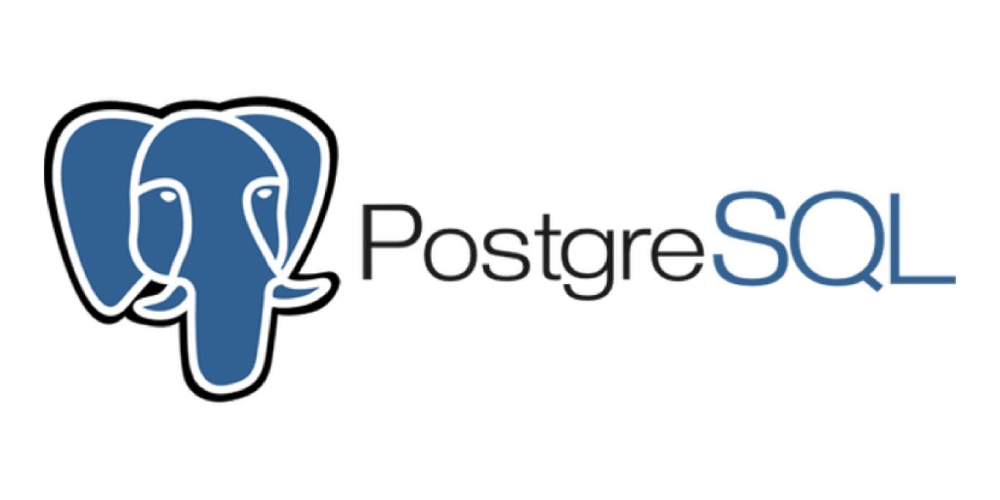
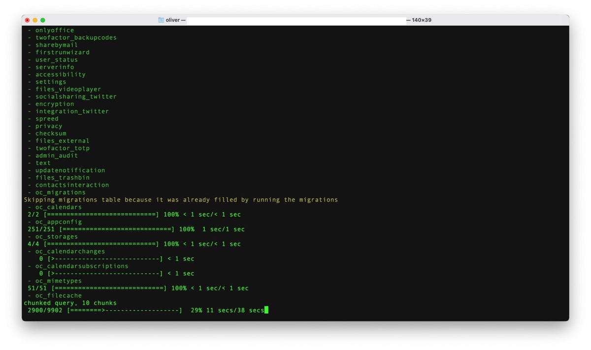
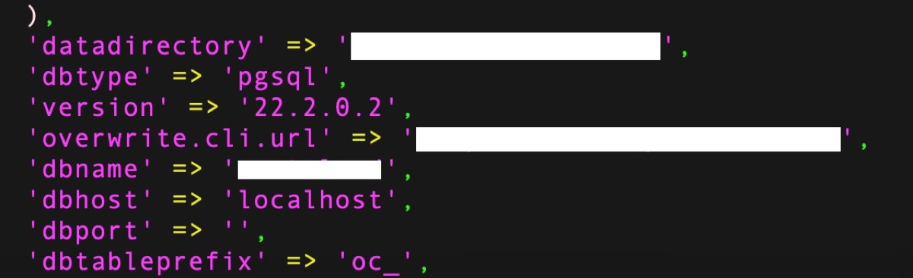
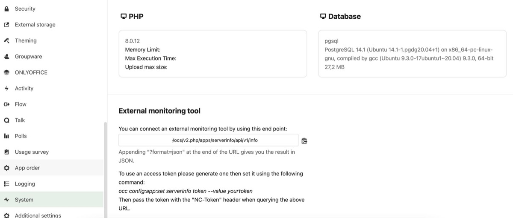

## From the early beginnings, I used MySQL and - later - MariaDB as my database of choice.

Backing my Nextcloud-installation as a standard database, MariaDB is a versatile, accessible and renowned product. Anyway, over the years I began to play around with PostgreSQL for various reasons and finally decided do switch my Nextcloud’s database-backend to the elephant-branded ORDBMS. With version 14, PostgreSQL makes a nice speed bump and as Nextcloud supports a migration path from the scratch, I can now easily show how to accomplish this!

Installing PostgreSQL
---------------------

First of all - and after backing up our existing data for security reasons - we need to install PostgreSQL. This is done via shell access and appropriate permissions on an Ubuntu 20.04-instance and officially accompanied by documents on behalf of PostgreSQL. From the scratch, Ubuntu doesn’t come with the latest version of PostgreSQL so we need to deal with the proper and official repository to make use of all benefits the current version 14.1 comes with.



Therefore, and first of all, we need to create the basic file repository configuration:

```
sudo sh -c 'echo "deb http://apt.postgresql.org/pub/repos/apt $(lsb_release -cs)-pgdg main" > /etc/apt/sources.list.d/pgdg.list'

```


Then we need to import the signing key:

```
wget --quiet -O - https://www.postgresql.org/media/keys/ACCC4CF8.asc | sudo apt-key add -

```


After accomplishing both steps, the new repositories are known to our Linux-installations and can be updated following the usual procedure:

```
sudo apt-get update

```


After the repositories are up-to-date, we can install the binaries. If you don’t want the latest version, use „postgresql-13“ or similar instead of „postgresql“ in the following command:

```
sudo apt-get -y install postgresql postgresql-contrib

```


As I am running PHP-FPM 8.0 on my Ubuntu-system and we need also PHP to collaborate with PostgreSQL, the official PHP-module should also be installed by typing

```
sudo apt-get -y install php8.0-pgsql

```


followed by the restart of the PHP-FPM process:

```
sudo systemctl restart php8.0-fpm

```


That’s it for the basic prerequisites - so let’s head on to dealing with PostgreSQL itself!

Database Doings
---------------

After the binaries have been installed, enter PostgreSQL by typing

```
sudo -u postgres psql

```


and you should be welcomed with PostgreSQL’s shell:

```
psql (14.1 (Ubuntu 14.1-1.pgdg20.04+1))
Type "help" for help.

postgres=# 

```


The command

```
\conninfo

```


will show you some connection information about the database

```
postgres=# \conninfo
You are connected to database "postgres" as user "postgres" via socket in "/var/run/postgresql" at port "5432"

```


while a simple

```
\q

```


leads you back into Ubuntu’s shell, leaving the PostgreSQL command line behind - once you want to do this. Everything we need is now up and running so we may stay in PostgreSQL’s shell for now and enter four commands for creating a specific user, creating an empty database, setting the new user to be this database’s owner and - finally - setting the proper user privileges for this database:

```
CREATE USER nextcloudusr WITH PASSWORD 'your-usr-password';
CREATE DATABASE nextclouddb TEMPLATE template0 ENCODING 'UNICODE';
ALTER DATABASE nextclouddb OWNER TO nextcloudusr;
GRANT ALL PRIVILEGES ON DATABASE nextclouddb TO nextcloudusr;
\q

```


In this example, the database-user is „nextcloudusr“ while the database is „nextclouddb“ and the password, here defined as „your-usr-password“ should be changed to suit your personal security needs. Each single command should work well and the final

```
\q

```


will exit PostgreSQL’s shell as our work here is done.

Migration Steps
---------------

According to the size of your Nextcloud-installation, database and system resources, the migration process can take quite a long time to finish. The migration itself is done with Nextcloud’s „occ“-command by typing

```
sudo -u www-data php8.0 /var/www/nextcloud/occ db:convert-type --all-apps --password "your-usr-password" pgsql nextcloudusr localhost nextclouddb

```


in my specific case, having PHP-FPM 8.0 and the PostgreSQL-instance running on the same server with Nextcloud’s webroot being located in /var/www/nextcloud.



Once the migration is finished and the script has disabled Nextcloud’s maintenance mode, your Nextcloud-instance should already be available again after the changes to Nextcloud's config.php have been made:



You may now log in with an administrator to see whether the new database-backend is available or not - and, once you didn’t encounter any error, it should:



Verdict
-------

We have successfully implemented the latest iteration of PostgreSQL and migrated our existing MySQL/MariaDB-database to PostgreSQL. After reaching this goal, we may now tune our PostgreSQL-settings by using tools like [PGtune](https://pgtune.leopard.in.ua/) or clean up the MySQL-/MariaDB-installation once there aren’t any other databases left besides our Nextcloud-related one.

Don’t forget to drop comments in case this tutorial has worked for you (even if not!) or you still have questions regarding this process. Thanks for reading!