## The choice of a proper Office-suite is a difficult one and needs to fit to the personal needs which are, as we know, often different. While Microsoft Office is surely THE standard for many, there are good alternatives around and especially when you are working with Nextcloud, two Office-solutions may be the ideal fit for you.

First of all: Everything depends on your needs and — also — on your personal taste. If you don’t like the Microsoft-way or don’t want to pay for a subscription in private, Nextcloud fortunately offers two famous Office-distributions from which the first, Collabora Online with its Libre Office-background, is strictly tied as the „out-of-the-box”-Office from Nextcloud 19 on.

Anyway, while you may activate the desired solution and its integrated Document Server in the „Apps”-section of Nextcloud, my preferred choice always was to use a Docker-ized version of the desired Office-suite so let me show you how you may integrate Collabora Online founded on a Docker-image in the late Nextcloud Hub 22.2.3!

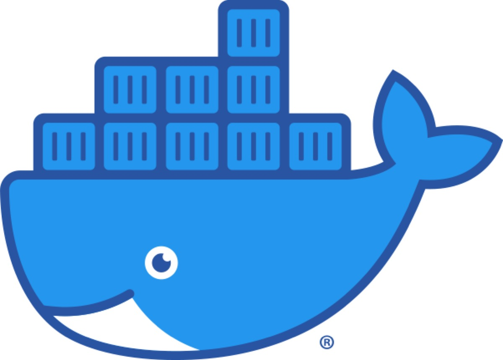

### Getting ready

The prerequisites met so far are an updated and therefore actual Ubuntu 20.04/Debian 10-Linux system with an installed Apache Webserver. In my case, Debian is the preferred distribution and Apache already serves my Nextcloud-environment. Certbot for fetching the Let’s Encrypt-certificates is installed as well so we are ready to go!

First of all, the Docker-environment needs to be downloaded to build the base of the Collabora Online Development Edition (CODE)-server in its Docker-ized state. The following commands should do this:

```
sudo apt update
sudo apt install docker.io
sudo systemctl enable docker
```


The first command updates the package catalogue while the second starts the installation and — you may have guessed it — the third enables Docker to start at boot time. Just in case Certbot is not yet installed, also fetch it by typing

```
sudo apt-get install python-certbot-apache
```


and you may head to the configuration of the webserver which will also play the role of a reverse-proxy serving the contents of you Docker-container.

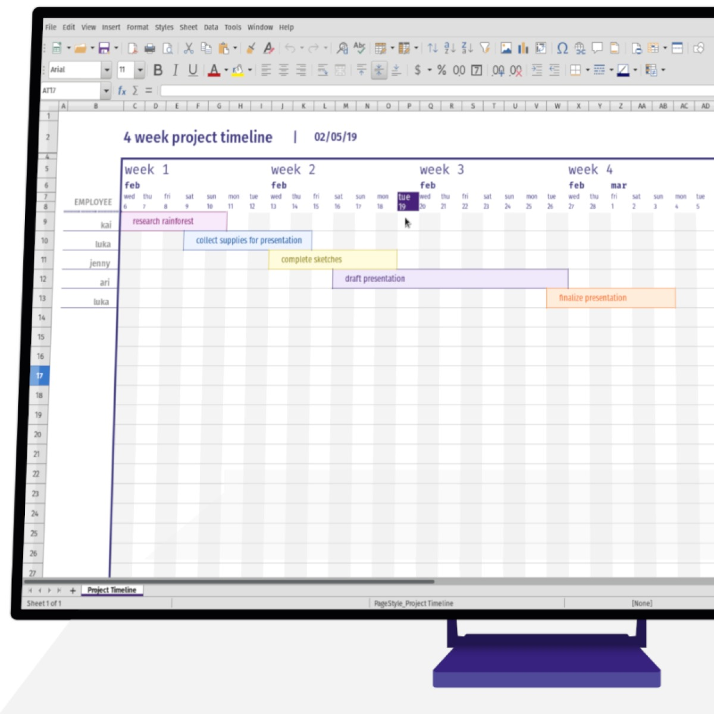

### The Reverse Proxy

Create a new virtual host configuration, for example by typing (I prefer to use vi though!)

```
sudo vi /etc/apache2/sites-available/001-office.domain.tld.conf
```


where „office.domain.tld” needs — of course — to be replaced with the desired hostname for your environment. In my example, my Nextcloud and my Collabora-instance are on the same machine but use different hostnames so you will need an additional A-entry in your domain’s DNS-settings pointing to the IP of your server. The file itself should be empty and you may fill in the following basic content:

```
<VirtualHost *:80>
ServerName office.domain.tld
</VirtualHost>
```


Save the file and activate the new site in your webserver’s environment as well as the modules needed to get Collabora Online working:

```
sudo a2ensite 001-office.domain.tld.conf
sudo a2enmod proxy proxy_http proxy_connect proxy_wstunnel
sudo systemctl restart apache2
```


### SSL-Security

As the new host is now known to Apache, we need to fetch our Let’s Encrypt-certificate to make the SSL-encryption working for our new host proxying our planned container. Let Certbot do its work by typing

```
sudo certbot --apache
```


and head through the process. Usually, you may just choose to redirect all http-requests to the https-site for the desired (sub-) domain. Afterwards, Certbot should tell you about the successful fetching of the certificate so let’s have a look on the newly-generated Apache-SSL-site:

```
sudo vi /etc/apache2/sites-available/001-office.domain.tld-le-ssl.conf
```


enters the configuration file where you now need to add the following lines under the freshly generated „SSLCertificateFile” and „SSLCertificateKeyFile”-entries under „<VirtualHost>, pasting everything between those lines which are closed by the „</VirtualHost>“ and „</IfModule>“-entries:

```
 ########################################

 # Reverse proxy for Collabora Online
 #

 ########################################


 AllowEncodedSlashes NoDecode
 SSLProxyEngine On
 ProxyPreserveHost On


 # cert is issued for collaboraonline.example.com and we proxy to localhost
 SSLProxyVerify None
 SSLProxyCheckPeerCN Off
 SSLProxyCheckPeerName Off


 # static html, js, images, etc. served from coolwsd
 # browser is the client part of Collabora Online
 ProxyPass           /browser https://127.0.0.1:9980/browser retry=0
 ProxyPassReverse    /browser https://127.0.0.1:9980/browser


 # WOPI discovery URL
 ProxyPass           /hosting/discovery https://127.0.0.1:9980/hosting/discovery retry=0
 ProxyPassReverse    /hosting/discovery https://127.0.0.1:9980/hosting/discovery


 # Capabilities
 ProxyPass           /hosting/capabilities https://127.0.0.1:9980/hosting/capabilities retry=0
 ProxyPassReverse    /hosting/capabilities https://127.0.0.1:9980/hosting/capabilities

 # Main websocket
 ProxyPassMatch      "/cool/(.*)/ws$"      wss://127.0.0.1:9980/cool/$1/ws nocanon


 # Admin Console websocket
 ProxyPass           /cool/adminws wss://127.0.0.1:9980/cool/adminws


 # Download as, Fullscreen presentation and Image upload operations
 ProxyPass           /cool https://127.0.0.1:9980/cool
 ProxyPassReverse    /cool https://127.0.0.1:9980/cool
 # Compatibility with integrations that use the /lool/convert-to endpoint
 ProxyPass           /lool https://127.0.0.1:9980/cool
 ProxyPassReverse    /lool https://127.0.0.1:9980/cool
```


Here, the handling of the reverse proxy is being defined so that the port 9980 the Docker-container runs at will be directed to our new SSL-enabled website. Now save the file and restart Apache once again by firing up the last

```
sudo systemctl restart apache2
```


Now Docker needs to fetch the container and all contents — with one command, we accomplish this, deliver all information to Docker and force the container to always restart even after your system has been rebooted.

```
sudo docker run -t -d -p 127.0.0.1:9980:9980 -e "domain=nextcloud\\.domain\\.tld" -e "username=<Your-Admin>" -e "password=<Your-Password>" --restart always collabora/code
```


All data is now being fetched and the container is created from the scratch. Please fill in your domain where Nextcloud runs on and which should be allowed to use Collabora as well as your desired username and password for administrative access via [https://office.domain.tld/browser/dist/admin/admin.html](https://office.domain.tld/browser/dist/admin/admin.html)!

After the process is done, typing

```
sudo docker ps
```


does the trick of checking wether your freshly-pulled container is up or not!


### Getting ready to rumble

As the container will be up and running unless you encountered any error message while fetching it, you have just finished the first part of the trip in the shell. Now let’s head to your Nextcloud and log in as an user with administrative rights as we need to fetch the desired app for getting Collabora Online to work.

Go the „App”-section of your Nextcloud, download and activate the Collabora Online-app and visit your Nextcloud’s setting afterwards where the pane mentioned should appear in the menu on the left.

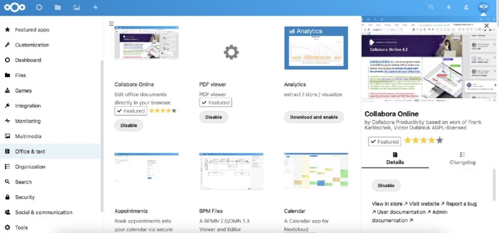

Switch to this pane now. Now choose the „Use your own server“-option, enter your freshly-created Collabora-Host, for example [https://office.domain.tld,](https://office.domain.tld,/) click on „Save“ and the green tick should acknowledge that everything before now resides in a proper setup.

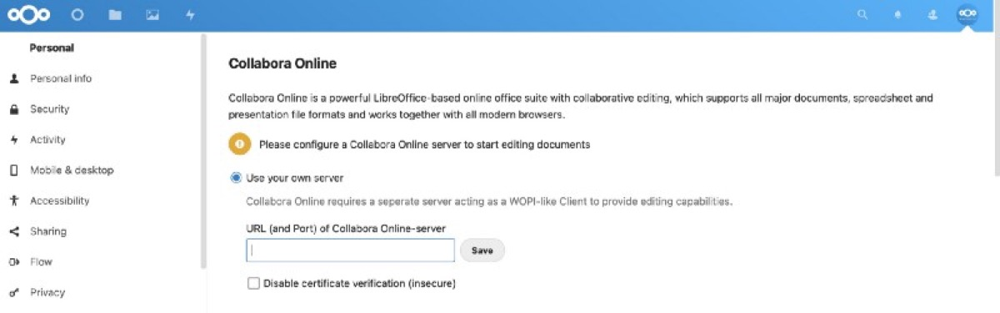

You may now deal with the additional options if you want to — for example with the possibility of choosing wether you want to use the OOXML file types instead of the ODF-file types that come along with the OpenDocument-format.

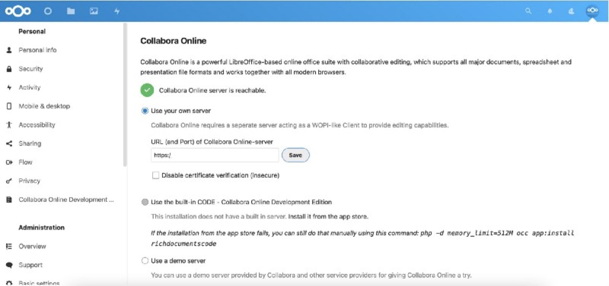

After — our container and his reverse proxy seem to work!

You may also activate the „Watermark”-mode so that restrictive documents are — yes! — watermarked in a certain way.

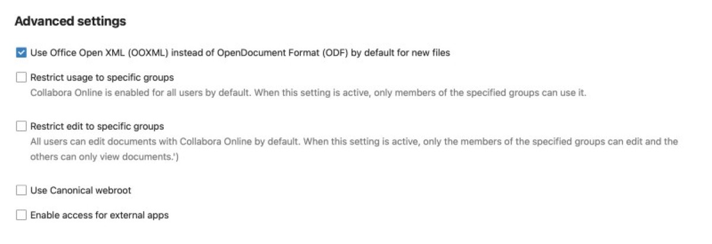

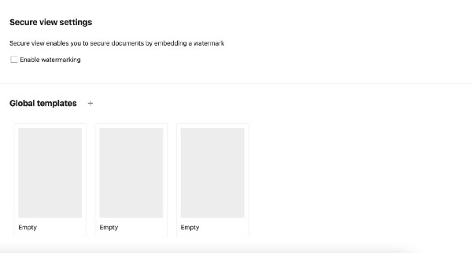

### Final verdict

Collabora Online is finally fully integrated into your Nextcloud Hub 22! You may now open the file types associated with Collabora Online before or click on the „Plus” in the file browser to create a new spreadsheet, keynote or text-document. Everything fits perfectly into the existing Nextcloud-solution and is yet another way of implementing an office in your virtual workplace. We finally managed to purify an existing Nextcloud-installation with a performant and independent online Office-solution which can handle Microsoft- as well as Open Document-files!

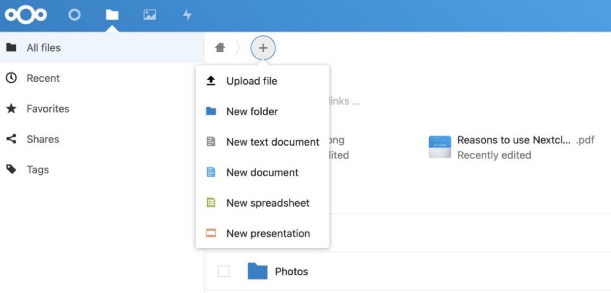

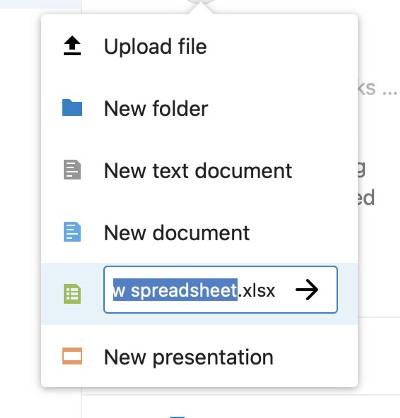

If you have enjoyed this tutorial and considered it at least a little bit useful for your private or business needs, please drop me a comment!

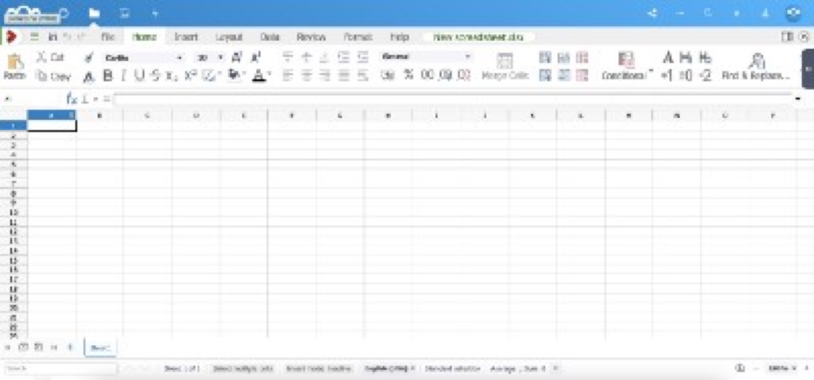

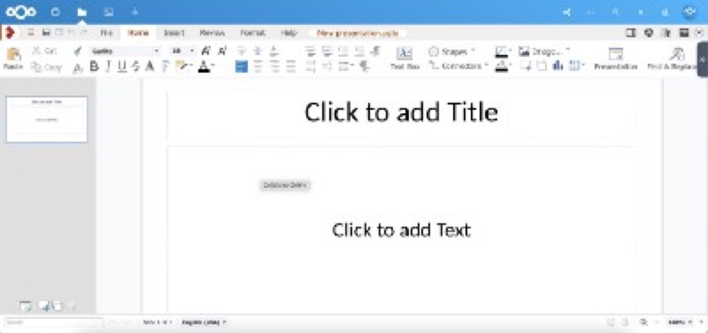

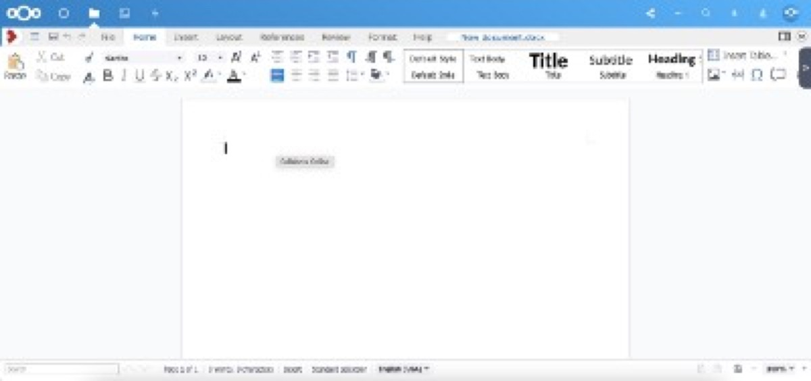

See above: Spreadsheets, Presentation and Text Files grounded in Nextcloud

Just in case you need a good Copy n’ Paste-version of the Apache configuration-files and the Docker-command to start everything up, please have a look at the specific [GitHub-page](https://github.com/OliverPifferi/samples/tree/main/Collabora%20Online) where I have [deployed](https://github.com/OliverPifferi/samples/tree/main/Collabora%20Online) these files!