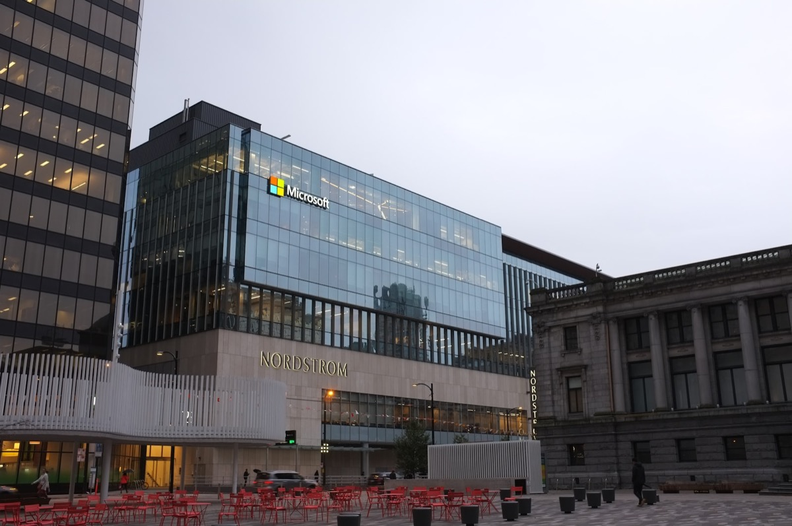
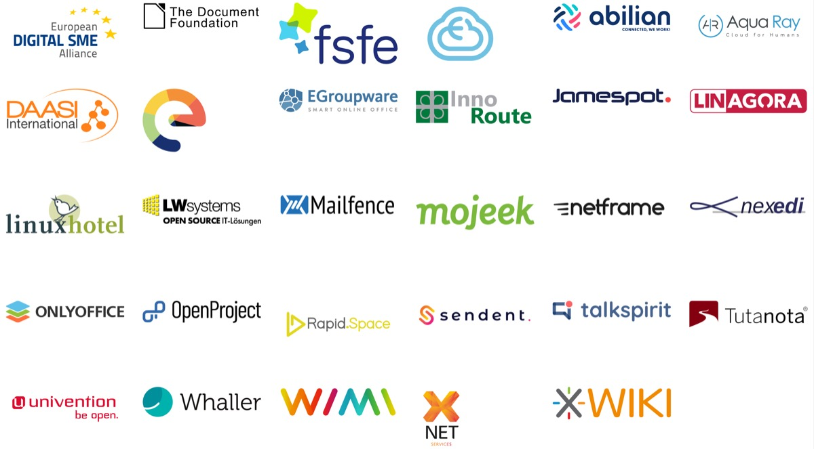
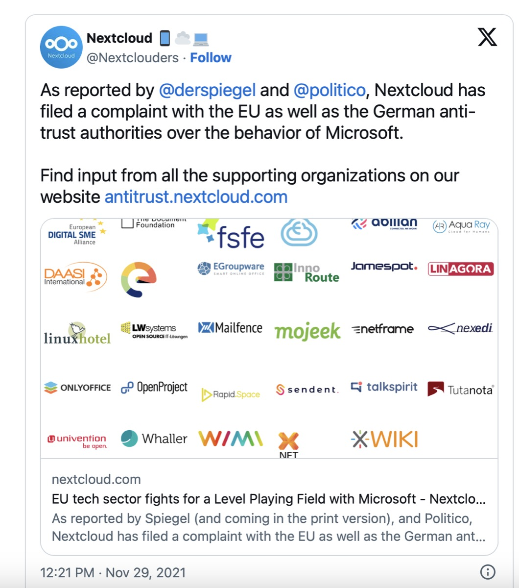

## History is repeating and people who remember „The Browser Wars“ in the 90s may find many things in common: Today, „Goliath“ is still Microsoft while „David“ is no more Netscape (RIP!).

Instead, many EU tech companies under the patronage of German Nextcloud are addressing their complaints about Microsoft’s closely spaced integration of - amongst other things - OneDrive in Windows.

The Browser Wars
----------------

The comparison with „The Browser Wars“ in the 90s is close upon today’s case: In the past, not the better browser survived but the one that was better bundled with and integrated into the operating system: Using a tight inclusion, Internet Explorer wiped the competitor off the playing field and the rest is history. Today, our digital life puts the Cloud more and more into the focus and while Big Tech giants provide a fast and direct access to many cloud services, the question is revealed whether there is still a choice or an (unwanted) integration: Everyone who tried to get rid of, for example, OneDrive in Windows 10, will understand what I am talking about: The way to the cloud is - in this car - made over the stepping stone named OneDrive in this specific case.

Of course Microsoft pushes OneDrive in Windows 10 and 11 - why shouldn’t Redmond do this to further integrate the user into its own service? Anyway, the mere fact that other Cloud-solutions aren’t integrated that natively into the OS is, according to private cloud company Nextcloud leading this coalition, a disadvantage for any competitor. Although Nextcloud runs great on Windows, it is still impossible to get rid of all OneDrive-components to save into, for example, Nextcloud as standard Cloud-service. Indeed, removing references to OneDrive is not possible for standard user who don’t want to tweak and tune their OS to its fullest.

Digital Rebellion
-----------------

Now, a quickly growing coalition of dozens of European SMB organizations support these efforts to push back to Big Tech and create a level playing field, supporting innovation and local businesses. Beginning with an Anti-competitive behavior complaint at the German „Bundeskartellamt“, Nextcloud addresses the growing integration of Microsoft 365-services into Windows - beginning with OneDrive being as privileged choice when saving Office-files up to Microsoft Teams being the integrated collaboration and videoconferencing-solution in Windows 11. With this scenario given, competitors don’t have any real chance to compete with Redmond’s services even if the user wants it - and users have, by all means, still the choice which services they want to use as standards.

Additionally and seen in a wider context from the European perspective, Microsoft, Google and Amazon have grown their market shares to 66% of the total European market. Simultaneously, the local European providers declined from 26% to 16%, driving the dependency away from the term of Digital Sovereignty which advanced more and more to an elementar building block of today’s Cloud world. All participating companies - amongst them The Document Foundation, FSFE, ONLYOFFICE, Tutanota or univention just to name a few - share one common goal, one common mission: The task of fighting against the harming of the European IT industry and its path to limiting customer choices.

Filing the complaint
--------------------

Earlier in 2021, Nextcloud already filed an official complaint with the EU Directorate-General for Competition against Microsoft and the company originally hailing from Stuttgart, Germany, is currently requesting the Bundeskartellamt to investigate against Microsoft due to its various dominant market positions which are of paramount importance across several digital markets in Germany. Nextcloud also pleads for the European Commission to take action in this context and to force Microsoft to allow for a level playing field. Specifically, the following both aspects are demanded:

*   No abuse of Microsoft’s dominant position in the OS (operating software) and related markets (e.g. by bundling, pre-installing or leveraging additional Microsoft services) while preserving a level playing field
*   Open standards and interoperability that allow for an easy migration or interoperability with dominant (incumbent) offerings from Microsoft: This would give European consumers a free choice among service offerings that should compete fairly (“on the merits”) in the digital sector

The digital cards are laid on the table so we may be curious how the case will turn out. Will the voices of famous Open Source-companies be heard? Will there be any chance to level the playing field in the choice of one’s preferred Cloud-service on the specific OS? Will „The Browser Wars“ get their miserable sequel two or three decades later? Will there be a chance for other, private-Cloud based solutions to be integrated into Windows and OS alike or will the gates be locked once again, taking away the personal choice for digital freedom in the user-preferred Cloud-service?

The ball is running and we may be curious about the outcome - but one thing is for sure: Never before has the alliance against Big Tech been that strong and versatile!

Further information on that topic can be found at the [official website](https://nextcloud.com/blog/eu-tech-sector-fights-for-a-level-playing-field-with-microsoft/).