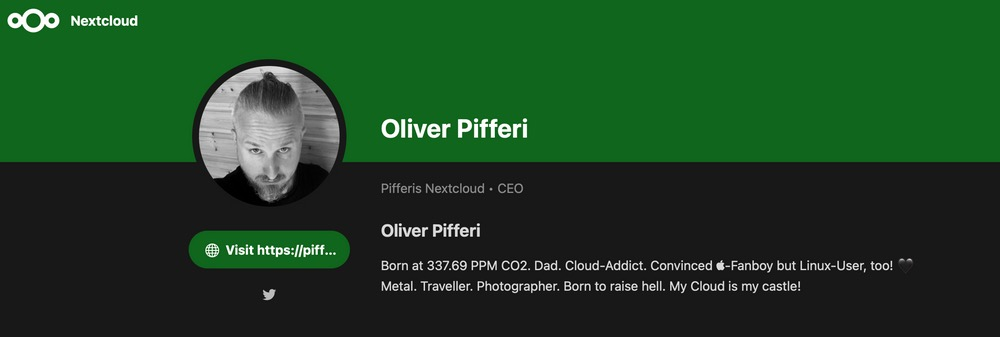
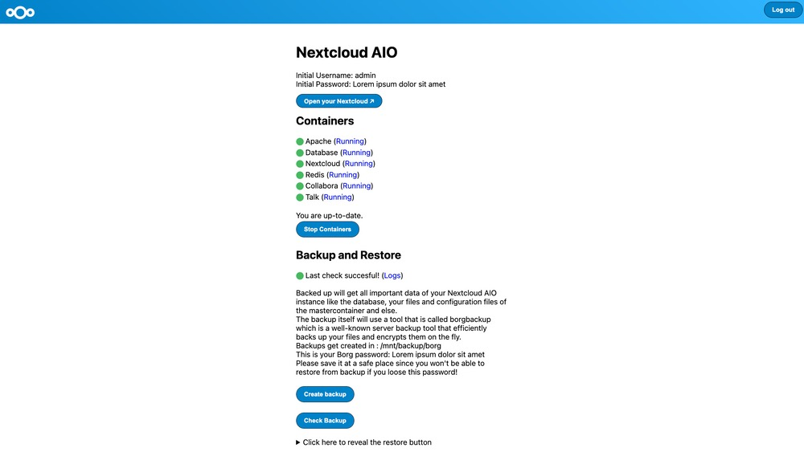
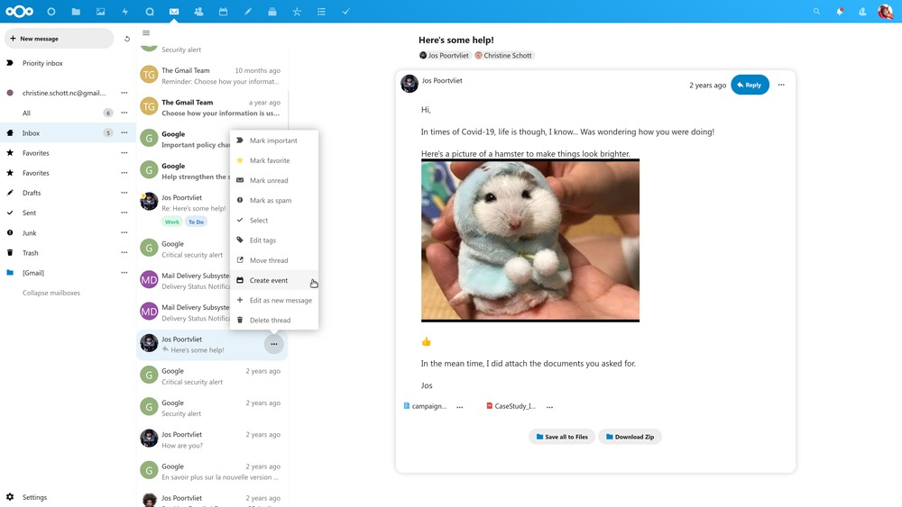
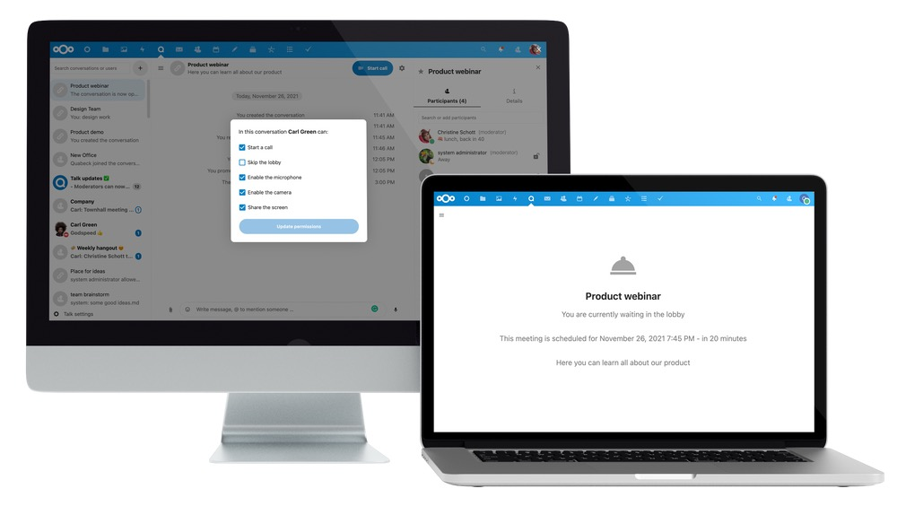
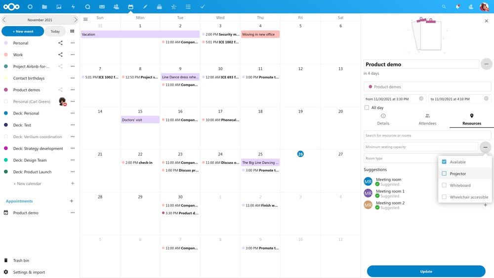
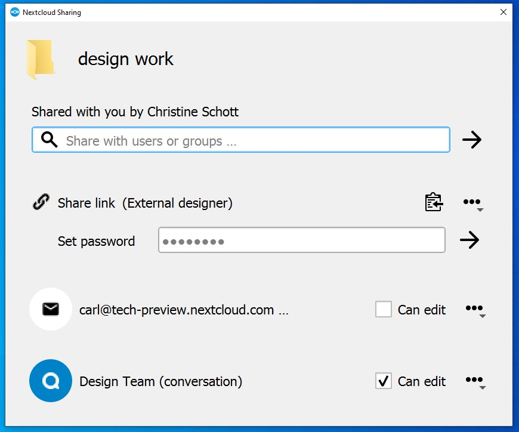

Since [Nextcloud](https://nextcloud.com/) appeared first on the stage in 2016, a lot has changed - and the pace the company keeps since then is still unbelievable.

Now, Nextcloud buries its Hub just to do a major overhaul and return with Nextcloud Hub II - and tons of new features in iteration number 23 which makes November 2021 one of the busiest months regarding news on Nextcloud!

Today, the company officially [announced](https://bum.berlin/) Hub II which may be seen as a the second major incarnation since January 2020 has been released to the public. The focus is clear: Strengthening the private Cloud-sector with a possible on-premises solution while being compliant and privacy-respecting in today’s crystalline world. Larger Nextcloud customers like the German federal government, Luxembourg and Deutsche Telekom (Magenta Cloud is dead, long live Magenta Cloud!) were thirsting for new features, therefore expanding functionality while accelerating their own deployments of Nextcloud-based services simultaneously. Nextcloud has just answered with Hub II, reflecting all needs in major deployments like in Schleswig-Holstein and through political decisions by the incoming 
German „traffic light“ coalition.

Emperor’s new clothes
---------------------

Nextcloud describes Hub 2 as a „major overhaul“ - and this isn’t without any reason: With this release come major feature and performance improvements to the classical „Files“-usecase, Groupware, Talk and the Nextcloud clients on all systems. Simultaneously, the company also introduced Nextcloud Office developed in collaboration with Collabora Productivity so the Online Office is now deeper integrated into the solution. Availability is given for easy and quick small-scale deployments on the major cloud platforms, VPS-providers of your choice and on-premises with an All-In-One Docker-based cloud image. Completing the circle, the previously announced peer-to-peer Backup solution for small installations is always part of the party and can backup the installation to either a new instance or attached, for example, S3-storage or SFTP-servers.

> This release presents a massive jump forward in terms capabilities, performance and integration for Nextcloud, marking it as the second major generation of our vision for Nextcloud Hub. As number one collaboration platform in Germany and the choice of collaboration platform for the Gaia-X project, Nextcloud is seeing an acceleration of deployments all over the world and in Europe in particular.

(Frank Karlitschek, CEO Nextcloud GmbH)

Integrated Office & Docker-ing
------------------------------

Just named, Nextcloud Hub II now introduces Nextcloud Office which was developed in collaboration with Collabora Productivity so user should be used with the look and feel. Together with an improved user experience and visual integration comes also features like Draw, a business-focused vector graphics and data visualization-app. Additionally, improved compatibility with proprietary document formats and more fill up the roster of features just like performance which was another focus: With a lower bandwidth usage and server load resulting from the development work, Nextcloud office should ease the pain of lacking speed in editing. Besides, this release is also told to expand Nextcloud’s office capabilities with public sharing support for the integrated Knowledge management app „Collectives“, usability upgrades to planning tool Deck and an Emoji-picker and extended mimetype support for collaborative note taking app „Text“.

Following the uprising of container-technology, the All-in-one Docker-image adds an option to the existing hosting solutions which already serve millions of Nextcloud users, giving users more control over their private cloud in exchange for a small amount of maintenance. It is told to automate configuration of web servers, databases and other underlying technology while offering the entire range of Nextcloud Hub II functionality out-of-the box. This also includes the high-performance back-ends for Files and Talk. It will provide an easy administrator interface from where individual services, ran as separate containers, can be managed so we may be quite curious how the implementation will look like!

Files, files, files
-------------------

Heading on, Nextcloud Files now introduces the ability for administrators to delegate administration to users and support for a configuration setting that limits what apps can be installed. Users can now create a profile page as already seen in the beta versions and User Status can be set automatically based on activities like a call in progress or vacation in the calendar which closes up to solutions like Microsoft Teams and its status drawn from Outlook. The file syncing performance with small files has been improved with the ability to bulk upload small files by the new desktop client. Search speed and S3-external storage-performance have been increased by an order of magnitude, as Nextcloud states.

Collaboration is the key
------------------------

In Groupware, the Calendar-application now introduces advanced room and resource search, configurable availability for free/busy and external appointment-booking as known from the „Calendly“-SaaS platform. The Mail app now comes with an improved layout, spam-handling, improved multi-account provisioning, IMAP tagging compatible with Apple Mail, Thunderbird and Evolution and the creation of Calendar events from E-Mail message: Features we usually needed a specific Desktop-client before are now integrated into the web interface of Nextcloud!

> Nextcloud is committed to providing its users 100% control over their data, something which provides near universal benefit for government agencies, businesses and individuals. Nextcloud Hub II is precisely what many modern organizations need and we expect a quick uptake and accelerated growth of our community and customer base.

(Frank Karlitschek, CEO at Nextcloud GmbH)

The Teams-derivate Nextcloud Talk now delivers the famous background blur in its web interface and a device check screen before starting a call - especially the first feature was long overdue and cloaks the chaos in today’s home offices. According to Nextcloud, moderation capabilities have been enhanced, giving moderators the ability to add and remove audio, video and screen share permissions from users. The Lobby-screen now gets a custom description and timer and individual waiting users can be brought into the conversation while the other participants remain in the lobby. The flexibility of audio/video connection quality was increased to better adjust to various network conditions, says Nextcloud.

Together with the availability of new, easy deployment and backup solutions for Nextcloud Hub II, Nextcloud-partners at [PDS Interop](https://pdsinterop.org/) have readied an update for the Solid server integration for Nextcloud aimed at wider deployment of this technology. The [Solid project](https://solidproject.org/team), conceived by WWW-founder Sir Tim Berners-Lee, is a new web standard for decentralized storage of data in so-called Pods. Nextcloud can therefore act as a storage Pod, giving users the ability to connect to other apps in the developing Solid ecosystem.

> It could be that the way Solid takes off is that it starts off with all the Nextcloud users just becoming Solid users. That bootstrap could be a very important part of the way Solid takes off.

(Sir Tim Berners-Lee, Solid Director, at Solid World April)

The other side of the medal: Clients
------------------------------------

The well-known Nextcloud desktop, Android and iOS syncing-clients coming with this release are now equipped with support for Unified Search, User Profiles and User Status on all platforms. The Android-app also introduces calendar backup/restore and an improved video player for streaming while the iOS app comes with native media integration and picture-in-picture.

The Desktop Client now supports End-to-end encryption with the Virtual File System on Windows and introduced a dialog to resolve file name issues. Additionally, various user interface-improvements line up including an enhanced activity dialog with file activity and sync status/progress as well as support for directly sharing files to a Talk conversation or E-Mail-address finally complement the Desktop Client release and may lead to a new, even tighter experience with the Cloud-instance.

Verdict
-------

Great news from Berlin today - with the release of Hub II, Nextcloud continues its fast development progress and shapes its solution for growing needs and new partners. While fortifying its roots and polishing well-known aspects of the solution, Nextcloud seemingly also focused in new features that close up to those of the [Big Tech-companies](https://pifferi.synology.me/eu-tech-sector-files-antitrust-complaint-against-microsoft/).

Personally, I am keen on updating and already went with the one or other beta but especially the new backup-feature and the All-in-one Docker-image will surely be a booster for Nextcloud-deployments „in the wild“ where the knowledge of building everything from the scratch is not given while the utter need for a private cloud solution is of major importance, already having the fear of proper and possibly missing backups in mind. Both approaches will boost the name „Nextcloud“ even more and I am quite curious how the solution will - once again - continue to develop. The facts are on the table and I hope that the industry will welcome these with open arms - even more than it did before!

Nextcloud’s All-in-one cloud image, Nextcloud Backup and the Solid Pod app are all [available](https://nextcloud.com/install/) right now with the release of Nextcloud Hub II!