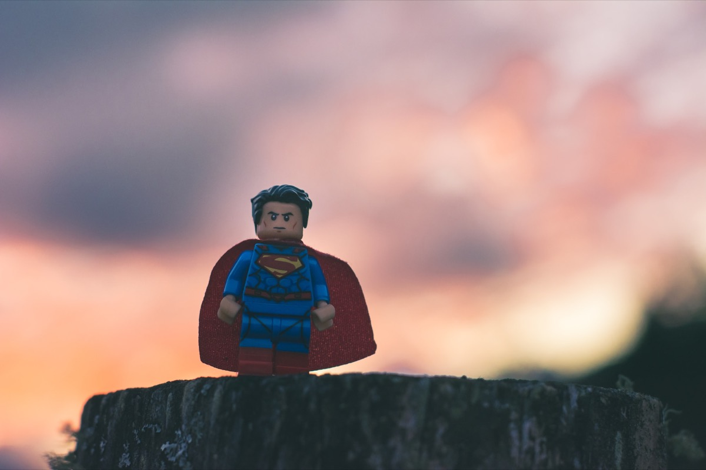

## Yet another year with the „pandemic“-flag has nearly passed. A year with frustration, deprivations, disenchantment but also traces of hope in an unsteady future.

COVID has shown that mankind is probably not evolved in the ways many people thought it was and while selfishness, rudeness, carelessness and voraciousness have still its rise, many aspects and groups of people stand out holding our daily work together just by doing their jobs. You won’t know some of them while you may meet others each days, but in these days facing Christmas 2021 I just want to sum up the things that work. Things that stand out in a world that is still most unsteady and doubtful in many ways. Not all superheroes have capes!

**Thanks** for my friends and family for being there whenever I needed them.

**Thanks** for all those smiles even if your job lets assume you are  in no laughing mood.

**Thanks** for all people doing nursing and caring and still being friendly despite the current situation.

**Thanks** for all the brave helpers who work at COVID-19 test-centers. You deserve my utter respect!

**Thanks** for all colleagues who still work as a forged unity instead of distributed, egomaniacal dorks.

**Thanks** for all package deliverers from whatsoever service - you keep the parcels running day by day!

**Thanks** for you people doing communal services for example working at the garbage disposal, police or fire department. You are the putty of this society even if you do possibly not think so!

And **thanks** to anyone I may have forgotten here that shows that there is still something to be thankful about. Most of you may go unnoticed but in every small moment someone who is just great may sweep through our minds, remembering your valuable contribution to our everyday life! There are traces of light in a world being thrown off the track and I hope that it will - and must - get better in 2022!