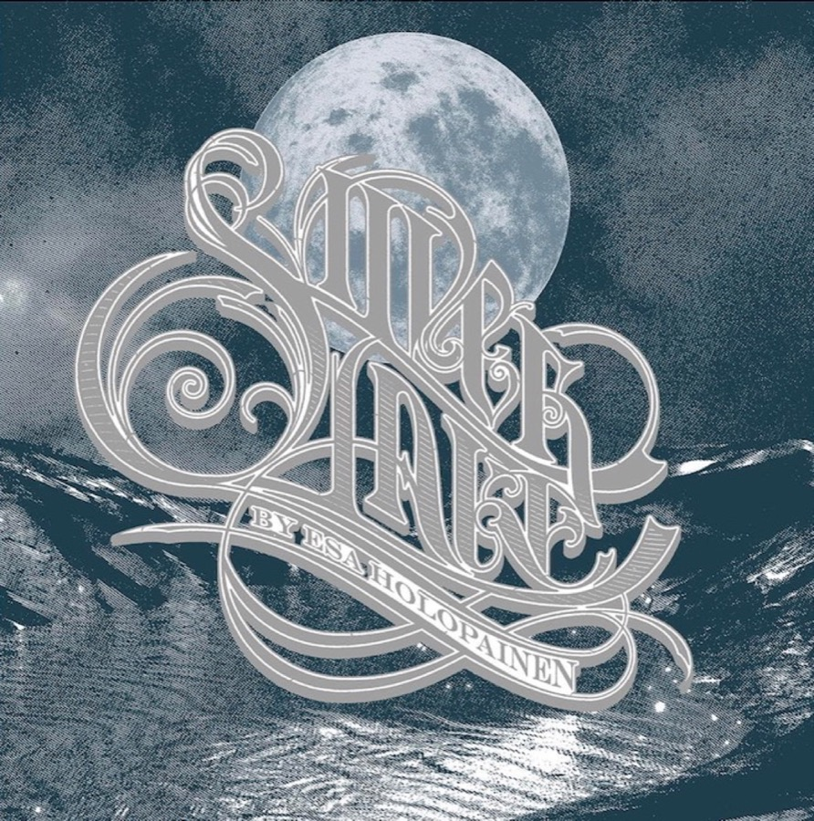

## Music is known to be a healing factor for the soul and an empowerment of one’s own senses but sometimes specific pieces of art stand out that underline a setting like, for example, a devastating year - and turn it to the better.

Being a longtime Amorphis-fan from the very beginning („The Karelian Isthmus“ was released in 1992), the development of this band was always something very special. „Tales From The Thousand Lakes“ followed in 1994 and was a huge jump that was completed by „Elegy“ in 1996. Amorphis caught me and I have been a fan of the Finns since then. Each album following over the years was somehow special but Amorphis climbed up to the absolute top with „Under The Red Cloud“ (2015) and especially „Queen of Time“ (2018) while especially the last-named advanced to one of my all-time favorite albums.

## Fellow musicians

While this glorious trilogy is going to be completed with the soon-to-be-released „Halo“ in 2022, mastermind and guitarist Esa Holopainen didn’t rest in 2021 and released his „Silver Lake“-solo debut in this dying year. A project with the spirit of the North, the true essence of Amorphis and the even more melodic roots of Esa himself, Silver Lake is completely different everything that could be expected but still a red thread in the musical legacy of Esa Holopainen. Together with singers Jonas Renkse (Katonia), Håkan Hemlin (Nordman), Einar Solberg (Leprous), Amorphis-pal Tomi Joutsen, Björn Strid (Soilwork) or lovely Anneke van Giersbergen, Esa Holopainen is - by far - not alone in this record and while he took care of the musical arrangements, each vocalist contributed his special style to the music, giving the single tracks their specific „Silver Lake“-shape without sounding like „just one more band“.

## The songs

It is - at least for me - quite hard to point out specific songs  here as, seeing this album always in its whole, but if I had to do so, five could (!) stand out in my opinion from which four are supported by videos.

### Sentiment

Starting with „Sentiment“, Katatonia’s Jonas Renkse gives this track starting with acoustic guitars his very special note and while the undercurrent is omnipresent, the pre-chorus „Change the sound of the future's voice, for the past is an arrow in my side“ directly burns into the listener’s mind. Lovers of the Katatonia-style will instantly feel like home while the video supports also my striving for Northern landscapes. Sentimental dreams are welcome!

> Change the sound of the future's voice
> For the past is an arrow in my side



### Storm

„Storm“ is one of the first singles which appeared before „Silver Lake“ got released as a full-length album and features iconic Swedish singer Håkan Hemlin from Nordman. While this song is rather Pop-loaded, the guitars and Hemlin’s powerful voice drive the song forward and manage to mix those Pop-elements with the well-known Holopainen-style and distorted guitars. The chorus

> Hear my home and learn who I am
> See my home, there is always more
> Feel my soul and I stay in here
> Don't you ever fear the storm
> Don’t you ever cry no more

takes care of pointing the listener into the right direction no matter what. A killer-track that combines the best of many worlds and is once again supported by a visual video artwork that enlights my wanderlust…



### Ray of Light

Backed by Leprous’ Einar Solberg, „Ray of Light“ was the second song besides „Storm“ that appeared before the album was released. Starting quite calm and rather acoustic, it also features some Pop-like elements but especially Solberg’s voice shows yet another side of „Silver Lake“ and certainly needs some time (and listening runs) to enfold its whole potential. Less Metal-lic but nevertheless powerful and a completely different building block in Esa Holopainen’s musical masterpiece: Unfamiliar, unexpected but exactly fitting anyway!



### Alkusointu

A poem of Finnish poet Eino Leino I - unfortunately - don’t understand but the music speaks for itself. The climax is reached in Esa Holopainen’s guitar solo which starts at the 2:48 mark and is propably one of the most-beautiful and fitting solos I have ever heard - and there were many. The spirit of Amorphis is ubiquitous once again and despite speaking the Finnish tongue, the essence of this song completely touched my soul.



### Fading Moon

Okay folks, I am biased here - since discovering Anneke van Giersbergen live singing The Gathering’s „Strange Machines“ on the 1996 Dynamo Open Air in Eindhoven, Netherlands, this voice has enchanted me. Anneke has also participated in Amorphis „Queen of Time“-album where the „Beauty and the beast“-scenario with Tomi Joutsen found its perfection in „Amongst Stars“ so she knows how to fuel Esa’s guitar passages with her mesmerizing voice. Additionally, fans will also know her contribution on „Her Alone“ on the „Under The Red Cloud Tour Edition“. „Fading Moon“ is no exception here and while the Dutch beauty sings here, the rest of the song is not less beautiful. Perfect match in its whole and nearly tearing up the listener’s eyes just because of this perfection!

## Verdict

I often talk to companioned Metalheads and we often drift into the discussion wether this is the expected „Amorphis B-Side“-material or not. To be honest, it isn’t - and for me, I never expected it to be such. Silver Lake by Esa Holopainen should be seen as a completely different approach to put - possibly unreleased - potential into new music besides Amorphis without Esa Holopainen steering on collision course amongst his projects. Although I have pointed out my personal five top songs amongst nine, it is difficult not to see Silver Lake’s debut album in its whole without tearing the nine single elements apart from each other. I had to (and couldn’t resist!) but, to be honest, each of those nine building blocks for an unified album stands for its own - finally forming its big and emotional whole, no matter which songs stand out for the single listener.

Silver Lake contains the essence, the heart of Amorphis - Esa Holopainen’s guitar - but goes completely different ways without being less beautiful. The debut (more is hopefully about to follow at some time) expands the cosmos of Esa Holopainen’s music footprint and although walking the path we know Amorphis for, the versatility of the songs and guest musicians interpreting the songs in their specific style define a beauty and a passion that is hard to describe - and even harder to grasp.

In an awful year 2021 which even surpassed the not less worse 2020, „Silver Lake“ is a ray of light (sic!) in the shape of (Northern) beauty. A trace of hope in uncertain times and a musical piece of art that is without equal, putting all those feelings many of us have encountered during these two years into a time capsule of audio-amplified pulchritude. This album is - by far - a musical masterpiece which got the heart of the matter at exactly the right moment and while not much will remain of 2021 in our own memories, „Silver Lake“ is the one element that helped to vanquish the emotional pain of two crappy years in a row. I'm raising my hat here for Esa Holopainen creating this eternal masterpiece in times where we may need some positive signals!

