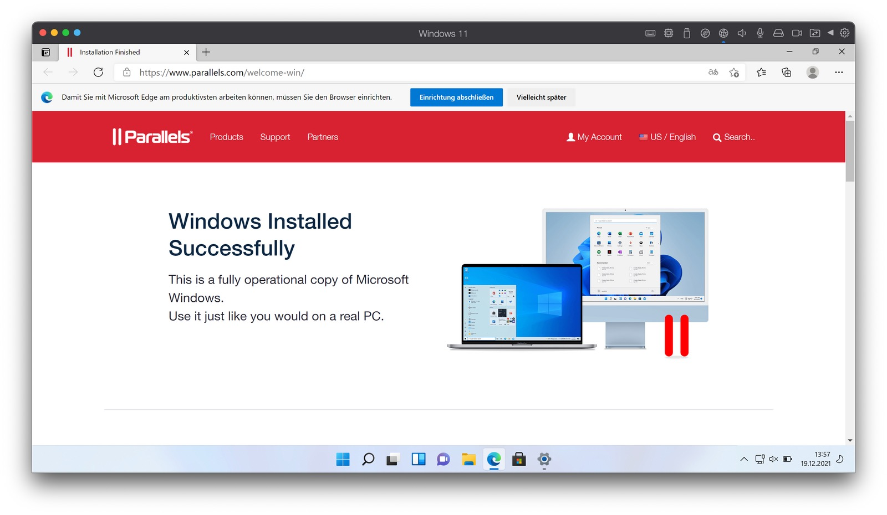

## Even if you may feel comfortable with your macOS-environment, there may be a need for running different operating systems nevertheless.

Especially if you pair the Apple Silicon-support with the seamless integration of Windows 11 on a Mac-system, you’ve got no other choice than to go with Parallels!

Over the years, desktop virtualization on Macs has been a shoulder to shoulder-race between the top dog VMware providing VMware Fusion and Parallels delivering Parallels Desktop to the user base. I have always been a fan of VMware Fusion but, during the last three years, the long shadows casted by Parallels finally lead me to put my priority on the longtime competitor. With the [arrival of Apple Silicon-based M1-chips](https://www.apple.com/newsroom/2020/06/apple-announces-mac-transition-to-apple-silicon/), the pack got reshuffled and with Parallels providing ARM-based Windows 10 and even 11, my personal race found a winner at last.

My background
-------------

Some years ago, I loved to connect my VMware Fusion-application to my ESXi-host at home, managing everything under the hood of a natural Mac-app. Over the time, the host disappeared while Cloud-computing began its rise so one argument for still going with VMware disappeared as well. Having often the need of virtualizing Windows- or Linux-systems on behalf of several projects, I ventured through many forums searching for benchmarks which of the two solutions provide a little percentage more performance for productive systems underneath macOS.

The results often drifted towards Parallels being a little bit faster for Multimedia-based environments while VMware Fusion provided the more „development“-like professional touch when stability is preferred. Not knowing wether was the proper choice, I omitted the following Fusion-update and put all of my virtualization-eggs in the Parallels-basket which finally resulted in this review featuring the latest iteration Parallels Desktop 17.

Going all in for Apple Silicon
------------------------------

At the WWDC 2020, Apple announced plans to transition away from Intel-chips to Macs built with its own Apple silicon chips starting in late 2020 with a re-designed MacBook Air, MacBook Pro and Mac mini. While the possibilities with these new chips still appear quite infinite, the virtualization of common x86-systems got a lot more difficult as the new systems are based on ARM-chipsets.

Additionally, existing virtual machines created on Intel-Macs won’t work on M1-enabled units and the creation of new VMs is just possible with compatible installation media: x86-based platforms don’t work on Parallels running on Apple Silicon-enabled Macs. To create new virtual machines, you need either an .ISO- or .VDHX-image with an ARM-based OS and while the ARM-port of Windows 10 already worked well, Parallels 17 enables you to use Windows 11, too. Besides, common Linux-derivates like Ubuntu, Debian, Fedora or Kali Linux can be installed on your M1-powered Mac. That’s for the restrictions, let’s now have a look at the possibilities!

Basic Steps
-----------

To start with installing Parallels Desktop 17, we either have to download a [fully-featured 14-days trial](https://www.parallels.com/products/desktop/trial/) or [download the latest upgrade](https://www.parallels.com/directdownload/pd/) once we already have an active subscription. The installation on (here) macOS 12.1 „Monterey“ is pretty straightforward once the .DMG-file has been downloaded: Just open it, double-click on the Parallels-package and read / accept the EULA. Once the user you are running macOS with hasn’t proper administrative permissions, you will need to enter those now so that Parallels can be placed into your „Applications“-folder.

Once Parallels was started after the initial installation, you may either use the trial for 14 days, enter and verify your software key (an active Parallels-account is needed here) or buy the software when both scenarios don’t match your current use case or you have exceeded the time for a free trial. After one of these prerequisites is met, Parallels Desktop is functional and we are ready to start!

Features
--------

Whether you want to run an isolated virtual machine as a lab or a fully-featured Windows 11-machine which seamlessly integrated into your macOS (and vice versa!) thanks to the „Coherence“-mode, Parallels Desktop 17 features it all. Personally, I prefer to separate my machines from my production OS but this doesn’t need to match your needs.

Guest Systems
-------------

As mentioned before, Parallels Desktop 17 features support for many ARM-based Linux-distributions and, in the current version, even built-in Windows 11-support straight from the scratch. With this offer, the solutions is currently years ahead of VMware Fusion which is, unfortunately, still struggling to implement the ARM-architecture in its solution: For now, just a publican technical preview is available which will be kept active for the rest of this year and possibly spring, as [VMware stated this September](https://blogs.vmware.com/teamfusion/2021/09/fusion-for-m1-public-tech-preview-now-available.html). With Fusion 12.2 available since October 14th, there is still some work to do before adopting Apple Silicon to its fullest so this missed opportunity for whatever reason is a big plus for Parallels Desktop 17 taking the front rank in this Apple Silicon-adoption race.



### Windows 11

Back to Parallels and Windows: To be specific, you simply can’t walk around the installation of Redmond’s latest Windows-iteration but, after all, Parallels downloads a current ISO, places it in your Mac’s „Downloads“-folder and starts a clean install straight from the scratch. You may omit this process of course but Parallels is quite nagging here and once you haven’t made the initial install, the reminder to go with Windows 11 appears again and again. Apart from the that (and most people will go with a Windows in their use case!), the system is deployed in just a couple of minutes on my 2020 MacBook Air with Parallels Tools already installed. Anyway, it needs, for licensing reasons, a proper Windows key to unlock all Windows-settings and features after this initial installation.

As the specific Windows 11-ISO (containing the „Home” and „Professional”-edition) is downloaded anyway and I prefer to install my systems rather manually from the installation medium instead of using any kind of guided assistant, I instantly went on creating a new virtual machine in manual mode next. The choice for which use case my Windows-installation is aiming at — productivity, software development, software testing, design or „just” gaming can be made just during this step: Parallels will adjust some basic and specific settings to suit these needs. Afterwards, you may alter the hardware-configurations and specific options for this individual machine — including sharing-options with macOS — individually.

As for security, the TPM-integration for Windows 10 and 11 enables you to use Secure Boot and BitLocker to gain a higher grade of security and even a fingerprint-reader attached to the Mac can be looped through to work with Windows Hello. Up to 38% faster Windows 10 resume, up to 33% faster Windows startup on Apple Silicon-Macs or up to 20% better vDisk-performance complete the whole set on new and improved features once you plan to run Windows as a guest operating system on your Mac!

### Linux

While my personal use case also bases on several Linux-distributions it is great to see that Parallels Desktop 17 is already offering the initial installation of Ubuntu, Debian, Fedora or even Kali Linux. My preferred distribution, Linux Mint, is - unfortunately - missing due to lacking support for the ARM-architecture so remember: While Parallels is able to run native ARM-code without any hassle, the operating system you want to install must support it, too - otherwise this might be a show stopper. As  Linux Mint is more or less an Ubuntu-clone, my hopes are still there that I can virtualize my favorite Linux-desktop based on Linux Mint at some time in the near future.

Until then, Fedora Workstation is my distribution of choice for a Linux running on my Mac backed by Parallels Workstation 17. The installation is - just we might have expected - pretty straightforward and after installing the distribution from the official media (or Parallel’s installation Wizard) and deploying the Parallels Tools, Fedora runs without any problems and even more quite smoothly as it did on the Intel-based MacBook Air I had the chance to test it on, too. Coming with multi-monitor support on Linux as well, the same counts for the Windows 11-experience which runs surprisingly good and hassle-free even on more than just one monitor!

### macOS

Starting Parallel’s wizard, you are also able to create a virtualized macOS-instance which can, in some scenarios, be useful, too. During a Mac-training some months ago I had to provide a clean Mac for training purposes and went with the virtualized macOS, handling the course without problems. Believe it or not - in collaboration with Apple, Parallels engineers are told to have created the world's first prototype of a macOS Monterey virtual machine running on a Mac with Apple M1 chip.

Pricing
-------

Depending on your personal preferences, you may choose between [three editions](https://www.parallels.com/eu/products/desktop/) of Parallels Desktop 17: The „Standard“-edition costs a one-time-fee of $79,99 but is limited to 8 GB vRAM and 4 vCPUs per VM while the „Pro“-Edition for $99,99 (billed annually) exceeds this limit to 128 GB vRAM and 32 vCPUs and enables you to access your VMs remotely via iOS/Android-devices or your preferred browser.

The same counts for the „Business“-edition with the same pricing but aiming at the enterprise with some specific features like centralized administration and management. Additionally, the ability to use unified volume keys for mass deployments of virtual machines is also tied to the „Business“-license. Updates for the „Standard“- and „Pro“-editions may be purchased as well, putting $49,99 on your upgrade-bill.

Once you are a verified student, you may also go with the „[Student](https://buy.parallels.com/329/purl-student-verify-proxiid?_gl=1*168ymve*_ga*MTI3Nzg2ODQ5Ni4xNjQwODc0NTc0*_ga_Z1D1QSDCDP*MTY0MDg3NDU3NC4xLjEuMTY0MDg3NDYwOS4yNQ..)“-edition where, of course, a valid student verification is required.

Final Verdict
-------------

Once you go with desktop virtualization on macOS, you need to know where the shoe of your personal needs is pinching. So to speak, the choice between the alpha male named VMware Fusion and the earlier competitor Parallels is something that needs to be re-evaluated with each year’s updates.

While VMware seemingly struggled with the timely adoption of M1-Macs since the release in late 2020 (and still does even one year after the first units were shipped), Parallels Desktop scented its big chance and became more visible for users of Apple’s new SoC-architecture. If you’re with a current Mac based upon Apple-SoCs, you have barely a more convenient chance of creating, maintaining and using virtual machines than you have got with Parallels Desktop. Speed, functionality and flexibility are provided on a near-to-perfection basis and while the license model should suit everyone, the core product underneath is exactly the perfect base for desktop virtualization on the Mac in late 2021.



VMware may catch up in the Spring or Summer of 2022 but, until then, Parallels 18 may appear on the stage and has once big pro aspect coming with it: Proven experience for a professional and convenient way of adding ARM-based virtual machines to your macOS Desktop-environment! At the time of writing, no way leads around Parallels Desktop and especially if you pair the Apple Silicon-support with the seamless integration of Windows 11 on a Mac-system, you’ve got no other choice than to go with Parallels!