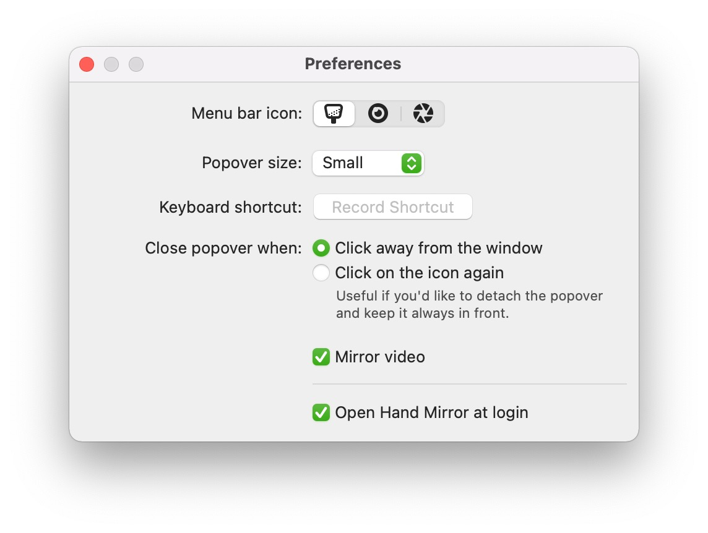

## Entering the well-known video-conferences that are our daily business since the pandemic without checking your look could bring you in unwanted situations.

Fortunately, there is also an app not just for „everything“, but especially designed to meet this use case from a smart developer named Rafa.

There is an app for everything, isn’t it?
-----------------------------------------

Fortunately, there is also an app not just for „everything“, but one especially designed to meet this use case from a smart developer named Rafael "[Rafa](https://rafa.design/)" Conde. Some may know him as one man behind [Superlist](https://superlist.com/) but with [Hand Mirror](https://handmirror.app/) which is as tiny as useful, he closes a gap many workers in the home office have to overcome before joining a meeting.

The app is straightforward as it - well - simply uses your webcam (either the integrated or an attached) to mirror your look so that you still can opt in for a makeover of your hair, your clothes, even your make-up before blundering into a meeting with a morning-lookalike or an untidied office in the background.

An app, self-explaining
-----------------------

After installing, the app humbly enters macOS menu bar and resides there until you click on one of three customizable icons which then opens a windows with your webcam’s contents therein. The windows’ size can also be configured to meet three options. Naming the options, these are - you may have guessed it - manageable as well and self-explaining.

People who are now questioning the app’s purpose should read this quote from Rafa, mirroring my workflow just before I stumbled upon this app:

> Opening Photo Booth was exactly what I was doing, but I would use Spotlight, and sometimes it would open Photos instead, or I would open Photo Booth so much that if I just typed "Phot" in Spotlight it would default to Photo Booth and not Photos, and that's nice but not what I want — if I type "Phot" and hit return, I would expect to open "Photos" and not "Photo Booth". So that was getting annoying and I decided to build this instead.

Verdict
-------

To sum it up, this tool is as simple as brilliant and closes a - at least for me - gap in my daily workflow routine as I used to open either the Camera- or Photo Booth-app before or used the preview-function of the particular video conferencing solution. Hand Mirror is lightweight, notarized and - of course - an universal binary running on Apple Silicon- and Intel-Macs without any hassle. And the best - it’s free of charge!

Hand Mirror requires macOS Catalina or later and can be officially [downloaded via the App Store](https://apps.apple.com/us/app/hand-mirror/id1502839586?mt=12&ref=pifferi.synology.me). Going back to High Sierra, affected users may download the .DMG-file [here](https://handmirror.app/Hand%20Mirror%201.1.2.dmg).