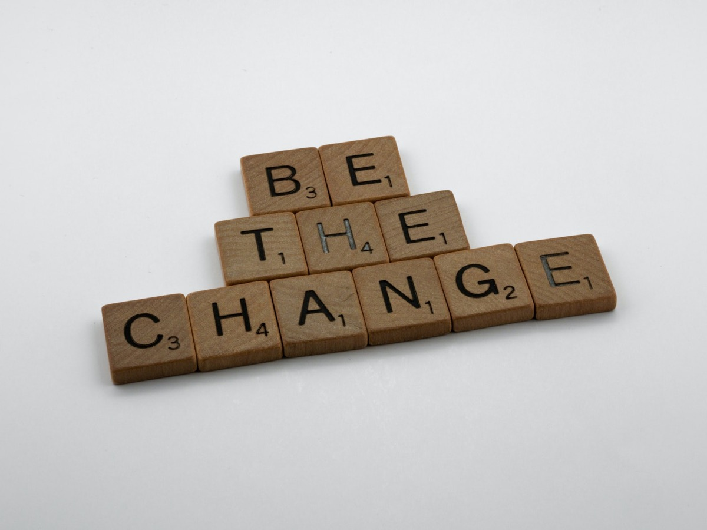

## We always strive for more. Higher, faster, further - there seems to be no limit in everyday life. But, sometimes, we are just vulnerable humans with a - more or less - healthy soul.

These days, Max Eberl, manager from my favorite soccer team Borussia Mönchengladbach, retired from his role at the team playing in German Bundesliga. Rumors spread the day before and I had to admit that I was quite angry, expecting he would leave to join another team despite the team’s current shape: Ranked 12th, Borussia Mönchengladbach is playing the worst season for years, just four points away from the relegation spot being the elevator to 2nd Bundesliga.

How terribly wrong I was. Being burned out from a business that has nothing more to do with „just“ sports, Max Eberl was a building block for this team since joining it as a player 23 years ago. Changing sides in 2005 and advancing to director of football in 2008, he formed a team that went through up and downs but could be counted to the better ones here in Germany. Now this journey has ended not because of the anticipated change to another team but for personal and health reasons. And, without expecting this before, Borussia’s press conference unknowingly has also shown what’s wrong with the world and the people these days.



These events around Max, including the social media shitstorm before (and not making an exception for me as I also expected anything but not that!) and the real reason for him instantly dropping the mic are the sad epiphenomenons of our time. Besides acceptance and get-well-wishes, there is still the frightening „business-as-usual“-mentality fueled by the press, asking for the next match and Max’s replacement in the same breath. We may just learn from this press conference where a man that has given everything for a single club turned his inside out, unveiling his utter soul and confessing that he cannot continue with something that was his whole life.

Who doesn’t share the pain that the „higher, faster, further“-method is going to wreck human beings at a certain level? Permanent communication on all channels, rising expectations regarding instant answers and 24/7 availability are more the standard than the exception. Of course this depends on your job and while Eberl had surely not much time to unwind himself as the manager of a Bundesliga-team, these things do also reflect on many people in other job genres. Take the IT-business for example - many don’t work in this genre because of the money but because they’ve turned their hobby into a profession - paired with passion for the fully-digital world.

By all means - and even if you are absolutely passionate about your job: Take care of yourself. Something like this comes slowly. Creeping. Without warning. Accelerated by COVID and a society divided for many reasons. Expectations to be available and always online even if you visit customers in persona. Variety of communication channels and tools. People trying to offload their duties onto you. Social Media-shitstorms without knowing the backgrounds. The world got more toxic during the last two years and things won’t get better in the aftermath of COVID-19, even if expecting the current status quo to turn into an endemic with the last „Omicron“-wave and getting back to the „new normal“ sometimes in the future.

> There is a darkness
>
> In my soul
>
> A darkness
>
> That can't be tamed
>
> A deep void of emptiness
>
> A gaping wound
>
> A vile, corrupted entity
>
> That has no name

(AMON AMARTH - „Into the Dark“)

Max Eberl and this case should be the proof that we need to take more care of ourselves and that this kind of illness can affect all of us. This is no weakness but a strength to realize that there is something wrong and the will to fight this obvious sickness. And while even 80-year old presidents in certain press conferences don’t seem to have any kind of understanding for the status quo, people these days are different than centuries ago: We may show weakness, confess that we are in an emotional and mental dead end and we may reach out for help - as there will always be someone taking your hand! We should use any spare time to live our lives in the ways we want them to be lived and recharge our batteries in every single moment!

Get well soon, Max - and thanks for everything you have sacrificed in these years! Now your own identity, your own human being and therefore your own health only counts and nothing more or less - soccer is of second rank here!

