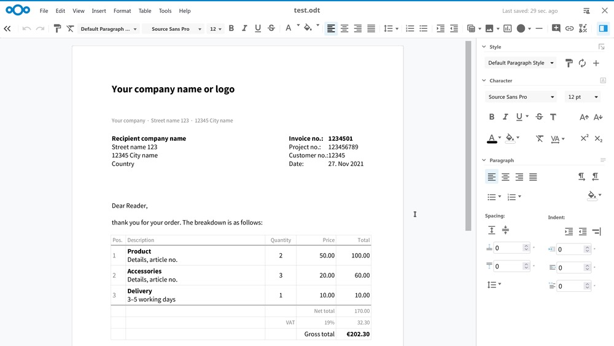
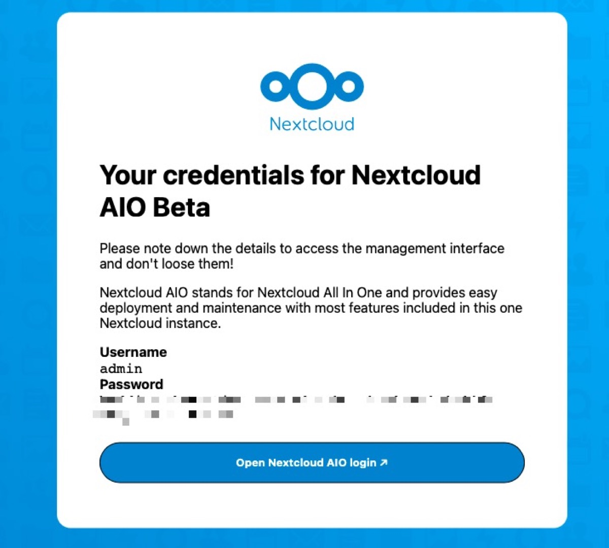
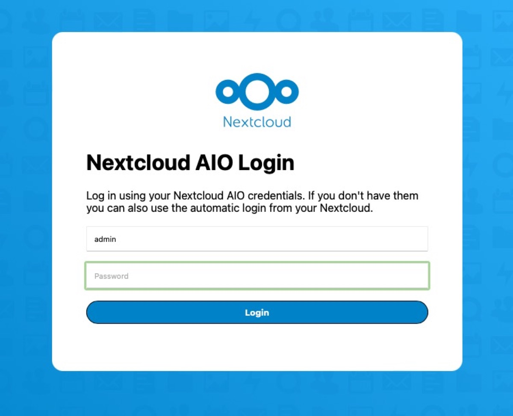
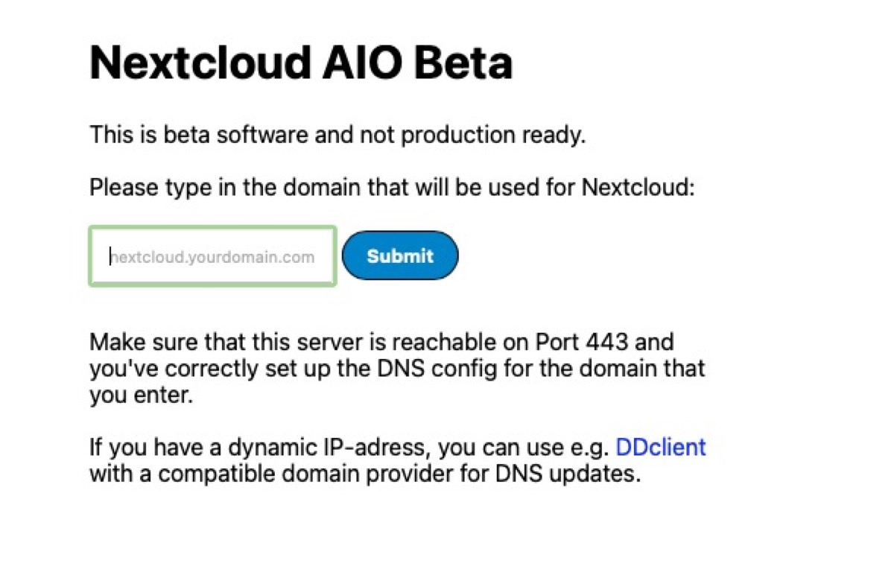
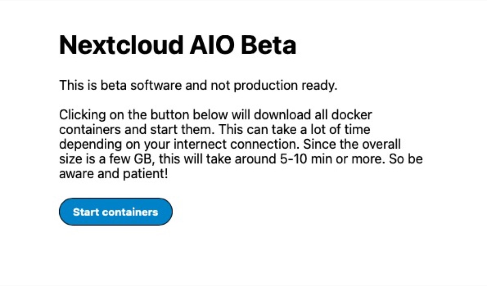
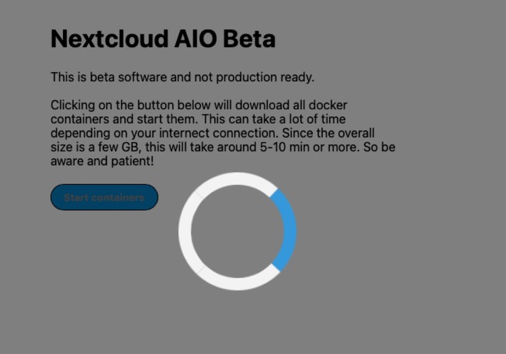
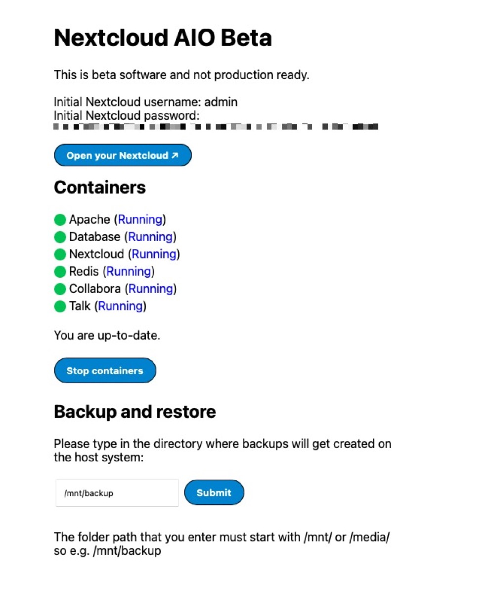
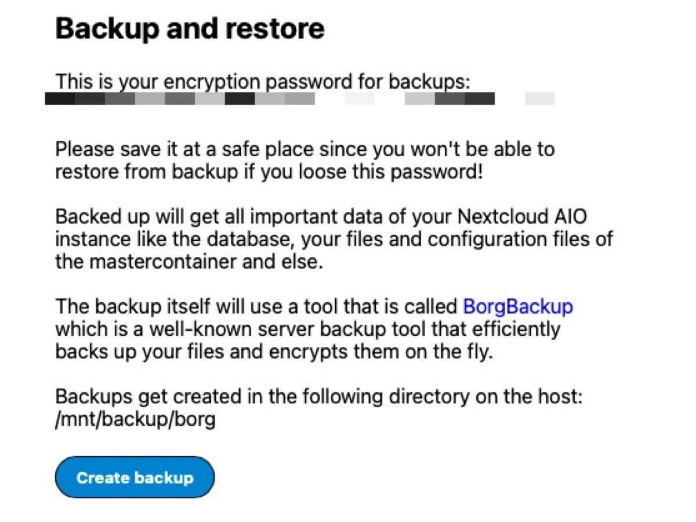
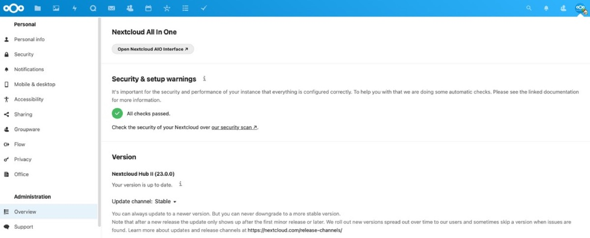
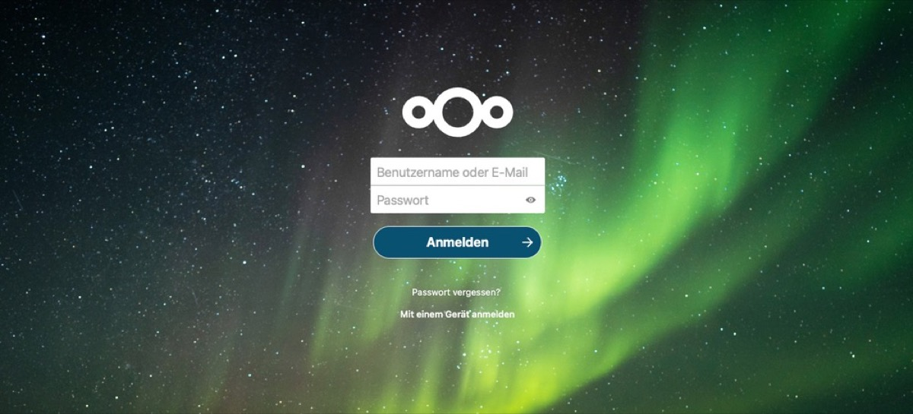

## There are many ways of successfully deploying [Nextcloud](https://nextcloud.com/) depending on your knowledge. One new has now just entered the stage, making your way to your own private cloud a lot easier!

Since 2016 I have refined my way of installing a Linux-system with Apache, PHP, a database and some other tools as foundation for an own Nextcloud. Over time, many tweaks followed with the experiences I have gained but what with the less-savvy people out there striving for a private cloud? The answer is probably one of the easiest ways to deploy it: New [Nextcloud AIO](https://hub.docker.com/r/nextcloud/all-in-one) (All in One) with Nextcloud Hub II comes on based on Docker-technology, is blazing fast and absolute easy to deploy - let me show you how!

Prerequisites
-------------

First of all, you need a server with an updated Linux-system running on it, either in your home or hosted by a provider like [Netcup](https://www.netcup.eu/) where also my projects are hosted. As we don’t want to focus on NATing and making your router at home ready for dealing with Nextcloud (which is yet another topic!) we focus on a freshly installed VPS running, for example, Ubuntu or Debian Linux.

Nextcloud AIO features all single components you usually would install one by one and consists of single Docker-containers. Covered are the webserver, the database, Nextcloud itself, a Redis-server for caching, Collabora running the new Nextcloud Office and - finally - a Talk-container for Instant Messaging, Collaboration and Video Communications even with the High Performance Backend enabled! Especially the latter is quite fiddly to implement so the final result will deliver a fully-equipped Nextcloud-instance to the user without the hassle of configuring everything piece by piece. On top there is also a backup-solution based on BorgBackup available as well so you shouldn’t miss anything once you have deployed those containers.

Basics
------

We start with an empty VPS which is - in my case - running with Ubuntu 20.04 and all updates installed including the curl- and (here) UFW-packages. The first is mandatory, the latter my one small way of additionally securing the Linux-server floating in wide sections of the World Wide Web. Especially UFW is also known as „Uncomplicated Firewall“ and an interface to the well-known iptables. It is particularly well-suited for host-based firewalls and provides an easy-to-use interface for beginner users who are rather unfamiliar with firewall concepts. UFW is the most-popular firewall tool originating from Ubuntu and supports both IPv4 and IPv6.

To configure our UFW on the freshly-installed machine, use the following commands according to the needed TCP/UDP-ports for Nextcloud AIO. First, UFW is installed, then the different ports are being opened while the last command enables UFW at boot time.

```
sudo apt install ufw -y
sudo ufw allow http
sudo ufw allow https
sudo ufw allow ssh
sudo ufw allow 3478/tcp
sudo ufw allow 3478/udp
sudo ufw allow 8080/tcp
sudo ufw allow 8443/tcp
ufw enable

```


SSH is optional here but is needed to connect to my VPS remotely while especially port 8443 is elementary for Nextcloud’s AIO web interface. You may tighten the security aspects in a more granular way later, possibly supported by tools like Fail2Ban, but this shouldn’t be part of this tutorial. Speaking generally, you should know which ports should be opened in a live system being accessed from the Internet - the choice is yours!



On the machine, there is a specific user we work with as running containers (or doing anything else) with the root-user often is not the best idea. So head over to your system, log in with the desired user and install the Docker-engine first as this is the minimum prerequisite to get everything running:

```
sudo curl -fsSL get.docker.com | sudo sh

```


To run Docker as a non-privileged user, we should consider setting up the [Docker daemon in rootless mode](https://docs.docker.com/go/rootless/) for our specific user but, before, he needs to be sudo.

To achieve sudo-permissions for our service-user which is, for example, named „nextcloud-svc“, enter the following commands:

```
adduser nextcloud-svc
usermod -aG sudo nextcloud-svc

```


Then switch to the specific user by typing:

```
su - nextcloud-svc

```


and secure your docker service which is finally done installing the desired additional package by the command

```
sudo apt-get install -y uidmap

```


followed by

```
dockerd-rootless-setuptool.sh install

```


and exporting the named environment variables

```
export XDG_RUNTIME_DIR=/home/nextcloud-svc/.docker/run
export PATH=/usr/bin:$PATH
export DOCKER_HOST=unix:///home/nextcloud-svc/.docker/run/docker.sock

```


once - additionally, you may also add those to your .bashrc-file manually.

People who prefer to go with the standard-Docker-packages delivered by Ubuntu's standard repository just need to enter

```
sudo apt-get install docker.io
```


instead, installing all necessary packages this way - the choice is yours!

After taking care of those prerequisites, let’s finally pull the latest Nextcloud AIO-base image from the [official Docker-repository](https://hub.docker.com/r/nextcloud/all-in-one) which may take a short amount of time, depending upon your Internet connection:

```
sudo docker pull nextcloud/all-in-one:latest

```


To fire the basic container up and start everything for the very first time, use the command

```
# For x64 CPUs:
sudo docker run -it \
--name nextcloud-aio-mastercontainer \
--restart always \
-p 80:80 \
-p 8080:8080 \
-p 8443:8443 \
--volume nextcloud_aio_mastercontainer:/mnt/docker-aio-config \
--volume /var/run/docker.sock:/var/run/docker.sock:ro \
nextcloud/all-in-one:latest
```


which also enables a persistent restart of all containers after, for example, a reboot of the host system.

Basic Configuration
-------------------

After the containers are up and running, we may now head to our preferred browser and enter the fully-qualified domain name of the server as a https-string followed by port 8080, for example while ignoring the possible certificate error yet:

```
https://cloud.my-domain.tld:8080

```


The integrated ACME-process will now instantly fetch a Let’s Encrypt-certificate and welcome you with an initial setup-screen delivering initial credentials for your Nextcloud AIO-login, needed to install your private cloud.



Follow the link and enter those credentials.



Following the installation process, you may now enter the fully-qualified domain name your Nextcloud-instance should be running with which is, in my case, also cloud.my-domain.tld.



This ensures this domain to be added into Nextcloud’s „trusted hosts“-configuration and enables you to head on in the next screen where the containers can be started for the first time.



All specific containers will be fetched here - this can take a lot of time depending on your Internet connection. Since the overall size is a few GB, this will take around 5-10 min or more so be aware and patient while the circle does its work!



Further configuration
---------------------

After a short while, you should see a status page showing your final and initial Administrator-login and password to your freshly created Nextcloud-instance. Write down those credentials and alter them as soon as possible, for example by just changing the password or creating a new, differently-named Administrator to prevent strange people from trying to guess the password for the usual „admin“-login!



Besides, you see all containers and their statuses (clicking on „Running“ shows the specific log of each container) and while you get familiar with this interface, you may also add a path for the integrated backup-solutions and submit this basic parameter. Once this has been done, the instance will present you an encryption password for backups which you should write down, too. Please save this at a safe place since you won't be able to restore from backup if you lose this password! The contents of the backup are all important data of your Nextcloud AIO-instance like the database, your files and configuration files of the master-container and (quite) everything else!



Once there is a major update for Nextcloud AIO, you may also refresh the components from this page which is, token-based, always accessible from your official Nextcloud-backend once you work with an user that has administrative permissions.

Your Nextcloud, Docker-ized!
----------------------------

After doing that much work in the background, you may now head to your Nextcloud AIO’s final URL which listens at Port 443, so venturing to

```
https://cloud.my-domain.tld

```


will instantly lead you to your complete Docker-ized Nextcloud-instance. Use the administrative credentials shown above to enter your own private cloud and configure it to suit your needs. While Nextcloud Office and Talk are already preconfigured and running, there are still tons of [apps](https://apps.nextcloud.com/) to extend your Nextcloud with!

All checks within your Nextcloud should be okay despite of the warning regarding the „mission default phone region“. As you cannot alter Nextcloud’s config directly like you would in a non-Docker-based installation, firing the command

```
sudo docker exec -it nextcloud-aio-nextcloud php occ config:system:set default_phone_region --value="yourvalue"

```


will suit your needs while my value would be „de“ for „Germany“ here - and with issuing this command, the one, only and last warning regarding your freshly-installed Nextcloud AIO-instance should have disappeared!



Generally, you may always use

```
sudo docker exec -it nextcloud-aio-nextcloud php occ your-command

```


to work with the well-known „occ“-command whereas „your-command“ should - of course - be replaced with the parameter you want to work with. We see: Even if Docker-ized, we still have the ability of working with the tools we know from „usual“ instances so far, having the chance to affect our installation in the ways we like to!

Verdict
-------

The solution came nearly out of the nowhere and has been already very, very active on [GitHub](https://github.com/nextcloud/all-in-one) lately. Still being labeled as „Beta“-software which may still have serious bugs while usage is at one’s own risk, Nextcloud AIO has reached a grade of near-to-perfection within the first days since release and is currently still versioned 0.2.1 while deploying latest Nextcloud 23.0.1.

The Docker-containers seem to be perfectly balanced and configured, the overall performance is blazing fast and even outperforms the way I built my Nextcloud over the years… manually! The big pro according to my use case if that both High Performance Backends (for Files as well as Talk) are implemented from the scratch as well while especially the nasty and distributed configuration of Talk, Signaling und the High Performance Backend is just fully-functional after the initial installation. Even with my best efforts, I often struggled and - seemingly - never achieved to get this running by 100% with my manual install!



Tech-savvy or not, here I decided to put my own „How-to-install-and-tweak-Nextcloud“-scenario aside and got engaged with this kind of deployment in no time. I was already a fan of Docker while fueling my Office-integration with Collabora Online] and ONLYOFFICE but this Docker-construct is a clear sign that the container-technology does not save time, but also comes with unbelievable flexibility. Yes, Nextcloud AIO is still entitled as „Beta“ but together with the well-known vivid community and the leading contributors [szaimen](https://github.com/szaimen), [Lukas Reschke](https://github.com/LukasReschke), [Adrian Gebhart](https://github.com/pestotoast), [Alexander Hörl](https://github.com/AlexanderProd) and [ph00lt0](https://github.com/ph00lt0), this project is - besides my long-time sympathy for Nextcloud - surely one of the greatest Docker-projects I have found in the last years!

You may find the GitHub-repository [here](https://github.com/nextcloud/all-in-one) while the Docker Hub-page can be found [here](https://hub.docker.com/r/nextcloud/all-in-one) - give it a try and pull the container, it’s definitely worth the few minutes of time getting a Nextcloud which is near-to-perfection!