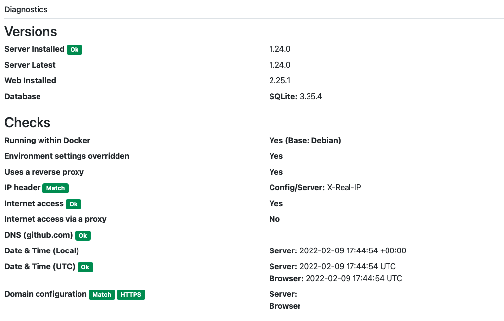
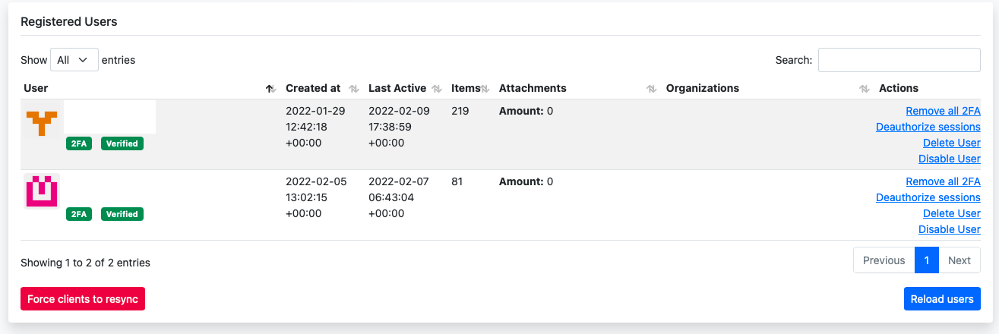

## Even a day after the SaferInternetDay, managing the challenging riddle to choose a specific password manager is still a tricky task, especially if you also want to self-host your sensitive data.

Should this be the case and you want to be independent from a service provider for whatever reason, it - of course - depends upon your choice if self-hosting is an option or not. Users of [Bitwarden](https://bitwarden.com/), one of the well-known password managers for example, have the chance to use the [Open Source](https://bitwarden.com/help/install-on-premise-linux/)\-based tool in many ways. By standard, you can register at Bitwarden’s website and push your passwords to their service either for free or for $10 a year with more features. As an alternative, you may self-host this repository but the official way of doing so is quite a heavy-weight as the Docker-based installation is just supporting MSSQL as database backend for now.

One more alternative
--------------------

Fortunately, there is an easier way to achieve the way of putting your password entries into a database located within your reach, based upon a compatible platform: [Vaultwarden](https://github.com/dani-garcia/vaultwarden) is an unofficial Bitwarden-compatible server written in Rust and some of you may already know it under its previous name bitwarden_rs. Being compatible to all official Bitwarden-clients you may [download](https://bitwarden.com/download/) from the [official website](https://bitwarden.com/download/), Vaultwarden is a sleek and mighty alternative and can easily be deployed on your, for example, NAS or a VPS. In my case, a VPS based upon Ubuntu 20.04 and already equipped with an Apache-webserver is a solid foundation for this purpose. It will feature all elements of the [$10 Premium-subscription](https://bitwarden.com/pricing/) like Two—Factor, YubiKey- and FIDO2-authentication or file attachments and stores everything in a SQLite-database.


Prerequisites
-------------

There are many ways to get Vaultwarden running and while some deploy it on a Raspberry Pi and even a Docker-enabled Synology-NAS with a reverse proxy will work, I decided to put my installation on a VPS with two cores and 8 GB of RAM, running Ubuntu 20.04. So let’s keep this as a basic system and assuming you have started with a fresh system, you’ll need a Webserver of your choice to do the reverse proxying later on. In my case I voted for Apache but there are several webservers supported by Vaultwarden as [these examples here show](https://github.com/dani-garcia/vaultwarden/wiki/Proxy-examples). Besides, I will share my configuration files for Apache and Nginx hosted on Github at the end of this tutorial.

But for now, we assume that you have created a specific user and don’t work as root (something you shouldn’t do anyway). Then be sure your system is up to date by typing

```
sudo apt-get update
sudo apt-get upgrade

```


Now let’s fetch the desired Docker-foundation by typing

```
sudo apt-get install docker.io

```


and confirming that you really want to download and deploy the packages.

Once this is done, let’s deal with our desired webserver (here: Apache) by using the command

```
sudo apt install -y apache2 apache2-utils

```


followed by Certbot / Let’s Encrypt.

Remember to enable the corresponding modules to make the container work with our Apache-configuration later:

```
sudo a2enmod headers
sudo a2enmod proxy_wstunnel
sudo a2enmod proxy_http
```


For security reasons, we don’t want Vaultwarden to serve its contents by plain HTTP so HTTPS should and will be enabled during this installation process. Let’s Encrypt paired with the fitting Apache-module will take care of assigning a valid SSL-certificate to your Bitwarden-like password vault later.

The command

```
sudo apt install certbot python3-certbot-apache

```


installs the desired routine for this part of our journey and once this is done, all prerequisites have been made.

Installation Procedure
----------------------

Now, create a specific directory that will host the contents of the Sqlite-database and your specific configuration file even if something happens to your container. Should you ever think about porting your vault to another platform which also relies on Docker, the contents of this folder can be used to transfer anything to the new system.


Looking at the container’s contents itself, this directory will be mapped into Vaultwarden’s „data“-directory when firing up the container.

```
sudo mkdir /opt/vaultwarden

```


As we plan to work with an Administration-backend, we need to create a token first. This token is used to login and secure this backend in case we want, for example, deal with E-Mail-notifications or to but a ban on new user registrations. All this can later be set in the specific configuration file config.json, but the initial deployment will be made in a more comfortable way via the web interface.

```
openssl rand -base64 48

```


generates an individual token you should write down or store in a secure place.

Now, we can fetch the container and start it with all necessary parameters. Once the Docker-file isn’t available on your system (and it shouldn’t), the image is fetched within this command:

```
docker run -d --name bitwarden \
  --restart=always \
  -e ADMIN_TOKEN=your-freshly-generated-token \
  -v /opt/vaultwarden/:/data/ \
  -p 81:80 \
  vaultwarden/server:latest

```


I went with port 81 here so that it won’t collide with a possible different web service running on port 80 sooner or later - which is still the internal port in the container. The parameters are quite self-explaining here and especially the „—restart=always“-option takes care of starting the Vaultwarden-container each time you restart the underlying host.

Once everything is fetched, a

```
sudo docker ps

```


should display a running container while a

```
sudo ls /opt/vaultwarden

```


will show new contents which popped up in our data-directory, giving you the chance of starting with a fresh and initial Vaultwarden-installation!


Reverse Proxying
----------------

As the container is already running now, we somehow need to access it. To get it working with a webbrowser and to initially log in, we need to create a basic configuration file for Apache, assuming our host in this example will be named vaultwarden.domain.tld (**which you should, of course, exchange with your host’s real name**) and **is pointing to the correct public IP-address (A-entry)**.

Create the new virtual host by typing

```
sudo vi /etc/apache2/sites-available/vaultwarden.domain.tld.conf

```


and fill it with the basic content

```
<VirtualHost *:80>
ServerName vaultwarden.domain.tld
</VirtualHost>

```


After saving, enable the freshly-created site and restart Apache.

```
sudo a2ensite vaultwarden.domain.tld.conf
sudo systemctl restart apache2

```


Now, generate the SSL-certificate via Let’s Encrypt by using the command

```
sudo certbot --apache

```


Now you will be guided through the initial setup. You may - optionally - enter your E-Mail-address for different information regarding your certificate, need to enter the proper host (as for now, there should be just one to select) and to opt in for always redirecting plain HTTP-request to the HTTPS-based version instead.

As this will alter Apache's configuration files for your website and we need to change those lines later, be sure to copy the freshly-generated SSL-inserts to your notepad - out of sheer laziness (thanks to [Lo2](https://twitter.com/Lau0002/status/1494797469242343436) for mentioning this!), we will soon need them!

```
SSLCertificateFile /etc/letsencrypt/live/vaultwarden.domain.tld/fullchain.pem
SSLCertificateKeyFile /etc/letsencrypt/live/vaultwarden.domain.tld/privkey.pem
Include /etc/letsencrypt/options-ssl-apache.conf
```


Once this is done, we should take care of automatically renewing certificates in the background. For this task, we will use Linux’ Cron-daemon:

```
sudo crontab -e

```


opens the crontab where you’ll need to insert a new line with the following content:

```
0 3 * * * /usr/bin/certbot renew --quiet

```


Once you have done this, save the file and you’re ready to go as the final step of our journey lies ahead!

Heading on, you now need to edit the freshly-created and SSL-enabled Apache-configuration file with

```
sudo vi /etc/apache2/sites-available/vaultwarden.domain.tld-le-ssl.conf

```


and insert the following content instead of the previous one here:

```
<IfModule mod_ssl.c>
<VirtualHost *:443>
SSLEngine on
ServerName vaultwarden.domain.tld

SSLCertificateFile /etc/letsencrypt/live/vaultwarden.domain.tld/fullchain.pem
SSLCertificateKeyFile /etc/letsencrypt/live/vaultwarden.domain.tld/privkey.pem
Include /etc/letsencrypt/options-ssl-apache.conf

ErrorLog ${APACHE_LOG_DIR}/vaultwarden.domain.tld_error.log
CustomLog ${APACHE_LOG_DIR}/vaultwarden.domain.tld_access.log combined

RewriteEngine On
RewriteCond %{HTTP:Upgrade} =websocket [NC]
RewriteRule /notifications/hub(.*) ws://127.0.0.1:3012/$1 [P,L]
ProxyPass / http://127.0.0.1:81/

ProxyPreserveHost On
ProxyRequests Off
RequestHeader set X-Real-IP %{REMOTE_ADDR}s

</VirtualHost>
</IfModule>

```


Once this is done, simply restart the webserver for the last time with a final

```
sudo systemctl restart apache2

```


and you are done here!

Final Configuration
-------------------

Now, head to your favorite browser and enter the URL of your new Vaultwarden-installation - here described as https://vaultwarden.domain.tld. A login-screen should appear and whilst you are missing an initial user, you may now register one to create your initial and personal vault.


Don’t wonder as there won’t be any kind of E-Mail-notification yet so these parameters (together with other ones) need to be configured either in the plain-text .json-file or the administrative web interface first.

To achieve this, head to https://vaultwarden.domain.tld/admin and enter the secure token you have created some steps earlier. You will the be redirected to a quite simple looking backend where you can configure all basic parameters including E-Mail-notifications sent via a smarthost, YubiKey-integration or the possibility of creating a backup of your vault.


Once the admin-token shouldn't work for you for whatever reason and you cannot login, check your config.js-file in /opt/vaultwarden and look if there is an entry like

```
  "admin_token": "your-freshly-generated-token",
```


which will certify that the correct token was placed in the config-file by the initial Docker-command and, usually, there shouldn't be a problem with accessing the administrative backened.

Additionally, you may with existing users and deauthorize them, remove 2FA for whatever reason, delete or disable them or force the clients to re-sync.


On another tab, you may deal with organizations once you have created some or show further diagnostics about your installation.



That’s it!

Verdict
-------

In this tutorial, we have successfully solved the task of creating a private cloud-based, personal password vault based on Vaultwarden fully compatible with the various Bitwarden-clients. In case you want to self-host and don’t put your sensitive data into the hands of a certain company (despite the fact that Bitwarden’s offer is pure bargain for $10!), this scenario could be a perfect fit. Whether you run a VPS located at the data centre of a local provider or host a Linux-machine within your household, this tutorial may help you to achieve all this.


Be aware of the fact that you will be fully responsible for the whole setup and the maintenance but using Vaultwarden is a good and resource-saving option for Bitwarden’s official MSSQL-based heavy deployment-scenario. You won’t be able to run unlimited users, but, depending on your bandwidth using the setup with hundreds of concurrent connections is no problem so far. Using many [official clients and browser integrations](https://bitwarden.com/download/), there is simply no platform not supporting Bitwarden’s structure so, once deployed, this Open Source-based password vault is - albeit being not that fancy as many competitors - a good solution for private and business users!



Hopefully you’ve had fun reading and following this tutorial so drop me a comment or an E-Mail in case you have any questions. Sample configurations for Apache and Nginx as well as the Docker startup-command can be found on [Github](https://github.com/OliverPifferi/samples/tree/main/Vaultwarden)!