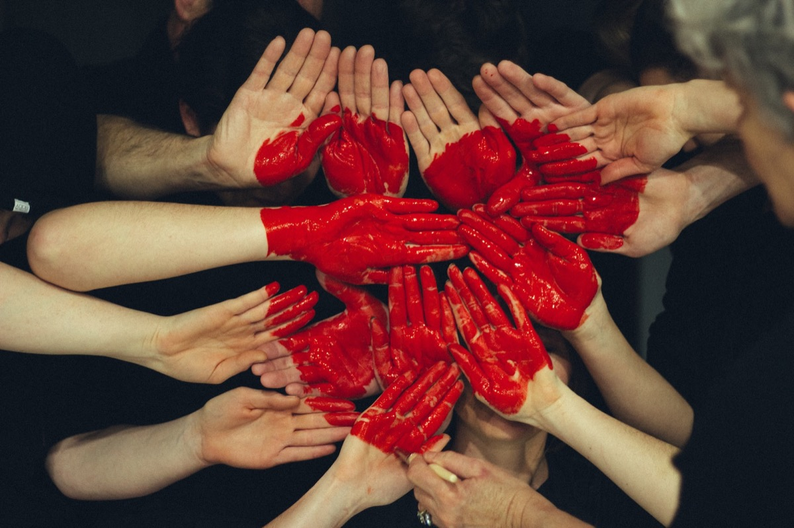
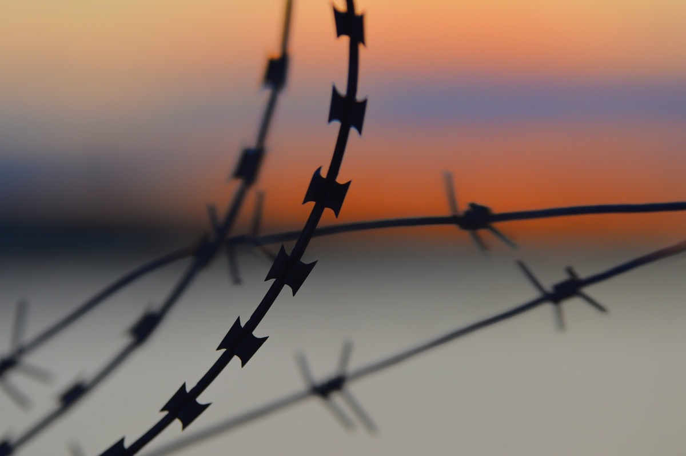
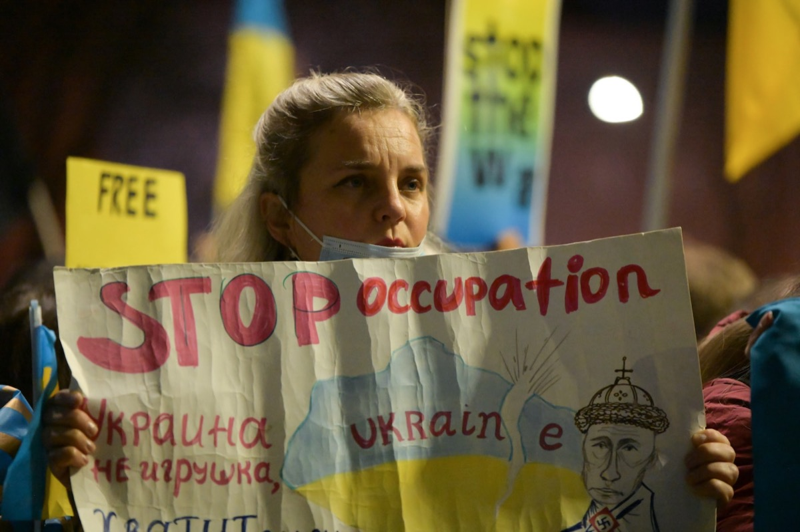
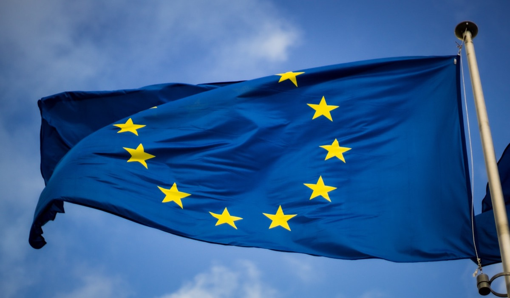
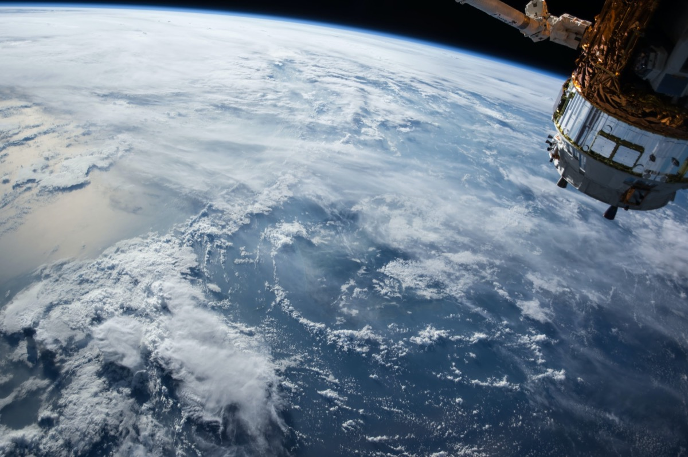
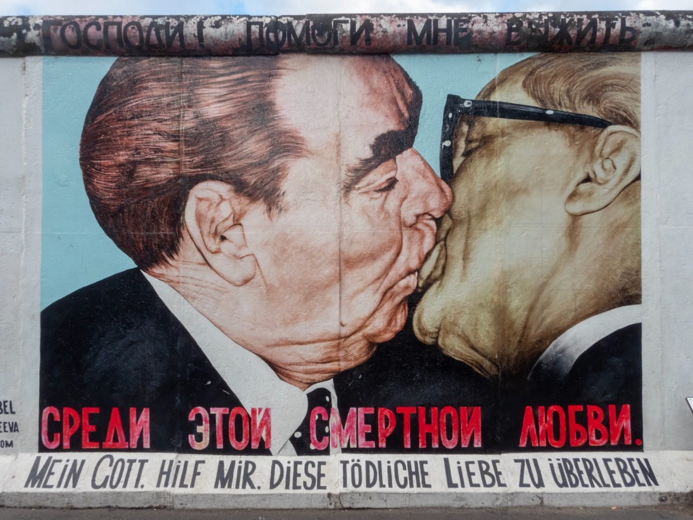

## How right Swiss psychologist Carl Gustav Jung was with this phrase is mere frightening and perfectly fits into the horrible events of, now, 2022.

I feel tired. I feel sad. Unhappy, sorrowful and stunned about the state of our world these days. Two years, we all have been in the clutches of COVID-19. Missing digitalization, lacking education while risking the health of our children, separation of families, a new and life-threatening sickness, striving for vaccinations and a common hopelessness were the key aspects of our lives since early 2020. Additionally, the fact that humanity isn’t as civilized as we have believed before was relentlessly shown while the world is lying in ruins.

As if all this wasn’t enough (and the pandemic just takes its well-deserved rest until this autumn), the threat landscape got just a new headliner. With Russia now invading Ukraine and willingly breaking and violating international law, the world seems not to be reverted to the early 80’s where the Eastern part of Europe was locked behind the Iron Courtain. Instead, with the extents and strategic attack of a sovereign state, Russia today looks more like Germany in the 1930/1940s where the Nazi-regime was responsible not only for World War 2, but also for a matchless genocide. Events that took its beginning in Germany shaped the world for many years to come and now, 80 to 90 years later and even after other historical events, the phrase „World War 3“ is somehow spoken out again. And yes, there is a war. A war raging in Eastern Europe!

## Politics weren’t on the schedule

I have never planned this blog or parts of it to become political but, as always, there are other times… and other manners. As some of you may now, I am somehow interested in and fascinated by The Great War and the impact it had on the world between 1914 and 1918 but this here is different. The last two years were demanding enough and while families try to stick together despite being locked in and forgotten due to COVID-restrictions (we use to call them „shadow families“ here), the world has more problems than „just“ a worldwide pandemic and the need to wear FFP2-masks. There is no patience left for faltering politics, raising costs for food items and the daily life and a choppy politically red thread trying to lead the population through this crisis affecting not only personal lives but also our daily work and dependency from quite anything worldwide.

## From COVID to war?

For two years, COVID-19 has been the main problem but was wiped away in no time. Vladimir Putin, Russian President, prepared his well-planned move to assault Ukraine for many months and although this was quite obvious, just a few people ever imagined that this could somehow happen. Putin has proven all doubters wrong and the the unexpected happened: Ukraine was attacked with the apparent aim to „de-nazify“ the country (sic!) and to implement a Russian puppet-administration instead of voted president [Volodymyr Zelenskyy][1]. According to Putin, Russia feels threatened by the NATO and, however, also threatens not only the Ukraine but also Finland and Sweden from going partial in this case, impending those not to head for an inclusion into the worldwide alliance.

All these events during the last days show that, unknowingly, the world is in the verge of a possible World War 3. Normality - if it ever has existed - is now even more distant than before 2020 when COVID-19 hit the world, cloaking other problems like the ongoing Ukraine-crisis with its origins in 2014. But besides Russian leader(s) becoming a Cold War-like threat again, there is a chance for Europe embracing Ukraine with open arms. With trying to overrun the country forcefully, Putin has made a decisive error and while European people are on the streets showing support for Ukraine, the Russian president has isolated his country even more - definitely burning bridges. Despite impending to put nuclear forces on high alert, Putin didn’t expect the process to be that slow, not expecting the Ukrainian resistance to be that strong.

## Our world - revised?

Penalties are now discussed and implemented. Air space is regulated for Russian aircrafts, banking regulations are actioned. Europe stands together like it has never stood together before - many nations united in help for Ukraine, facing an aggressor trying to revive the Soviet realm that has been laid to rest many years ago. It’s a strange unity no one may have expected weeks ago but besides the imminent threat, there is a trace of hope. And while many of us know that we recently woke up in a new world, there is a sign that a new Europe is going to be born.

The world of tomorrow is different and despite not being a political involved human, I still hope that the situation won’t escalate even more. Even if Ukraine is 1300 kilometers away, the events there will affect all of us and will claim a sacrifice from everyone. Living in a free world like the one we always knew and keeping this world for our children should be utter aim. Having never realized any direct kind of post-war era, we grew up in freedom and it’s absolutely awful that a war is raging in Europe, trying to hurt this freedom. Today my wife and me watched news in the morning with tears in our eyes, hardly capable of telling our children that there are so much worse things than the daily and small problems we have in a country like Germany.

## Is mankind learning from the past?

Finally, Jung was right and once again we may realize with sadness that, indeed, we’re the only thing we really have to fear on this planet. Let’s hope that history won’t repeat (although I fear that mankind doesn’t learn from the past anyway) and that reason and unity worldwide will finally beat the Russian warmonger. This is not a conflict with the Russian population, this is a conflict with some antiquated and unteachable elements having lost their mind in the troubles of the Cold War, being mentally stuck therein.

War is never justified, but the mission of „de-nazifying“ a country led by a young and west-orientated president of Jewish origin is surely one of the most light-headed arguments ever. It’s all about control, about re-integrating Ukraine into the old „CCCP“, ideally supported by yet another dictator in persona of comrade Lukashenko of Belarus. The signs were evident since 2014 but we all lacked to ascribe importance to the many stepping stones Putin used to reach this point - wether it was poisoning on English ground, Crimeria’s annexation or the Navalny-case: Everything fits together like a perfect puzzle piece on the chessboard of madness and the world must now show that Ukraine won’t be part of it. This isn’t the Cold War anymore, this is not the time were people with an inconvenient point of view get killed or disappear for whatever reason - not in a, as we should assume, civilized world.

## Showing support and hoping for the good

After many sad days knowing that we have a war raging in Europe and a matchless worldwide sign of unity, let’s hope that this conflict won’t be carried to an extreme, otherwise the world we know and we will once leave behind for our children will be a different one… Everyone of us should do whatever he can to show support and to participate in an human manner - for us, our children and the people to follow our traces on this planet, being free from any kind of dictatorship and genocide. History does repeat but this time, the world needs to be smarter to show that man does learn!

[1]:	https://twitter.com/ZelenskyyUa "Володимир Зеленський"