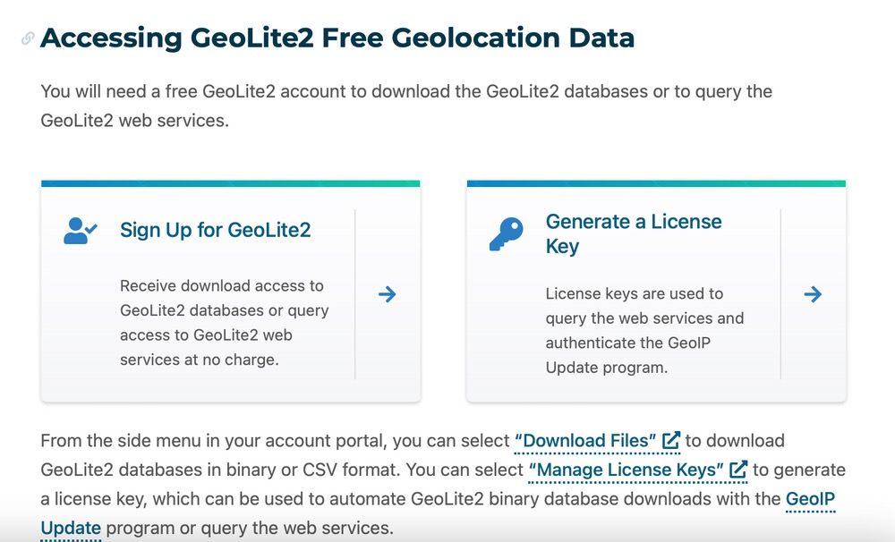
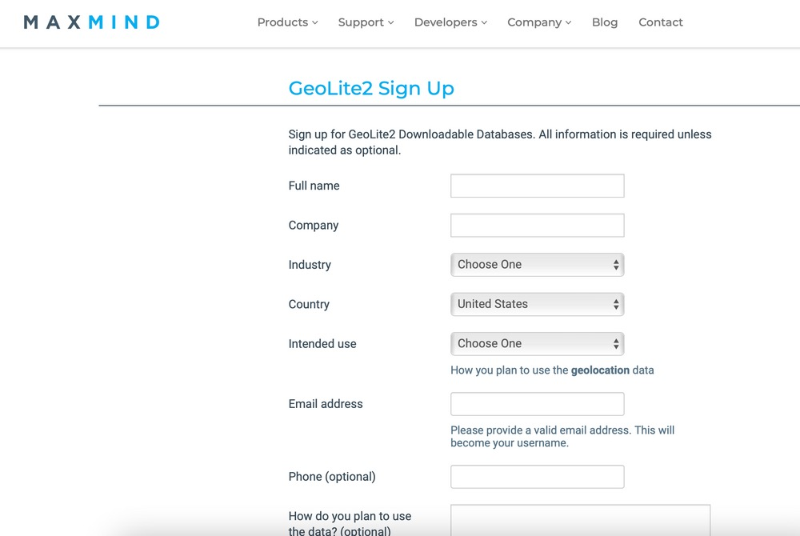
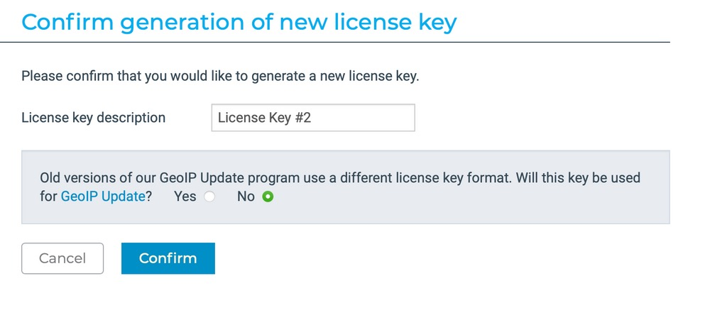
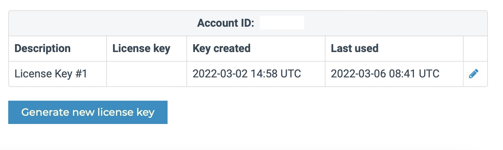
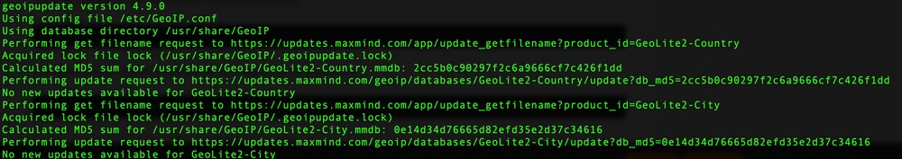
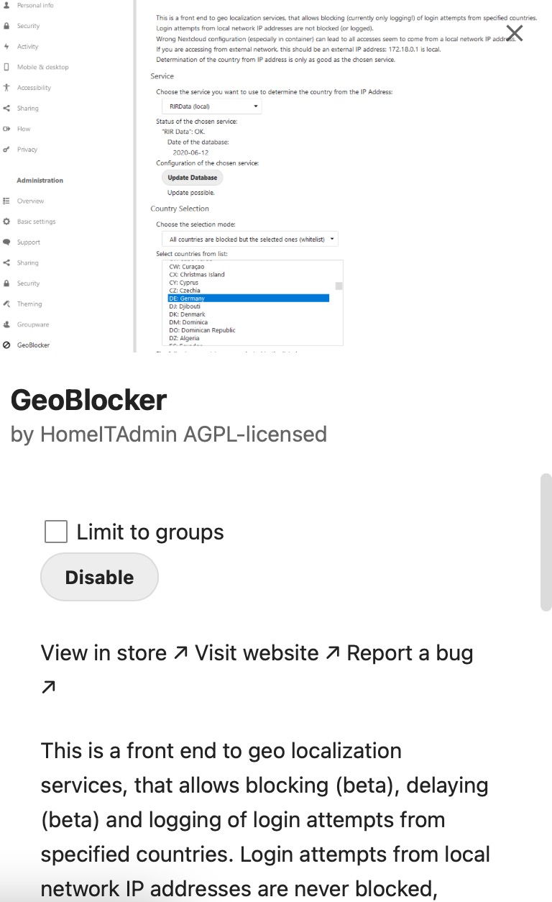
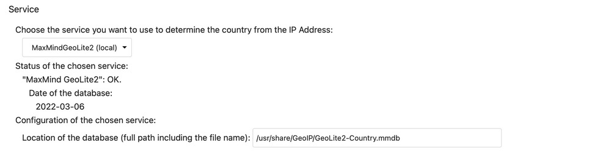
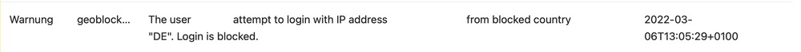
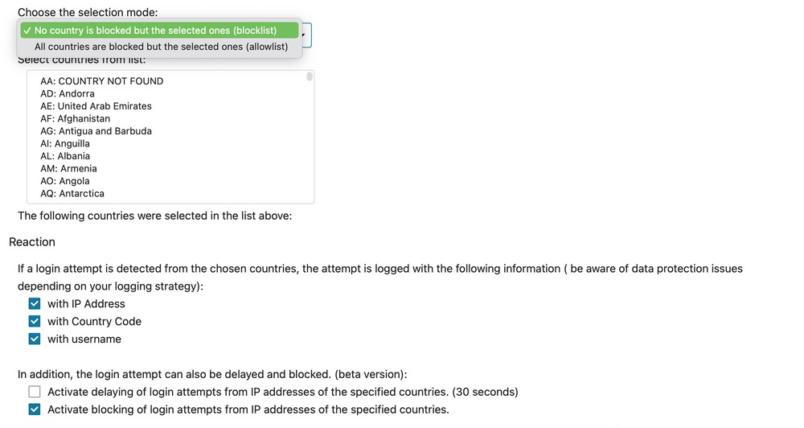

## Especially during these times there may be the need to regulate the access to webservers and specific solutions running thereon.

I had this idea in mind for quite some time and although putting it aside for many months now, adding a geoblocking-option to my Nextcloud was always on my mind. Having a running Debian 11-system with Nextcloud Hub II (23.0.2) and founded upon PHP-FPM 8.0 and PostgreSQL 14, there is a solid basis which can be extended by Nextcloud’s [App Store](https://apps.nextcloud.com/) and, especially, by the [GeoBlocker](https://apps.nextcloud.com/apps/geoblocker)\-app. Let me show you how this feature can be implemented into your Nextcloud!


Preparations
------------

With the use of GeoIP, this database maintained by [MaxMind](https://www.maxmind.com/en/home) was able to connect IP-ranges with countries or cities. Over a long period of time, this tool was available for free and could be integrated in supporting webservers and products. Becoming a „legacy“ product, the successor GeoIP2 entered the stage while the retirement of the legacy-edition has now been [announced for May 2022](https://blog.maxmind.com/2020/06/retirement-of-geoip-legacy-downloadable-databases-in-may-2022). While Nextcloud supports GeoIP, GeoIP2 can be implemented as well as RIRData.

Here, we need to [create](https://dev.maxmind.com/geoip/geolite2-free-geolocation-data?lang=en&ref=pifferi.synology.me) a free account at MaxMind to be able to download the latest database-files (a process which will be automated by use of Cron later) and to get a license key we need for our configuration file.



After initially registering for GeoLite2 (which is the free edition) and activating the account, go to your [account](https://www.maxmind.com/en/account/login) and generate your license key.



We do not need the compatibility for the legacy GeoIP-update routine here, so give your key a fitting name and click the „No“-option here.



Afterwards, you’ll have a license key and your account number which you both need in our Debian’s configuration file once we have all relevant packages installed. Anyway, the work here is done so let’s head to the shell!



Installing the packages
-----------------------

First, we need to install the GeoIP-Debian packages. You’ll find the latest version [here](https://github.com/maxmind/geoipupdate/releases) on GitHub. The latest version at the time of writing is 4.9.0 which can be fetched with

```
sudo wget https://github.com/maxmind/geoipupdate/releases/download/v4.9.0/geoipupdate_4.9.0_linux_amd64.deb
```


and should afterwards be installed by typing

```
sudo dpkg -i geoipupdate_4.9.0_linux_amd64.deb 

```


Once this is done, fetch the further packages need by the command

```
sudo apt install libmaxminddb0 libmaxminddb-dev mmdb-bin

```


and edit the freshly created configuration-file to match your MaxMind GeoLite2-account and key:

```
sudo vi /etc/GeoIP.conf

```


Edit the following lines to suit your data - and don’t mind the comments above telling you what these parameters are for:

```
# Replace YOUR_ACCOUNT_ID_HERE and YOUR_LICENSE_KEY_HERE with an active account
# ID and license key combination associated with your MaxMind account. These
# are available from https://www.maxmind.com/en/my_license_key.
AccountID YOUR-MAXMIND-ACCOUNT-ID
LicenseKey YOUR-MAXMIND-LICENSE-KEY

```


Save and quit the file, we’re done here! Should you use Ubuntu Linux **instead**, the installation procedure is quite easier - just use the following lines to get all the packages you need before editing the config-files:

```
add-apt-repository ppa:maxmind/ppa
apt update
apt install libmaxminddb0 libmaxminddb-dev mmdb-bin geoipupdate

```


To check whether you successfully installed all packages and edited the configuration-file with the proper data, use a

```
sudo geoipupdate -vvv

```


to see the database files (on Debian, located in the path /usr/share/GeoIP) getting updated.



To finally automate this step, let’s do a

```
sudo crontab -e

```


and add a new line calling the“ geoipupdate“-command to the crontab. In my case, the script is executed daily at midnight and the possible output is suppressed:

```
0 0 * * * /usr/bin/geoipupdate >/dev/null 2>&1

```


After saving the crontab-file, we’re temporarily done with the shell and the initial configuration. We may use GeoLite2 for different scenarios now, for example a local Nginx-webserver or - or existing Nextcloud so let’s head to Nextcloud’s backend!

Enabling Geoblocking in Nextcloud
---------------------------------

Log into your Nextcloud’s backend as a user with administrative permissions and head to the App Store. Under the moniker „Security“ you will find the [GeoBlocker](https://github.com/HomeITAdmin/nextcloud_geoblocker)\-app: Download and enable it and then turn to your Nextcloud’s settings where you will discover a new administrative option named „GeoBlock“.



The options there are pretty straightforward but we need to choose „MaxMindGeoLite2 (local)“ as our preferred service. In the beginning, something still seems to be wrong as the app is requesting a missing „[geoip2.phar](https://github.com/maxmind/GeoIP2-php/releases)“-file as the error message

> “MaxMind GeoLite2": "geoip2.phar" does not seem to be placed correctly or does not have the correct access rights“

shows. We will deal with this quite soon but first of all, we must overwrite the database-location with the location we’ve discovered when updating the GeoIP-database for the first time. The correct entry is

```
/usr/share/GeoIP/GeoLite2-Country.mmdb

```


here. Change it and it will be saved. Now, switch back to the shell again.

Assuming your Nextcloud’s webserver-root is /var/www/nextcloud, head over to the directory

```
/var/www/nextcloud/apps/geoblocker/3rdparty/maxmind_geolite2

```


and fetch the desired file with the proper user your webroot is running with (usually and, in my case, www-data):

```
sudo -u www-data wget https://github.com/maxmind/GeoIP2-php/releases/download/v2.12.2/geoip2.phar

```


Re-check your Nextcloud’s GeoBlocker-settings once again and the error message should be gone, showing the status of the chosen service as being „OK“ - finally (and this time indeed!) we are done with the shell!



Dealing with the basic options, you may now choose that either no countries are blocked but the selected ones or all countries are blocked but the selected ones, garnished with the single countries to activate. Depending on your use case and, for example assuming you’re just in Germany, you may block every country except „DE“ if you want so.



Additionally, the triggers/reactions can be configured. For example, if a login attempt is detected from the chosen countries, the attempt is logged with the information like IP-address, country code and the username used. This is a setting which should be in accordance with your particular data protection rules regarding logging strategy. Besides, login attempts from the named countries can be delayed - a nice feature which is currently in Beta-status. Last but not least, you may also simulate the next login-attempt from your administrative user coming from a specific IP to check whether your blocks are working or not.



That’s the magic here and once you should lock yourself out, using the shell-command

```
sudo -u www-data php occ geoblocker:country-selection:reset

```


in the Nextcloud-webroot will do the magic and reset the (possibly) wrong country selection!

Final notice
------------

Using parts of this tutorial will lead you to a good and proper basic way of either denying different countries accessing your Nextcloud or allowing just some chosen countries to do so. Besides, please be always aware that either IP-addresses and regions connected to those may change without warning and that using any kind of VPN-service may bypass this solution. Realizing the contents of this tutorial will be a good first (and, as I said, basic!) step towards a little more security but please don’t fully rely on it and consider using further approaches towards security.


Besides, I haven’t been that political in younger years but, considering the circumstances in Eastern Europe, I take side with the Ukraine being invaded by the Russian aggressor. Views and opinions change over the year and so does the interest in political actions. All this isn’t equal with the Russian nation and the brave people protesting against this madness of their political leaders. This tutorial and its release is, of course, driven by the current events but I hope that the Western nations and their allies will help to bring back the peace and unity we are all striving for - in one way or the other.


Geoblocking may be a way of protest (and, in my way, surely is!) for whatever kind of reason but will surely and rather target usual people like us instead of the political leaders in charge of war, invasion and genocide. And, despite the fact that we are quite afraid of a war in Europe and its possible outcome, there is hope that lasting peace will return - as war is never a solution!