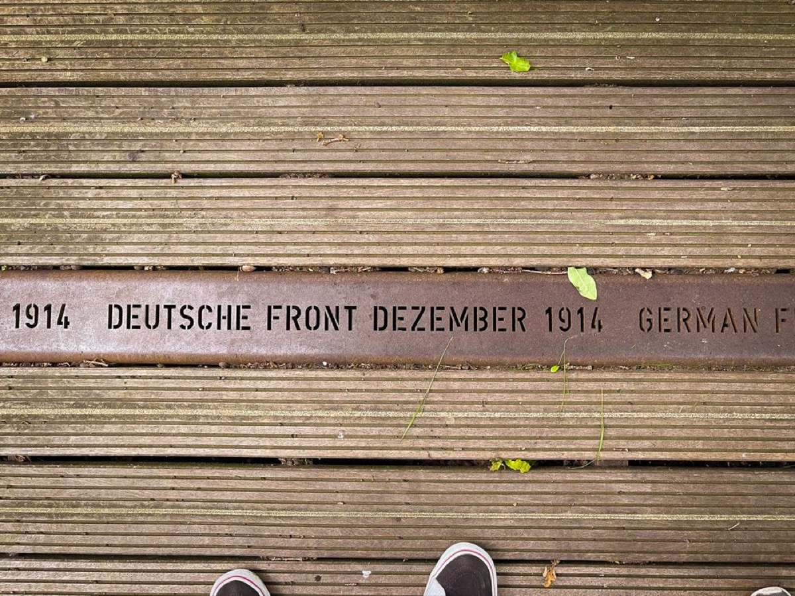
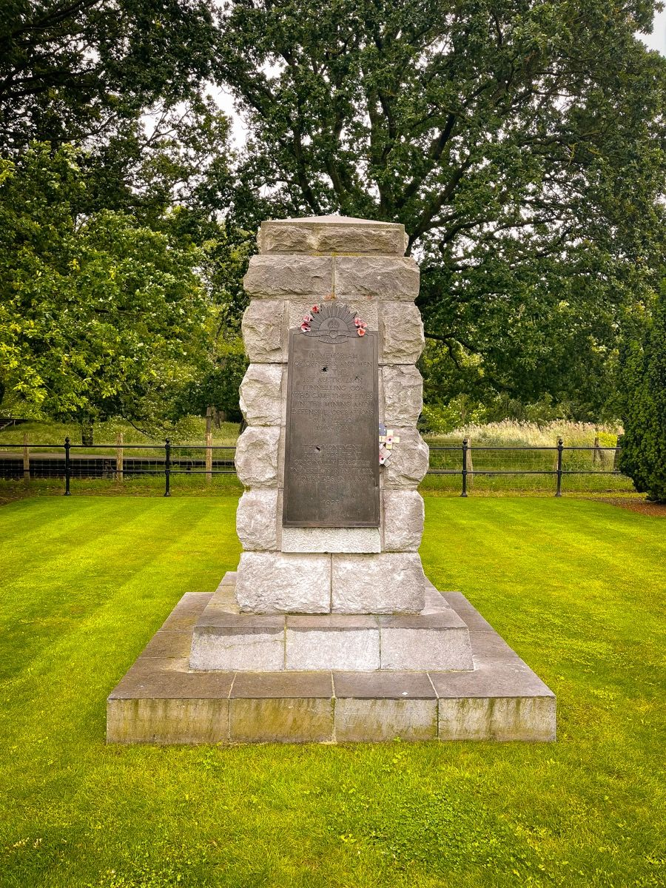
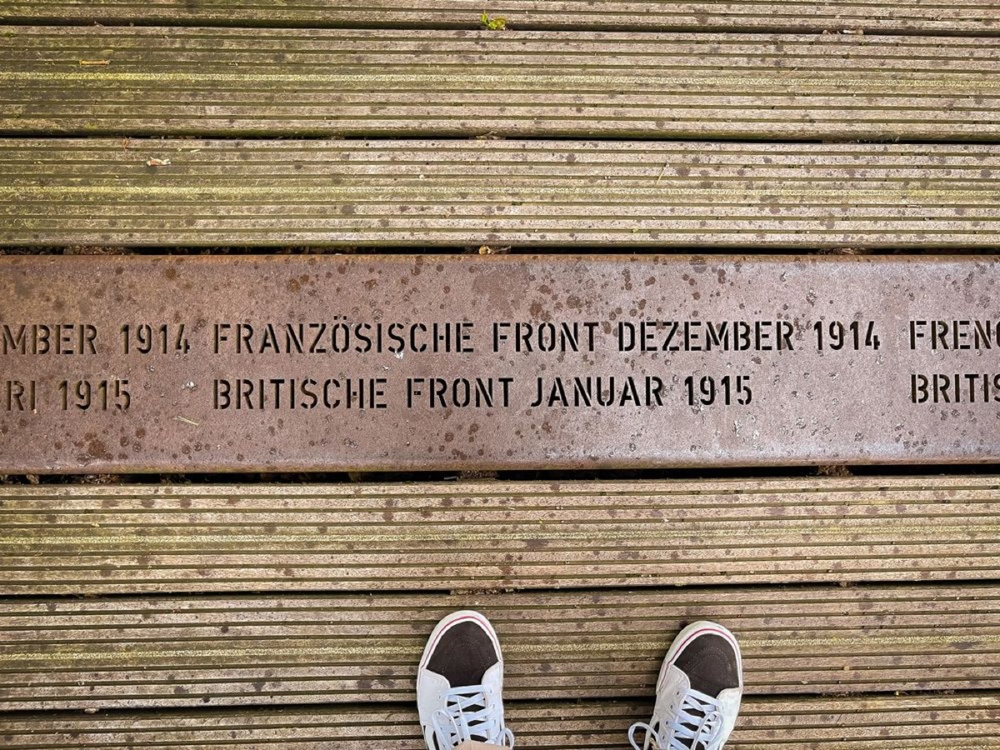
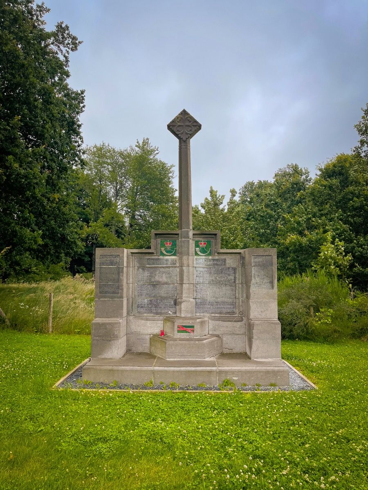

## There’s a war raging in Europe once again. A sad fact that sends my thoughts back to World War One and the discussion for „The Price of a Mile“ and the question how many soldiers need to be sacrificed to gain temporary advance in a senseless war:

## The Battle of Passchendaele

Forever connected to the Battle of Passchendaele and commonly known as the „Third Battle of Ypres“, the slaughtering took place on the Western Front, from July to November 1917. Over half a million of lives were gone for gaining just six miles of land - the ultimate proof that we cannot charge up lives against advancement. Alas, mankind didn’t learn much as World War Two has shown in an even more dreadful sight. These days just show that aggression is still settled over reason for many people that neglect the faults we made in the past.

## Hill 60

Rewinding my life’s timeline back to July 2021, I (once again) visited Belgium and especially the region of Flanders where my interest in Flanders Fields was born years ago. Visiting Hill 60 in Zillebeke near Ypres, I discovered a site I haven’t visited before on my journey through Flanders Fields. Hill 60 was a low rise south-east of Ypres made from the soil removed in digging a cutting for the Ypres to Comines railway. It is told to had excellent views over both Ypres and Zillebeke, and was captured by the German army during the first Battle of Ypres in November 1914. On 17 April 1915, in one of the first tunnelling operations by the British Army, six mines exploded under Hill 60, which was then quickly captured with minimal casualties.

The history of Hill 60 gained its rise in the Battle of Messines where the previously placed explosives were sparked and acted as a prelude for the battle. There were two chambers dug by the Allies for quite some time: One was filled with 53,300 pounds of Ammonal explosives while the second, known as „The Caterpillar“, was equipped with 70,000 pounds of explosives, At 3:10 am on June 6th, 1917, these two mines and 19 others, containing nearly one million pounds of explosives, detonated. It is told that the aftermath of the explosion was, apart from pouring hot air over 20 miles of the battlefield, felt in London.

> „Gentlemen, we may not make history tomorrow, but we shall certainly change the geography.“

(British General Charles Harington)

## The Battle of Messines

The Battle of Messines was considered a British success that greatly boosted moral among the Allies. The cost was high over all these years as 25,000 German soldiers and 17,000 Allied troops fell during the battle actions and especially the Australian Mining Corps had a considerable proportion in the planning and execution of undermining and preparing Hill 60 for the ultimate „blow“.

Coming back to „The Price of a Mile“ and once again thinking that mankind didn’t progress that much since over 100 years after The Great War has ended, I stood at the original Allied frontline after walking over the wooden-supported construction that leads over Hill 60 nowadays. 15 meters - 15 steps - away there was the German frontline and while „The Price of a Mile“ was innumerable (and still is!), it was a shock that 104 years ago, 15 steps defined the border between friendly and enemy territory. It may be still odd to think of these events in the 21st century, but remembrance is something which should sharpen our senses towards all the things happening today. Who thought with, the assassination of Archduke Franz Ferdinand of Austria on June 28th, 1914, the world would fall into its worst nightmare ever? With every action comes a reaction - and looking into Europe these days, nothing is - unfortunately - impossible.

## History in Revision

Closing the circle, the Russian invasion - and it is nothing more or less - advances quite slower than the Kremlin expected, thanks to the brave defense of Ukraine and its resisting force. Still we cannot if any sacrifice is worth the lives of brave men and women defending their country against an invading force. The Price of a Mile is still relative and although examples of the past have shown that this calculation never pays off, progress is - sadly - payed by blood.

I’d wish mankind could learn from the imperfection of the past and having seen the frontline from WW1 in Flanders, there is just mere understanding of how close life and death are seated between each other. History is alive and we should learn from it, but - simultaneously - history is always repeating. A frightening fact for someone who never experienced the situation of a real war in his life…