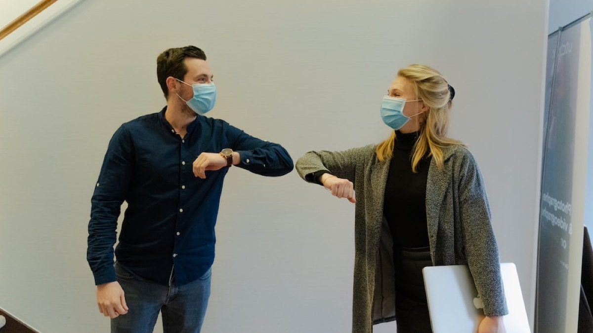
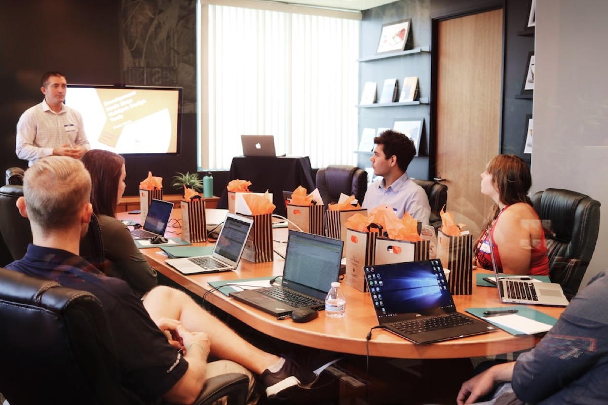
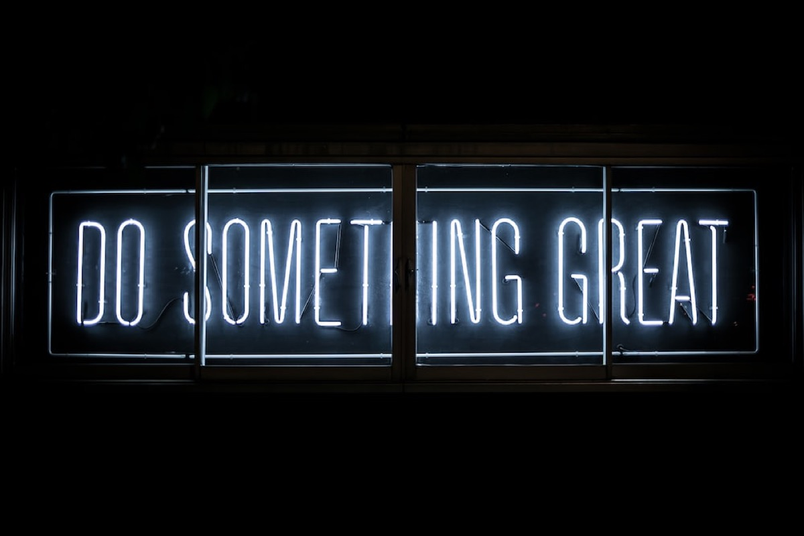

COVID-19 has been one of the riders of the apocalypse during the last two years but, in one special way, it was a driver to change the way we work these days.

The pandemic was our generation’s plague since appearing first in the end of 2019 and while it has shown that mankind is still less civilized than we ever thought before, it forced us to change the ways we live - and work. It has changed the world and even the way we work. While the pandemic has shown many obvious gaps in society, the benefits for working nearly everywhere is one of the few good things that came along.

## The Office

I was always a defender of working at the office. Gathered together, being productive in persona just we knew it as working was heading to the office and doing your job there. Before the whole world was poured down the sink, things and working life were different. Working in the IT-sector, „home office“ wasn’t something new and always an option - and based upon trust that employers work as productive as they would on-site. That’s for the status quo before COVID. Then things (as we all know) changed quite instantly.

With the order to „go home wave by wave and make comfortable in the home office“ in early 2020 to stop the possible local spreading of the new virus, everything became different. Working for an IT-company, we already had the tools and possibilities to fully opt-in for remote working but as everything happened, we never expected to stick with remote work for the first 14 weeks in Wave One - at least our unit which is Sales-based. New kinds of communications, new kinds of working routines, completely different approaches to glue your own team together: The working world suddenly went upside down despite the technical possibilities which worked flawlessly from the very beginning.

## The New (Working) World

Two years later and after some kind of artificial short-time working scenario even with a full-time customer demand, we have faced additional COVID-waves. Seemingly, they didn’t have that impact on our working routine as we managed to juggle between presence on-site and remote working within our team albeit the fact that two of my team-mates nearly disappeared in persona which shows one of the challenges when adopting the new kind of work. These days, Germany opens up again, dropping many of the rules and protection efforts like the mask mandate to protect us from COVID-19.

This will be a temporary measure as we all know what is going to happen: While there are people who judge their level of freedom by the mandatory use of face masks during shopping, many people are still responsible, opting in for the masks to stay: Years ago, we smiled at Asian people wearing face masks in the public and if you ask me, they are still a way of protecting you from many things except COVID-19, even flus and similar diseases - or smog. Anyway, what I am pointing at is, while Spring is on the rise and Summer will return, governments will be surprised again when, facing the season of Autumn, COVID will strike back when many people populate unfiltrated and unventilated rooms once again. The problem of COVID-19 isn’t solved and we’ll have to live with it and so they kind of work we used to know needs to constantly change.

## Things Have Changed

Besides taking care of pushing digitalization (something many countries, including Germany, aren’t really good at!) for workers and especially schools, a new way of work finds one’s way into our world. Employers have to be flexible and change their way of thinking as it comes to remote work. Many of them have the enormous task to bury the old way of working - always in persona, always on-site - beneath the ruins of a world devastated by COVID. No matter what you do but once you manage to keep things ticking over from everywhere you are, the business keeps running - which should be the primary goal of each employer. There are plenty of jobs that needs physical presence but in cases of doing Sales, Administration, Consulting etc. pp. the possibility of (at least) hybrid work isn’t alien anymore.

In our specific case I changed my opinion. Time has shown that there are teammates who do their job by more than 100%, no matter where they are - and even if they sit within a well-connected alpine hut located at the Himalaya. And those who didn’t perform so well even in the office nearly disappeared in the home office - which made them costing even more time to manage them. Everything is a matter of trust and in case these two tiresome years have shown anything in the job-genre it is that putting trust in your employees is a mandatory must.

## A Desperate Option, Here To Stay!

I have changed my opinion and never before I was that happy to be that wrong. The old style of working, the mandatory presence in the office, is quite dead. New ways to work have proven to be efficient, fast and we all still have to juggle with the dozen additional tons of internal communication. Many of my mates have delighted me while just very, very few have disappointed me, getting lost in the home office with just very few traces of individual drive. While this is definitely a contra-argument, it has proven that self-propulsion is not something that fits to everyone. While the insights of this will surely help to  separate the wheat from the chaff, the positive aspects prevail and have shown that good co-workers adopt and embrace the flexibility and freedom of remote work without ceasing working performance.

The new kind of work will be remote and while we still need the office just to gather in persona or meet with customers, the time has shown that work in the sector of Information Technology has already drastically changed. Once there is work to do, it can be done without being bound to a specific place and once companies adopt this strategy, they will be considered to be modern, following the spirit of time. Even an adoption rate of 50% is okay when the discovery of the new way of work has already begun: Equipping the employers with the proper tools and technics is a must to remain competitive and opens the door to the future of digitalization - something we have definitely been missed here before, especially but not only in Germany.

The question is not which tools you are using and if you’re opting in for the big tech companies and their solutions or the Open Source-alternatives: The question is if your company-mindset has already adopted the flexibility of modern work to remain responsive, paired with a certain trust in your employees. If your company meets these criteria, it will be successful and a valued employer to work for! And while many of us strive back into the offices these days (no matter if they like or not), the knowledge of (at least) a hybrid working model is something which is here to stay!