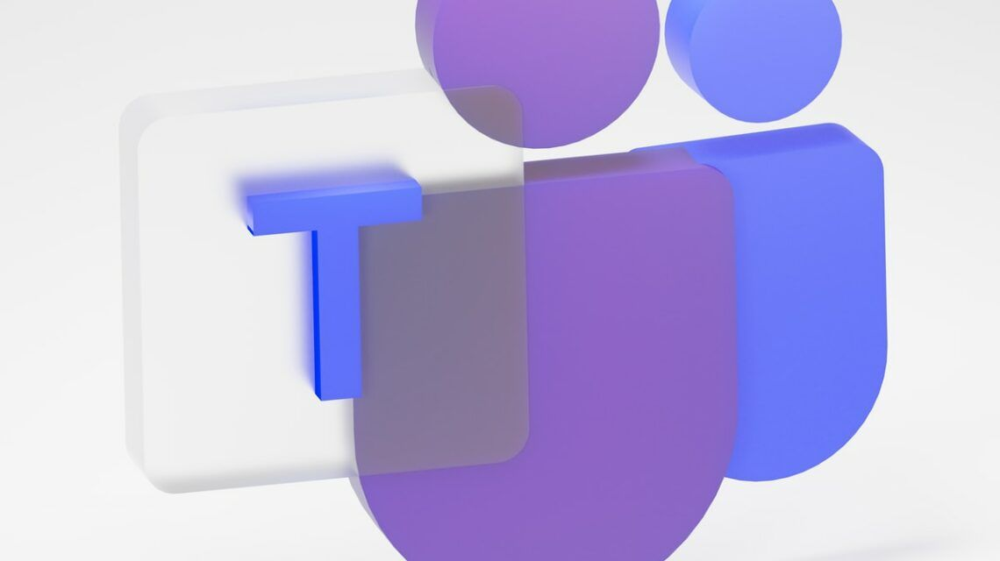
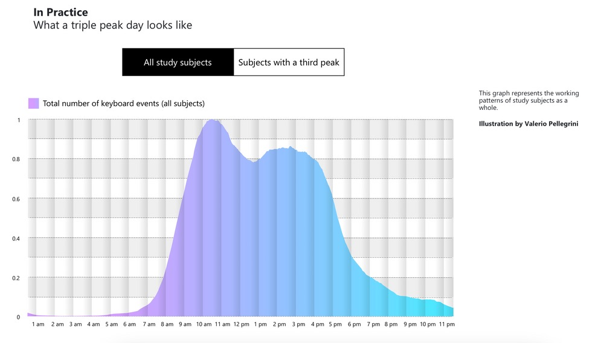
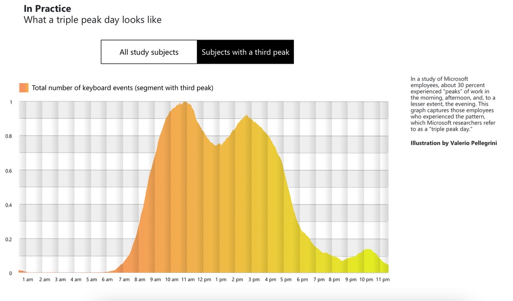
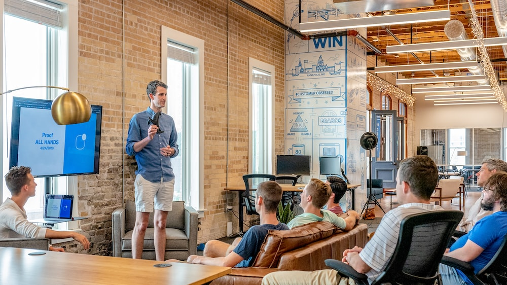

## Recently I wrote about the fact that [the model of hybrid work is here to stay](../Return-to-offices-is-announced-but-the-model-of-hybrid-work-is-here-to-stay/). A new [Microsoft-study](https://www.microsoft.com/en-us/worklab/triple-peak-day) also underlines that a 9 to 5 day is obsolete as well.

Things have changed over the last years and so did the way we work in many genres. The way of classic work is vintage now and while employees return to the offices once again, many aspects are different now, putting the person and personal demands into the (unexpected) focus. There are less borders separating private and business life, melting everything into a combination of a new workforce of the future.

An interesting study
--------------------

These days, this study commissioned by Microsoft, came with the conclusion that the 9-to-5-workdays-scheme may be a relict of the past and already fading in the new age of remote and hybrid work. As a result, Microsoft Teams-chats and activities often happened after this timeframe, showing that many people were still busy [between 6 and 8 pm](https://www.microsoft.com/en-us/microsoft-365/blog/2020/07/08/future-work-good-challenging-unknown/). Personally, I already discovered this phenomenon by myself as the usual work times were mainly used to focus on customers and quite important internal talks while the „usual“ communications with less priority often extended into the evening hours.

Traditionally, the work day was woven around the first half of the day and the second one - before and after lunch. Paired with the need to take care of children stuck in homeschooling (and mainly left alone due to missing digitization here in Germany - but this is yet another story to be told), this classical schedule broke up. While still trying to juggle with minutes and even hours, the old working model slightly disappeared while we gained a new way of flexibility, even turning work tasks to happen in the evening hours. Work was still there despite the fact that it has gotten a new, non-linear shape.

> „It raises the question, ‘Is this about flexiblity, or is it about work encroaching on someone’s personal hours?’“

(Shamsi Iqbal, Microsoft Research and Viva Insights)

Opting in for peak number three
-------------------------------

After the two original peaks have turned into three, the question is raised what is going to happen with this new normal? Do we need new specific rules? Do we need to adopt mindsets as, still, many people are stuck in the old working schedule, being inflexible without the will to adopt the new possibilities? How can employees embracing the hybrid work be supported by team leads and senior staff? And - most important - where is the border that needs to be drawn between work, private life and the fact that these worlds morph to one?

> “Having your kids at home, having no breaks to eat or exercise, we see that one of the ways to cope is to take a break, eat dinner, and then spend time in the evening actually getting things done.”

(Mary Czerwinski, research manager, human understanding and empathy, at Microsoft Research)

According to Microsoft, this line got thinner during the last past one and a half / two years. The average Teams-user now sends 42 percent more chats per person after hours, according to [Microsoft Work Trend Index](https://www.microsoft.com/en-us/worklab/work-trend-index/hybrid-work)\-findings. I am no exception here and many of my working mates do act similar but everything finally depends on the way how you adopt this flexibility and what positive aspects come along. While the recently-named Mary Czerwinski and her team analyzed the behavior of Microsoft-employees this summer, an 30-percent increased working spike in the evening hours were discovered based upon measured keyboard usage. Its intensity was less compared with the pre- and post-lunch slots, but it was an obvious impact that hasn’t existed before.

While the researchers continue to study the data, it’s not yet clear exactly what caused the uptick for some employees—whether, for example, it was related to daytime childcare responsibilities or jobs requiring cross-country collaboration. Alas, the findings bear out a more general trend: In our current era of hybrid work, there is no one size that fits all: Some people stick to traditional office-hours (and live good with it!) while others don’t and adopt the new way of work. The exciting question is, though, how the best of both worlds may be combined without losing the company’s flexibility and strike capability.

> “Now with the triple peak, people have the ability to do what they need to do in the moment and still have time to work later on. That’s super important as far as reducing stress levels.”

(Mary Czerwinski, Microsoft Research)

Life after 9 to 5
-----------------

There are many benefits with the new work model but, as always, there are downsides, too. You can’t switch off after 5 pm to be the private individual only and the danger of work always being present in your brain’s deep space may increase. Hence, the question must be told what we do need to take care of to prevent employees from being available 24/7? Constantly working at all three peaks without the essential breaks could drive people into the well-known misnomer „burnout“ and [another study](https://www.microsoft.com/en-us/worklab/work-trend-index/brain-research) backs up this fear.

Should we see the third peak as the „new normal“ or as an option to juggle between our obligations in private life and work? Can the work we need to do as non-frontline workers be done in the evening hours to be as flexible as possible? And - mainly - do the companies we are working in have such a modern approach to back up this „new normal“ with trust? During some sessions in [Microsoft’s Cloud Sales Academy Premium](https://www.microsoft.com/de-de/partner/readiness/workforce-of-the-future/cloud-sales-academy.aspx) it was pointed out that employers want to work different since the pandemic and choose their new employers also on the criteria of providing flexible and hybrid work or not - a fact that just a few among us had thought of before COVID-19 struck our world!

> „More than ever, people are taking on additional day duties that they didn’t have before, whether it’s caring for kids and helping with schooling or being a caretaker to another family member. This is a new piece of the puzzle that’s pushing a lot of people to work later.“

(Gloria Mark, professor in the Department of Informatics at the University of California, Irvine, and visiting researcher at Microsoft since 2012)

Empathy and Communications
--------------------------

While the way we work was digitalized during COVID-19 without a certain schedule and often pushed through in no time, the kind of offline-communication in persona reduced due to absence in the offices. With personal absence, the task was to transfer empathy through new digital channels which - in my known case - promoted a new meeting culture. While still being responsive while the well-known world crumbled, meeting times and slots increased in a quite unhealthy way: Not every coordination really needed a meeting and setting up a call instead of typing three messages was the opposing side of adopting the new normal.

These days, meeting culture needs to be reviewed once again. Different workers have different needs and challenges, many of which go unseen. Not every meeting in persona is quite necessary and not every Teams-call needs to block a 15-minutes-slot in your calendar. „Short but sweet“ should be in the focus again, putting the essential content and aim of any meeting in to the centre of communication, paired with the empathy needed either during remote or on-site-meetings. No (or at least less) small talk anymore, just the utter goal of reaching the meeting’s essential aim: A venture on a difficult task!

> “Workers are not islands. Right now you cannot assume that everyone on your team is going to be available during the 9-to-5 timeframe, or that others will want to collaborate when you’re working outside regular business hours.”

(Shamsi Iqbal, Microsoft Research and Viva Insights)

And, following up, Shamsi Iqbal points out an important message by stating:

> „I think we need to reset the expectation and realize that most information, unless it’s urgent, can wait for a reply!“

And this is one of the key arguments when dealing with the tasks of modern work and shifting away from the 9-to-5-working day: In the Cloud Academy Premium and the slot of „modern workplace“, even Microsoft states that Microsoft Teams is not a 1:1 medium like E-Mail is but also an asynchronous tool where people don’t expect an instant answer. Touché! Looking back and gathering my experiences the status quo, in reality, is that people don’t mind your status on Teams. Being away or busy? Just very few care. Appointments in your calendar? Even fewer people are seemingly interested in your calendar’s slots despite you document every task you do throughout the day there.

Reality is: You are called and phone-bombed via Teams, Mobile and - when things are really worse - by another parallel PBX-solution that, altogether, wring the most out of your own flexibility. This is something that needs to be addressed in any company - when chatting to someone, don’t expect an instant answer. Previously, we were road warriors, visiting customers three or four days a week, reviewing these days on a Friday before hitting the road again next week. Today this is just impossible: Not only because road warriors and likewise scenarios are declining but also because the assumption that people are „always on“ are pure poison for any modern workplace scenario. We were online in the last two years due to COVID-19 but the assumption that this has advanced to normality in the meantime is a misbelief that needs to be adjusted instantly!

This model is the future, but…
------------------------------

„Mindset is everything“ - and with a proper mindset, people (not caring how old-fashioned they are) need to accept that other human beings work best if they can take care of their duties on their own. Without the pressure and need of answering instantly to any message, without being always on or the fact that simply no one is really interested in your chosen status. Does really any request needs an instant answer? We waited for responses to E-Mails before the pandemic and we were good with it but with great power, there comes great responsibility - but not the need to pay the new flexible kind of work by burned-out workers.

> As employees redesign their workdays again in the shift to hybrid, it’s important that organizations support them through times of change.

The behavior of ignorant employers who adopt their „always on“-style onto their co-worker’s way of working must be nipped in the bud. This is the task of every employer who opts in for the new and flexible working model - tasks and challenges are still there and needs to be faced with an attitude matching the new technologies. Employees need the support and the backing of their employers to be fully able to adopt the new kind of working, otherwise the company’s working culture will - literally - end up in the gutter.

With the proper techniques, workers can be „de-stressed“ and of course Microsoft also delivers the tools for the new normal: Scheduling options — currently in Outlook and coming soon to Microsoft Teams — allow users to take care of mails hitting the inboxes within the working hours for example.

> “People often send emails at odd hours because they don’t want to lose the thought and they want it captured, but it doesn’t necessarily have to arrive at the recipient’s end right away.“

Finding the focus… again!
-------------------------

Finally, it’s all about the focus - and not losing it. Our mindset needs to change as it won’t be important where people work but how they perform and collaborate with each other, finally working better. The „how“ is important, facing the challenges of remote work - closing the gap between the classical, 9-to-5 office workers and the remote workforce of the future. Build a base, define a common goal - and people with the flexibility and the sense of responsibility for their work will follow faithfully.

For employers, this gap and mastering it as still being an obstacle towards the goal of modern work is the essential task. Closing it will define how a company will work in the future and measure its success - while 9-to-5 will continue to decline albeit we must still come for the people who still just want to work that way - and understand their needs, too. The rest will build a successful and modern workplace around the key office hours with the flexibility to deal with children, family or other private commitments - and add its pinch of salt on the classical work routine; before or after those well-known office hours.

We’ve got the tools and the techniques so all it still needs is to adopt this new way of work and eradicate the boundaries that prevent us from doing so - and understand that a red dot in the status doesn’t mean „Call me anyway“! Then - and only then - the model of the triple peak day will be our guidance throughout the new kind of working - focused, independent from our location, flexible and - successful!