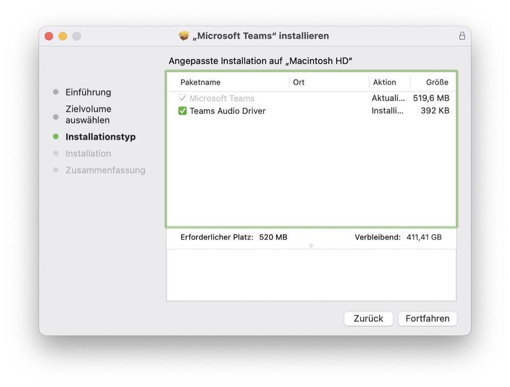
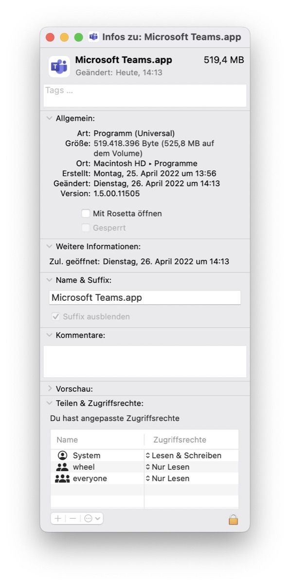
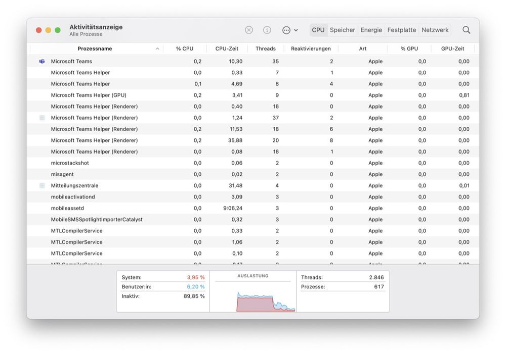

## Microsoft was one of the early-adopters when it came to embrace the Apple Silicon-platform in late 2020. Over the time, many apps were added after the initial provisioning of Microsoft Office on Apple’s latest chips.

Shortly afterwards, Microsoft’s Chromium-based Edge-browser enqueued as well and got company by the M1-native OneDrive-client just two months ago, even Defender for Mac was ported to Apple Silicon in the meantime. Anyway, one of the apps we mostly tend to use on a daily basis since the pandemic hit our world is Microsoft Teams. Over the time, it was implemented quite well to work within Microsoft’s microcosm but its greatest feature was also its greatest demise so far: Based upon and encapsulated within the Electron-framework, the app is portable but often feels alien and sluggish, even on Windows-systems.

Going all in for Apple Silicon
------------------------------

Apart from that, the binary running on macOS was still made for Intel-Macs so besides the Electron-scaffolding cloaking it, Apple’s „Rosetta 2“-emulation was needed to get it running on Apple Silicon-chipsets. Today and out of the well-known schedule from Microsoft, a M1-native binary appeared secretly on [Microsoft’s Download-page](https://statics.teams.cdn.office.net/production-osx/1.5.00.11505/Teams_osx.pkg), respectively the CDN, showing version 1.5.00.11505 after installation. The official sites don’t show the download yet (the localized German page still leads to the Intel-version) and between the weekly cycles of announcing preview-versions, this Tuesday should be next to feature any trace of announcing the new version.

Availability
------------

While installing (and you can do so by [downloading](https://statics.teams.cdn.office.net/production-osx/1.5.00.11505/Teams_osx.pkg) the .PKG-file) it is noticeable that, with this iteration, the installer also comes with an yet unspecified „Teams Audio Driver“. After installation, the app indeed starts quite faster than the Intel-based predecessor and takes obviously less CPU and RAM-ressources. As for now, it still hasn’t been made public when Microsoft will announce Microsoft Teams being in the official Apple Silicon-crew as well but, according to various [sources](https://9to5mac.com/2022/04/25/microsoft-teams-apple-silicon-mac/), it shouldn’t take that long anymore, leaving the obvious Beta-state in version 1.5.00.11505-E behind!

