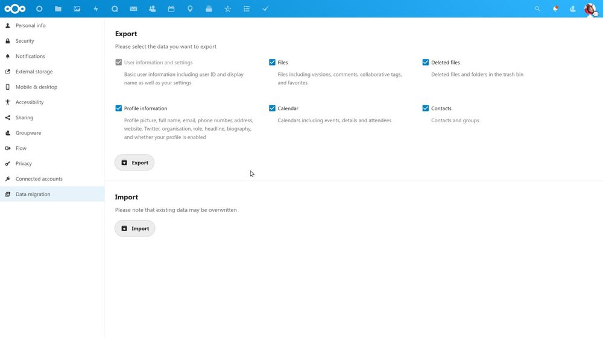
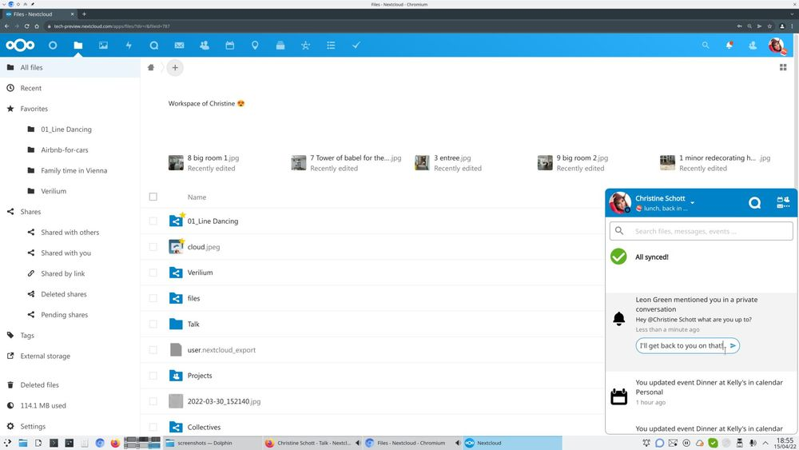
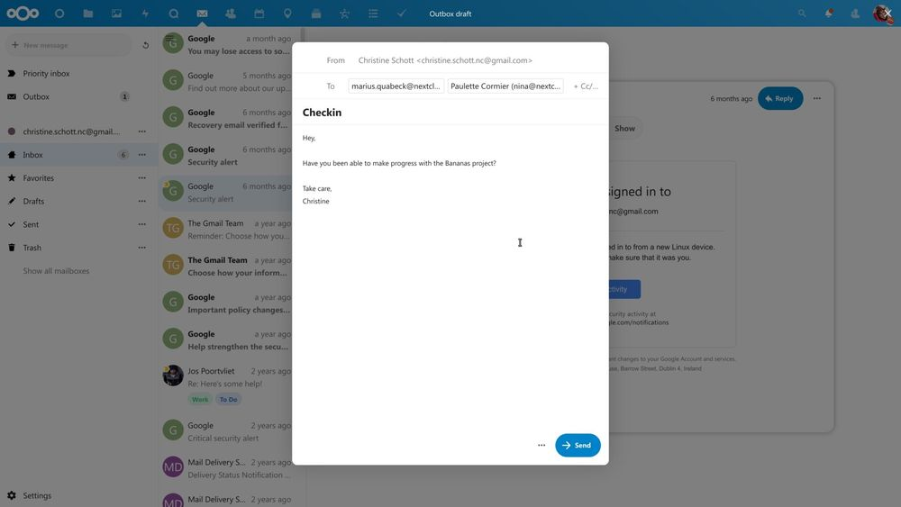

## As of 2022, the need for independence, the need for data protection and privacy based on Open Source-solutions, has developed in a discreet manner and so Nextcloud Hub 24 was released today.

It’s time for a new Nextcloud-release and just five months after giving birth to iteration 23, this one especially aims at competing with the Big Tech Company’s solutions.

Call it sharpening a knife or just going all in for the private cloud: After filing the antitrust complaint against Microsoft or empowering the Open Source-idea with the new German „traffic light“-coalition, there seems to be a need for being an alternative to the „big“ public cloud infrastructure: This is where Nextcloud comes from and what Frank Karlitschek and mates had in mind when once starting the project. As of 2022, the need for independence, the need for data protection and privacy based on Open Source-solutions, has developed in a discreet manner and so Nextcloud Hub 24 was released today.

This time, it seems as if numerous new features aren’t the only driver behind the new version. Although there are features and improvements, this release mainly aims at fighting vendor lock-ins by providing data export and migration capabilities and focuses on improving communication and collaboration while adding performance improvements for large-scale installations. According to Nextcloud, v24 was „developed to put pressure on Big Tech firms on a technical level, by empowering users and decentralizing the digital workplace.“

> Big Tech companies like Microsoft and Google are not keen on a world where users can move easily from one vendor to another. We, on the contrary, have fought for this and with our complaint to the EC and upcoming EU regulations, the pressure is on. This release shows that it can be done – easily moving between clouds, from cloud to on-premises and vice-versa.

(Frank Karlitschek, CEO and founder of Nextcloud GmbH)

Putting the squeeze on Big Tech
-------------------------------

These days, we see a growing demand in the way people want to use Cloud-based solutions but, simultaneously, the need for a certain decentralization. As your personal data belongs just to you, it must be ensured that, with one click, this data can easily be exported and moved between the single solutions – back and forth. Modern business environments require an integrated, hybrid remote-local environment with real-time collaboration and communication while retaining control over location and access to data. Big Tech Software-as-a-Service-vendors often fail to deliver, incentivised to build virtual walled gardens with locked-in data and caging users with anti-competitive behavior against smaller, more innovative competitors – like Nextcloud. The key improvements in this release of Nextcloud’s Hub is intentionally aimed to address exactly these challenges.

Key Improvements
----------------

Even if the new features aren’t the mere focus this time, there are, of course, some to be especially mentioned in Nextcloud 24: With the export-feature, users are not only capable of saving a whole copy of their data but also to import it in another instance or another provider, supporting that the slogan „Who owns your data“ isn’t just a well-worn phrase here. Nextcloud Office now comes with automatic file locking enabling users to lock or unlock documents while working on them. As for the optics, a more familiar tabbed menu interface finds its way into the integrated Office-module in Nextcloud.

Heading on, the improved performance for large-scale installations with hundreds of thousands to millions of users is named as a significant number of changes were, according to Nextcloud, made resulting in an up to 4x lower database load. Achieving this goal, empowering more large hosting organizations, governments and educational institutions to successfully run their own instances and reduce energy operation costs will be possible, finally benefitting the environment and creating a certain level of sustainability.

Last but not least, Nextcloud Talk’s desktop-integration was improved with the introduction of a call notification where users can pick up or decline a call and the ability to reply directly to chat messages in the notification menu in the corresponding Desktop-client. Additionally, further improvements on Nextcloud Text (which now supports tables and Drag n Drop of images) and groupware (new mail composer UI and enhanced calendar invitation management in the web client) were added to the new version of Nextcloud Hub besides dozens of minor improvements completing the latest version.

This release of Nextcloud Hub is available immediately for download on [nextcloud.com](https://nextcloud.com/install/) as an All-in-One Docker-image deploying-your-own-docker-ized-nextcloud-hub-ii-instance-in-no-time/) for fast deployment or a tarball for [manual server-setup](https://download.nextcloud.com/server/releases/latest.zip). Additionally, a [virtual machine-image](https://download.nextcloud.com/vm/Official-Nextcloud-VM.zip) is available as well while especially the All-in-One-version is a great productive solution for everyone who doesn’t like to take care of the classic LAMP-stack and needs to get started with Nextcloud quite fast.