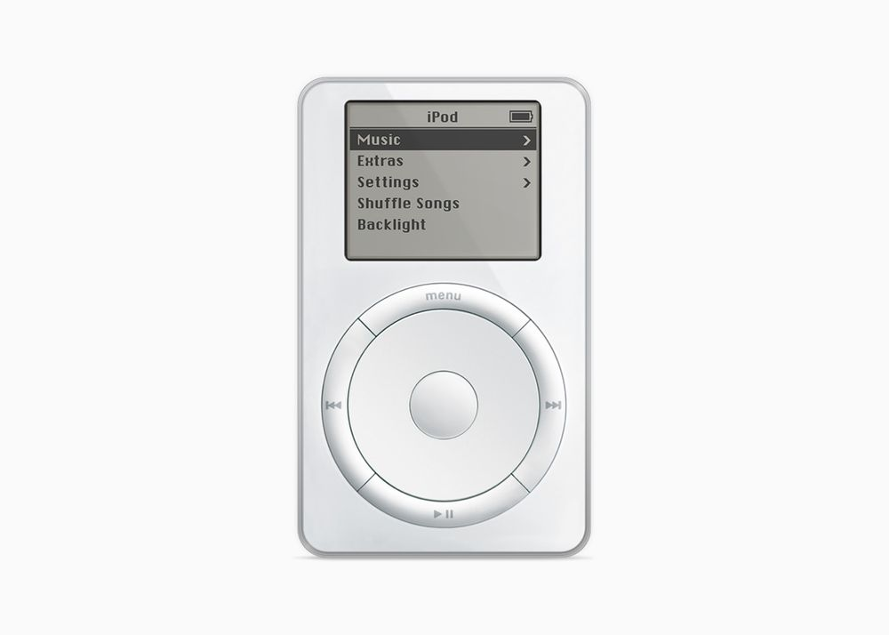

## Incredible to imagine that smartphone and music-player were separated once. Years before the first iPhone and even more years before the streaming services that fuel our headphones these days, Apple managed to put 1000 songs straight into your pocket.

It has definitely changed the way we listen to music and took the world by storm. Today, Apple pulled the iPod’s plug after a journey lasting for 21 years. Incredible to imagine that smartphone and music-player were separated once. Years before the first iPhone and even more years before the streaming services that fuel our headphones these days, Apple managed to put 1000 songs straight into your pocket.

## Conquering the world

The first iPod took the world by storm while some us were still using Napster to gather song collections or iTunes to rip our CDs, turning them into digital MP3s. Introduced by Steve Jobs in 2001, portable music was suddenly hip – and framed into an iconic design supported by the click wheel which, in my eyes, is still one of the finest physical user interfaces ever built. Many tried to battle it, but no one succeeded.



I didn’t join the party until I got hold of the second iPod, the mini, which was introduced in 2004. I won’t ever forget the feeling of syncing all my favorite music for a two-week holiday on Tenerife to the device and enjoying this fine little device all the time. It was the time where we used to have simple phones (mine was a Sony Ericsson these days) with quite limited capabilities and I instantly fell in love with the usability and simplicity offered by the iPod.

## Heading on

The world has developed over the days and while our physical music collection may have shrunk, the iPhone began to revolutionize the world from 2007 on, combining phone and music player in one device. While I personally stepped in with the 3G(S) some time later, the iPod was, especially in its Touch-iteration, a quite beloved way of getting the iPhone-known UI into your hands – just without the GSM-functionality.



These days, streaming is the media of choice when it comes to mobile music. While CDs and especially vinyls are – somehow – on the rise while people discover physical music once again, the mobile option is to get your music wherever you are, supported by your favorite streaming service, preferably Apple Music: There is no need to use iTunes cloaked as „Music“-app today to physically transfer your music to your Apple-device. Times have changed and so it was quite inevitable what once could happen to the latest iPods still holding position.

> “Music has always been part of our core at Apple, and bringing it to hundreds of millions of users in the way iPod did impacted more than just the music industry — it also redefined how music is discovered, listened to, and shared.”

(Greg Joswiak, Apple’s senior vice president of Worldwide Marketing)

## Rest In Peace!

Today, Apple has revealed what has been expected for quite some time: The iPod is being carried to his grave and while, strategically, this move was long overdue, is still comes with great sadness and lots of sentimental thoughts. Putting 1000 songs into your pocket has never been that easy and user-friendly, born in a time where MP3-players were ugly, uninspired and often better USB-sticks without any proper UI. Apple did set standards that last until today which have paved the ways we enjoy music in the 21st century.



## Farewell

The iPod may have been gone, but its spirit and legacy will live on. Forever, putting into the historic halls of Apple-devices which have reformed a whole industry in a time where no one else had the idea and power to unite functionality and usability. Rest In Peace, iPod – it was a pleasure to meet and enjoy your company!

Customers can purchase the [iPod touch](https://www.apple.com/ipod-touch/) through [apple.com](https://www.apple.com/), Apple Store locations, and Apple Authorized Resellers while supplies last.