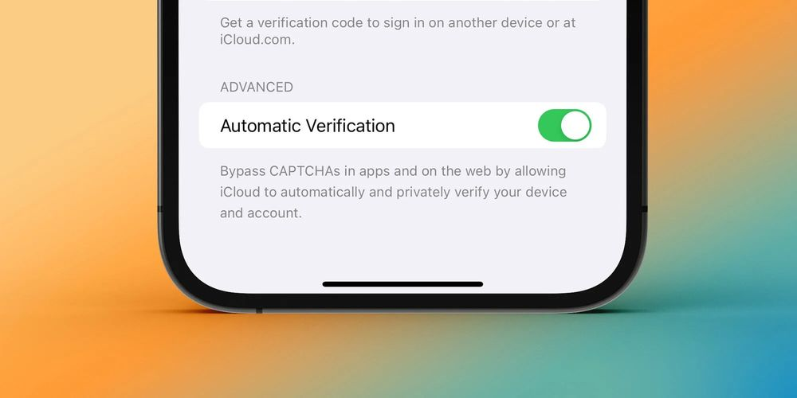
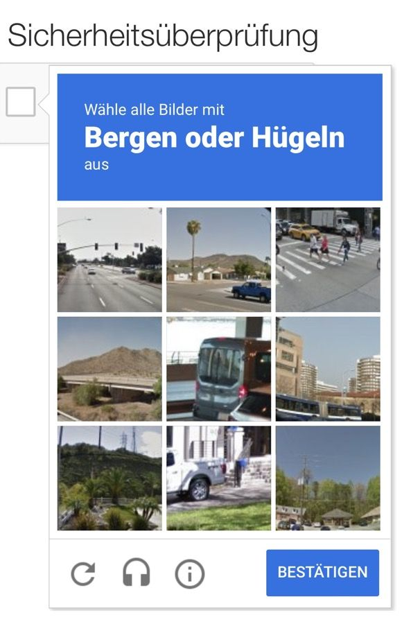

## They belong to the latter Internet-age but, along with the basically good idea of checking whether you‘re a robot or not, CAPTCHAs often interrupt the user experience in the Web. Apple is now seemingly approaching this problem with the upcoming iOS 16.

A new feature named „Private Access Token“ coming with the latest iteration of Apple‘s mobile OS will, as we know for now, wipe away those pesky nagging puzzles which often prevents the users from the direct way of accessing information, creating or logging into accounts. The word about the new feature was first spread on [Reddit](https://www.reddit.com/r/iOSBeta/comments/vfwx3e/ios_16_db1_automatically_bypass_captchas/) and a later confirmed by Apple at a WWDC 2022-session titled “[Replace CAPTCHAs with Private Access Token.](https://developer.apple.com/videos/play/wwdc2022/10077/)”. Technically, the feature will use a combination of your device and Apple ID to inform the specific website using a CAPTCHA that you are human and no robot trying to spam or doing similar sneaky actions.

Apple explains:

> Private Access Tokens are a powerful alternative that help you identify HTTP requests from legitimate devices and people without compromising their identity or personal information. We’ll show you how your app and server can take advantage of this tool to add confidence to your online transactions and preserve privacy.

How does it work?
-----------------

Like we got used to, this feature is intended to be used with privacy in mind and unlinkable to personal information of the user. Servers are able to request tokens using a new HTTP-authentication method called “PrivateToken.” These tokens are then used as part of a cryptographic process to confirm to the server that the “client was able to pass an attestation check.” Apple relies on the your device‘s Secure Enclave here and states that „servers that receive tokens can only check that they are valid, but they cannot discover client identities or recognize clients over time.”

	Cupertino also notes that companies like Cloudflare and Fastly are already developing support for this new standard in terms of „You-can-pass“. In fact, both of those companies have already enabled their issuer services while additional providers will be able to sign up later this year through Apple’s website. This new “Automatic Verification” feature is enabled by default in the first betas of iOS 16, iPadOS 16 and also macOS Ventura. Once you’re with the beta, you can find it by navigating to your Apple ID-settings, choosing “Privacy and Security,” then looking for the new “Automatic Verification” toggle at the very bottom.

Goodbye, CAPTCHAs!
------------------

After all those years of nagging featuring CAPTCHAs that never managed to recognize that you have really chosen all buses on the desired picture, the digital world finally seems to get rid of the rather ancient security mechanism. Paired with AI and secure information, users of the upcoming iOS/iPad OS 16 and macOS 13 will surely benefit from this feature once all specific providers have adopted the new way of verification. For now, no one mentioned how this feature will work on Windows or Android and how especially Google‘s and Microsoft‘s approach in this genre will look like. At the time of writing, PAT (Private Access Tokens) will be an integrated feature on Apple-devices so everyone living in Cupertino‘s bubble can soon (and finally!) lay CAPTCHAs to rest in this fall!