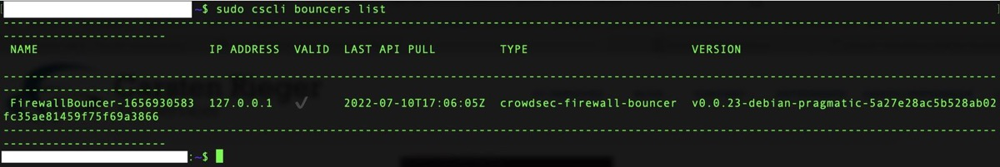
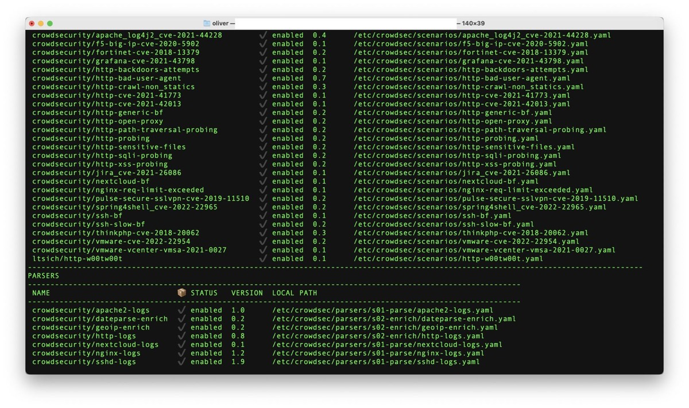
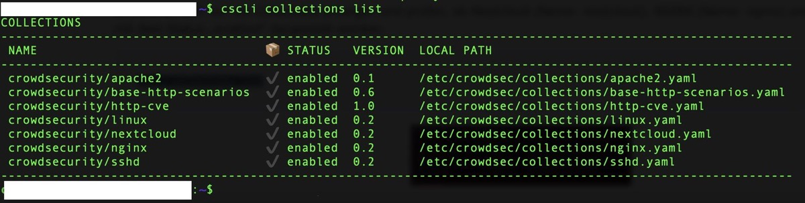
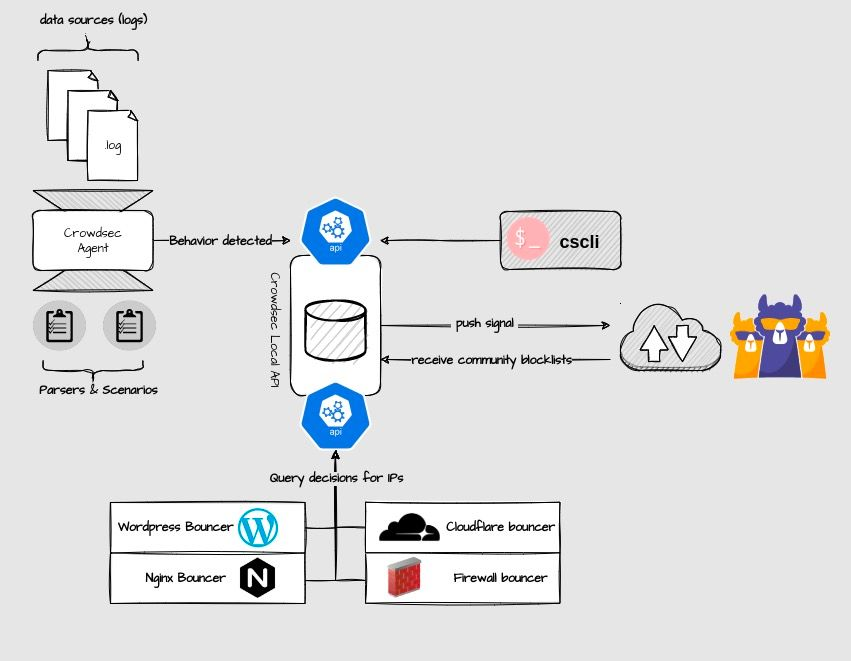
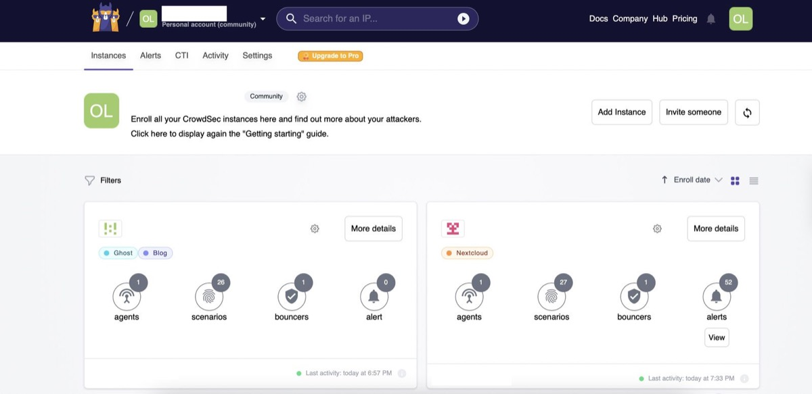
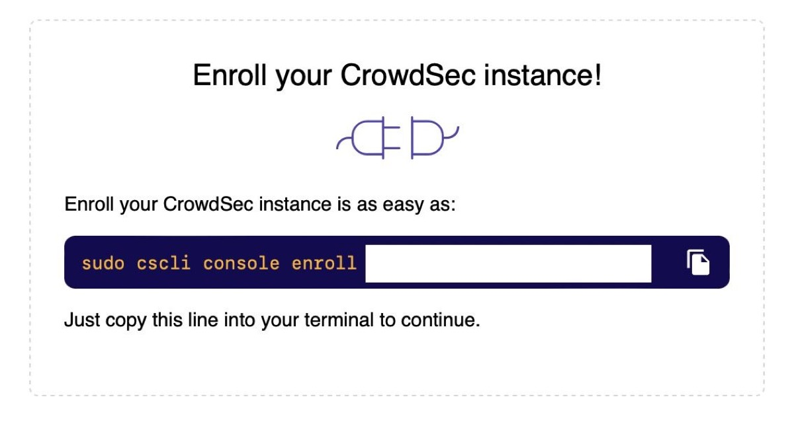
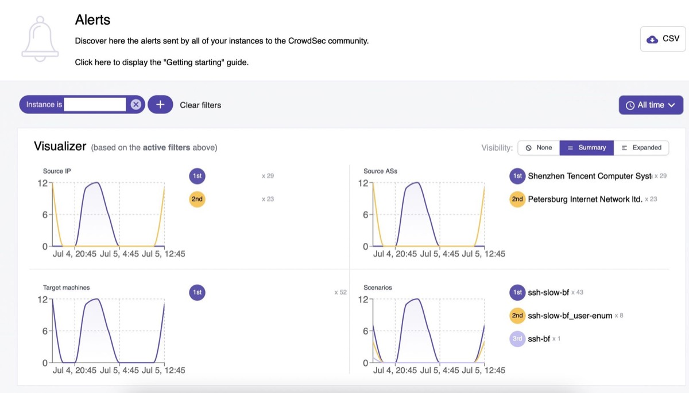
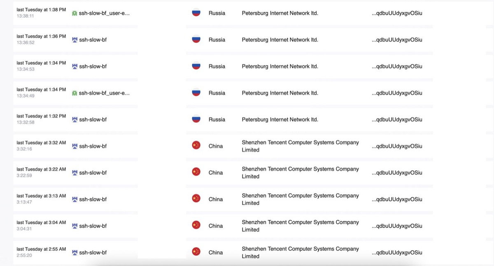
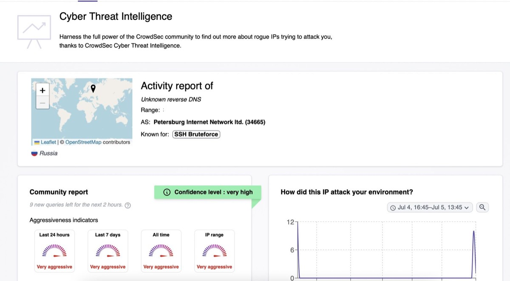
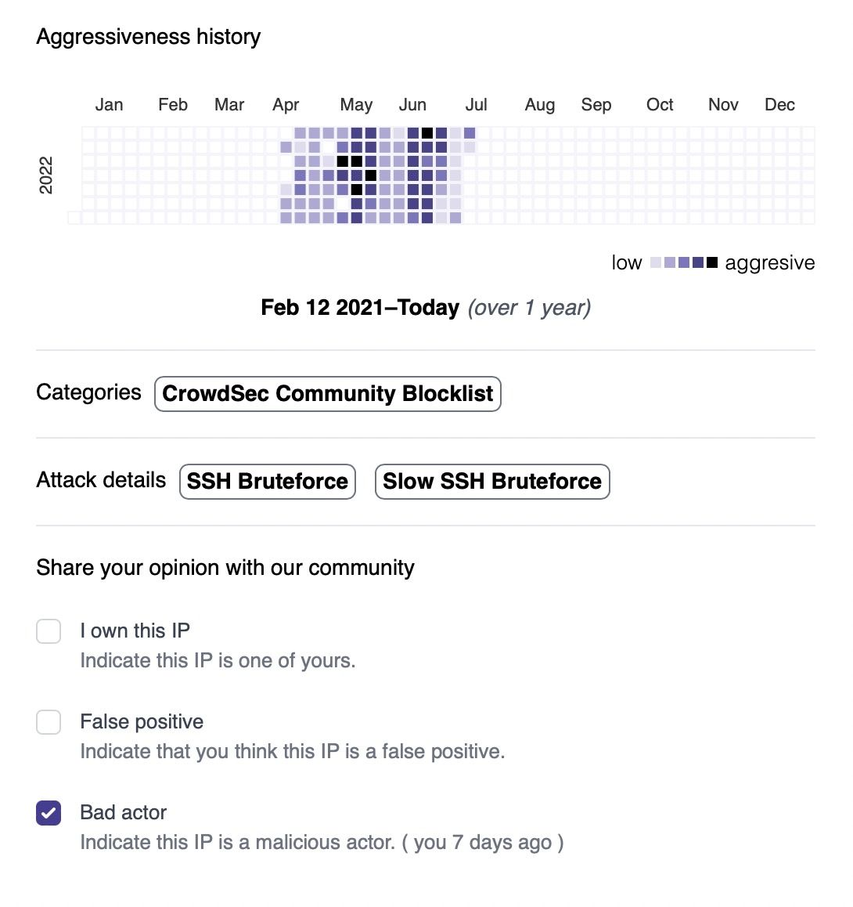

## There are many ways of equipping your system with a basic protection. UFW and Fail2Ban always did a great job and CrowdSec is yet another great alternative with a modern console.

For now, I mainly relied on a well-to-do combination of UFW (Uncomplicated Firewall) and Fail2Ban as a basis for my Linux-servers. While the first one took care of closing ports that didn’t need to be open, the latter locked out unwanted guests that, for example, tried to brute force SSH with numerous login attempts within a certain time slot. Some days ago, I stumbled upon Carsten Rieger’s interesting [blogpost](https://www.c-rieger.de/intrusion-prevention-system-ips-mit-crowdsec-fur-nextcloud/) about securing NGINX and Nextcloud with CrowdSec - reason enough to finally deal with this solution.

CrowdSec is an [Open Source](https://github.com/crowdsecurity/crowdsec) and collaborative IPS (Intrusion Prevention System) which founds on F[ail2Ban’s original philosophy](https://www.crowdsec.net/blog/crowdsec-not-your-typical-fail2ban-clone) but is told to be 60x faster and not just a protection against brute force-attacks. It leverages local behavior analysis to create a global IP reputation network and enables you to view all events happening on your machines after installing the solution and a specific agent. The agent defends against intrusions by analyzing logs and identifying and blocking offending IPs. Flagged IPs are then sent to the community blocklist to protect the Crowd, delivering a community-based approach to stop the attackers.

In my use case, I want to focus on securing my [Nextcloud All in One](https://pifferi.synology.me/deploying-your-own-docker-ized-nextcloud-hub-ii-instance-in-no-time/), the associated NGINX-webserver and of course the SSH-feature which, in my case, already had a specific configuration but should part of this scenario anyway.


Preparations
------------

Running an updated Debian 11-system, we need to fetch the desired packages first. After switching to the privileged user mode by typing

```
sudo -s

```


we start with creating the repository and telling our system that the new packages will be fetched from it. Assuming you’ve already got Curl installed, the command

```
curl -s https://packagecloud.io/install/repositories/crowdsec/crowdsec/script.deb.sh | sudo bash

```


will take care of exactly this task. Heading on, we can now easily install CrowdSec by using the well-known „apt“-command:

```
sudo apt-get update
apt install crowdsec

```


Then, we enable the service to start at boot time:

```
systemctl enable --now crowdsec.service

```


To avoid conflicts with Fail2Ban which may be installed simultaneously, we stop the service, disable it and take care that it won’t be loaded again for whatever reason:

```
systemctl stop fail2ban.service
systemctl disable fail2ban.service
systemctl mask fail2ban.service

```


With all preparations done, we can now turn to the granular configuration of CrowdSec!

Configuration
-------------

With the binaries installed, we officially start from the scratch here: There is no ruleset deployed at the initial installation process so we need a basic protection via the IPS-module which can be fetched with the command

```
apt install crowdsec-firewall-bouncer-iptables

```


while a first

```
cscli bouncers list

```


shows the initial „bouncers“. As per definition, a bouncer is „a piece of standalone software in charge of acting upon blocked IPs in the CrowdSec-ecosystem. They can either be within the applicative stack or work out of the band. While the CrowdSec agents detect attacks, bouncers block them."

To check which scenarios and parsing actions are configured with this initial list, use



To check which scenarios and parsing actions are configured with this initial list, use

```
cscli scenarios list && cscli parser list

```


which will show a list of scenarios and parsers.



The following screenshot already shows my configured NGINX- and Nextcloud-actions that are already fully functional on my system and will do so on your server once you managed to follow this tutorial to the end!

To anticipate the result (or the way to it), use the commands

```
cscli collections install crowdsecurity/nginx
cscli collections install crowdsecurity/nextcloud

```


to install the specific rulesets.



Enabling the Nextcloud-log
--------------------------

While NGINX and its logs are parsed straight from the beginning, we need to adjust the configuration file so that it may find the proper Nextcloud-log.

Edit the file by using your favorite editor which is, in my case, „vi“:

```
vi /etc/crowdsec/acquis.yaml

```


By default in the „normal“ (non-Dockerized) versions, the path would be /var/www/nextcloud/data/nextcloud.log or similar. As we are using Nextcloud AIO, the log file is a little bit difficult to find, but resides at

```
/var/lib/docker/volumes/nextcloud_aio_nextcloud/_data/data/nextcloud.log

```


So we add the following lines to the recently opened „acquis.yaml“-file:

```
---
#Nextcloud-Logs
filenames:
 - /var/lib/docker/volumes/nextcloud_aio_nextcloud/_data/data/nextcloud.log
labels:
  type: Nextcloud
---

```


Save the file and exit.

To force the activation of this freshly-implemented extension, reload CrowdSec and its components:

```
systemctl reload crowdsec && systemctl restart crowdsec

```


The optional command

```
cscli metrics

```


shows how the Nextcloud-log is interpreted in CrowdSec and how many log-lines are parsed, unparsed or read in general.

Now let’s check whether NGINX, SSH and Nextcloud can be found under the used collections and if the status of those components is enabled or not - usually, it should:

```
cscli collections list

```




By default, your system is now able to react on DDoS-scenarios, brute force-attacks or similar malicious activities and will lock out any IP violating those rules for four hours. This value may changed in the file

```
/etc/crowdsec/profiles.yaml 

```


if you want to customize it - don’t forget to restart the CrowdSec-service afterwards!

The command

```
cscli decision list

```


shows the IPs currently banned from your system together with a certain ID you can use to unblock this IP in case of a false positive. Assuming the ID would be, for example, 12421, the command

```
cscli decision delete --id 12421

```


takes care of exactly this task!

Polish: Installing the agent and managing the Webinterface
----------------------------------------------------------

As CrowdSec is not only a command line-based service but also a web-based application with a [management console](https://app.crowdsec.net/), you may also [sign up](https://app.crowdsec.net/signup) for an account. Several [pricing tiers](https://app.crowdsec.net/pricing) are provided and, as we got used to, deliver different feature sets to the users. In our case, the free plan does everything we need offering basic data retention of 500 alerts/7 days, a basic CTI („CrowdSec Threat Intelligence“)-quota and access for one user.

After registering for the service and logging in you should enable 2FA like you should do with any modern platform to further secure your account. In the dashboard, your instances are shown and as we have just started, there aren’t (of course) any.



Click on the „Add Instance“-button now and head to the shell of your Linux-system, being prepared to Copy-and-Paste the command to deliver your personal agent to the target system:

```
sudo cscli console enroll cl45ip1hk11111wnnn7ufgc3443

```


This is just an example how your individual command will look like, but after executing this command, wait a few seconds and have a look on CrowdSec’s console again - your server should appear now.



With the option-wheel mounted on this instance, you may edit, copy the instances’s ID, transfer this instance to another organization or remove it. In our scenario, we want to edit it to give it a fitting name (I prefer the hostname here) and some good tags. Clicking on „More Details“ in the specific instance now shows the current IP, the scenarios and bouncers we have configured via CLI before and the version of the agent running.

As for the bouncers, collections and configurations, the [CrowdSec-hub](https://hub.crowdsec.net/) provides provides additional addons to implement, for example for the Apache2-webserver, MariaDB, Postfix etc. - the system is absolutely expandable here.

Once something happens within your instance - for example an attack attempt - CrowdSec documents this in a great and visible way.



On your instance, click on „View“ right near the number of alerts and you can see a lot of statistics what has happened (and from where) and even see if the IP related to this event is conspicuous or not.





Indeed, using CrowdSec’s Cyber Threat Intelligence (CTI), you may also mark this IP as yours, report it as a bad actor or even a false positive so that other community-members benefit from this after CrowdSec has verified your choice.



Verdict
-------

CrowdSec is a great and modern way to extend the features of solutions like Fail2Ban with a Cyberthreat-touch and a community-approach behind it. You may use the solution completely via the Linux-shell but once you want to gain more and modern insights, the web-interface of the CrowdSec-console is the method of choice here.

The solution is [well-documented](https://doc.crowdsec.net/) and comes with a nice hub which helps to extend its impact on your baseline-security based upon your demand. The pricing-model is okay when you go for larger installations with more individual needs while the private user should have everything within reach within the Free-plan.


I hope to have successfully shown you how to make your first steps with CrowdSec on your Linux-system and especially trained it to use the logfile of a Nextcloud AIO-Dockerized instance. If you have any questions, feel free to contact me and never forget: There is no security grade of 100%, the biggest risk still sits in front of the screen(s)!