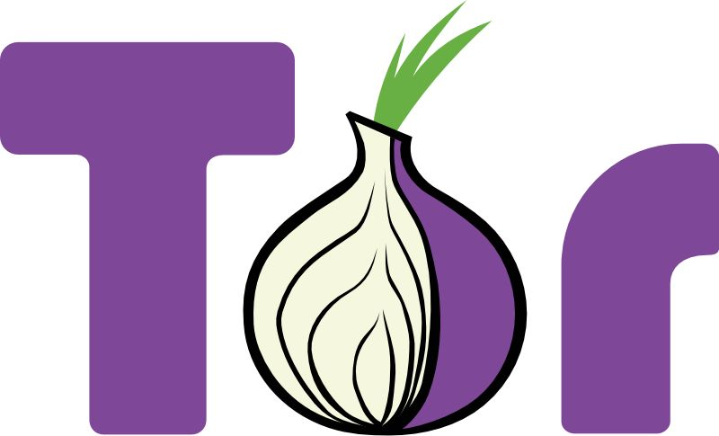
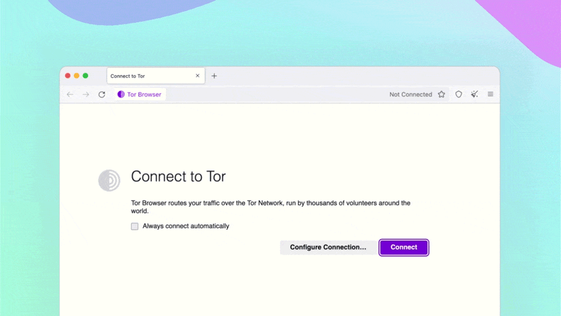
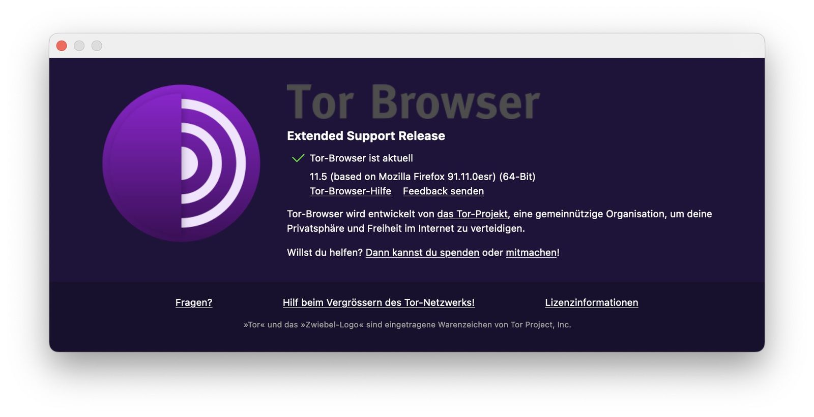

## While the world dismantles itself in many ways these days, the need for anonymity and freedom of speech constantly rises to help speaking out with voices of reason. One elementary tool for this is Tor Browser.

Truth always hurts and Freedom of Speech is something that (lucky) parts of our civilization know as a fundamental right. Alas, there are places on this world and situations therein where the use of Freedom of Speech threatens existences, life, family and friends. And, while anonymity is something that is often set equal to being some kind of illegal activity, the demand of delivering pieces of information or surfing the Web without being persecuted is on the rise. The Tor Browser, paired with its underlying technology, is a long-time tool for moving in the shadows for whatever reason and is now available in the latest iteration 11.5 as The Tor Project just [reported](https://blog.torproject.org/new-release-tor-browser-115/).

New features ahead
------------------

Originally, The Tor Browser has once been created specifically for accessing sites through „The Onion Router“ („Tor“)-network to offer users anonymity and privacy when accessing information on the World Wide Web. Technically, this is achieved by routing traffic through nodes on the network and encrypting it at every step, making it impossible to trace back to its origin. The connection itself finally reaches the destination through an exit node that is used to relay the information back to the user.

One new feature is called „Automatic censorship detection and circumvention“ and focuses on the initial way of connecting to the Tor-network. Once opening the app, it tries to build up a connection to the network which could fail in specific cases, depending upon the level of regulation in the underlying network. The process of optimizing this step has already started with the release of version [10.5](https://www.bleepingcomputer.com/news/security/tor-browser-adds-new-anti-censorship-feature-v2-onion-warnings/) one year ago where first improvements to the connections-process were implemented. Now, users no longer have to manually try out bridge configurations to unblock Tor as the „Connection Assist“ is automatically assigning the bridge configuration known to work best for the user’s specific location.

> „Connection Assist works by looking up and downloading an up-to-date list of country-specific options to try using your location (with your consent). It manages to do so without needing to connect to the Tor Network first by utilizing moat – the same domain-fronting tool that Tor Browser uses to request a bridge from torproject.org.“

Although Connection Assist is still in an early stage of development despite reading its v1.0-milestone, the Tor team welcomes user feedback and reports and especially searches Alpha-testers from countries like Belarus, China, Russia and Turkmenistan who are known for blocking Tor-related Internet-traffic.

All-in for https
----------------

We already got used to it, knowing that every „https“-prefix means an encrypted and secured connection to a website. The support for the protocol once came bundled as an extension of Tor Browser and while nearly all major and modern sites are [backed by https](https://www.eff.org/deeplinks/2021/09/https-actually-everywhere), browsers have also adopted the way of automatically adopting a „http“-address to a secure one. Firefox – the browser on which Tor Browser is based – calls this feature [HTTPS-Only Mode](https://blog.mozilla.org/security/2020/11/17/firefox-83-introduces-https-only-mode/) and, with this release, the integration is done and the „HTTPS-Everywhere“-extension is not needed anymore. Alas, this journey can’t be done in one step and so, unlike the Desktop-version, Tor Browser for Android will continue to use HTTPS-Everywhere in the short term.

As for the time of implementation, The Tor Project states that a research by Mozilla indicated that the fraction of insecure pages visited by the average users is very low – limiting the disruption caused to the user experience. Additionally, this change will help protect Tor-users from SSL stripping-attacks by malicious exit relays and strongly reduces the incentive to spin up exit relays for Man-in-the-Middle attacks in the first place.

Additional improvements
-----------------------

After going all in with the Connection Assist and HTTPS-only-Mode, there are still additional improvements to the latest Tor-browser. The project names improved font support bundles many more fonts from the [Noto](https://fonts.google.com/noto)\-family in the current release without increasing the size of the installer package too much.

Additionally, the project also admits that there is still a lot of work to do regarding the Android version of the Tor-browser which still is behind the Desktop-version. Prioritizing again, the Android-roadmap is scheduled like this:

1.  Start releasing regular updates for Android again
2.  Fix the crashes that many Android users have experienced
3.  Begin catching up with Fenix (Firefox for Android) releases

Trying to catch up with the latest Fenix-releases, The Tor Project also promised to extend the Android-team’s capacity and devote more resources to the development of the mobile Android-version while focusing on Fenix v102 and keeping everything stable (again).

How to get it
-------------

Tor Browser 11.5 is now available from the Tor Browser [download-page](https://www.torproject.org/download/) and also from the official [distribution-directory](https://dist.torproject.org/torbrowser/11.5/). Packages are available for many operating systems and platforms once you made it to [this](https://www.torproject.org/download/languages/) page.