## In November 2020, Apple launched its ARM-based M1 SoCs. Since then, many vendors adopted their software to match the new platform - not all have accomplished this task yet, but there are alternatives.

Software development is something that needs time. While other companies like Microsoft and users did as well, there are still exceptions that haven’t been able to release a final version of their specific software. Amongst them are quite famous names and while always having the need for desktop virtualization, my once preferred solution VMware Fusion.

Apart from the well-known alpha males just mentioned, there is always space for competition and - once you don’t want any rocket science or complex scenarios apart from virtualizing or emulating some Desktop OS - [UTM](https://mac.getutm.app/) is one of those. „UTM“ doesn’t stand for „Unified Threat Management“ here, indeed it is a [qemu](https://www.qemu.org/)\-based virtualization for iOS/iPadOS and macOS with my focus on the latter edition here. Seeking for an affordable alternative to Parallels with its subscription model or VMware still officially missing Apple Silicon-support paired with less demands over the years, I perceived the voices calling out for a new software on the virtualization market made possible by the developers at Turing Software, LLC.

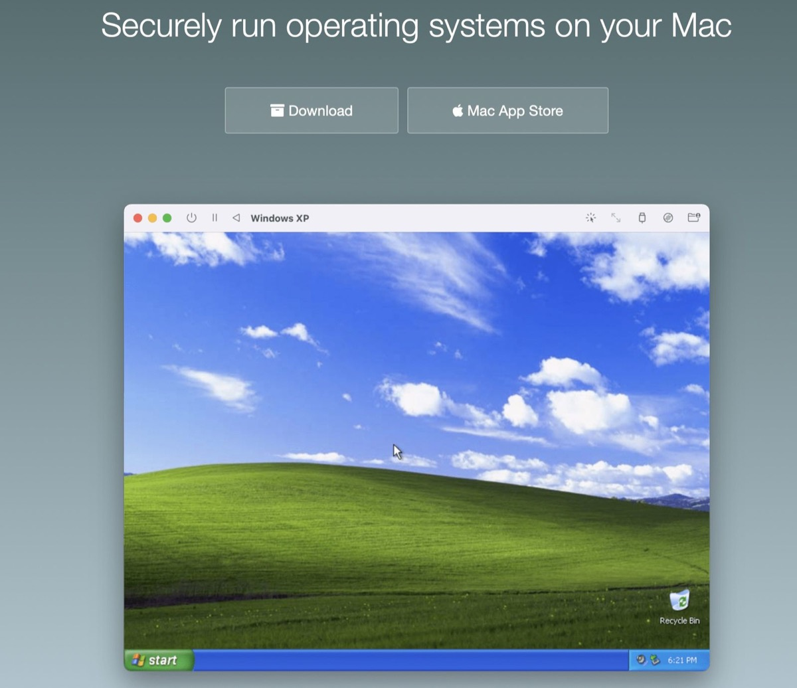

About UTM
---------

According to the publisher’s info on the official [website](https://mac.getutm.app/), UTM employs Apple's Hypervisor-virtualization framework to run ARM64 operating systems on Apple Silicon at near native speeds. On Intel Macs, x86/x64 operating system can be virtualized. In addition, lower performance emulation is available to run x86/x64 on Apple Silicon as well as ARM64 on Intel. For developers and enthusiasts, there are dozens of other emulated processors as well including ARM32, MIPS, PPC, and RISC-V. These use cases don’t need to match all of your demands, but going for a virtual Windows 11 on ARM is one of the things only Parallels managed to accomplish so far.

For the start and focusing on macOS 12.5 „Monterey“ here, you have the choice to download the software for free from the official [website](https://mac.getutm.app/) or by doing a one-time-payment of $9.99 in the [App Store](https://apps.apple.com/de/app/utm-virtual-machines/id1538878817?mt=12), founding the development of the app (and Apple!). The latest version is 3.24 on both platforms so you won’t have any differences in functionality - but if you prefer apps delivered through the App Store mainly, UTM needs to be purchased for nearly ten bucks.

Using the software & installing Windows 11 ARM64-preview
--------------------------------------------------------

According to your kind of installation, you have either downloaded the app via the App Store or opened the latest .DMG-file in combination with Drag-and-drop into your „Applications“-folder. In contrast to the competitors, the first view on UTM is quite straightforward and less fancy. Eye-catching options are the possibilities of creating a new virtual machine, browsing the gallery, looking at the user guide or longing for support. Also the basic options aren’t that complex so that you can directly start with virtualizing or emulating a new system after checking those - although you needn’t to.

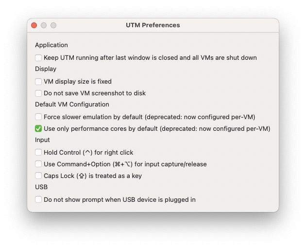

In my primary use case, I used the official Windows 11 ARM64-preview from the Windows Insider Program to boot from an UEFI-compatible BIOS trying to install a Windows 11 from the scratch.

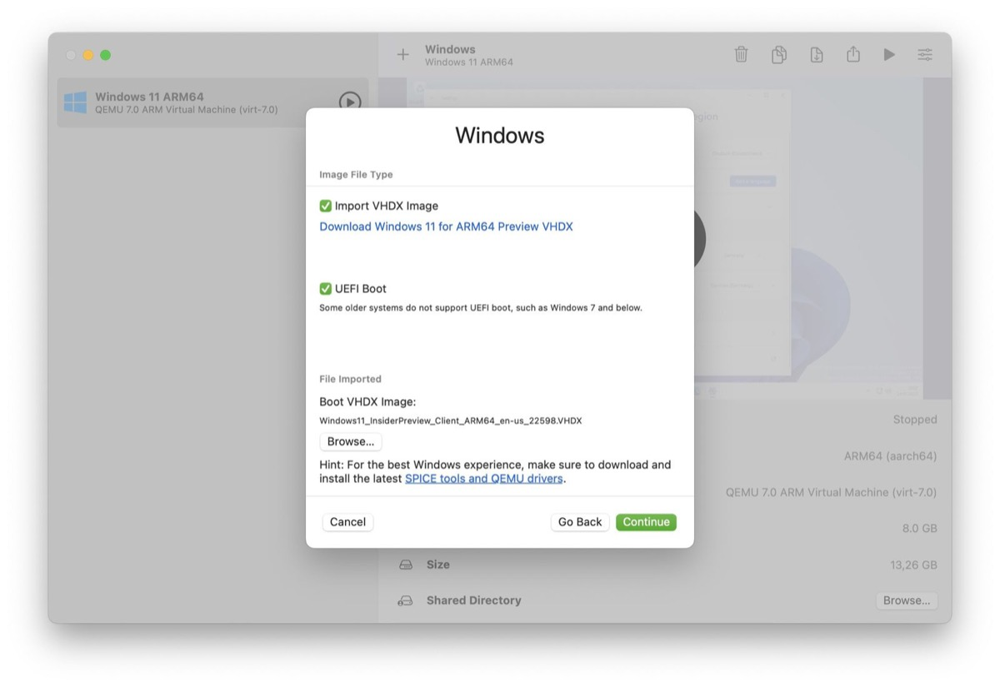

Although the installation went smooth, Windows 11 assumes that you’ve got an Internet-connection to complete the installation.

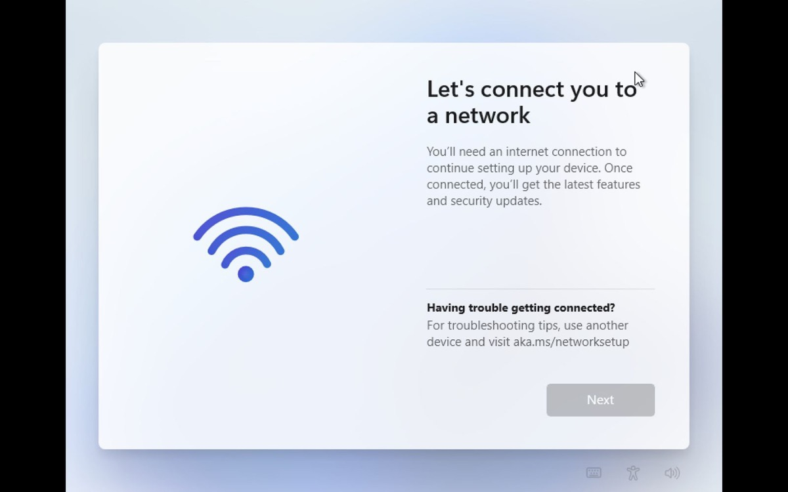

As we are just installing a system without fitting network drivers, our installation is offline and needs the [SPICE Guest Tools and QEMU Drivers](https://mac.getutm.app/support/) provided by UTM once Windows is installed.

This may be a showstopper for now but, fortunately, you can bypass this by hitting the „FN“-key in combination with Shift + F10. By doing so, a command prompt is opened where you now can enter the command

```
"OOBE /BYPASSNRO"

```


(mind the double quotes!) and restart the virtual machine.

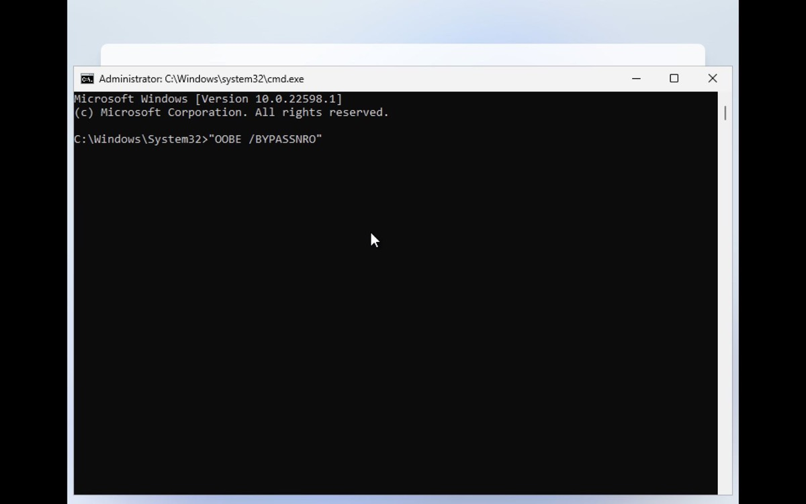

When returning to the setup screen again, choose the „I don’t have Internet“-option to create the (unwanted) local user in Microsoft’s latest iteration of Windows and finish the installation.

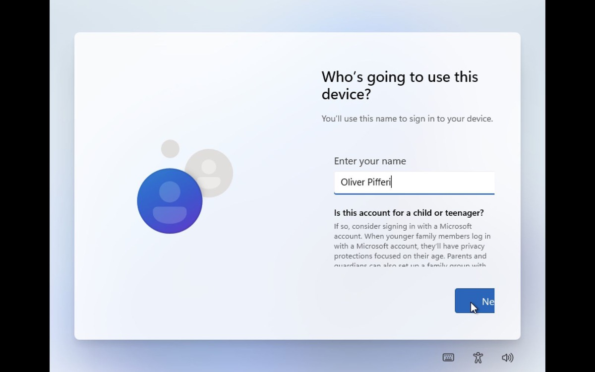

Once the installation is finished, you’ll need to mount the recently download ISO-file containing the SPICE guest tools for network drivers and install them by executing the .EXE-file in the ISO’s root: After another restart, Windows 11 and its networking options will be fully functional just like the graphics are as we successfully installed the necessary drivers.

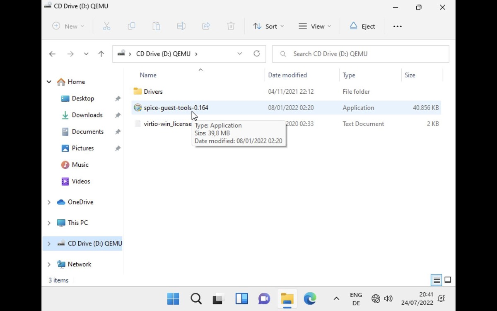

There may be an issue with the Windows Store missing in the current previews. To get rid of this, open a terminal or command prompt and use the command

```
wsreset -i

```


and, after some waiting time, the store should appear as an app symbol and you can fetch your desired packages or update the standard ones.

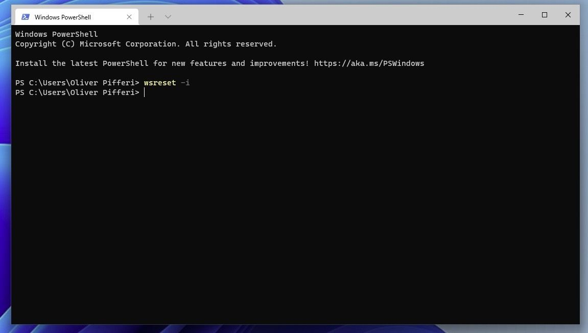

Although Windows 11 for ARM64 is still in a preview state, I considered the system to be very stable despite different localizations were still missing while the US-version was the only version you can fetch at the time of writing. Perceived during my tests, the system didn’t run as smooth as Parallels but hey - the software is cheap if even for free and will do its work for basic and-/or office-tasks!

Other systems
-------------

Looking at the official [gallery](https://mac.getutm.app/gallery/), we do also find some systems that are emulated as their origin is x86- or even PowerPC-based. Mac OS 9.2.1 with PowerPC-emulation is available, Sun Solaris 9 on SPARC-platform or even the well-known Linux-distributions like Debian or Ubuntu can be downloaded as a template to directly get imported into UTM. Also well-known Microsoft-systems are found: Windows 7 and even XP are in the spotlight here as well!

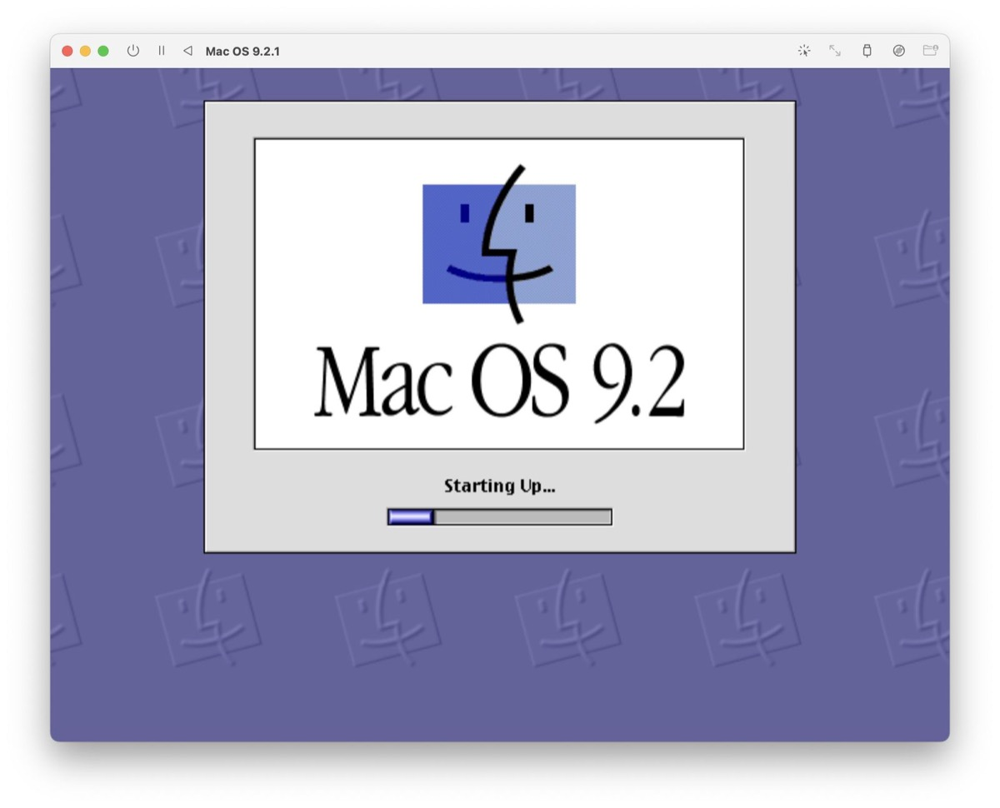

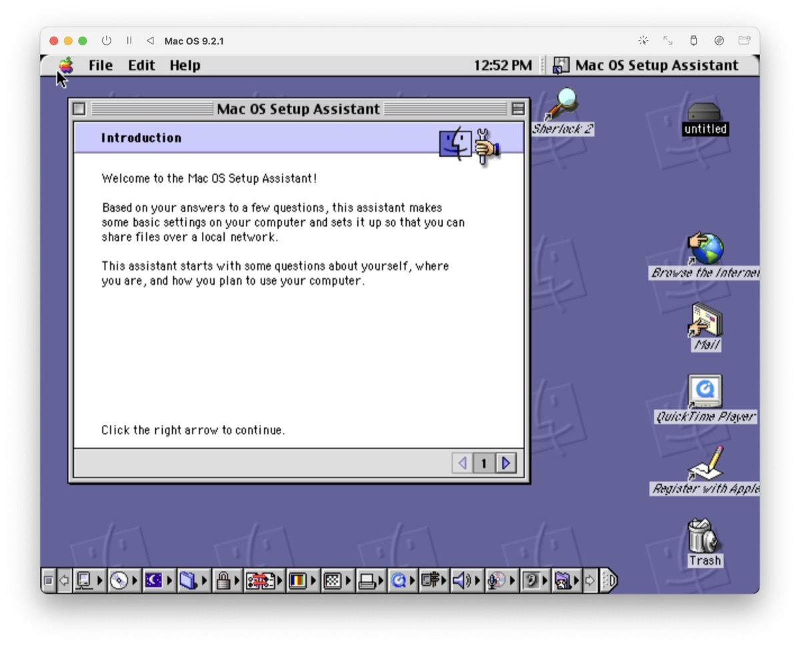

Apart from that, you are of course able to install a system like Debian from the scratch. Just fetch the official [ISO](https://cdimage.debian.org/debian-cd/current/arm64/iso-cd/), create a new virtual machine and boot from this media. After this has been accomplished and the system has been installed, a simple

`sudo apt install spice-vdagent spice-webdavd`

takes care of fetching the latest SPICE Guest Tools and QEMU Drivers to get the Linux-based VM fully running with all optimized drivers.

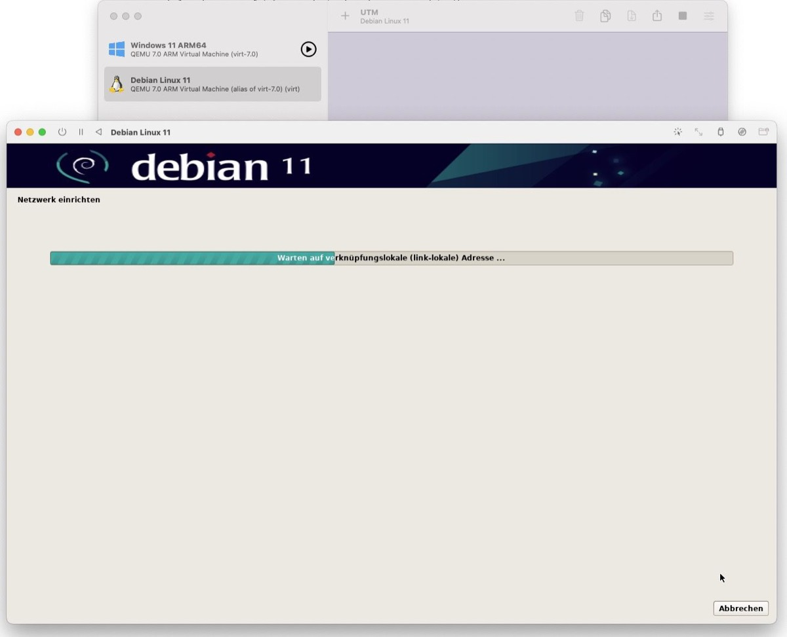

Verdict
-------

UTM is a quite new tool while the underlying qemu-platform isn’t - many of us have already used this platform in a hosting-environment or a personal lab. With UTM appearing in the team of Desktop-hypervisors, the alpha males of Parallels and VMware get a nice and young competitor who will surely help to pick of pace again. While Parallels is - undoubtedly - my favorite at the time of writing, VMware needs to catch up with a final version of Fusion finally adopting the Apple Silicon-platform nearly two years after its release.

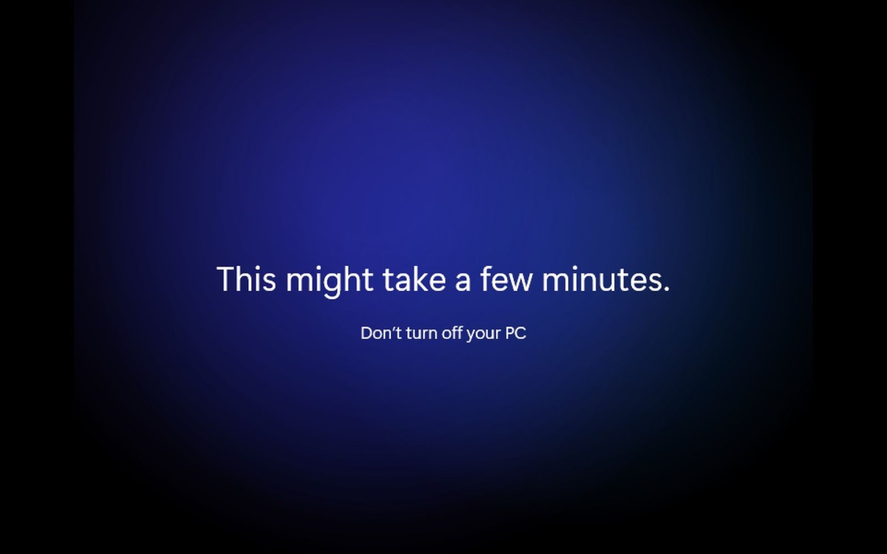

UTM may not be the solution everybody needs but, with some polish and experience gained over the several releases, this software can be a good fit against the named alpha leaders, filling the gap for the home user while Oracle’s VirtualBox cannot deliver for Apple Silicon either yet. Parallels is still years ahead in its development and the scenarios this software can be used but not everyone likes the subscription model forcing you to renew the license each year. If your demand is set a little bit below the high standard, you want to try several OS on your Apple Silicon-device or build a small lab without much invest, UTM could be in your target vector!

How to get UTM
--------------

UTM can be downloaded via the official [Github-repository](https://github.com/utmapp/UTM/releases/latest/download/UTM.dmg) or Apple’s [App Store](https://apps.apple.com/us/app/utm-virtual-machines/id1538878817). Pre-configured images to suit different needs can be found in the [Gallery](https://mac.getutm.app/gallery/) while Windows 11 Preview for ARM64 must be fetched via [Microsoft’s Windows Insider Program](https://www.microsoft.com/en-us/software-download/windowsinsiderpreviewARM64). In case you also want to use the virtualization features on iOS/iPadOS, [this](https://getutm.app/install/) website shows you how to accomplish this - if it fits your use case!