## Various Synology-devices support Docker, a lightweight software containerization solution. Although this works quite well out of the box, more flexibility can be added by yet another tool: Portainer.

While Synology’s approach to bring Docker on its famous NAS-devices is pretty straightforward, many of you may miss additional options you may already have experienced when dealing with docker-compose.yml-files in the past. Polishing this feature, Portainer offers you to easily deploy, configure and secure containers in minutes on Docker, Kubernetes, Swarm and Nomad in any cloud, datacenter or device: Enough for our Synology-NAS which is, in my case, a Synology DS920+.

This short tutorial will show you how to install Portainer as a basis for all future Docker-deployments on your [supported](https://www.synology.com/en-us/dsm/packages/Docker) Synology-device.

Installing Docker
-----------------

First things first - head to Synology’s Package Center on your NAS and install the Docker-package. After this has been done, a new folder named „docker“ will appear in the root of your file-system. As a preparation for using Portainer, create a folder named "portainer" inside the „docker“-folder. That’s it at this stage.

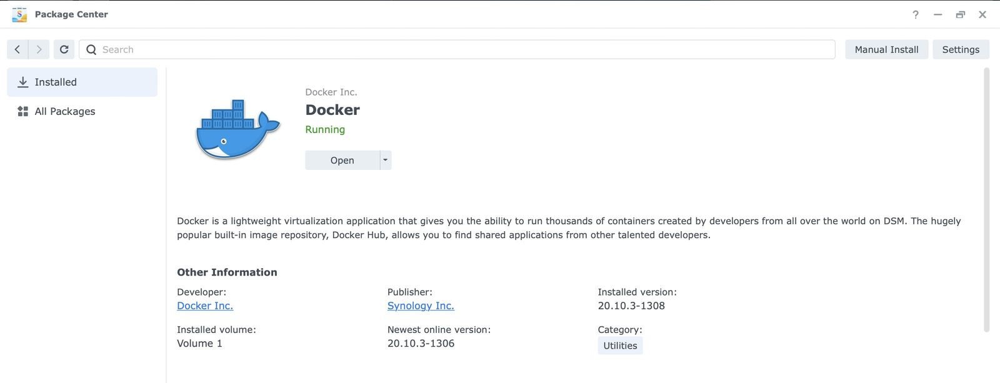

Implementing Portainer
----------------------

Now navigate to the Control Panel, switch to the Task Scheduler and create a scheduled task using an user-defined script.

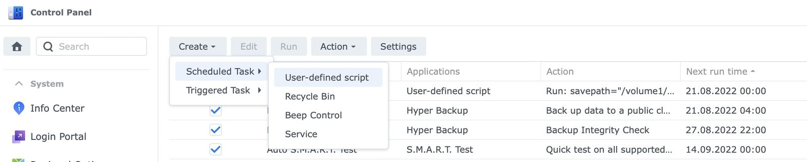

In the „General“-section, name the task, untick the „Enabled“-checkbox (we don’t want this to run regularly!) and choose „root“ as the specific user for this task. On the „Schedule“-page just select „Run on the following date“, then select „Do not repeat“ - again, this task is going to be a one-timer!

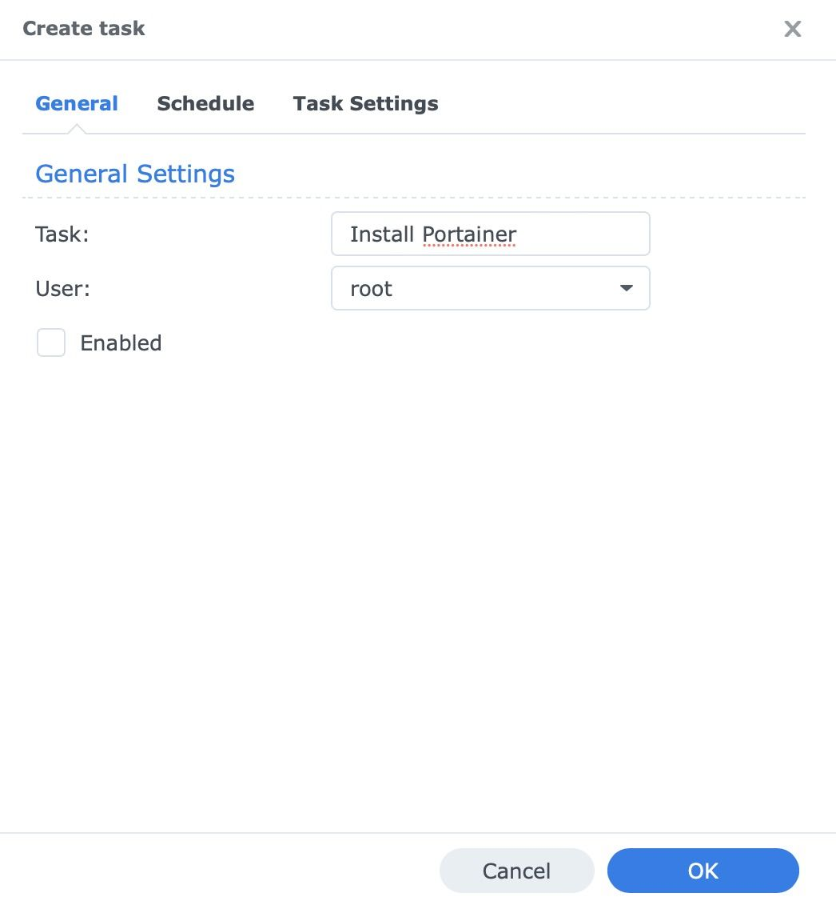

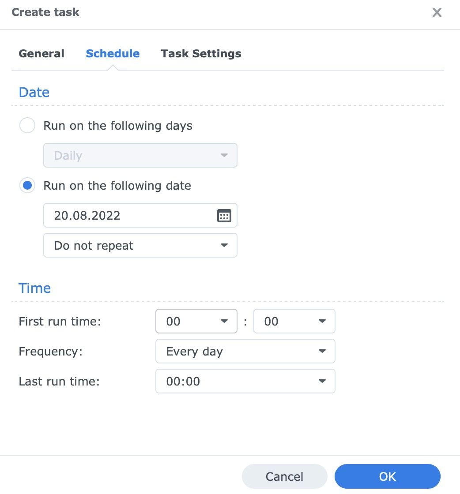

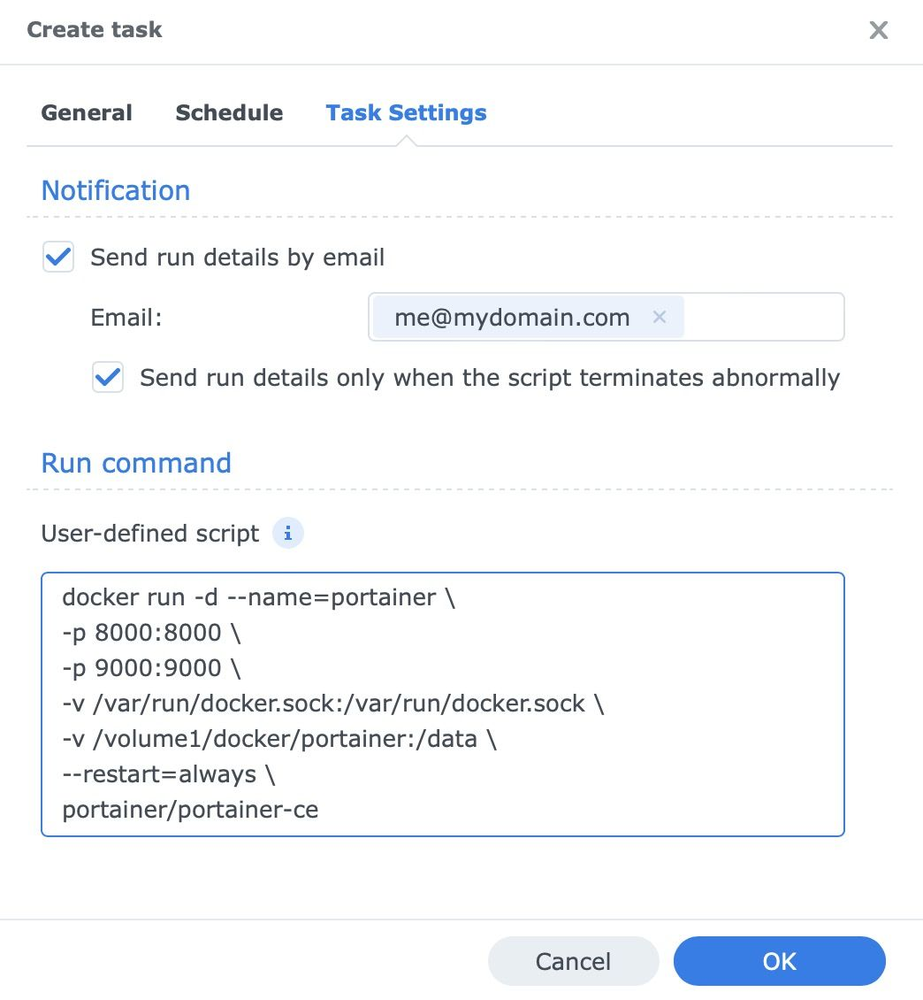

In the specific Task Settings you may enable an E-Mail report with the run details (assuming you have already configured the correct SMTP-options within Synology’s DSM) or choose to send those only in case of an unnormal script termination. As a run command, insert the following code:

```
docker run -d --name=portainer \
-p 8000:8000 \
-p 9443:9443 \
-v /var/run/docker.sock:/var/run/docker.sock \
-v /volume1/docker/portainer:/data \
--restart=always \
portainer/portainer-ce
```


Note: Some tutorials (and my original one) refer to port 9000 (http) instead of port 9443 (https). After a short [tweet](https://twitter.com/portainerio/status/1561309149564207108?s=21&t=n2eCtaw1QoNSlY5o6-rtNg) from the folks at Portainer I changed the code above for obvious security reasons. Besides, port 8000 is only needed if you plan to use Portainer’s edge agents so feel free to adopt the script above to suit your personal needs!

The recently created „portainer“-folder will contain the specific data from within the container while „portainer-ce“ is the name of the Community Edition. Swapping this container’s name with „portainer-ee“ will install the Business Edition instead which has some additional nice features and is indeed free for five nodes - should you be interested, visit [this](https://www.portainer.io/install-BE-now) page to obtain your free license or find the key differences [here](https://www.portainer.io/products)!

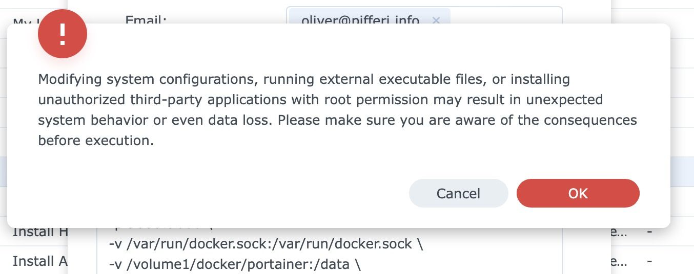

After clicking on „OK“, a warning window will appear telling you about the risks of unauthorized third-party-applications and scripts but as we know what we are doing, we can click on „OK“ again. Now select the freshly-created task and click on „Run“ at the upper side of the window. As long as you haven’t mistyped anything, Synology’s Docker-engine will now fetch and start Portainer in the version chosen.

Crossing the Finishing Line
---------------------------

Once you opted in to get an E-Mail, this choice should already have taken care of sending out an E-Mail to you once the process is done and everything is up and running. If not, check the specific error message.

By typing https://<YOUR-SYNOLOGY’S-URL>:9443, for example [https://192.168.1.254:9443](https://192.168.1.254:9443/), you should now be able to visit Portainer’s start page where you may choose your unique username paired with a strong password. Don’t worry for now, as we haven’t issued a certificate so far, you need to trust this page to accept the self-issued certificate. Once you opted in for Port 9000 without encryption, e. g. for internal use only-scenarios, this is - of course - not the case and you can access the page with the „http“-prefix!

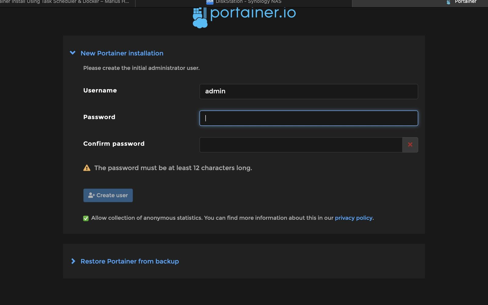

After the initial login, we need to basically connect Portainer with the underlying Docker-engine. Click on the „Get started“-pane, then at the pencil right from the „Unassigned“-label.

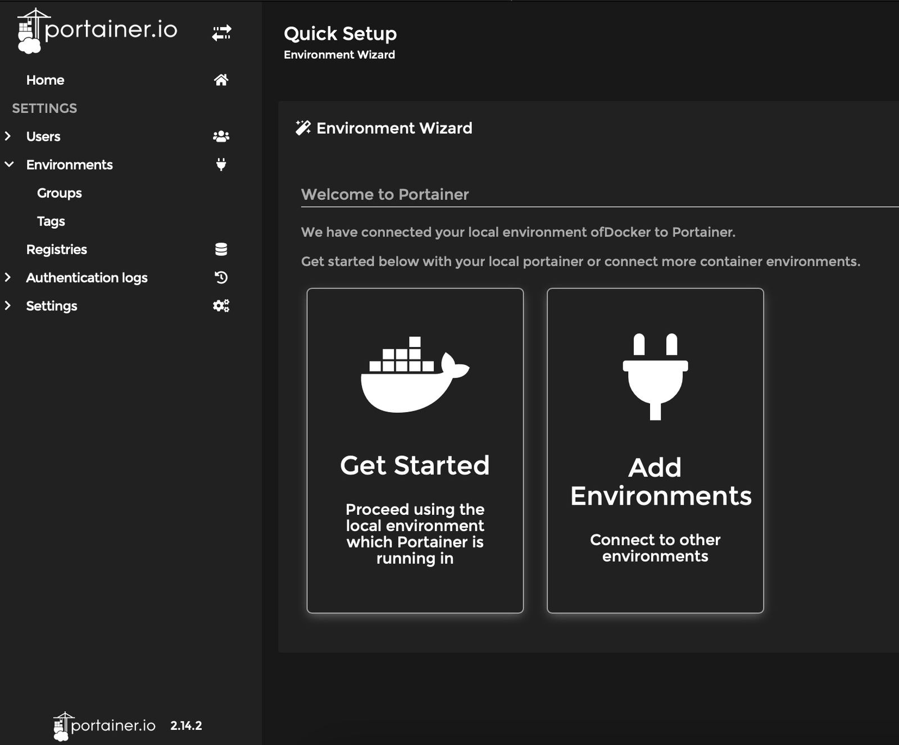

Now enter your public IP in the specific input field which is, in our small use case, the local IP of the Synology-NAS. Save this setting by clicking on the „Update Environment“-button.

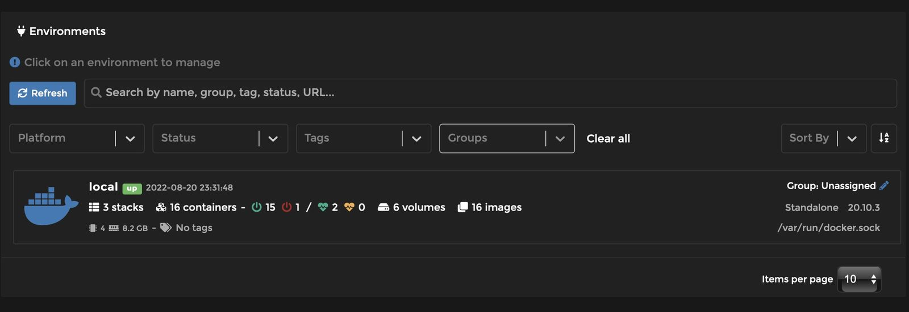

Following this step, your new environment „local“ is created and, of course, you may rename this or just head on to further learn Portainer’s benefits!

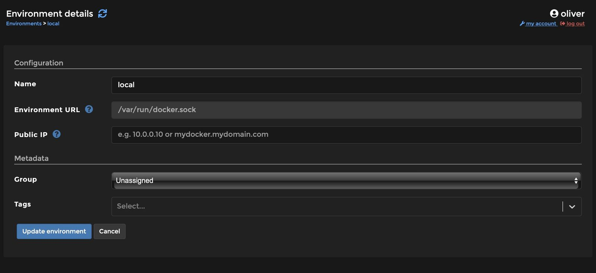

Verdict
-------

By venturing through this brief tutorial, we have successfully implemented not only Docker on a [supported](https://www.synology.com/en-us/dsm/packages/Docker) Synology-NAS but also enriched this versatile platform by an even more versatile toolkit in the form of Portainer. Creating of docker-compose.yml-compatible scripts or building full application stacks with all options available is now possible in the blink of an eye and with clearly more versatility than Synology’s Docker-GUI offers from the scratch!

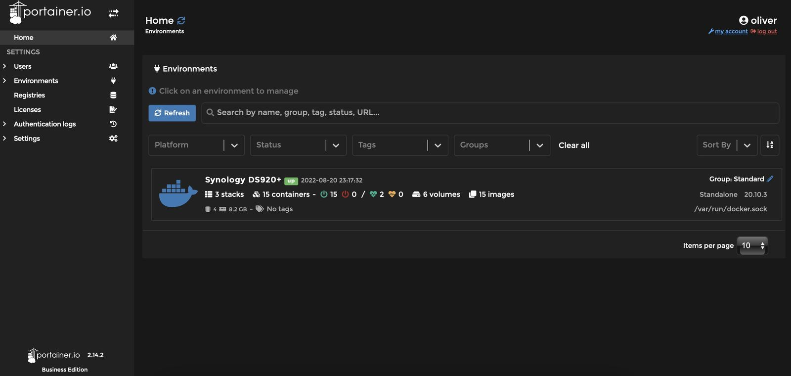

Besides, we just have opened the door to the world of Portainer which also extends the world of containers far beyond our local NAS: Managing, for example, Kubernetes-stacks in AWS, Azure or Google Cloud could be yet another future step with Portainer - enjoy!