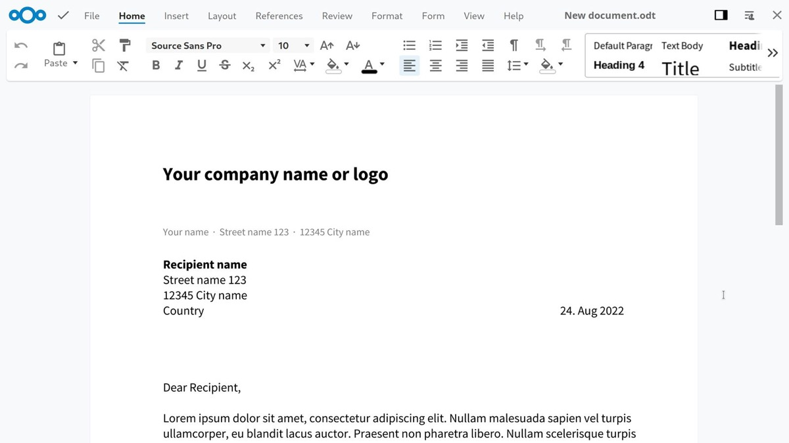
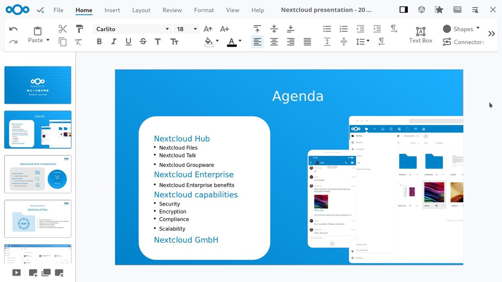
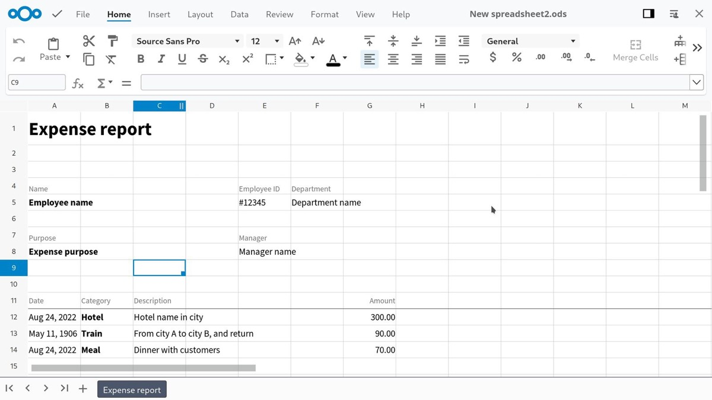

## There must be an Office beside Redmond’s variant and, so far, Nextcloud embraced the Open Sourced-based version of Collabora Online and ONLYOFFICE quite well. Anyway, there is still space for improvement so an European initiative should fix what still seems to be broken.

There must be an Office beside Redmond’s variant and, so far, Nextcloud embraced the Open Sourced-based version of [Collabora Online](https://pifferi.synology.me/how-to-implement-collabora-online-in-nextcloud-hub-22-using-docker/) and [ONLYOFFICE](https://pifferi.synology.me/how-to-implement-onlyoffice-in-nextcloud-hub-20-using-docker/) quite well. Anyway, there is still space for improvement so an European initiative should fix what still seems to be broken.

Okay, admittedly, Nextcloud made efforts to integrate the named Office suites quite early in its development and, since 2021, the Collabora-based Nextcloud Office is an official part of Nextcloud Hub. While many organizations and European Governments are facing a certain dependency and data control challenges, the eagerness of getting independent from the big global players are on a rise while the users are searching for alternatives.

A new Initiative
----------------

These days, Nextcloud GmbH announces a European initiative to build a digitally sovereign office, integrated in the Nextcloud collaboration platform - virtually underlining the efforts so far which started in early 2021. Nextcloud describes the goal of this campaign as a response to a growing need in the European Union for an independent, on-premises and trustworthy document collaboration tool. Targeting the small number of big digital collaboration platforms threatening the European Sovereignty, the case is quite hot as the latest [Anti-Trust-discussions](https://pifferi.synology.me/eu-tech-sector-files-antitrust-complaint-against-microsoft/) have already shown.

Founding on this movement, a growing number of data protection offices across Europe, from the Netherlands, Sweden and Germany to France, is seemingly coming to the inevitable conclusion that these foreign cloud platforms are not suitable for use by government institutions. Confirming this, the need for a GDPR-compliant, decentralized and Open Source-based solution has definitely grown over the years, preventing vendor-lockins or data leaks to third parties and countries.

The Announcement
----------------

Achieving this, European Government agencies joined with Nextcloud to deliver this solution and two days ago, the German company announced the formation of an Advisory board with members of the Swedish, German, Swiss and other European federal and local governments. The common goal is the continuing development of Nextcloud Office which is already widely deployed in the Government sector, opening direct communication between the development team and users. The board is looking for new members to participate in the furtherance of European Digital Sovereignty.

The first production-ready results are already available and have already been deployed at customer sites across European governments.

> Collaborative office applications are key for the digitization of the public sector, and a diversity of options reduces both risk and cost.

(Andreas Pelzner, Chairman of Komm.One, responsible for IT services for over 1000 municipalities in the German state of Baden-Württemberg)

Changes at Nextcloud Office
---------------------------

Hundreds of municipal, state, federal and EU government organizations in Europe already use Nextcloud to collaborate in a secure and compliant manner and deployments are accelerating. As mentioned above, Nextcloud Office was launched in December 2021 in collaboration with the online office experts from Collabora delivering the mighty foundation for this module. It introduced advanced compatibility with proprietary document formats and alongside the establishment of the Advisory Board, the Nextcloud Office-team released an update with a familiar tabbed menu interface.

Following this, the Nextcloud Usability-team is going to launch a usability survey to investigate usage patterns in the public sector and establish key priorities for development.

> Improving the choice of online office solutions in the market benefits both private and public parties.

(Steve Jordi, City of Geneva, servicing IT for the employees of the city government and its suppliers and partners)

According to the German company, Microsoft Office compatibility with documents is a key concern for Nextcloud-users and Open Source-enthusiast alike. Work is done to make sure that Nextcloud Office has better compatibility with Microsoft Office’s document formats than the various Microsoft products themselves have achieved between platforms and over the years. Customers are going to have fewer cases where Nextcloud Office can not display elements of documents than they would encounter on Microsoft 365, especially with legacy documents and file formats.

> A multi-vendor strategy is important for the Swedish government for reasons of strategic independence, healthy markets and cost control.

(Swedish government official - Sweden recently decided to move to digitally sovereign technology for its government services)

Nextcloud openly encourages users to participate in the usability study while the company continues to ask public sector-users of Nextcloud to participate in our Advisory Board, further striving to a deeper integration of Nextcloud Office. Definitely an interesting approach with a - hopefully - successful and widely spread result. Exploratory work is already done and we may be curious about the next steps with an Open Source-based Office-solution without compatibility issues!