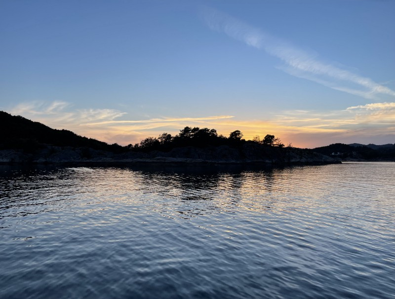

Experiencing the Black Metal-wave in the 90s, visiting Norway was surely one thing on my bucket list. Decades later, I set my foot on Norse ground and was captured by pure beauty that was far beyond any of my expectations - and triggered a lot!

There are moments in life where you begin to think of your life’s purpose. Are you doing everything right? Is your work-/life balance compensated? Are there still things have have missed so far? Are you prioritizing the right things? After some days in Norway, I was grounded in many ways but the experiences I made there began to flood my mind and will hopefully be a basis for approaching some aspects in a different way in the future.

First things first. Norway was meant to be an adventure. Postponed three times (usually we wanted to travel in May 2020) due to COVID, we finally made our way from Germany to Denmark (eight hours), crossed over by ferry (three and a half hours) and drove the last stage to our goal in Reme, just one hour from Kristiansand in the southern part of Norway. While my goal was just to venture around and discover parts of the country with my Nikon, my DJI Mavic Pro and my GoPro HERO8, my two fellows had „fishing“ on their to-do-list as this trip was planned as a mere fishing holiday but also advanced to a „hike-and-shoot“-adventure with my gear.

### Fishing, not „phishing“ this time

By partially adopting the art of fishing (although I am more fond of „phishing“ due to my job), I also learnt to spend six hours on a small boat in a fjord which alone was a certain experience, even one without barfing due to not (!) getting sea-sick in contrast to my expectations. Anyway, life is an open road and so you need to open your mind for new experiences - fishing was one of those although I refused to kill and disembowel the fish afterwards. A nice experience indeed, putting three characters in a small boat and relying on teamwork while one navigated, one steered the boat and one prepared the fishing poles with each positional change. You’re focused, you’re cautious and you’ve respect for the elements surrounding you: Your life is based upon the water and the wind, you need to cooperate while the beauty of nature embraces you - a great periphrasis for life in general, isn’t it?

### There is still (new!) friendship

I was never the guy who had lots of friends - very close friends are just three and I know all of them for approximately two decades now. The rest are people you get along with for some time and then ways part like interests do. Sometimes, people cross your way on work and even if you think that you don’t need additional „staff“ to accompany your life, someone stands out and appears on the stage. One of those friends was a very good workmate so far and although we both knew that we had more in common than just work, this week in Norway forget a new alliance on a more private basis. I don’t need much people around me and always tended to keep the circle of people close to me quite small - but it got a definite addition which is hopefully here to stay!

COVID-19 has shown that people split up, that former good friends (or colleagues) just entered a new stage of relationship and dissociated from each other. While we waited nearly two years for our Norway-trip to come true (which was postponed three times), we navigated through the lows of the pandemic, numerous weeks and months of home office and communicated even more than before: This trip (which will definitely face its second part next year!) definitely brought me a new friend and vice versa, additionally another person I didn’t knew before and who was our accompany for this week. Great people are rare and they often appear when you never expect them to do so - yet another recognition so be sure to hang on the people who do you good!

### „Deleceration" is the new trend

You always read from „deceleration“ or „digital detoxing“ - just cutting off some parts of your life while being on holiday, taking your sabbatical, enjoying your weekends etc. While I can never fully do this digital detoxing (which may be some kind of an occupational disease as I am carrying too much stuff around with me), it feels good to disable your corporate E-Mail-account as well as the one for Microsoft Teams and just be a private individual. As for myself, I have discovered that the hamster wheel of balancing between work and my private life ran faster and faster - and that it was about time to make a full stop when I am not on duty.

As an IT-consultant, steering between Sales, Team Lead and my „old“ profession - rather technic-based - the best I could do is to drastically cut the other role off the other: Work is done when work is done and even when it’s not done, there is another day. Exceptions may occur, but I think (and I discovered) that mixing everything makes it hard to recharge your batteries and continues to fuel the „always on“-habit that many of us finally adopted with the pandemic. I don’t want to have Teams-meetings when I have finished my day while I reach my hime and I don’t like answering E-Mails when I am on holidays or - even worse - discovering the beauty of Norse nature. The last week has demonstrated that gaining (or re-gaining) this quality of life is imminent to handle the tasks that are still along the way - either corporate or private tasks and situations.

It took me a lot of working years and some really bad two years to realize that I have missed too much in the past, driven by my ego and the success to achieve… yeah, to achieve what? I am not the kind of guy that lives with the situation to be stuck in a dead end, indeed I still try to somehow find an escape route. My four daughters are growing up fast-paced, [my dad just recovers from colon cancer and one of the closest friends of my eldest daughter died at a plane crash 600 kilometers away from home - at the age of 14](https://forhekset.com/posts/Death-smiles-at-us-all-a-man-can-do-is-smile-back/). We always say that life is short and often things prevent us from living it to the fullest, but the last two years brought up the proof that you need to change something unless something changes you - or the people around you. Fate is merciless and I’d wish I had used some time fragments in better ways than to cruise through Germany on behalf of my last employers. Time is spent and your influence how it is spent is limited - but often you can still control the oars.

### No traveling back in time

So what am I going to say here? I struggled a lot with my orientation how my work-/life-situation needs to be balanced but it took a week in Southern Norway to completely slow me down. Living a simpler life albeit you’re carrying lots of gear with you to digitize this great country. Learning how other populations work and live - and take care of each other - is something that I have already realized in Belgium, The Netherlands or - now - Norway. Everything is related to your attitude and believe me: Coming back to Germany after such a week is equal to a slap in the face - local people can be nasty, narrow-minded and deadlocked (it may be the image of the Germans that foreigners often refer to!) but looking over the horizon, new adventures wait: Other people, other cultures, other manners and personally I draw a lot out of these experiences because life seems to be easier when you see other sides of the coin.

Sometimes it needs a full stop to regain orientation, to re-focus and to put the important things back in the centre of your own point of view. Use this time, use it wisely and never be shamefaced to do so - no individual and no company will give it back to you. Use the time to re-charge your batteries and to learn to see from different perspectives: The daily business will return much too soon, turning your daily life into a rat race once again - so use any precious second wisely!

Life is short so life it to the fullest! There’s so much to see, there is so much to experience. Take any chance to let your dreams come true, take care of your beloved once and don’t let anyone prevent you from doing so. Our time on Earth is quite limited so leaving your own footprint and enjoy every given second should be your utter goal! Live is too vivid so we all should try to live it that way - matching just our own expectations and those of our beloved ones!