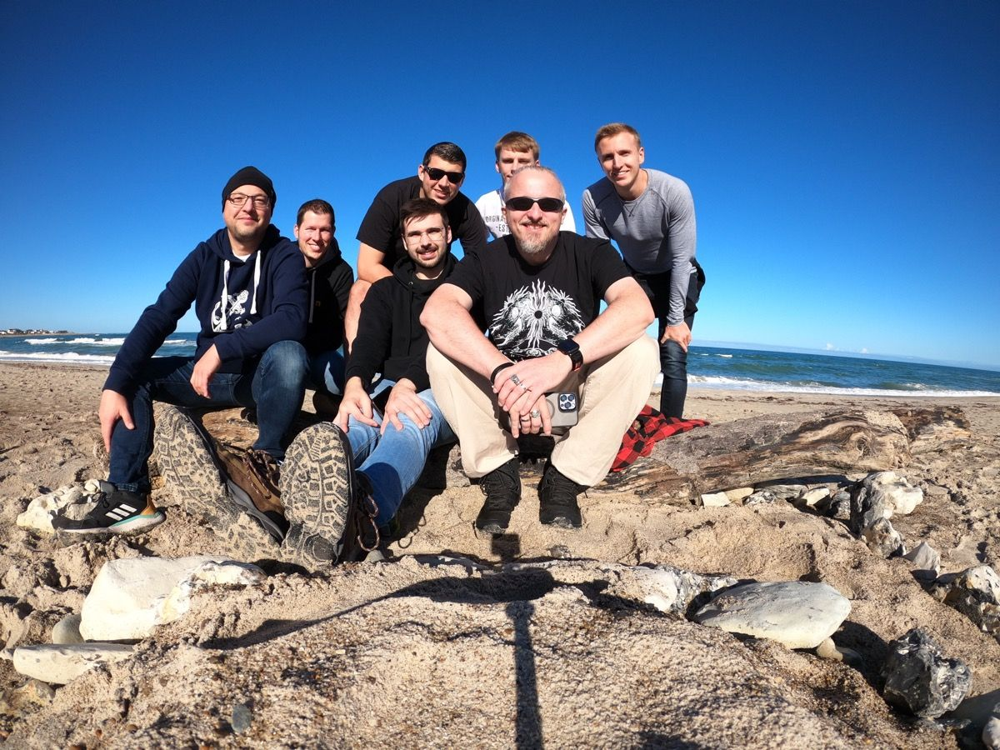
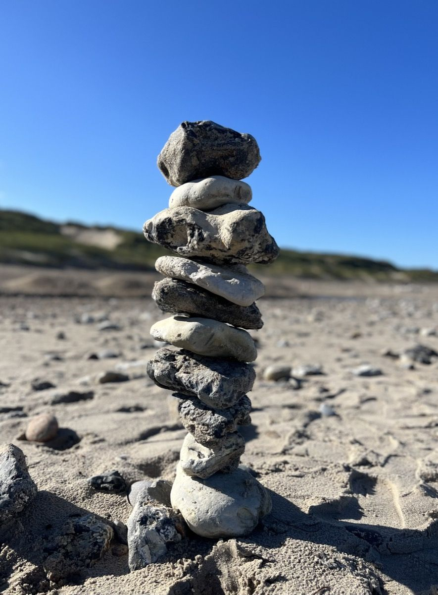
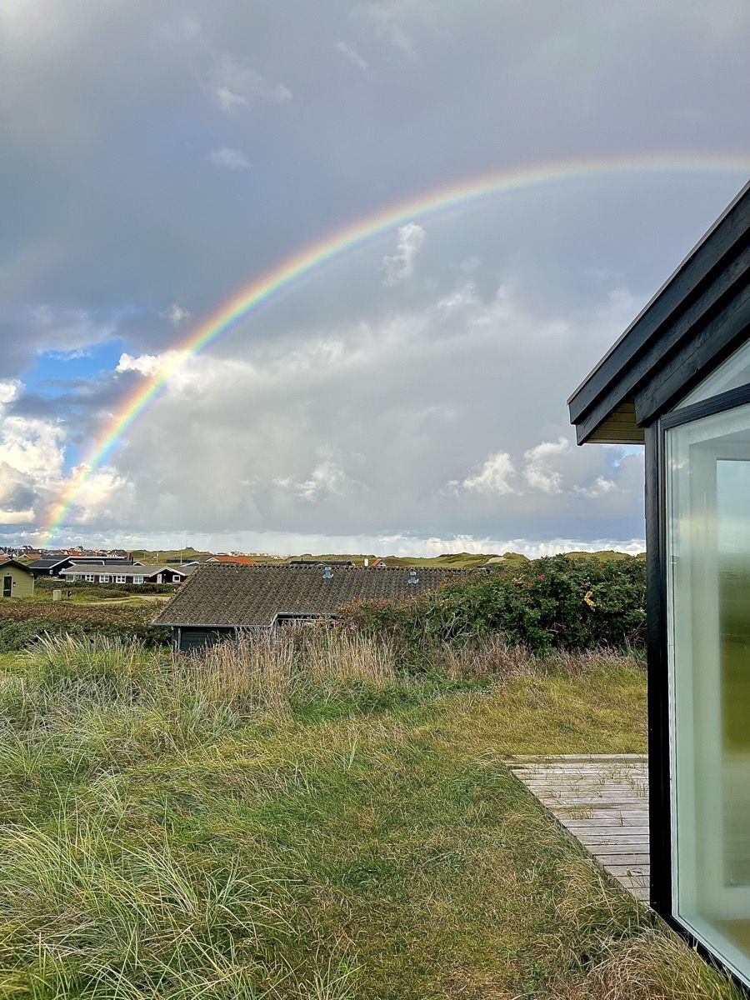

## The pandemic has shown that, sometimes, extraordinary efforts are needed to keep things running. While people separated in many ways, other consolidated to form an even stronger (work-)force, despite the general conditions and underlining Eleanor Roosevelt‘s original citation.

Sometimes, people need a weird idea to achieve something special. After our last team event was rather a remote-playing session with lots of pizza in a dying 2021, the need for something special was long overdue. While there were lots of options, I came to the conclusion that, after two years of pandemic and a quite scattered workforce, it was time for a real, special and unique team event. We didn‘t spend our budget in the first and second quarter of the year so the moment was right to plan something special as everyone has given his best, especially during the eerie years of discovering home office in the pandemic.

## Event-Juggling

The hardest task was to agree upon a mutual date on which our „teambuilding-weekend“ could take place. After this finally happened (believe me, it‘s quite difficult to juggle with the calendars of seven people!) it was my task to do something completely different - no event at a local spot, no dinner: Indeed I searched on Airbnb for an accommodation being able to host this number of people in Denmark. I am a Scandinavia-fan but the site should be within reach (still we drove approximately eight hours) and, after getting the okay from my manager, I finally found a nice spot in Northern Denmark: One weekend, seven people, self-catering: It sounded like a good deal and - anticipating the outcome - it definitely was!

## Moving dynamically

We definitely took advantage out of the free, positive and proactive weekend: No action, no talk, no way was mandatory - everything developed freely in its own unique way and although some parts could have been part of a defined script, we just unwittingly have shown that we somehow form a certain unity: In the office, at the remote workplace or on site in the office where we once got scattered from in the beginnings of COVID-19. Many verdicts in our lives are - more or less - a forced result - this weekend was the pure opposite! No one stayed at home and, despite walking over 13 kilometers on Saturday, the outcome as a whole delivered new thoughts and even - literally - stacking stones as a metaphor for the strong foundation we represent as a team.

Entering the house and arranging everything? Preparing the dinner with a dutch oven and five kilograms of ingredients? Making the breakfast next morning? Teamwork. Going for a small beach-walk that turned out to advance in a there-and-back-trip paired with an ale at the turning point? Check!  Searching for a viewing platform and a museum, turning this search into an adventure of WW2-bunkers and memorials throughout the landscape? No problem! Doing an Echometer-Retro with a decent beer tasting and paired with the following FIFA-event on the big screen? Simple business! And - finally - cleaning up the whole house, preparing everything for the final leave, remembering this weekend as the ultimate charger for things to come? Definitely a welcomed no-brainer!

## What‘s next?

We can’t control what happens tomorrow. We do not know where we are in one year. We don’t know how the market will develop in 2023 and besides all forecasts and requirements, everything will happen dynamically and not in the ways many do anticipate. All we know is that a strong workforce paired with personal friendship and respect can literally move mountains - finally, and, despite all technical aspects, everything (and also the world of IT) is still a people business: Something we should definitely value more in our daily routine and the struggles we encounter in our companies day by day!

It‘s simply all about people!