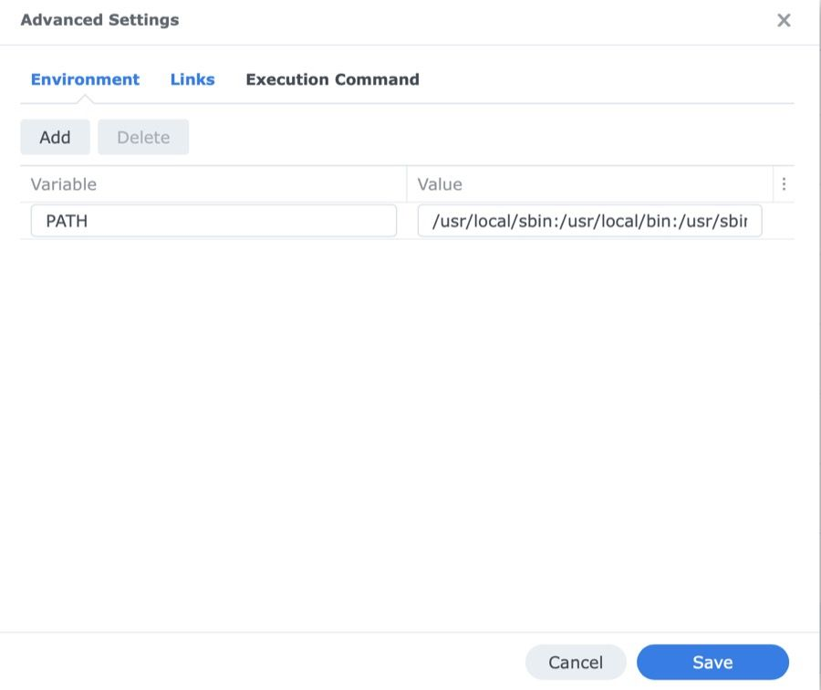
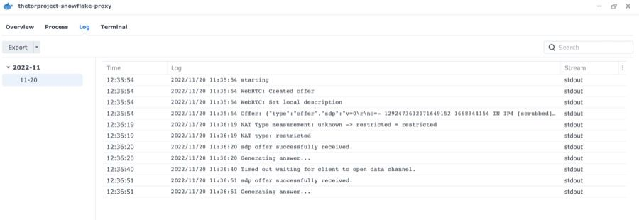

## In many areas, we have unlimited access to the Internet while other regions or single people are blocked from venturing through the web freely. [Snowflake](https://snowflake.torproject.org/?lang=en_US) is a possible solution for anyone striving towards anonymization and bypassing censorship.

Snowflake is a system that allows people from all over the world to access censored websites and applications. Similar to how VPNs assist users in getting around Internet-censorship, Snowflake helps to avoid being noticed by Internet censors by making Internet activity appear as though people are using the Internet for a regular video or voice call. There are numerous tools available that "transform" Internet activity, each using a different technique. Some redirect Internet traffic to appear to be coming from popular cloud providers like Microsoft Azure and Amazon Web Services. Others scramble Internet traffic in order to make it appear completely random - Snowflake takes yet another approach while preserving decentralized anonymity.

There are two sides to every question and for everyone who is browsing the web, [Tor Browser](https://torproject.org/download) on the Desktop and Android or the [Onion Browser](https://onionbrowser.com/) on iOS as well as [Orbot](https://orbot.app/) on Android and iOS are the preferred methods of choice. Having downloaded the different software components, you are easily able to activate Snowflake and also browsers like [Firefox](https://addons.mozilla.org/en-US/firefox/addon/torproject-snowflake/) or all [Chrome-based](https://chrome.google.com/webstore/detail/snowflake/mafpmfcccpbjnhfhjnllmmalhifmlcie) ones provide a plugin to supply a Snowflake-proxy to others without any hassle, enabling the mandatory infrastructure for people who really need the features for whatever reason.

Providing a Snowflake-proxy on DSM
----------------------------------

This short tutorial will show you how to install a Snowflake-proxy powered by Docker on your [supported](https://www.synology.com/en-us/dsm/packages/Docker) Synology-device. After checking whether your model is supported or not (it doesn’t need much CPU-power or networking bandwidth) the only prerequisite you’ll need to take care of is fetching the container and letting it run once the basic install steps have been made.

The process is pretty straightforward and assuming you’ve already installed Docker before and service and GUI are running, log into your DSM and open Docker. Then, choose the „Registry“-pane and search for „Snowflake“ in the search in the upper right. One of the search results should show the official container „thetorproject/snowflake-proxy“. Click on „Download“ and opt in to fetch - of course - the latest build of the container.

Now switch to the „Image“-pane on the left, select your freshly-downloaded Snowflake-image and click on „Launch“ - a new dialog will appear. We may now change the container’s name, give it high privileges when executing it or enable a resource limitation and an auto-restart in case the container crashes. Don’t worry, Snowflake won’t take much resources so we leave this windows with only the „auto-restart“ option checked. As for the network, you may use one of the (possibly) previously created networks or opt in to use the host’s one which I have chosen in my example here.

Next, we may change some environment variables (not needed here), do something network-specific here (not needed either as we have chosen the „Host“-network) or specify an execution command. Below the shown Entrypoint with /bin/proxy, there is an empty line where we should add the parameter „-verbose“ if we want to see any output in the log file or the shell once the container has been successfully deployed. Heading on, we don’t have the need to map external files or folders into the container so we may omit this option here and are - finally - welcomed by a brief summary screen with the ability to confirm all this with the „Done“-button, instantly starting the container.

Verdict
-------

After we have fired the Snowflake-container up, click on the „Container“-pane on the left and then double-click the specific container. An overview will appear, showing how little CPU- and RAM is consumed. To see the output of Snowflake working, you may either have a look on the terminal (be patient, it does take some time for data to appear here) or the log which will instantly show the proxy working with some statistics on opened channels, transferred data etc. - thanks to the „-verbose“-switch when creating the container.

Your Snowflake-proxy is now up and running and with little few resources on your Synology, you’re contributing something good to the big whole.

You don’t need any additional configuration to your local firewall or router (e. g. NAT) as Snowflake handles everything straight from the scratch and with providing these resources, other users on this planet can somehow bypass Internet censorship or similar government regulations and limitations.

It doesn’t need much to provide this service so either you go with this self-hosted solution or with one of the browser plugins, but - by all means - you may help someone needing this network!

Additional information on Snowflake can be found on the official website on [https://snowflake.torproject.org/](https://snowflake.torproject.org/).