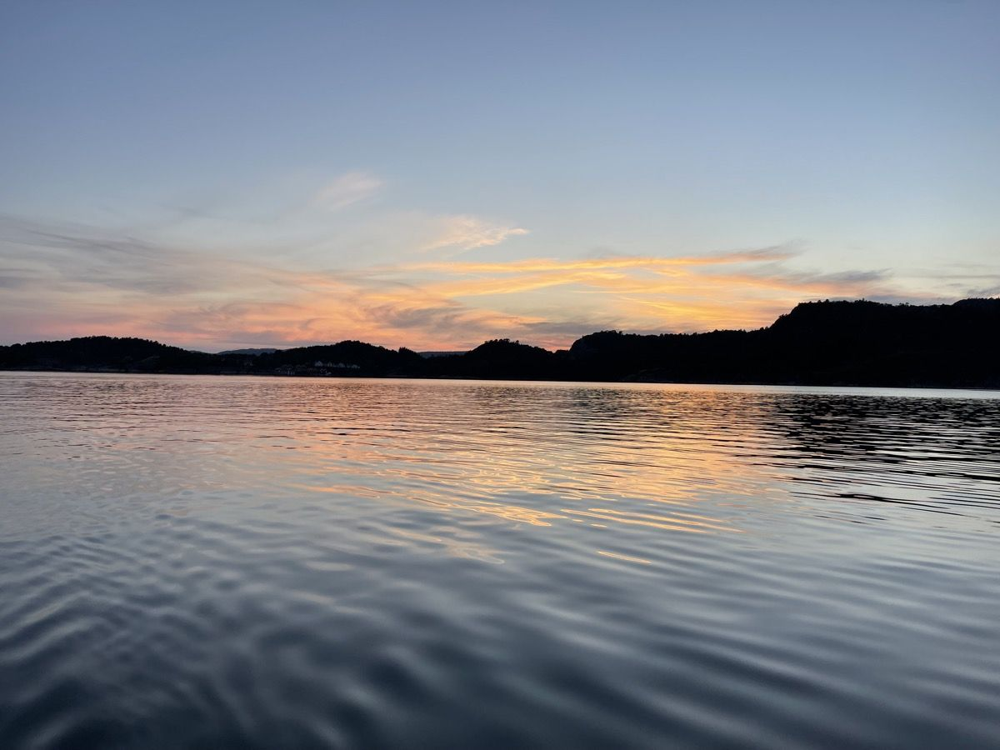
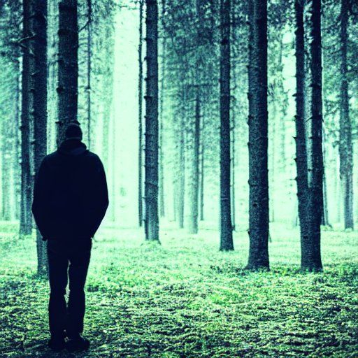
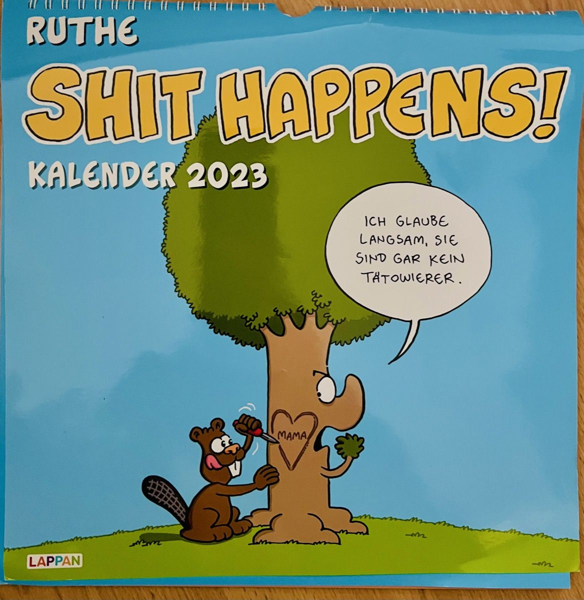
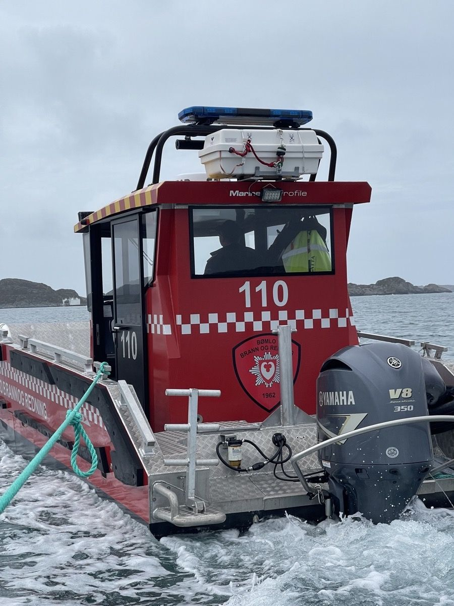

## During the pandemic, a lot of rather moderate things happened in everyone’s life but sometimes you aren’t prepared for additional struggle in terms of human connections coming after the two-year-COVID-streak.

You may have your plan in your daily routine. You may have your plan in your job. Sometimes both worlds collide and leave behind a pile of shards you definitely weren’t neither expecting nor prepared for: A pile of shards harming a long-year friendship and wounding it fatally. By facing such a situation, questions come up - in each moment of silence or solitude, before going to bed or when waking up and - generally - arbitrary throughout the day. Questions like…

…what if…

* friendship besides co-working in the same company was just a delusion?
* opting in for a new job role destroyed this friendship although both parties agreed that nothing could intervene the whole lot?
* the acceptance that people are still incalculable no matter how long you know them is simply brutal?
* thinking that dropping the new role could turn the wheel of time back again while knowing that there’s a crack in this relationship that will stay?
* thinking that switching the company could be an escape to fix something that is broken now?
* realizing that the only bond in this friendship was the common frustration and common issues in the company?
* identifying that, even in your 40s, you can just look in front of other’s heads despite assuming you know the individual behind is just somber?
* realizing that, even in their 40s, other people can ghost you from one moment to the other like a toy town teenager is the utter perfection of shock?
* being ghosted by a friend turns into one of the most terrifying experiences for a grown-up?
* experiencing the friendship’s grade was not that good after being locked out of someone’s life without spoken words or any kind of justification is just horrible?

are currently part of my daily act of thinking and I’d wish I could use these brain actions for more meaningful and productive thoughts.

There are many of them - yet too many and still I don’t know what happened from one day to the other. But, facing my own pride that prevents me to get treated like that without a reason I know of, I’ll respect the person’s wish to finally become the ghost he turned me into. Finally, being cut off from the life as working mates and the private relationship I considered to be a friendship.

Six years seem to be wasted somehow and while you remain silent, all I can do is to ask what I have done wrong and accept the inevitable. You’ve made your choice as a grown-up and you will have your reasons - and I hope you are fine with them, possibly knowing what you have caused and destroyed.

> „When the world turns you away
>
> A friend will not say no 
>
> There is strength that we all have 
>
> It's not the strength we show“

(MANOWAR, „Blood Brothers“)

Some things seem to be broken and it is doubtful if they can ever be fixed again. It’s ridiculous to know a statement like „Never f-uck the company“ in terms of a love affair and reflect this onto a man-to-man-friendship that once conquered Scandinavia and many aspects of business life, bringing success to both. But this is what it is - or why does one party suddenly decide to lock the other one out of one’s life?

Indeed, even 2022 got worse than the two years before and with a situation like this, this year’s end comes near a crap bag imploding into your personal and business life.

> “The truth is, everyone is going to hurt you. You just got to find the ones worth suffering for.“

(BOB MARLEY, seemingly a wise man)

There are always lessons to be learned - and this one was a painful one. And still is. And yet, I am not ready for this experience that comes along this unwanted and unplanned lesson of ignorance and the knowing fact that even close friendships are fragile - even if I had never dared to rate them as such. Fact is: You’re never too old for a new lesson and the „Zero Trust“-approach of modern security can also be a great approach when tying knots in business - and in private!