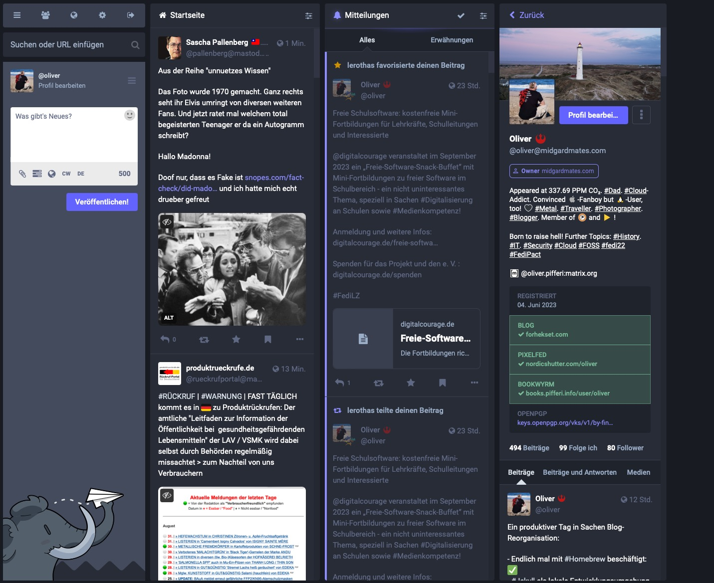

## Whether Twitter is doomed since Elon Musk’s takeover or not (changes for federated services have never been that good!), it’s always an option to think outside the box. One possible alternative already glowing in web for a certain time is Mastodon.

„Strike while the iron’s hot“ could be a big plus for the decentralized platforms that emerge out of the chaos Elon Musk is finally causing at Twitter. One of the winners is surely [Mastodon][1], a microblogging service founded by German developer Eugen Rochko in 2016. Many things of Mastodon remind of Twitter as it was in earlier days and while decentralization and privacy are two key aspects of the service, there couldn’t be any better advertisement for Mastodon than Musk’s personal interpretation of Apple’s „[WeCrashed][2]“-TV show adopted to Twitter in real life.

## The web is broken

First things first, the web is somehow messed up these days. We all know it and while many of us are searching for alternatives, even more still stick with services like Facebook, Instagram, WhatsApp - and Twitter, even though there are alternatives: Alternatives that may be less „fancy“, less famous and not that easy to deploy, but they are definitely worth a closer look as no revolution is started when no one leaves his own comfort zone. I first stumbled upon Mastodon two years ago and played around with the service before choosing to let this project rest for the time being. Earlier this year, I revived my account at a big public instance, discovered what has changed over those two years and - fueled by the Twitter-discussion - set up my own personal instance in really no time.

During the [pandemic][3], many things have changed in the life of nearly everyone. Social media got more attention while people stayed at home and, with the increased usage, the seed for the dark side of information was planted. The world flipped over, [work][4] got more remote or at least hybrid, [superheroes][5] fueling the daily business popped out of the nowhere. Riots stormed the US Capitol, [Russia invaded the Ukraine][6] during a „special military operation“ aka. „War of Aggression“ (as sane people call it) and between everything and the pandemic, social media connected and divided people and cultures alike. The presence of social media platforms increased and got more weight, finally leading to a uncertain status quo where data is still the new gold and, while proving many services for free, the companies behind those were just aiming at personal data.

## My personal journey - relinquishing

I once used to adopt any social media service I could get hold of. After many years, many senseless posts and lots of thoughts, the topic of privacy became a higher ranking in my list of priorities. I read a lot and began to think whether all this is a must because „everyone has those services, too“ or if I can refuse to use the one or other platform in any way. To be honest, it was a tough decision accompanied with lots of discussions with friends and colleagues over the time. Then, finally, in my first step I disposed WhatsApp finally and with all consequences nearly two years ago. The good: My personal impact was quite non-existing even if my aunt asked how she would be able to reach me now - which mirrors our society in the worst-possible way if you ask me.

I’ve got Signal, I’ve got Threema and hey, iMessage is great for Apple-users, too. The bad: You aren’t part of any socialized group dealing with your kids’ school events or birthday party plannings but I can live with this as there ARE alternatives. Surprisingly, people still complain nearly two years after deleting (!) my WhatsApp-account that they’ve sent me something, asking why I don’t answer - but this is yet another story to be told. [Facebook was next][7] and on November 7th, 2021, I finally made the step and left the platform. Too much ads, crippled and dazzled timelines and no real actions against complaints, incidents and spam accounts drove me to let loose here, too - and today, one year later, I don’t miss a damn thing. Of course you’ll still have to somehow justify that you either don’t use Facebook or WhatsApp which makes people staring at you like a freaking alien - but the outcome is worth the price…

## The Twitter-story

This October marked by 12th consecutive year with Twitter - and it was the last one with the option to let my account die slowly or completely wipe it after exporting my Twitter-archive. I mainly used the platform as a news aggregator (love the lists I created over the years) and to spread info on my few blog posts. During the pandemic, it was one of the sources that combined news from all over the world but also personal accounts with similar opinions and things I am interested in like other tech blogs, privacy or political parties like German Pirate Party. Alas, during the pandemic, I found myself into a whirlwind of emotions that often weren’t positive and while the world around us collapsed into pieces, my own turmoil lead to a mood that wasn’t healthy.

Garnished with increasing numbers of commercials I was sucked into the dark side of Social Media once again - something I discovered with Facebook already. Apart from seeking information, the algorithms often discovered topics that seemed to be similar but, after following these trends, turned out to paint an even more depressive state of our world. Getting the essence of information got more difficult and I finally discovered that Twitter seemed to deliver more negative than positive things for whatever reason. Then the rumors with Elon Musk started and everything imploded this autumn, showing that a service which is, virtually, a digital standard nowadays, shouldn’t be in control of a single person acting like a big child, being unpredictable and moody with each new day to come.

Over the last weeks and months, this impression has strengthen somehow as Musk has reactivated Donald Trump’s account as well as [locked down many accounts of reporters (and unlocked them again)][8] or „uncomfortable“ people that dare to criticize  what he is doing with the service in general. Juggling with (paid) blue checkmarks followed and Twitter’s status quo seems to be depending on the mood of someone suffering a Napoleonic complex, no matter what he does with Tesla or other companies (which I still consider to be interesting on a technical basis). The way he acts with Twitter, the accounts being revived (or blocked) randomly definitely show that no one can be sure what happens next on this central platform - [even when calling out to „prosecute“ Dr. Anthony Fauci][9]. Did you try to link to a Mastodon- or Pixelfed instance from a Twitter-profile or just mention the hashtag? Well, Elon vetoed this as well - so far in terms of freedom of speech - the same counts for the search in the meantime if you don’t want to pay for Twitter.

To be honest, Twitter had its problems but I bet Jack Dorsey [regrets][10] what develops out of his former „baby“ in the meantime. There IS a real chance for competition this time and Mastodon could be one minus the aspects that makes Twitter an unpredictable platform these days, even destroying the right of free speech and freedom of press.

## Discovering Mastodon - once again

In the turmoil of the „Evan-plays-Twitter-chess“-game which offered insane decisions day by day (laying off 50% of the workforce was just topped by the 11,000 people getting fired from Facebook a short while ago), it got more and more conclusive that the days of centralizing Big Tech may finally be over. Giving the power of a service used by millions of users into the hands of one freakish person can’t be justified anymore and although we all expected this to happen, the astonishment that Musk’s clown actions are indeed turning Twitter into a dead donkey is still amazing in a negative way. The need for decentralization, for real moderation apart of algorithms, rose in enormous metrics - and now, after being „just an Open Source alternative for Linux-freaks“ (as a colleague of mine labelled Mastodon two years ago) in the past, Mastodon is on the rise and with the power of the masses finally striving for a change in Social Media, times may change.

It takes its time to label „Tweets“ as „Toots“ as Mastodon tries to call them and, without following the proper accounts, it can either be quite silent or - if following the federated or even local (server-) timeline - really overwhelming. Once you have settled there ([and found an instance possibly reflecting your interests][11]) you are ready to go and it’s astonishing to see how many persons of interest, government institutions or companies have joined the Fediverse in the meantime - or have already been there. Besides reflecting the „nearly-lookalike“ of Twitter, feeds are based upon interests, hashtags (which reflect those interests) and people you follow: The approach is different as your timeline won’t be flooded with algorithms or trending topics.

Mentioning this, Mastodon is somehow „quieter“. Although the flood of people turning from Twitter is immense and I have indeed focused on likes, re-Tweets and gaining followers there, I had to adopt yet another different style of social media: Really interacting with people reacting on my posts at eye level. Criticism is welcome but there is no toxic atmosphere which can, of course, be the new zest but the treatment between each other is simply different straight from the beginning. Maybe this is caused by choosing the proper basic instance probably reflecting individual attitudes, maybe it’s just a basis of thing people have learned since Elon Musk took over at Twitter, accelerating the obvious, namely the platform with its long-term problems focused on the acting of a single individual.

## The chance for the Fediverse

Mastodon won’t be a magic bullet for everything, neither the Fediverse will be. Especially these days, the platform is facing a growth that no one expected. The biggest plus, the flexibility and scalability, is also the biggest threat for the few well-to-do instances and so federation is the key - once again. Those instances being there from the beginning, like mastodon.social, have already discontinued the ability to register new accounts, instead it is recommended to maybe turn to a smaller, well-known instance for scaling.

Besides, The Washington Post [tells the people how to start with Mastodon][12] while [The Wall Street Journal writes about what Mastodon is and how it may be used][13] after Mastodon’s official Twitter-account was suspended by Mr. Musk. In the meantime, some of the blocked journalists also [turn from Twitter to Mastodon][14], terminating their existence on the bird site. The times, they are changing and while Mastodon was a „software for some Open Source-nerds“ before (many people I know entitled it as such), its background and mere existing are fully justified around the globe now.

Everyone can join a server, [everyone can set up a server with an own instance][15] and federate with other ones to take part in the Fediverse and the preferred topics. Mastodon may be around since October 2016 but with Twitter crumbling into pieces just because of a single person, there is enough tail wind to change the world of social media for good. While over all the years, there were single services like Facebook (do you know [Friendica][16]?), Instagram ([Pixelfed][17]) or Twitter centralizing the single data, the wind is veering and the decentralized services could fix what has been broken over all the years. With the ability to move your profile and followers from one instance to the other, there is no lock-in in the Fediverse and all the platforms can talk to each other as they are based upon the [ActivityPub][18]-protocol.

## Decentralization is the key

While also many companies are saddling up and joining, people see that the change is imminent and not just coming but already existing. While the Fediverse grows, it will of course face the challenges of growth and regulation (every single rule depends on the server’s administrators and their willingness in many controversial discussions) as well as security. Besides, it shows that the focus on concentrating everything on centralized services has made many social media platforms turning into springboards for hatred, racism or mobbing. The intellectual challenge is there and I am quite keen to see how Mastodon and founder Eugen Rochko will face this together with the federated Mastodon-instances all over the globe.

Fact is: With buying Twitter and forcing the pace paired with senseless decisions, arbitrariness and being an ego-maniac while simultaneously disposing workforces as well as security, Elon Musk did a disservice to the Fediverse. It won’t ruin Twitter for now and instantly, but he lead the service astray and strengthened the competition that is more than just „Open Source software for geeks“ these days. We may be curious what to further expect in 2023 but the cards are scrambled and if there has ever been a catalyst for the ActivityPub-protocol and services like Mastodon, it was Elon Musk.

[1]:	https://joinmastodon.org
[2]:	https://tv.apple.com/us/show/wecrashed/umc.cmc.6qw605uv2rwbzutk2p2fsgvq9 "Watch WeCrashed | Apple TV+"
[3]:	https://blog.pifferi.info/goodbye-2020-it-just-wasn-t-a-pleasure
[4]:	https://blog.pifferi.info/is-our-post-covid-working-life-here-to-stay
[5]:	https://blog.pifferi.info/thank-you-not-all-superheroes-have-capes
[6]:	https://blog.pifferi.info/the-only-thing-we-have-to-fear-on-the-planet-is-man
[7]:	https://blog.pifferi.info/i-finally-escaped-facebook-and-i-am-happy-with-that
[8]:	https://www.washingtonpost.com/media/2022/12/17/musk-twitter-journalist-suspension-media-react/ "Musk reinstates reporters on Twitter. Their companies, though, never ..."
[9]:	https://news.yahoo.com/white-house-musks-attack-fauci-063856883.html "White House: Musk's attack on Fauci is 'dangerous'"
[10]:	https://www.cnbc.com/2022/12/13/jack-dorsey-admits-mistakes-at-twitter-says-site-still-has-problems.html "Jack Dorsey admits mistakes at Twitter, says site still has problems"
[11]:	https://fedi.directory/
[12]:	https://www.washingtonpost.com/technology/2022/12/17/how-to-join-mastodon/
[13]:	https://www.wsj.com/story/how-to-use-mastodon-the-social-media-platform-blocked-by-elon-musks-twitter-7751455f
[14]:	https://mastodon.social/@tiffanycli/109521975075886371
[15]:	https://docs.joinmastodon.org/admin/install/
[16]:	https://friendi.ca/
[17]:	https://pix.norse.social/oliver
[18]:	https://activitypub.rocks/