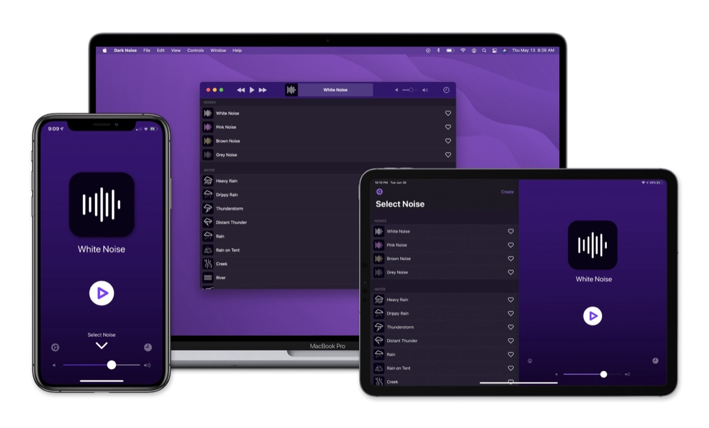
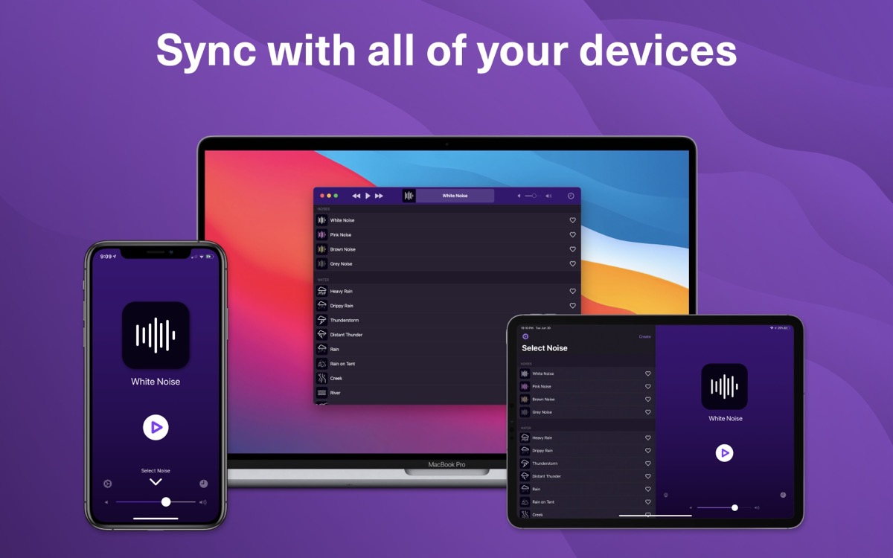
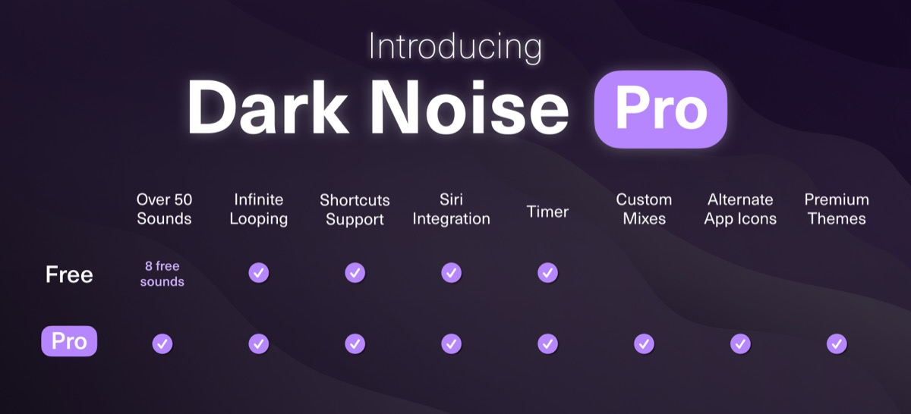

## When Anthrax released their famous album „The Sound of White Noise“ back in 1993, aiming for silence and harmony wasn’t the main focus. Today, Dark Noise is a tool willing to phase down the pace of everyday life by providing natural sounds on all Apple-based OSes, striving for calmness.

With noise, permanent office talks and similar sounds all around it’s difficult to focus on anything. I often discover myself to be simply fed up with senseless conversations (just to talk anything at all) or permanent muttering all around: Especially if you’ve got kids of nearly all ages, there IS always a variety of sounds all around preventing from focusing on anything. I like the expression that „a lot of people think I’m unhappy because I’m quiet“. In fact I'm not unhappy, I just appreciate silence in a world that never stops talking!

Having this in mind, Dark Noise, which has recently been released in Version 3.0, closes the gap of just isolating yourself from the noises outside - for a variety of reasons. The app itself has a certain history - v1.0 was released in August 2019 on iOS, v2.0 followed in July 2020 with mixing capabilities and the feature of syncing these mixes via iCloud to each device associated with the specific Apple-account. In May 2021, v2.5 finally made the step to the Mac



and these days, version 3.0 was released, introducing of a free tier. This includes access to eight free sounds as well as full support for infinitely looping sounds, Shortcuts, Siri integration, and the Timer-feature. The app itself is built pretty straightforward - developer Charly Chapman is, by his own words, building software for eight years and pretty new to the iOS-scene. Putting this aside, the level of maturity on Dark Noise is quite impressive as the main goal - providing environment sounds - can be achieved without any hassle: Browse through the list, pick your sound and enjoy!

While each sound stands for his own, I especially like the mixing feature: Putting beach and seagulls together, I combine my own favorite and mind-tranquilizing scenario at ease! Everyone of you liking windy trees together with some kind of rain and crickets can mix this as well - and even if you like the soundscape of a coffee shop with a construction side nearby paired with the sound of a city street, you will be able to make up the preferred sound setting.

Charly Chapman is also providing the possibility of either [request a specific sound](https://tally.so/r/wAzPGk "Request a New Sound Form") to be added to Dark Noise or [request a feature](https://tally.so/r/wdEq4A "Request a Feature Form") while providing support to all additional questions besides the [FAQ](https://darknoise.app/help) by E-Mail. In my personal use case, I often stumbled upon apps that were aiming towards providing sound sets to calm down, relax, re-focus or just turn away from the classic Apple Music- or Spotify-based playlists. Many crossed my path but Dark Noise is definitely here to stay: Apart from the variety of sounds, there are two features that I would personally consider as unique selling point: The mixer and the iCloud-sync which even enhance the custom mixes by simply putting them on my iPhone and iPad after I have created them on my Mac. Also the Siri-integration or support of Shortcuts is a big plus that raises Dark Noise above the common masses.

Dark Noise 3.0 is available on Apple’s App Store to [download](https://apps.apple.com/us/app/dark-noise/id1465439395 "download for free") for free. Dark Noise Pro is currently available for 2,99 EUR a month, 22,99 EUR a year with a 3 day trial, or a one-time-purchase for 59,99 EUR while the US-Dollar prices slights vary. According to the App Store and the developer’s privacy policy, no data is collected during the usage of the app - by June 2020, Firebase-and Crashlytics-reporting and analytics have been removed from the app and anonymous TelemetryDeck-analytics can be opted-out from within the app. 

The pricing is okay and fair, especially if you go with a yearly plan - and, according to your use case, the one-timer may also make sense in terms of supporting an indie developer which once had a great idea and has now made all the proper steps to be successful with Dark Noise on all major Apple-based platforms!