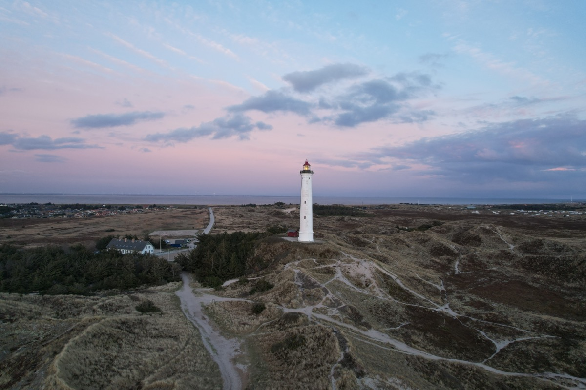

## While the past is gone and the future still is still ahead, Abraham Lincoln’s famous quote can be a synonym for a proactive way of influencing events that are still ahead.

I’ve pulled the plug. After months (summing up to years?) of anger, desperation, lack of perspective, sluggishness, avolition and familiar impact in terms of health and [death][1], we finally made it to Denmark (a long-time goal on our family’s holiday shortlist) with the kids to create a distance between the daily [burden][2] - at least for a single week. Although being to Denmark before, the country was more or less a „jumphost“ for our ventures to Norway. This time, it gets at least a one-week-attention with the family-focus on it.

Time to recharge, time to refocus, time to get away from everything that is harming the everyday’s life. For me, there is no better cure than the sea and especially (especially, especially!) the sea. All sorrows are gone if I venture to the beach, sit down there and enjoy the grace of weather, tide and the sand there. While time is seemingly stopping, my inner self comes to rest and gets time to reflect many, many things. The life is different near the sea and the everyday-disturbances you know from your hamster running wheel at home are simply gone and forgotten.

There are decisions to made in the near future and decisions that have already been made to get back on a track in certain situations.  As I am the kind of human who judges by pro- and contra-arguments, there are always aspects weighting in for one side or the other but when I opt in for one, it’s a final decision and - usually - turning back isn’t on my agenda. Basically, you will never know what you get with each decision but - on the other hand - won’t ever make the experience what could happen if you never dare to decide anything.

While thinking about the future in the one or other aspect, life focuses on my family, my wife, my kids and hobbies which never get the attention they usually deserve. Re-gaining this focus, I find the time to create my own future in a certain way. Not all parts of my life will be affected, but there is a time for new challenges and moving on. Therefore, a precise prediction of my future in all aspects remains (of course!) uncertain, but getting actively involved into its creation may stop the hamster wheel and open a door while another one will be shut in the short term. Sometimes and occasionally, opportunities that needs to be grabbed simply stumble upon your way, giving you a new perspective!

Don’t wait for your future to be created by you. Take the time to re-focus, „pull the plug“ and think about the things that are good for you - and sort out those aspects that aren’t. Often it just needs a specific distance to find a solution - and someone with a helping hand and a perspective, clearing things up. You won’t play an active part in the way the universe works, but you can put the things on the right track to somehow benefit from it: Both your personal wellbeing and your family will be grateful for that proactive attitude towards changing your own’s future!

[1]:	https://forhekset.com/posts/Death-smiles-at-us-all-a-man-can-do-is-smile-back/
[2]:	https://blog.pifferi.info/goodbye-2020-it-just-wasn-t-a-pleasure