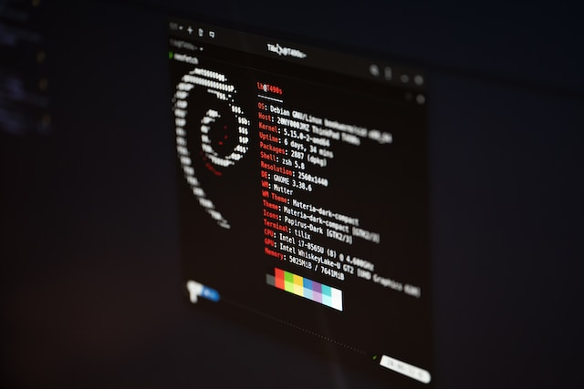

## Yesterday, the latest iteration of Debian Linux in version 12, codename „Bookworm“ was [released](https://www.debian.org/releases/bookworm/). Everyone of you thinking that a direct upgrade to the new system is essential at this early stage may do so as many package have been updated.

Amongst them was PHP so that other repositories aren’t necessary anymore for the moment.

Alas, with great power comes great responsibility so you should know what you are doing, not caring if you use Debian for private usage or as the strong foundation for server-based services like I do: First of all, backup your valuable files, snapshot the virtual machine or do a full backup your environments with trustworthy solutions like [Veeam](https://www.veeam.com/de/linux-backup-free.html). Although the update-process is pretty straightforward and [documented](https://wiki.debian.org/DebianUpgrade), things may happen and break your environment or specific services so the motto should always be „backup early, backup often“. Apart from that, you can pursue the following steps to bring your system from Debian 11 „Bullseye“ to Debian 12 „Bookworm“:

## Update Currently Installed Packages

Before starting the release upgrade, it is recommended to update all your currently installed packages to their latest versions. This is something you may already do regularly but it’s essential to take care of this before this version upgrade. Packages marked as „held back“ cannot be automatically installed, upgraded or removed. This may cause issues during the upgrade process which we try to bypass. To check whether there are held back packages on your systems or not, just run

`sudo apt-mark showhold`

If there are any „on hold“-packages, you should either unhold the packages with „sudo apt-mark unhold packagename“ or make sure the packages will not interfere with the upgrade process itself. After3wards, we need to refresh the packages-index and upgrade all installed packages just as it is done everytime:

`sudo apt update`
`sudo apt upgrade`

You may also run „apt full-upgrade“ to perform a major version upgrade of the installed packages and simultaneously remove some unnecessary packages by using

`sudo apt full-upgrade`

Finally, we want to get rid of some garbage aka. automatically installed dependencies that are no longer needed by any package:

`sudo apt autoremove`

## Upgrading Debian 11 Bullseye to Debian 12 Bookworm

First, we need to reconfigure APT’s source-list files so that only the „Bookworm“-repositories will be used in the future. To do so, you can either open the /etc/apt/sources.list file with your text editor and replace each instance of bullseye with bookworm and bullseye/updates to bookworm-security. If you have other source-list files under /etc/apt/sources.list.d, you must update those sources, too.

The default file /etc/apt/sources.list on Bullseye looks like this:

Alternatively, before choosing to manually edit those files, we can also make use of Linux’ „sed“-command and let the following three lines handle this for us:

`sudo sed -i 's/bullseye/bookworm/g' /etc/apt/sources.list`
`sudo sed -i 's/bullseye/bookworm/g' /etc/apt/sources.list.d/*.list`
`sudo sed -i 's#/debian-security bookworm/updates# bookworm-security#g' /etc/apt/sources.list`

Once Once done, update the packages index from the new repositories for the first time by using the command

`sudo apt update`

If there are any errors or warning messages related to a third-party repository, try fixing the issue or disabling the repository as it may prevent a successfully upgrade (or make it at least a little bit more complicated). Then, start the system upgrade by finally upgrading the installed packages. This will upgrade only those packages that don’t require any other packages to be installed or removed and is executed by the well-known

`sudo apt upgrade`

You will be asked if you want specific services being restarted during this upgrade - this may lead to a short service interruption for the restart-process so if you are, for example, updating your SSH-config, be sure that a service restart doesn’t interrupt your session. In this case it’s always better to use the hypervisor-based console or the monitor attached to the bare-metal-system you may update!

Furthermore and during the upgrade process, you may also be asked various other questions, like whether you want to keep an existing configuration file or to install the package maintainer’s version. Please read the information carefully and if you never made any custom changes to the file it is safe to type „Y“. Otherwise, to keep the current configuration, enter „N“ - in my case, existing configurations for NGINX or SSH were kept the ways I have customized them. Depending on your Internet-connection and the amount of packages being updated, the upgrade process may take some time.

Finally and after mastering this stage, execute an „apt full-upgrade“ which will perform a complete upgrade of the system, install the newest versions of the packages, and resolve the dependency changes between packages in different releases. This will upgrade all packages that were not upgraded with the previous command and put everything else in the proper order.

## Cleaning up and going live

After going through the previous steps, a

`sudo apt autoremove`

will clean up unnecessary packages and a final reboot with typing

`sudo systemctl reboot`

finally takes care of getting your upgraded Debian 12-system online so that you can check whether everything is running fine - or not (followed by a certain troubleshooting).

Once back again, you can check the status of your freshly-upgraded system by typing

`uname -a ; lsb_release -a_`

which should finally show you a running Debian 12 Bookworm and a Linux 6.x-kernel running underneath.

## Verdict

We successfully managed upgrading from Debian 11 to Debian 12 which is a quite easy, painless and reliable process once all prerequisites are met although a backup or snapshot should always be in reach for the one thing that goes down according to Murphy’s Law!