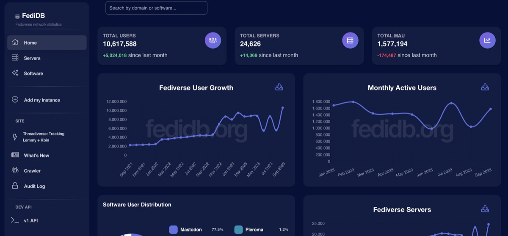

## When I once discovered Mastodon, the Fediverse was already a nice approach in helping to rebuild the polluted Social Network-landscape.

But, based upon the [ActivityPub](https://www.w3.org/TR/activitypub/)\-protocol, Mastodon isn’t the only player giving hope for federated and decentralized networking. After going with my own Mastodon-instance, I also discovered two additional great services that are valuable additions to the Fediverse - and I don’t want to withhold those from you in case you are interested in learning more about those!

## Pixelfed

After finally dumping Instagram in December 2022, I went all in with [Pixelfed](https://pixelfed.org/): After discovering this service in early 2021, I  already tried to free myself from the bounds of Instagram but - let’s be honest - Pixelfed wasn’t ready to follow in Instagram’s step then. The basis was okay and considering the project to be work in progress - and albeit the „little“ version 0.11.6 at the time of writing - the software created by [Daniel Supernault](https://pixelfed.social/dansup) has heavily progressed over the time. I returned in late 2022, played around and finally created an instance that was playground. Later, it got dumped and on April 21st, my latest instance [nordicshutter.com](https://nordicshutter.com/) has opened its gates, welcoming people from Scandinavia and people loving the Scandinavian way of life and the nature there. While the server itself ist hosted in Nürnberg, all media assets are stored in a Wasabi S3-bucket in Frankfurt so no data is being stored or processed outside Germany. Finding the proper way of S3-integration took a while but, over the months, has turned into a solid base for storing media files.

Thus spoken, Pixelfed is still a project under heavy development, but frequent commits are made on [GitHub](https://github.com/pixelfed/pixelfed), the community is open-minded and various ways of participating are possible, with Dan always being somewhere besides the coding activities, always going with a hint or a helping hand. Once you don’t want to go with an own instance (it still may be tricky if you build and maintain from the scratch if you don’t exactly know what you need to do and in which order things should be done), you can always opt-in for one of the more or less known instances. With choosing the instance you like or which may best reflect your needs and interests, the ActivityPub-aspects of Federation and De-Centralization are put into the focus - just like we know it from Mastodon  - finally leaving Instagram isn’t the big problem anymore.

## BookWyrm

BookWyrm is a solution also built on ActivityPub and a great successor for LibraryThing or GoodReads. By using the protocol Mastodon, Pixelfed and many other are running on, it inter-operates with different instances of BookWyrm and other ActivityPub compliant services. This means you can run an instance for your book club and still follow your friend who posts on a completely different servers with different, book-related collections. It also means that your friend on Mastodon can read and comment on a book review that you post on your BookWyrm-instance.

A long time ago, I used to track my books with a Desktop-based Mac-software named [Bookpedia](https://www.bruji.com/bookpedia/). With the relevance of classical apps decreasing and people rather turning to online services, Bookpedia somehow fell behind. Besides myself listening more to audio books than actually reading those (a trend I even consider to be nasty from my own point of view), also the development of Bookpedia seemed to slow down and so the latest iteration 6.2.1 was released by the end of 2021. As times have changed, LibraryThing or GoodReads as modern Internet-based services popped up but when BookWyrm came along, the mixture of self-hosted data-control, ActivityPub-integration and connection to other instances for book background data like ISBN, ASIN, cover artwork etc. made it a no-brainer.

Without the basic purpose of just cataloguing my bookshelves, I checked out the „mother instance“ [bookwyrm.social](https://bookwyrm.social/) and after fetching the look and feel of BookWyrm and because of already hosting my own [Mastodon](https://norse.social/@oliver)\- and [Pixelfed](https://nordicshutter.com/oliver)\-instance, I went to spin up my [BookWyrm-instance](https://books.pifferi.info/) as well! The [docs](https://docs.joinbookwyrm.com/) are written pretty straightforward and despite my love for Docker-based deployments, I went with the non-Dockerized version this time, paired with the same Wasabi-powered S3 storage backend that also fuels my other ActivityPub instances. That being said, BookWyrm is an ideal and modern approach towards a book-reading- and tracking-based service that supports ActivityPub. With following my account on BookWyrm, my friends and followers on Mastodon see what I am currently reading (or listening!) and besides, I finally can track my own reading behavior and the (audio-) books I own!

## Verdict

Rarely before I have felt such passion and joy when talking about new trends in the Internet during the last years - or what’s left from the original Internet as it once used to be. With Federation, De-Centralization and growing independence from Big Tech and learning from (at least) Twitter’s demise many people have realized that things must change - and a real change was long overdue. Maybe we don’t need the ad-polluted streams of the common Social Media anymore - maybe we don’t even need the overloaded content there anymore. Maybe stepping back to a more curated, smaller account of contents is the proper way of turning Social Media back to something we may use instead of being the product?

Alas, with great power comes great responsibility and so the moderation of instances (as long as you don’t use a single-user-instance just for your own joys) is a frequent topic within the current growth. Without centralization, there is no single instance taking care of that so it is especially within the responsibility of the instance’s admin to take care of unwanted content or spam etc. - if you like it or not. Based on this, everyone should wisely choose the mother instance of the single services and weight in if the server rules appeal to the specific user’s imagination. While ActivityPub makes its way throughout the web, also the interoperability between instances is still a challenge: While Mastodon at least offers the options to move an account to another domain, this option and especially contents like likes, media etc. are still to be integrated in Pixelfed and BookWyrm - the goal: No one wanting to switch to another instance should start from zero or manually repost everything (which is, experienced by myself, a torture!) piece by piece.

Apart from that, the Fediverse is growing and there are lots of products waiting for us to discover them. Pixelfed-founder Daniel Supernault is also taking care of [FediDB](https://fedidb.org/), a project summing up statistics for the Fediverse and the single software solutions empowering it. There is a [big amount of software available and many platforms](https://fedidb.org/software) are waiting for new users - by using the ActivityPub-protocol, all these single places can talk to each other, like posts from other platforms and even boost those. Less poison, less hate, less misunderstanding and the connections between single software components founded on the ActivityPub-protocol are about to revive the „classic“ Internet from earlier days and I hope that this trend will get strengthened, opening the door for a decentralized social media of many kinds apart from the Big Tech-monoliths that somehow seem to be rather old-fashioned and boring when being compared to this movement of modern, federated Social Networks in the internet of the 2020s!

If you’re interested, feel free to find my profiles in The Fediverse on

Mastodon - <https://norse.social/@oliver>

Pixelfed - <https://nordicshutter.com/oliver> and

BookWyrm - <https://books.pifferi.info/@oliver>

and let’s follow or connect with each other!