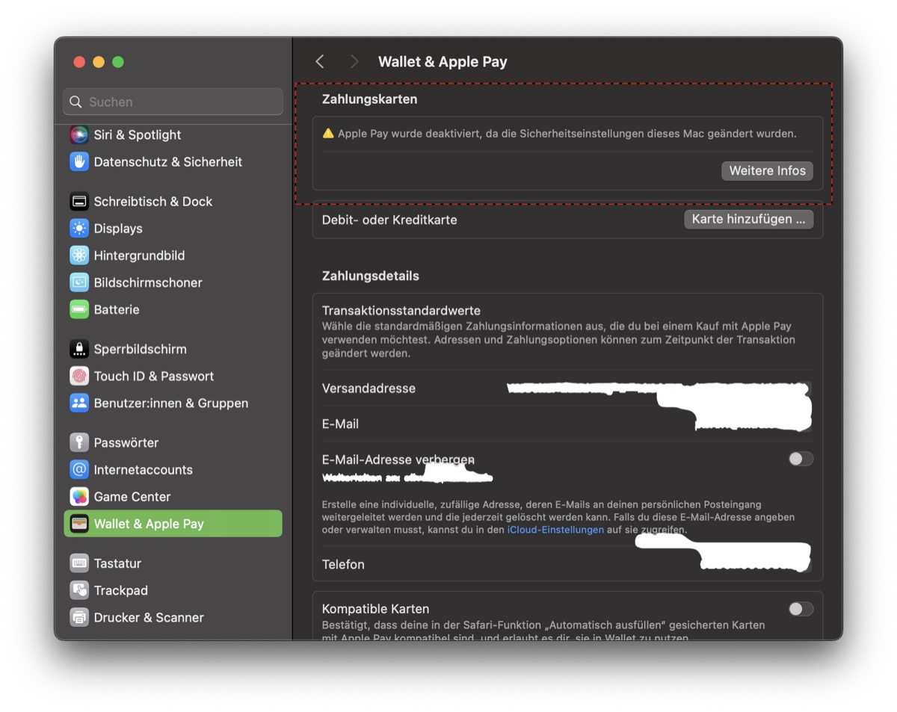
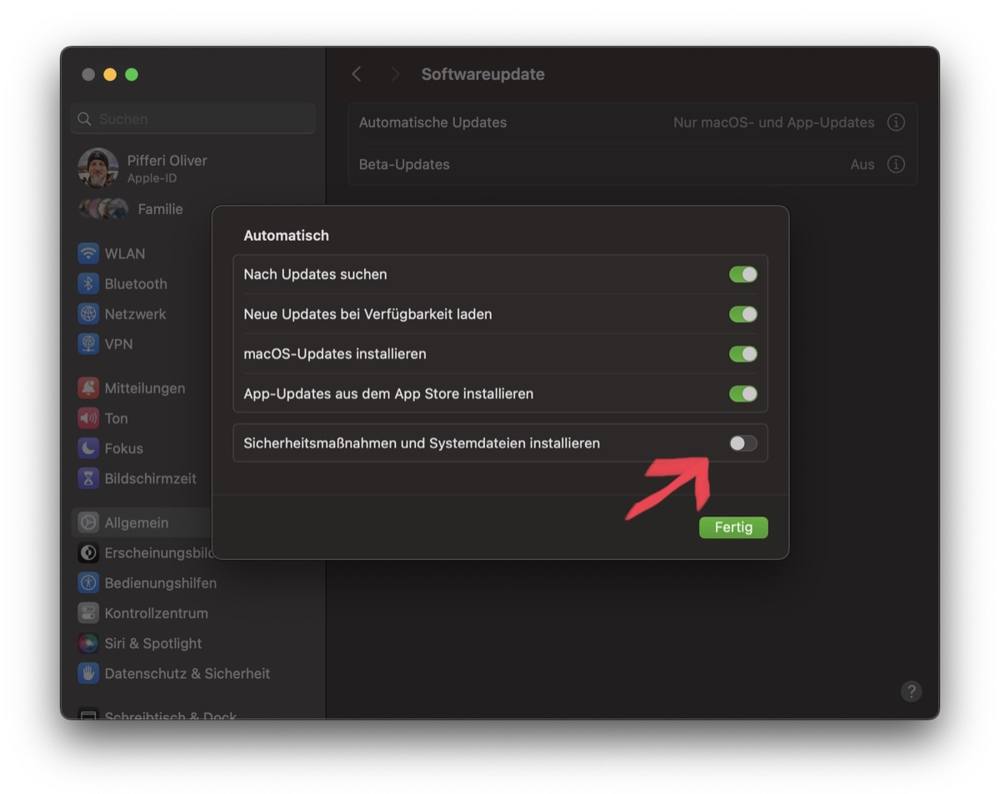

## There aren't many glitches with macOS in my common use cases but lately and after migrating my user from one Mac to the other, I realized that, seemingly, Apple Pay was deactivated for whatever reason.

Although FileVault was enabled and my fingerprints were registered for use with Touch ID, the message "Apple Pay has been disabled because the security settings of this Mac were modified" appeared when trying to add my credit cards to Wallet/Apple Pay on the new device. This error appeared the first time in connection with the Migration Assistant on macOS Ventura 13.0 and moved on to Sonoma 14.0 while Internet sources tell it has already been around since 2020 so this issue may not be that new.

The solution is as astonishing as straightforward and may be fixed in a different setting one may expect: After some research, many users reported that it has something to do with the state of macOS-related updates. Indeed, going to Software Update/Advanced and unchecking the "Install system data files and security updates"-option with enabling it again shortly afterwards, this problem was fixed in no time. Apparently it appeared when moving one user account to a new machine, telling the system that something has been happened to the security hardware underneath (which was the fact).

Finally, the reason for this issue to appear is reasonable but the way it can be fixed is somehow confusing. Besides this, the workaround must be done using an account with administrative permissions - as I tend to have one administrator on my devices while working with a standard user, this may be helpful as well: As a standard user, you can disable and enable the "Install system data files and security updates"-option and authenticate with the administrative account but this won't erase the error - you'll have to perform these steps with the local administrator of your Mac!