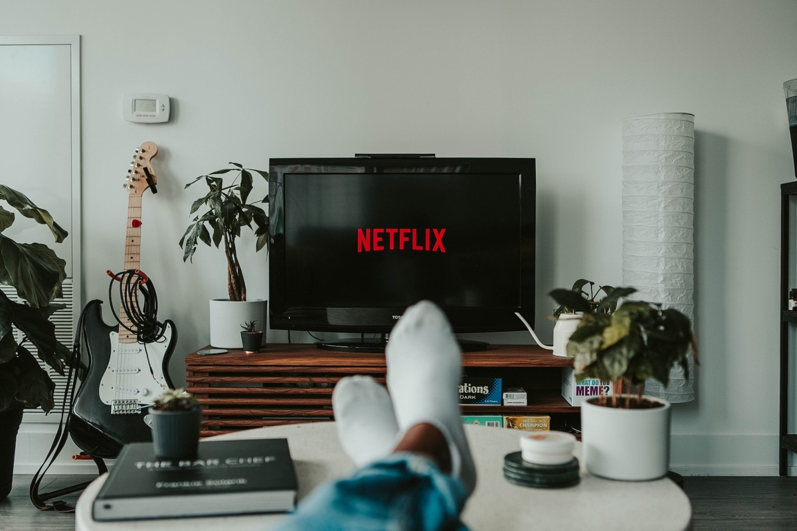
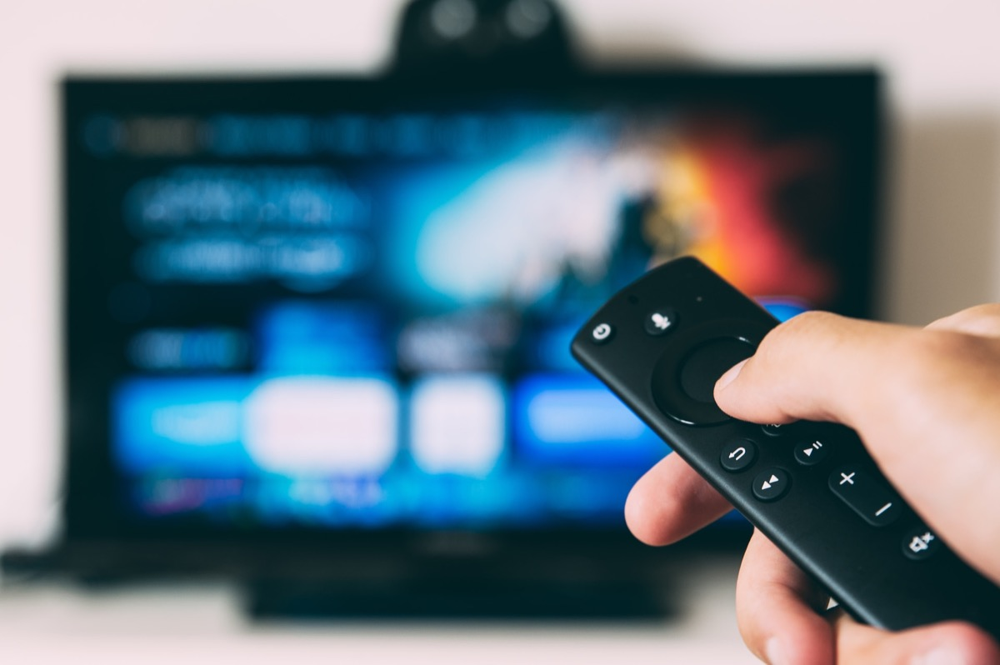
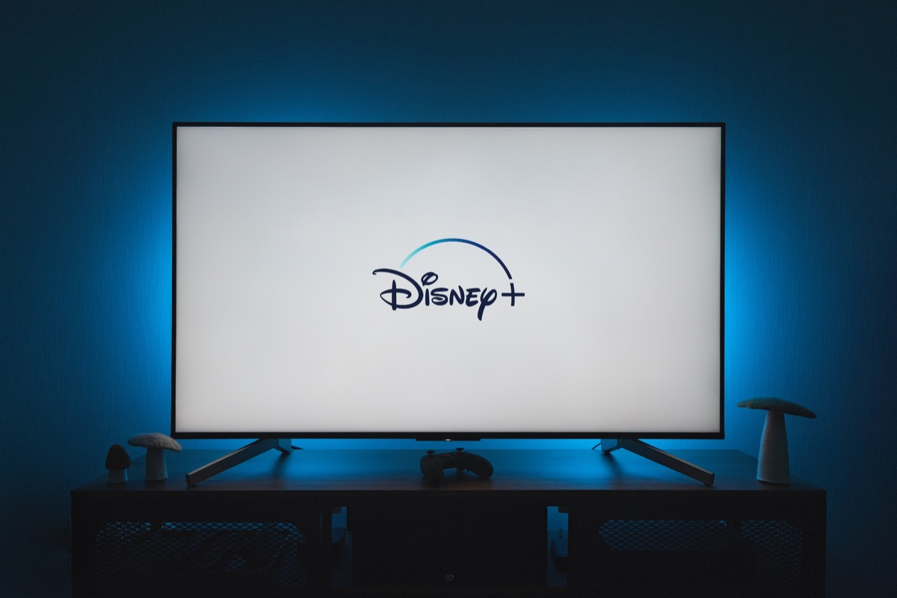
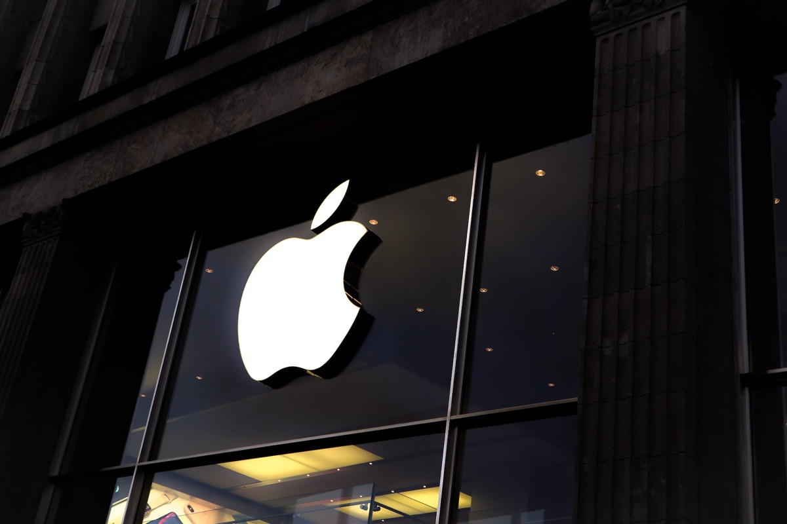
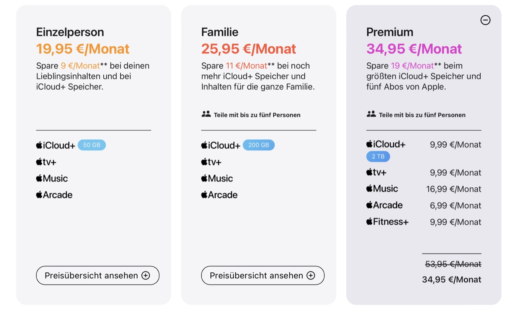

## While we mainly rely on subscription-based Internet services these days, it is more than obvious that, with saturation of demand, the peak of user acceptance in terms of constantly-raised pricing has been reached while the market is in a state of odd turmoil.

A common and widespread modus operandi is currently swashing through the Internet: Over many consecutive years, many vendors and providers have invested into the specific infrastructure and the current look n' feel of the services we know today. In 2020, I already asked if "[It's all about services - now](../Services-its-all-about-them-now/)" and as the answer was a clearer "YES!" than we all may have assumed three years ago, I also pondered "[why Apple One hasn't convinced me](../Why-Apple-One-hasnt-absolutely-convinced-me-yet/)" this year.

While I subscribed anyway (the bargain with six family members, 2 TB of iCloud-space, custom domains and Apple Music amongst the favorite services was just too luring for $29,99 then!), we have to talk about the progress - and possible downfall - of the Internet service landscape in 2023.

The plan always stays the same when introducing new products: Enter the market with pricey offerings while investing into the infrastructure, operate in the red while going for market saturation, optimize (in whatsoever direction), cut down account sharing (hello, Netflix), implement commercials (got it, Amazon?) and... finally... raise the prices over a certain  time (you - everyone!).

I fully understand that implementing a certain service infrastructure and ecosystem does need lots of upfront invests but looking at the streaming- and services-landscape in the dying 2023, the customer's bargain seems to lower more and more while prices are - partially - leveling into pointless dimensions that are difficult to justify. Anyway, come and join me through my thoughts of needed (or not needed) subscriptions that affect our six-people-household - and if there is any way at all to save money or reallocate saved bucks from one to the other service!

## Netflix

Netflix implemented advertising and is, reportedly, killing its base plan for one device here in Germany just like it has happened in the USA and Canada before - which is always an indicator what will happen in Europe sooner or later. Carrying on the sabotage of the long-countenanced account sharing (which my brother in law used with a profile on my account), I really had a thought whether we need to pay for four concurrent streams or not - with one 16- and one 13-year old daughter there are times of clash, but hey: Two simultaneously streams still serve well as we (unsurprisingly) have alternatives like Disney+, Paramount+ or - you name it - Apple TV+ - while watching in 4K and HDR is just something I do mind in our household.

The result here: Raising the premium plan from 17,99 EUR to 19,99 EUR doesn't sound that much but will seemingly drive me to definitely reduce my need for four streams, lowering those to two for 13,49 EUR instead of 12,99 EUR (current pricing). Periodically Netflix is definitely worth binge-watching some new shows but keeping up with the premium plan just for this case isn't necessary - and we have got alternatives so albeit this difference isn't that much money, it's noticeable and will be changed in accordance to our family needs.

Tendency: Reducing the plan to Full HD and two streams, therefore saving 6,50 EUR in new pricing per month

## Prime Video

Amazon's video streaming service is the first one we subscribed for - and this not because of the offering but just for getting our Amazon-orders with next-day delivery. Although the prices have also increased over the years, additional channels which you can additionally subscribe to or the commercial-backed Freevee-platform were added over time. No need for this yet so Amazon Prime Video will stay no matter what. Amazon's own shows are worth watching and despite more content or movies mainly come with additional costs, 0,99 €-actions before the weekends often bring various good movies or some hidden gems for a reasonable price.

Tendency: Leaving it untouched, especially because of the next-day-delivery and many Amazon-branded shows.

## Disney+

Surely one of the aspects why I don't understand Netflix raising the prices again and again: Due to licensing rights, many contents previously shown on Netflix wandered into Disney's roster. Besides, the back catalogue of the Walt Disney Company including many classic movies and cartoons pair with the ultimate collection of Marvel- and Star Wars content or evergreens like The Simpsons, Justified and many more.

For a six-people household with two kids older and two kids younger than ten, there is barely no way around Disney for me despite the upcoming price raise in November. The question here is the same than with Netflix - do I need two or four concurrent streams? If I stay with two (and Full HD), my monthly subscription expenses for Disney+ won't change - if I go with four, 11,99 € would be the new price which makes an increase of three EUR per month with upcoming regulations on account sharing.

Tendency here: Stay with two and juggle with the other two using Netflix simultaneously.

## Paramount+

The youngest of the streaming services and - until now - another bargain for 7,99 EUR a month. To good to stay that cheap and yet rumors have raised that Paramount is planning various new subscription models and maybe an advertising-supported plan. I discovered the service with "Star Trek" and stayed there because of shows like "Tulsa King", "Mayor of Kingstown", "Special Ops: Lioness", "Chemistry of Death" or "From". Perceived, we do still find more quality content with less burden on this platform and hopefully this will be the fact in the future as well.

Tendency: Will be kept and likely limited to two streams (I am sure this plan will be offered when the first changes will appear!)

## Apple One

Yeah, my personal Pandora's box - over the time, I (of course) subscribed to Apple One which once was 28,95 EUR when it started and was raised to 31,95 EUR in December 2022. With two teenagers and two parents heavily using Photos, it had to be the 2 TB storage plan (which I once used anyway with family sharing) and Apple Music as our preferred streaming service entered the party, too. This price was okay and with it, Apple TV+ came along which I don't watch that regularly, but some shows like "See", "Infiltration" or especially "For all Mankind" and the legendary "Ted Lasso" showed that Apple is rather going with "all killers, no fillers".

Anyway, now we are facing yet another price increase and the whole Premium-package is going to be raised to 34,95 EUR a month here in Germany and I am already considering leaving this all-in-one-offer. Fitness+ and Arcade are nice services, none of them are offers I would subscribe to anyway. Apple News is something that will probably never come to Germany so it's all about the 2 TB iCloud, Apple Music and TV+ while the other services are nice to have, but rarely used and - at least with our use case - somehow disposable. iCloud Drive is still often laggy and has syncing issues, (free) sharing to external users without an Apple ID is still impossible: Would there be any chance to sync my Apple-based apps with platforms like Nextcloud for example, this would make iCloud definitely dispensable - so there is still the need to finally, finally, really finally improve iCloud like I already wrote back in [2020](../Why-Apple-needs-to-strengthen-and-upgrade-iCloud/). At least Cupertino has finally implemented custom [E-Mail-domains](../Apple-iClouds-custom-domain-feature-is-secretly-available-now/) in August 2021 but speaking about DMARC, DKIM and SPF, there is still a lot of work to do for paying Plus-customers!

Tendency: Really looking to split up the services: The 2 TB-plan is mandatory but doesn't contain data outside Apple's app-microcosm, this scenario is served by Nextcloud. Apple Music is also quite mandatory as the pricing being compared to Spotify doesn't differ (and Spotify is also going to overhaul its pricing) and Apple TV+ may be the only thing that may be booked on a monthly, spontaneous basis. Arcade and Health are two services that might be given a miss as they are nice to have, but also rarely used.

## Verdict

Coming to a conclusion, we may just hope that the unhealthful peak of Internet service pricing has been reached but, as always, there always seems to be one direction: Upwards!

Of course we users had our benefits over many, many years: A big catalogue, fair pricing and - later - a good competition before more and more services appeared, licenses were moved and contents as well. Maybe we got used to the "I-can-watch-everything-everytime"-feeling and thought that the current pricing and tolerated account sharing would last. Maybe we became to cushy so that it is now on the customer's side to differentiate between the services, contents and the pricing. I still think we have a choice but subscribing to everything without utilizing a service up to a specific percentage will become more expensive while losing subscribers because of new pricing is surely a calculated risk of any subscription-based provider named above.

Personally I don't expect price drop in the distant future so customers will be forced to judge which services are really needed and terminate those that aren't - or go with if-and-only-if-partial subscriptions, binge-watch (for example) and cancel the subscription again. This may be an unhealthful peak of today's streaming landscape but I think it's well-calculated and long overdue after good bait catches fine fish over all the years.

Companies indeed must to find arguments to further tie customers to a specific platform and although we live in a six-people-household, I will definitely tune down the one or other subscription if I am needed to - amongst those candidates like Netflix, Disney and... now... Apple!