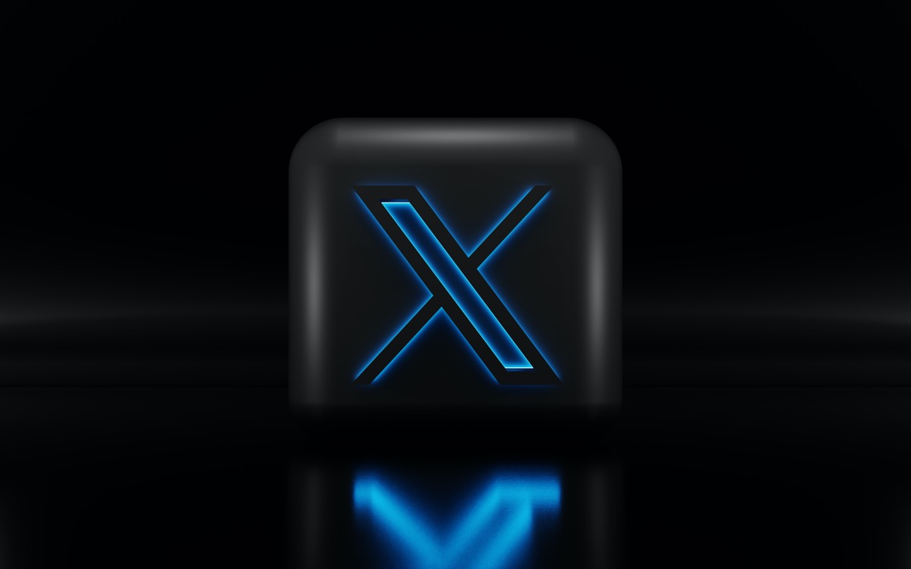
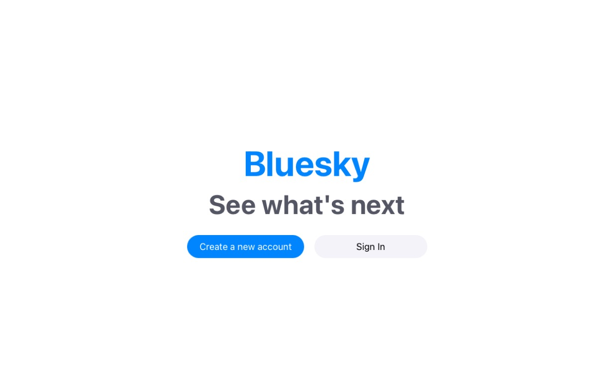
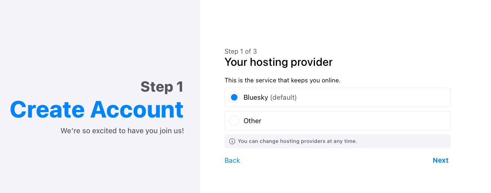
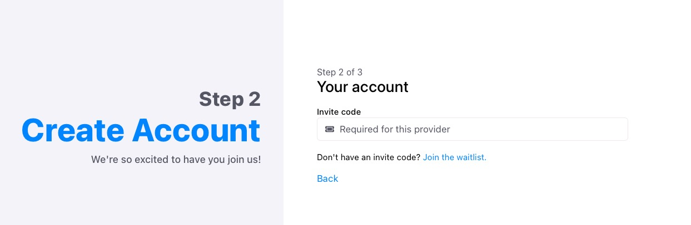
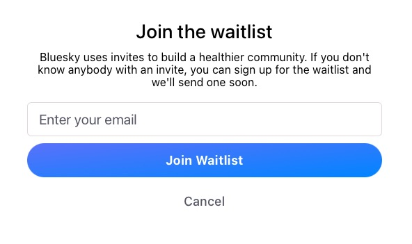
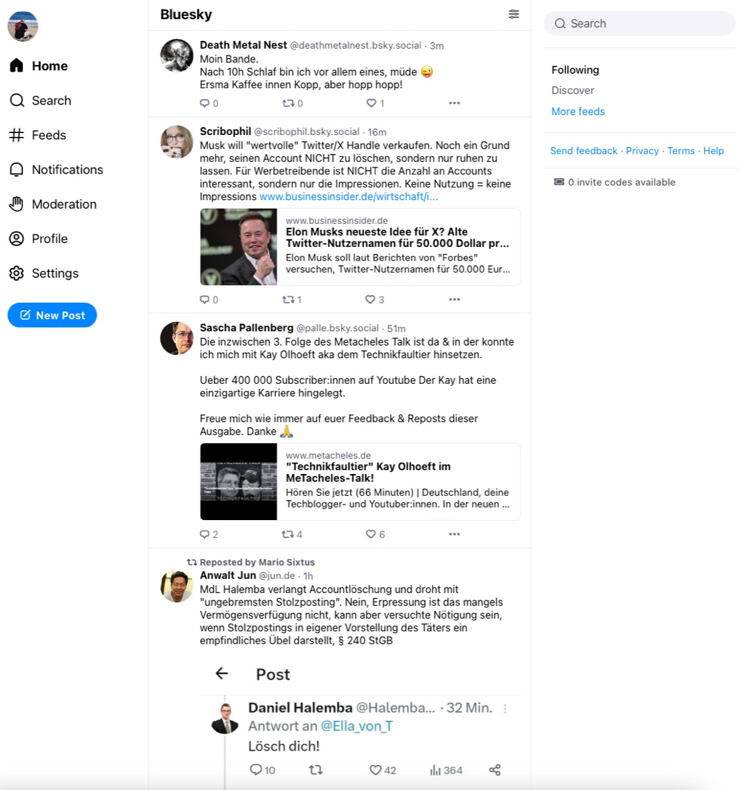
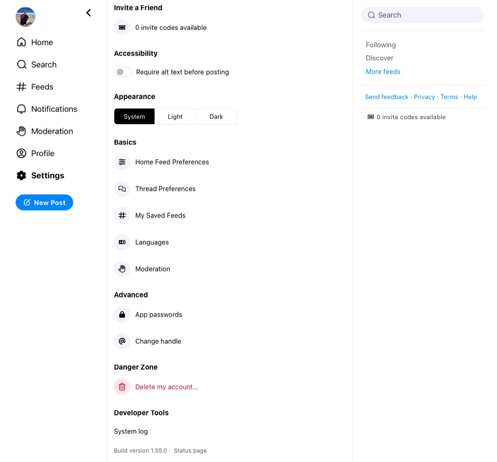
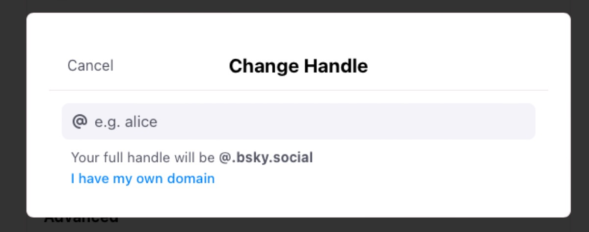
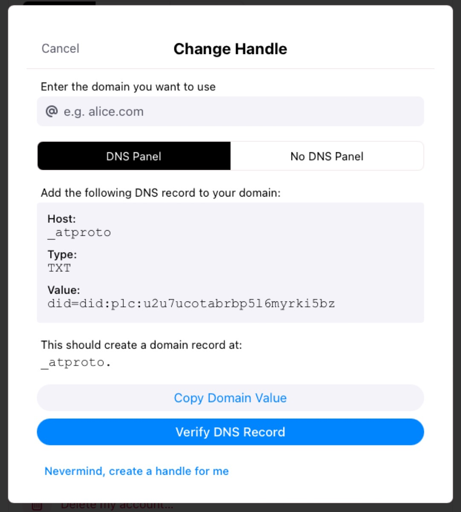
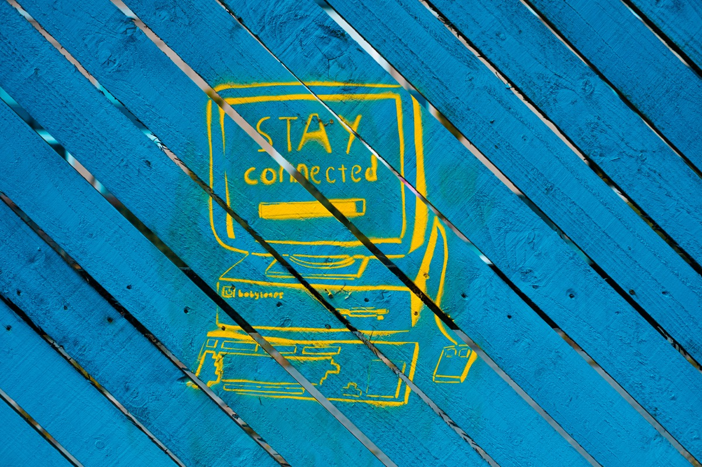

## While many people and even corporate brands are fleeing from X - formerly known as "Twitter" - the question is which service is able to provide shelter. The Fediverse with products like Mastodon or Misskey/Calckey/Firefish is definitely an option while Jack Dorsey, former Twitter CEO and Co-founder, tries to gather up the masses with his latest project, Bluesky. 

The Social Network-landscape is shattered these days. While the downfall of X was somehow a predictable process, it is still astonishing how fast a service that once was a synonym for short messaging is ruined while (seemingly) hazarding all consequences. Anyway, each failure is a chance for optimization and so other networks with the focus on decentralization grew over the years - one of them, virtually flagshipping The Fediverse, was Mastodon. Besides, and somehow lurking in the shadows, the virtual successor of Twitter has been in the works for four years using an investment of nearly 13 millions USD: Bluesky, lead by Jay Graber and former Twitter-CEO and co-founder Jack Dorsey - a decentralized new social network based upon the [AT-protocol](https://atproto.com/guides/overview).

## From bluebird to Bluesky

First of all, Bluebird's [website](https://bsky.app) looks quite simple - and yes, it's work in progress. Getting onboarded isn't as easy because the access to the new Social Network is - in my eyes - crippled intentionally. Not everyone can sign up, people need invite codes - everyone of you who thought this scenario reminding on the old days of early OnePlus-smartphones has been put to a grave is wrong. You need an invite code to play in the sandbox of Bluesky - and getting those may be a hassle.

As always, celebrities and people or organizations of public interest join the platform to attract new followers and subscribers. In moments where many of those flee from X.com, Bluesky is a welcomed new home and especially here in Germany, this escape-scenario drastically increased throughout the last months with many famous accounts migrating to Bluesky: Good bait catches fine fish and with a solid base of well-known accounts, people automatically get interested in following those.

Should you be able to get an invite code (users who are with the platform a little bit longer get those for example), there is no obstacle towards subscribing to Bluesky anymore as the web interface is definitely not a complicated one: Create your account by choosing your provider, enter your invite code (or join the waitlist), pick your handle, enter your E-mail address and password and you're ready to go.

It could be that easy if the trending thing about entering Bluesky wasn't the artificially-truncated invite code thing. I personally don't know if this is because of making the service more "exclusive" or keeping spammers and bots outside - finally, this scenario does its work.

There are different ways to get an invite - just be patient and wait until your spot in the waitlist is next, get a code from another Bluesky-user or look for initiatives like, for example, the [invitation exchange platform](https://mailbox.org/en/post/mailbox-org-opens-bluesky-invitation-code-exchange-platform) of German provider mailbox.org - paying customers can request an invite or share their codes with others: In my case, I didn't wait a half day until (unexpectedly) the mail with an invite reached me (pure luck or less demand - who knows?)-

## First steps

Once you made it to scavenge an invite code and used it for good, you probably have created your account with the @bsky.social-appendix and the outlook will be quite similar to Twitter in earlier days. Indeed Bluesky focuses on the essentials while missing some of those well-known ones, but you definitely will feel familiar straight from the first visit.

On the left pane, you see self-declaring links for your home site, the general feed, current notifications, moderation statistics, your profile and general settings. The middle shows the feed with accounts you've subscribed to, the right side displays a search box, an option to discover other accounts and more feeds. The latter are indeed custom algorithms that users can build with a little coding expertise as documented [here](https://github.com/bluesky-social/feed-generator).

## Verification

There is no blue, yellow, gold, whatsoever checkmark to verify your identity (yet). Instead, you can change your handle, for example @oliverpifferi.bsky.social, to - in my case - @pifferi.info by adding a certain DNS-entry to a domain you own. It's still not the way of a knightly accolade, but what can proof your online identity better than access to the DNS-settings of a domain you own by yourself?

First of all, enter the settings and use the "change handle"-option just like you would do when changing it into another @bsky.social-tag.

Click on the "I have my own domain"-option here:

Now another windows will appear with the verification-settings you need to enter into the DNS-settings of your domain. Enter the domain in the upper field and see which TXT-entry will be generated afterwards. This entry with the _atproto-prefix and the specific value must then be added to your site's DNS-configuation as a new entry.

One you have done this in a separate window, click on "Verify DNS record" and, depending on your provider, your account will be verified, permanently changing your handle to, in this case, @alice.com (or, @pifferi.info in mine). In case you don't have access to the DNS-console, you may also place a TXT-file in the webroot of your specific website and verify it via this way. Further information on verification on Bluesky can be found [here](https://blueskyweb.zendesk.com/hc/en-us/articles/19001802873101-How-to-Set-your-Domain-as-your-Handle)!

## Finally...

Bluesky looks like X/Twitter once used to look. It still misses features that many former users got used to and while the whole platform is definitely in the status of "work in progress", it is definitely fill up with many people flooding from X or users who run their Bluesky-account parallel to their Mastodon-one - which is quite interesting. If you don't mind starting with a new social network created by the same crypto bro that once was in charge of ancient Twitter before selling the whole platform (and if you're okay with this possibly happening again), Bluesky may stand for the simplicity that once made the former bluebird that popular. The classical PR-B/S of "federated" and "decentralized" is something that needs to be proven in the future - without the approach of an open, really decentralized and federated standard, just another siloed platform has just been born.

Until then, and with direct messages possibly being integrated sometimes in the future, Bluesky may be an alternative based on "yet another protocol". It looks slim, is trimmed down to basic functions and you will probably find lots of people that fled from X - but, as always, it will be interesting to watch how this platform will grow and develop once the artificially-shortened signup process has been erased and in how far it can compete with the Fediverse in terms of "building a healthier community". Most of the people fleeing from "the other side" need to find a new comfortable home, just a few of them will care about where the data is being stored. Considering that all your posts on Bluesky are available via API-endpoints without any kind of authentication at the time of writing (see my post in raw [here](https://bsky.social/xrpc/com.atproto.repo.listRecords?repo=pifferi.info&collection=app.bsky.feed.post) for example), "Privacy" could also be an interesting topic to deal with when opting in for any new platform.

## Stream of time

At last, time will (as always) tell but as someone who changed to Mastodon for quite a while and running an own instance, even Bluesky has its charm and reminds on times where Social Networking was less toxic than it is today. In the end, usability and the people, groups and institutions on the specific platform will shape the foundation for more or less success - this is a challenge all solutions of the "post-Twitter"-era have to deal with inevitably.

Considering the results of all these thoughts, Bluesky IS worth a visit at the time of writing, despite the silly invite-system - but don't expect a fully-matured platform like the former Twitter or Mastodon & Co!  It still is work in progress and although the current approach serves our nostalgic memories quite well, missing hashtags-support, no possible video-uploads or even basic things like 2FA in terms of security show that there is still a long way to go. Speaking of federation and decentralization I am also quite curious if the self-hosting on own Bluesky-servers based upon the AT-protocol will be possible like we know this from the Fediverse-solutions. Time will tell but any option is better than the remains of the social network that once made use to know what's going on in the world with 140 characters!

If you're interested in joining me on either [Mastodon](https://norse.social/@oliver) or [Bluesky](https://bsky.app/profile/pifferi.info)? Click the specific link on each service and you'll be guided to my respective profile and let us mutually discover how the social media landscape will change in the near future!