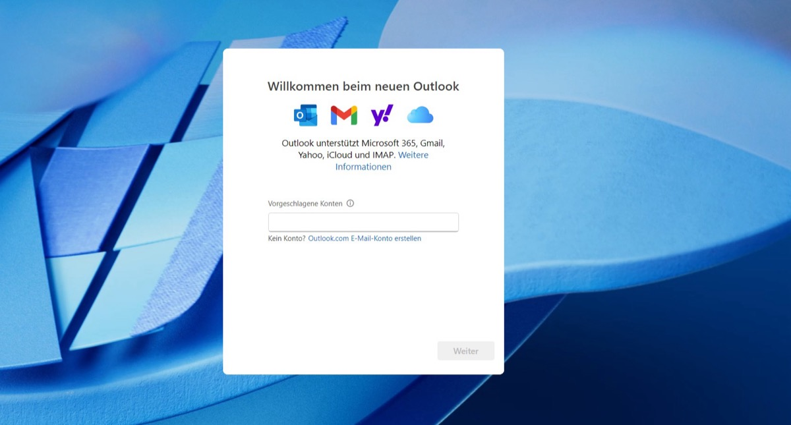
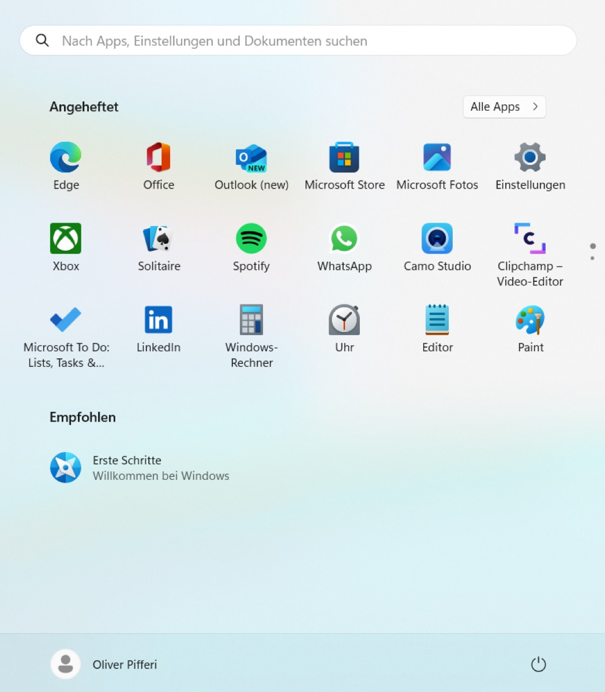
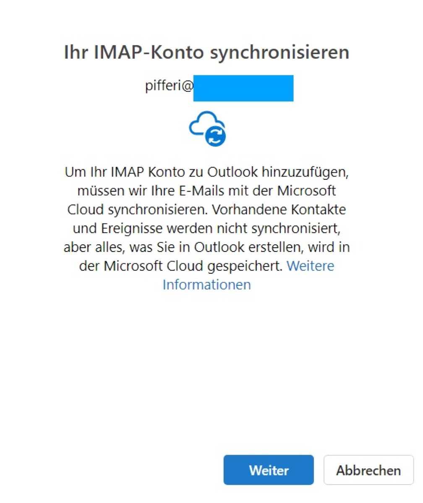
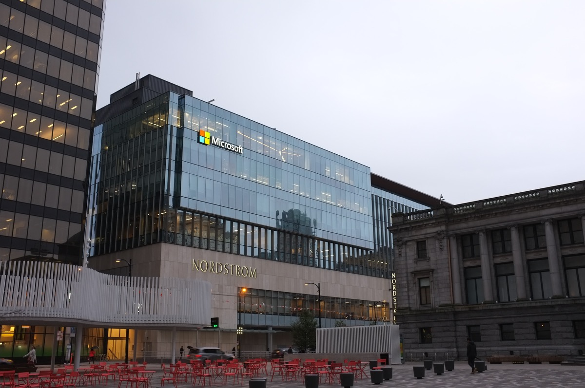
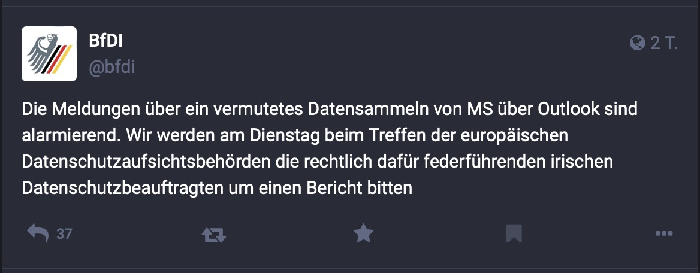

## Especially in IT, trust is everything and working with different solutions and providers is always a matter of trust. The possible fact that Microsoft's new Outlook-offshout is seemingly sending sensitive data to Redmond could shake the world IT to its very foundations - years after the once acquired mobile Outlook-app did the same. 

Apart from the growing inconsistency of the classic and "new", often undercooked iterations of Microsoft Desktop-applications (you may have noticed this with Teams and Outlook already), the latest Windows-version seems to be quite keen on submitting IMAP- and SMTP-credentials to Microsoft-servers as German site [heise.de](https://www.heise.de/news/Microsoft-krallt-sich-Zugangsdaten-Achtung-vorm-neuen-Outlook-9357691.html) reported this week.

## Everything "new"?

Speaking highly of the "new Outlook", [Microsoft's plan is that this new version is about to replace](https://techcommunity.microsoft.com/t5/outlook-blog/things-to-look-forward-to-in-the-new-outlook-for-windows/ba-p/3975602) the abandoned Windows Mail and the well-known, monolithic desktop client on Windows and macOS. Users can already switch to the new Outlook but while several elemental features (on-premises Exchange-support, PST-support on Mac etc.) are missing, the way Redmond deals with personal information and login credentials is quite questionable.

The 2023-Windows 11-update already implements "Outlook (new)" into the start menu under "Recommended apps" so many users may give this a try - but substituting margarine for butter doesn't always have the effect usually hoped for. 

In detail, adding a new account to the new Outlook which isn't hosted by Microsoft, a certain reference is given, explaining that "non-Microsoft-accounts are synced with the Microsoft" cloud as stated [here](https://support.microsoft.com/de-de/office/synchronisieren-ihres-kontos-in-outlook-mit-der-microsoft-cloud-985f9e19-d308-4e85-9d1d-0c6f32f8e981?ui=de-de&rs=de-de&ad=de) in German. At the time of writing, only iCloud-, Gmail-, Yahoo- and general IMAP-accounts and the Microsoft 365-stack are supported (and therefore synced!), including the versions on iOS, Android and macOS. 

Following this notify, adding an IMAP-account to the new Outlook comes equal with syncing E-Mails with Microsofts servers. Existing contacts and calendar-entries won't get synced but everything what is created in the new Outlook afterwards gets a direct injection into the Microsoft Cloud for whatever reason.

## The problem

Mentioning the note above which things are synced, users may question the intention behind this move. Why does the vendor of my software application not only need to save the credentials for a personal mailbox but also presume to access the personal data of users and sync them with their own systems?

heise.de was able to [sniff the traffic](https://www.heise.de/news/Microsoft-lays-hands-on-login-data-Beware-of-the-new-Outlook-9358925.html) between new Outlook and the Microsoft-servers, proving that the output contained the target server, login name and password which were sent to the Microsoft Cloud. Although the connection itself appeared to be TLS-protected, the data was sent to Microsoft in plain text within the tunnel. Without informing or inquiring about this, Microsoft grants itself access to the IMAP-and SMTP login data of users of the new Outlook which is, basically, an undeniable no-go!

## What now?

In the end, user should sit this deployment out as long as possible. There are enough alternatives around to connect IMAP-accounts with [Thunderbird](https://www.thunderbird.net/) being probably the most-famous one. There can be no reason for Microsoft doing this and while Redmond already caused an outcry years ago when the acquired - now - Outlook Mobile-app did already send credentials to third parties, using this new half-cooked app for whatever reason is an imminent threat for everything at least slightly connected to data protection.

For now, this is seemingly only affecting IMAP-accounts but as Outlook is also mostly used in the Enterprise, it is more than questionable what Microsoft tries to achieve with this move. I don't want neither my private mails, calendars and contacts nor my credentials to the accounts hosting those transmitted to the creator of a Personal Information Manager. Considering the latest bad press on [stolen keys](https://www.bleepingcomputer.com/news/microsoft/hackers-stole-microsoft-signing-key-from-windows-crash-dump/) of Microsoft's cloud infrastructure, this whole thing comes with a very bad taste.

Don't get me wrong, I have used Microsoft-products my whole life and am partially still doing so in private while I have to rely on them in business life - wether I like it or not. But the inconsistency of new software (just switch between the classic and "new" Outlook on Mac) or the undercooked releases (old Teams? New Teams?) just cast long shadows on Redmond's quality of code and the common alignment of Microsoft as a vendor. Combined with the dreadful firing of new, partially unwanted or unfinished, features or software, a feeble impression comes up that there doesn't seem to be any common theme except the wild gathering of data for whatsoever reason - which matches my personal impressions on the development of Microsoft Edge which started as a great alternative to Chrome but turned to a bloated meeting point of unwanted features over the years.

## GDPR calling

The Federal Commissioner for Data Protection and Freedom of Information of Germany, Professor Ulrich Kelber, is alarmed by the data detour in Microsoft's new Outlook. On Mastodon he informed about the intention [to ask for a report from the Irish Data Protection Commissioner](https://social.bund.de/@bfdi/111381793883035665) who is told to be responsible for companies like Microsoft, during a meeting of the European data protection supervisory authorities next Tuesday.

Finally, it's up to us users to answer and react - and for everyone directly in charge of enforcing GDPR-compliances, this may be a new target to definitely aim and focus at and especially businesses should keep Outlook's journey under review!