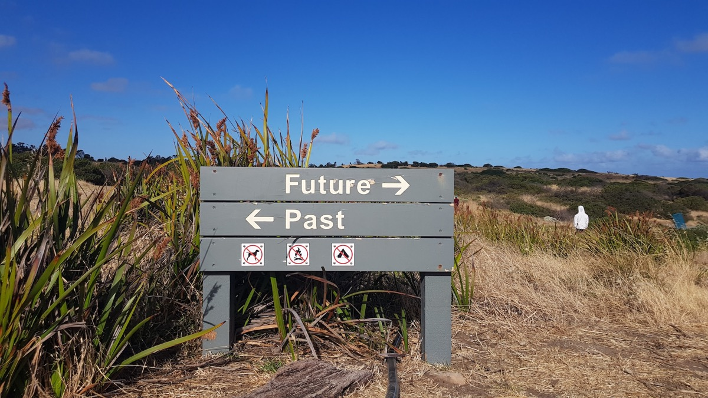
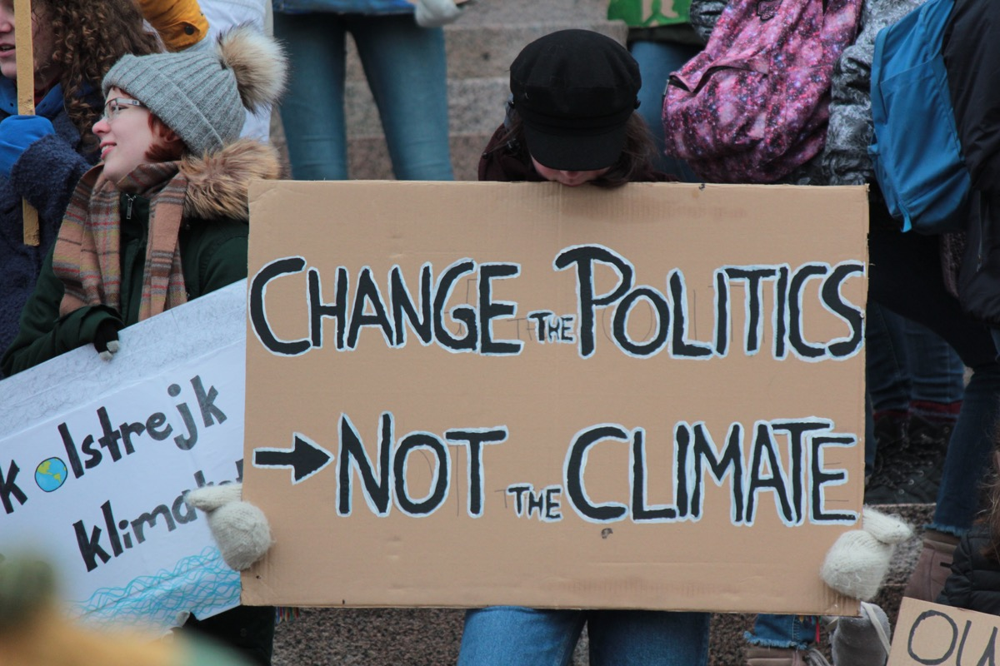
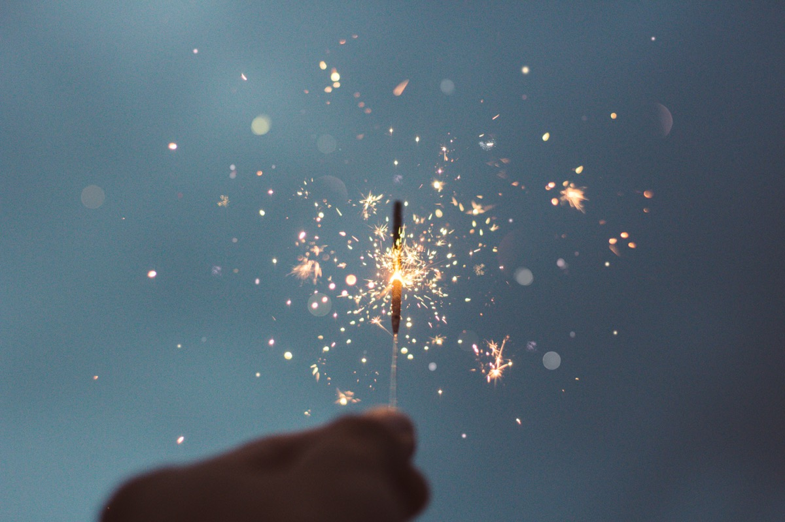

## It was a special and somehow strange year - paired with many experiences and the proof that there are often unexpected insights into human nature.

Looking back even into the COVID-years which defined our way the last three years (while the plague is still there), 2023 wasn’t the best year in many ways. It was a year of change, a year of insights and a year of breaking bonds with people seemingly flagged as „friendly co-workers“ just because of a job change: All those experiences finally built their own, full circle and, in the end, other positive outcomes helped to leave the past behind while aiming towards a better personal future.

From a professional basis, many things changed in its foundation starting this March, [finally enabling me](../The-best-way-to-predict-your-future-is-to-create-it/) to leave a dead-end caused by many wrong strategical decisions over the last consecutive three years. Over the year, there was a s[teep learning curve](../Stop-worrying-about-people-that-arent-worried-about-you/) experiencing that, during these days, literally leaving the Hogwarts Express heading to anywhere except Hogwarts may leave you disposed into the nowhere. Seen from a business view, you were useful once you opted out continuing to howl with the wolves despite the real wolves in sheep’s closing tried to make anything worse powered by missing awareness, ignorance and ongoing megalomania. 

## The personal view

From a personal point of view, it was also challenging year. Seeing how fast your kids - my four girls - grow up is a blazing experience and, deeply felt, this speed is accelerating every single month. We faced an absolutely sad and unexpected loss as my father-in-law suddenly passed away in March, ripping our Italian heart out of our family’s chest. With the pain growing, the family closed ranks even more and while I consider many opportunities to suit better, my brother-in-law lived with us for nearly two weeks, helping is sister and everyone of us to redress the pain. After this, a wonderful week in Denmark was welcomed to create a distance to the awful events and drove me to [make a final decision](../The-best-way-to-predict-your-future-is-to-create-it/) on my job perspective, summing everything up with the result being perfectly clear.

Over the year, the world seemed to continue to go down the swanny once again: [Ongoing war in the Ukraine](../The-only-thing-we-have-to-fear-on-the-planet-is-man/), a (German) society striving to the far-right regarding politics (while everyone seeing this happen), the state of (worldwide) politics in general and environmental events like the climate change being a threat to all of us not worth discussing: The challenges for mankind are ahead and if rising temperatures, floods, thunderstorms and other events aren’t proof enough that we’re already too late to participate in the game of change, then this planet may indeed be doomed. While politicians still gather their lickspittles around them, deny these threats and continue to curry favour with the fuel-lobby instead of really patronising solar and wind energy-options, many people have realized that we must turn towards new energies.

The clash of culture(s) is preprogrammed and will be an immense task not only for the new year to come as the countdown to extinction (as Megadeth already knew and sung about in 1992) is still ticking... faster. Basically, many nations and governments (not only the German one) need a complete overhaul but where to start? It needs an invest of everyone and so my thoughts since the COVID-19 pandemic were fortified over the years: Every man for himself - a dangerous tendency!

## The personal view

Personally, I am quite sure that some debts will be payed off next year and surely many people will encounter the lovely wisdom of „as you sow, so you shall reap“. Karma is a bitch and sometimes it takes longer for people to earn what they were striving for - in the end, everyone finally gets what he deserved. [I was personally disappointed by a lot of people in 2023](../Stop-worrying-about-people-that-arent-worried-about-you/) and my (formerly good) knowledge of human nature failed in many ways. But there is hope with an old (and trustworthy) but also new workforce around me, with new people acting in concert and new challenges ahead. Let’s work on and with these, let’s be successful and let’s create a working culture within a promising company really empowering the employees to participate instead of building a castle in the clouds guarded by an unicorn while everyone actually knows that everything is pouring down the sink anyway.

There will be familial challenges ahead, challenges with health and my growing kids but I hope that we will somehow manage those in the best-possible ways so staying healthy as long as possible is surely one of the better wishes for an upcoming new year. While this one comes to an end, I try to put many disappointing moments of 2023 into a box, seal and get rid of them. The sad moments prevailed but the good moments are a foundation to build trust on, no matter if it was a 60 km-hike within three days, opening an exciting new chapter of your professional life with ten people in common, playing „Hogwarts Legacy“ with your eldest or conquering the (still-not-real) North of Norway with three wonderful and crazy guys: Hope for the better lives on, so be welcomed, 2024 - and hopefully this year will be a better one than the last ones as the good often comes unexpected!
