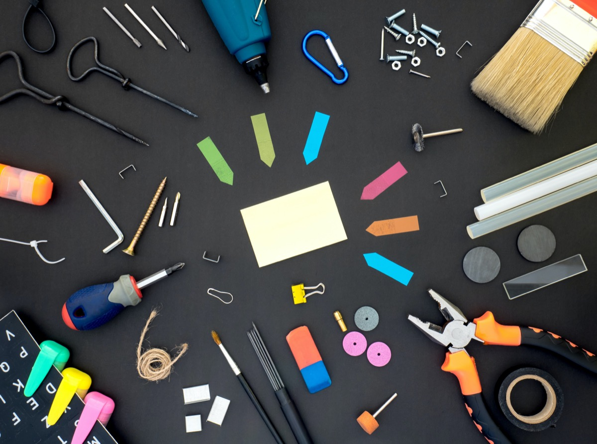

## There have been many lovely events in the Internet over the years and one to cherish especially is the one where users simply blog about their favorite standard apps they are using.

It’s a simply idea and despite reminding me on some kind of classic chain letter, I stumbled upon this campaign by swiping through my Mastodon-feed. Niklas, a lucky German guy who managed to live in Norway (yes, I am definitely jealousy of him here!) [shared his list](https://www.niklas.fyi/posts/2024-01-11-default-apps/). After looking what all this was really about, I discovered [Robb Knight’s](https://rknight.me) site and his „[App Defaults](https://defaults.rknight.me)“-project.

Here, he initiated and collected RSS-feeds people in the Net telling exactly which standard-apps / services they use and although this is a quite basic idea, it is one of the vivid and positive things in the WWW these days.

- 📨 Mail Service: mailbox.org\
- 📮 Mail Client: [Apple Mail](https://apps.apple.com/app/mail/id1108187098) on macOS & iOS, mailbox.org in the Web\
- 📝 Notes: [Apple Notes](https://www.icloud.com/notes)\
- ✅ To-Do: [Apple Reminders](https://apps.apple.com/us/app/reminders/id1108187841)\
- 🌅 Photo library: [iCloud Photos](https://www.icloud.com/photos)\
- 📆 Calendar: mailbox.org CalDAV\
- 📁 Cloud Storage: [Nextcloud](https://nextcloud.com)\
- 📖 RSS Service: Self-hosted [FreshRSS](https://freshrss.org/)\
- 🙍🏻‍♂️ Contacts: mailbox.org CardDAV\
- 🌐 Browser: [Safari](https://www.apple.com/safari/) and [Firefox](https://www.getfirefox.com/)\
- 💬 Chat: [Signal](https://signal.org/), [Messages](https://apps.apple.com/zm/app/messages/id1146560473) & [Threema](https://apps.apple.com/us/app/threema-the-secure-messenger/id578665578?ign-mpt=uo%3D4)\
- 🛒 Shopping Lists: [Apple Reminders](https://apps.apple.com/us/app/reminders/id1108187841)\
- 🔎 Search: [DuckDuckGo](https://duckduckgo.com)\
- 📚 Reading: Printed (!) books\
- 📰 News: [Reeder 5](https://apps.apple.com/app/reeder-5/id1529445840)\
- 🎵 Music: [Apple Music](https://www.apple.com/apple-music/)\
- 🎤 Podcasts: [Apple Podcasts](https://www.apple.com/apple-podcasts/)\
- 🌤️ Weather: [Apple Weather](https://apps.apple.com/us/app/weather/id1069513131)\
- 🔐 Password Management: Self-hosted [Bitwarden](https://bitwarden.com)\
- 🧮 Code Editor: [CotEditor](https://apps.apple.com/app/coteditor/id1024640650?mt=12)

As 2024 is still being young but already comes along with uprising political turmoil here in Germany paired with a quite dissatisfied population, there are definitely some more serious things to handle this year. Anyway, it’s quite funny to create this list and look how it will develop over time as needs and use cases may change like they have changed over the years - so apart from the real serious events on this planet, this one here is a welcomed relief...