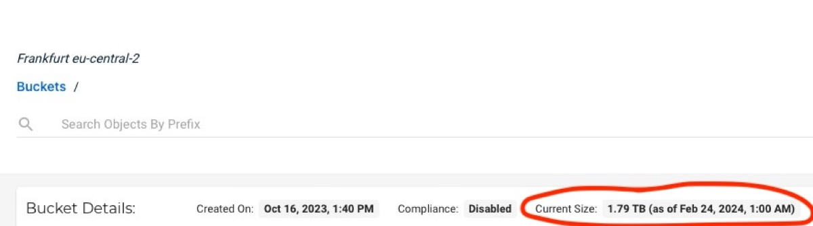
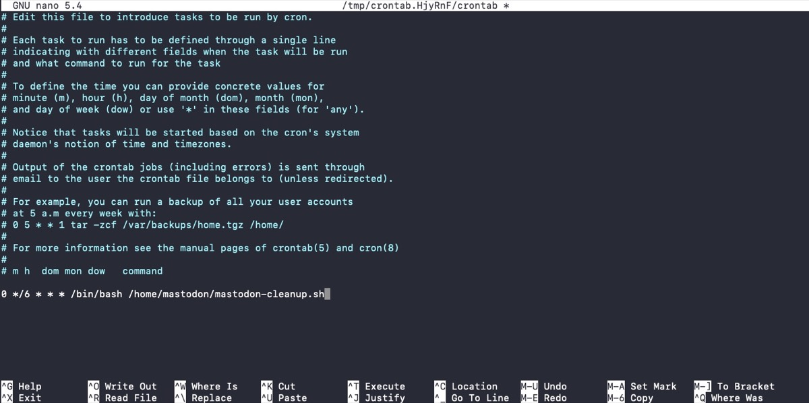
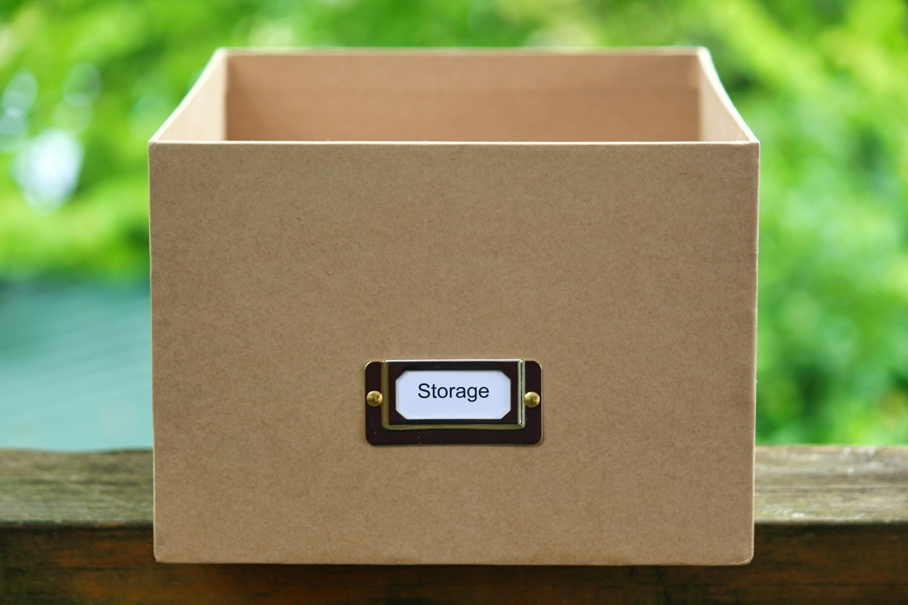

## After six months of running a small, two user Mastodon-instance, I was astonished to see the media growth over the time so it was way overdue to reflect how to do some spring cleaning in this cozy, self-hosted space.

Despite carefully selecting and tuning Mastodon’s internal retention policies to (obviously) suit my needs, I discovered this small instance filling up nearly 1,8 TB of storage in my S3-bucket: Fortunately, I am actively tracking my monthly bills  of my Wasabi-account but considering that, not long ago, a whole TB was enough for some of my Fediverse-based services and some backups in separate buckets, I was forced to get to the bottom of this case and found the Mastodon-based cached media assets to be the root of this evil.


## Mastodon’s materials on board

Fortunately, Mastodon’s backend is indeed some kind of beast so the [built-in CLI](https://docs.joinmastodon.org/admin/tootctl/) gives you the availability to clean attachments and previews from remote accounts, purging the precious disk cache.  Despite Mastodon having tons of options, you may rarely use them on a daily basis so I did finally spend some time to get used to the single commands. Afterwards, combining and scheduling them on a cron-basis may help you to save valuable disk space, no matter where your data is stored.



## The script

Six single commands are the road to our success of re-gaining storage space for our Mastodon-instance. Being the „mastodon“-user on my system and assuming you use the same user and the same paths according to Mastodon’s official guide for deploying your own server, I decided to create an empty file via

```
vi /home/mastodon/mastodon-cleanup.sh
```

and filled it with the combination of six commands and the specific explanations aiming at a retention of seven days which should, in my case, serve well - feel free to alter these parameters according to your personal needs:

```
#!/bin/bash

# Prune remote accounts that never interacted with any local user
RAILS_ENV=production /home/mastodon/live/bin/tootctl accounts prune;

# Remove remote statuses that local users never interacted with older than 7 days
RAILS_ENV=production /home/mastodon/live/bin/tootctl statuses remove --days 7;

# Remove media attachments older than 7 days
RAILS_ENV=production /home/mastodon/live/bin/tootctl media remove --days 7;

# Remove all headers (including people you follow)
RAILS_ENV=production /home/mastodon/live/bin/tootctl media remove --remove-headers --include-follows --days 0;

# Remove link previews older than 7 days
RAILS_ENV=production /home/mastodon/live/bin/tootctl preview_cards remove --days 7;

# Remove files not linked to any post
RAILS_ENV=production /home/mastodon/live/bin/tootctl media remove-orphans;
```

Now make the script executable.

```
chmod +x /home/mastodon/mastodon-cleanup.sh
```

If you've never run these commands before (just as I did) I'd suggest you start with initially running them one by one as they might take several hours or days to run for the first time. The size of the cached media and database will depend on how many people you follow (approximately 100 in my case), how many users are on your specific instance or how many relays you have added to your instance - just to name some aspects. With Mastodon being a federated Social Network, there are many pros but also cons as each server is talking to other ones, gathering lots of data - which lead us to the dilemma of a quite impressive disk space consumption even with a very small instance.

## Scheduling time

After we have initially deployed each of the six single commands and freed up the first batch of space, it is sure that we don’t want to do this manually each time. Fortunately, Linux Cron-daemon is our Swiss Army knife for scheduling and with just a single line of code, our script will run at specific times.

So, as logged in „mastodon“-user, just deploy a

```
crontab -e
```

to enter this user’s cron-settings. Now just add another line at the end of the file matching your needs when this script should run. After the first run, it won’t take that much time anymore so I decided that I am fine with running it every six hours.

```
0 */6 * * * /bin/bash /home/mastodon/mastodon-cleanup.sh
```

If you aren’t familiar with the syntax of Cron, I recommend to use the [Crontab Generator](https://crontab-generator.org) which is always a good way to to check whether your job is correct or not - or even create the whole command you may insert into the crontab instantly for you!



Save the file and from this moment on, cron will take care of executing the script every six hours!

## Verdict

With this small tutorial, we managed to implement a great mechanism of automatically getting rid of cached and material and media on our own Mastodon-instance. This is by far the best-practice for every instance and yes, every file may be download and cached again once we interact with the specific status or message connected to it - therefore this solution is more an approach for smaller instances instead of larger ones but, as always, tastes (and demands) are different.



According to your type of storage you may see the result quite fast or - in my case - on the next day as Wasabi’s statistics need their time to refresh the bucket size. With local storage, the result should be imminent, for me it took its time but the used space decreased drastically and ended up with Mastodon taking less than only 20 GB afterwards! Especially in terms of Wasabi and even despite the fact that the space is freed up immediately, you even pay for deleted storage for 90 days in advance here - in my case a good compromise to prevent the egress-charges from other S3-providers but this is yet another topic!

Anyway, putting all provider-specific considerations aside, this script should help you to control the amount of cached media on your Mastodon-server. Feel free to adopt the script to match your specific needs and do a spring cleaning on your Mastodon-instance - I hope that you somehow consider this post as some kind of useful! And - if you’re interested.  feel free to find my profiles in The Fediverse on

Mastodon - <https://norse.social/@oliver>

Pixelfed - <https://nordicshutter.com/oliver> and

BookWyrm - <https://books.pifferi.info/@oliver>

and let’s follow or connect with each other!