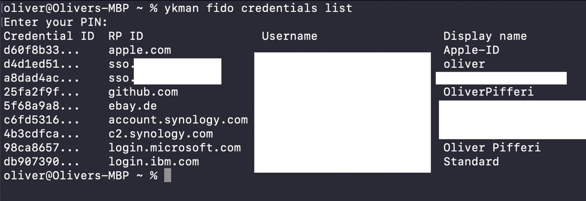

## Using YubiKeys for securing accounts is a premium step to a nearly ultimative security approach besides Passkeys or „simple“ 2FA. Alas, over time, those hardware tokens often fill with more and more accounts - adding them is no big deal, but getting rid of older entries isn’t that intuitive either.

Securing online accounts is one behavioral paradigm I have followed since hardware keys appeared and were affordable. With starting to use a password manager many years ago, also Two-Factor Authentication (2 FA) found its way into this security chain and in the time before the Passkeys (and still today) another layer of security is still mandatory. Paired with complex passwords, each layer helps to protect online accounts and even a password appearing in a new breach doesn’t scare that much if there is another, second (or third) factor helping you to prevent a personal and digital disaster.

As I am tending to check and change passwords as well as services mostly in the spring (call it spring cleaning!), I am also checking whether I still use a specific service or not. If not, I try to delete the account - the same counts for accounts residing on my YubiKeys. I don’t add credentials to them every day so I do this phased and then continue to work with the keys for weeks or months. As I am also a friend of cleaning up a historical mess, I try to get rid of old credentials when I don’t need them anymore - something that is quite difficult if you handle the YubiKeys just with the official YubiKey Manager. The app (still now Universal Binary on macOS though) helps you to change many parameters but prevents you from easily deleting unneeded credentials. This works anyway and, despite quite hidden, is done with the YubiKey Manager CLI - so let me show you how we can accomplish this task on our YubiKeys without resetting the device to factory defaults!


## Getting the YubiKey Manager CLI

For Windows-users, the way of [getting the CLI](https://www.yubico.com/support/download/yubikey-manager/?ref=pifferi.info) is pretty straightforward as it comes bundled with the YubiKey Manager-application and resides in C:\Program Files\Yubico\YubiKey Manager. As long as your YubiKey uses at least firmware 5.2.x, you will instantly be able to deal with it using the CLI as documented [here](https://docs.yubico.com/software/yubikey/tools/ykman/Using_the_ykman_CLI.html?ref=pifferi.info).

The Mac-version 1.25 comes as a .PKG-file and obviously misses the CLI so we need to make use of extended package managers like Homebrew to fetch the desired file named „ykman“.

Installing [Homebrew](https://brew.sh) is pretty straightforward but yet another topic so assuming you have already done so by either typing

```
/bin/bash -c "$(curl -fsSL https://raw.githubusercontent.com/Homebrew/install/HEAD/install.sh)"
```

or using the new and official .PKG-installation for Macs hosted on [GitHub](https://github.com/Homebrew/brew/releases/latest), a simple

```
brew install ykman
```

should do the trick and, after some packages were fetched, we’re finally ready to go on macOS.


## Doing the magic with ykman

After having met the one and only prerequisite, ykman is ready to so firing up the command without any specific parameter should show us the following screen with all options available:


To see which credentials are stored, just enter a

```
ykman fido credentials list
```

followed by your personal PIN (which should be set, otherwise using a hardware security key is quite pointless).

A list of services will appear, guided by a credential ID:

.

To delete a specific service, simply use the following command followed by the specific credential ID:

```
ykman fido credentials delete [credential id]
```

For example, for removing my apple.com-account from my YubiKey (always two there are!), the appropriate command would be

```
ykman fido credentials delete d60f8b33
```

and it would be just the first entry with credential ID d60f8b33 that would be deleted from the YubiKey’s storage!

To check whether the credentials have been removed or not (believe me, they should!), another

```
ykman fido credentials list
```

will show the remaining credentials.

## Verdict

With simple materials on board, we have managed to remove single elements and stored credentials from an YubiKey without the need to fully wipe the device. Despite the CLI-tools are quite hidden on Mac or - to be more specific - must be installed separately from the YubiKey Manager, we finally used Homebrew for doing this task for us, enabling us to clean unwanted credentials from out precious YubiKey.

.

This way may be quite helpful if you aren’t aware which credentials are stored on the YubiKey and just want to see or delete them on a per-item basis instead of wiping the whole device, forcing you to re-integrate the whole hardware token with each service connected!