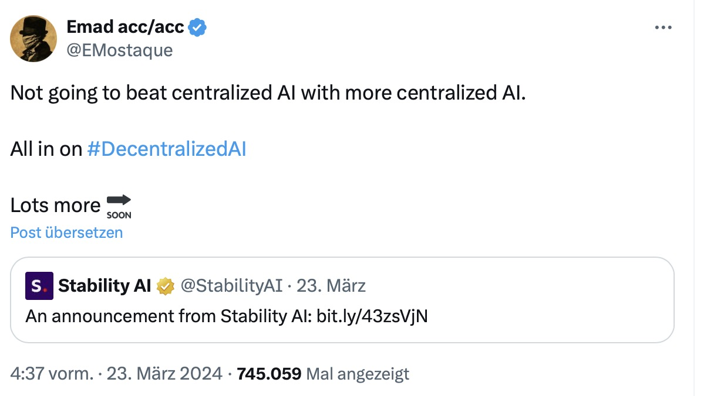

## With AI already being more than just „the next big thing“, it is more than clear that, with great power, there comes great responsibility. Considering this, the ultimate question whether AI should be centralized or not is surely one of the key aspects we need to talk about in the field of Artificial Intelligence. Now Emad Mostaque, CEO of Stability AI, is resigning in the wake of the current row over this issue.

Before we go all out and make Terminator's "Skynet" a reality, the ethical question of how to deal with the power of AI and how to regulate it is omnipresent. With this in mind, Emad Mostaque has [apparently resigned](https://twitter.com/EMostaque/status/1771380668930674850), and while Stability AI [has already expressed its regret] (https://stability.ai/news/stabilityai-announcement), Mostaque himself states that he "does not want centralized AI to fight centralized AI", while still retaining a majority stake in the company.

## The state of AI in early 2024

According to Mostaque, he is in favour of decentralized AI, talking about the challenge of coordinating and regulating AI rather than making it more powerful. This seems to be in contrast to the models of OpenAI or Anthropic, both of which started out quite open but over time have closed themselves off, making it impossible even to know what kind of data samples were used to train the specific AI models. "Concentration of power is bad for all of us," says Mostaque, who is already concerned about a "strange focus on revenue" when it comes to AI-focused companies, while believing that AI is still "the biggest tech bubble of all time" that still needs constant research.

While the power and possibilities of artificial intelligence are imminent, it is still unclear how generative AI can be turned into a stable business based on a specific funding model. Even OpenAI-founder Sam Altman admitted that there is no real idea of how the whole industry can be underpinned by a revenue-based cash flow as the development and deployment of AI-models is currently too expensive to be refinanced by recurring revenues.

Rumour has it that Stability AI investor Coatue also urged Mostaque to step down, citing a more profit-driven approach to the company. Citing the [blog post](https://stability.ai/news/stabilityai-announcement) accompanying his departure, Mostaque says: "I strongly believe in Stability AI's mission and feel that the company is in the right hands. Now is the time to ensure that AI remains open and decentralised," followed by a thought that is accompanied by a desire to refocus while preparing the company for its next step in growth. In the wake of recent events, Stability AI is also facing [legal action from Getty Images](https://fingfx.thomsonreuters.com/gfx/legaldocs/byvrlkmwnve/GETTY%20IMAGES%20AI%20LAWSUIT%20complaint.pdf) for possible copyright infringement: The company is believed to have used copyrighted material, including the Getty Images logo, to train the AI.

## Still some work to do

While AI is still in its infancy and already offers many opportunities, the ethical questions have yet to be answered. Decentralized or centralized, regulated or unregulated: Although everyone seems to be jumping on the AI bandwagon (and many have already done so), the technology is already involved in our everyday lives and boundaries are hardly set. There is more AI in today's technology than many of us can imagine, but the models need to be trained with sample data - at least for now: Sample data that not everyone has access to or is allowed to use.

.

There are endless use cases and possibilities, but recent events around OpenAI and Sam Altman's [temporary leave (and glorious return!)](https://openai.com/blog/review-completed-altman-brockman-to-continue-to-lead-openai) or Emad Mostaque's resignation from Stability AI show that there is still much to discuss. Is AI a public good? Should the big tech players be funding and owning a technology that could take us to the stars or doom humanity for all time?

There is no consensus yet, and as Ben Parker once said in Spider-Man: "With great power comes great responsibility" - hopefully we'll find a way to deal with the enormous power we have in our hands with Artificial Intelligence. Founders or CEOs leaving their companies when the path is bifurcated is an alarm signal and leading a discussion about the use and control of AI is essential - without diminishing the capabilities of modern Artificial Intelligence to fill many gaps!