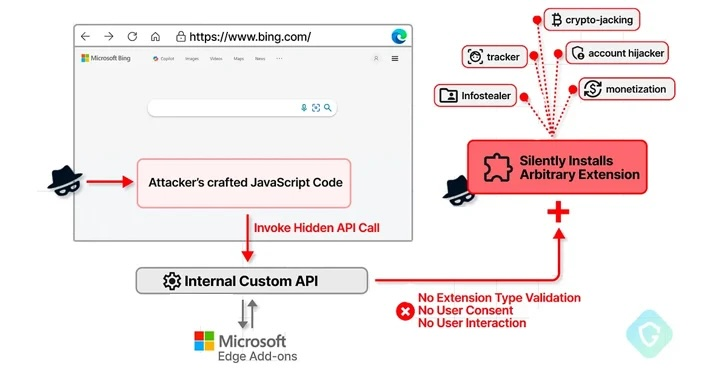
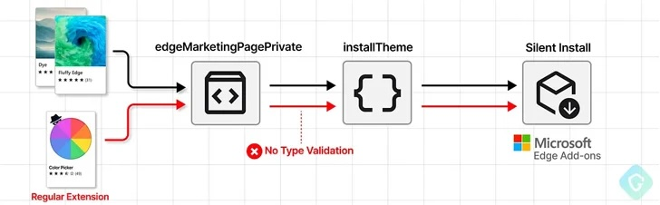
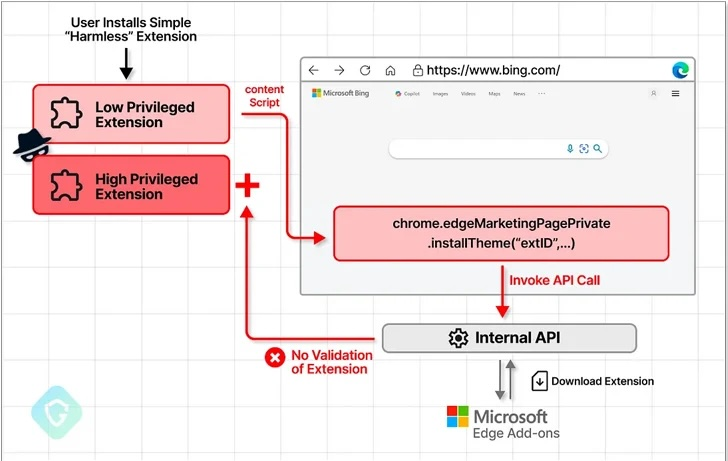

## Years ago, I took my first steps on the internet with Netscape Navigator. Today, browsers serve more than just as a gateway to the World Wide Web. They are essential software for many purposes in our digital world but also a surface for modern attacks.

Although I prefer to use Safari and Firefox for personal browsing and keep my browsers free of excessive extensions, the situation is different in my business setting. Due to its seamless integration with Microsoft 365 and its underlying services, Edge is the preferred browser here. Although the Chromium-based browser was initially a promising alternative to Google's Chrome in 2019, it has since become burdened with unnecessary integrations and privacy concerns, both for private users and businesses. Unfortunately, Edge has become quite similar to Google Chrome over time but with a Redmond flavor and a recently reported, serious security issue.

## What has happened?

As [The Hacker News](https://thehackernews.com) has recently [reported](https://thehackernews.com/2024/03/microsoft-edge-bug-could-have-allowed.html), a now-patched security flaw in the browser’s engine could have been abused to install arbitrary extensions on users' systems and carry out malicious actions in the background.

> This flaw could have allowed an attacker to exploit a private API, initially intended for marketing purposes, to covertly install additional browser extensions with broad permissions without the user's knowledge.

(Oleg Zaytsev, security researcher from Guardio Labs)

Zaytsev reported an issue with „[Microsoft Edge's Marketing API being exploited for covert extension installation](https://labs.guard.io/cve-2024-21388-microsoft-edges-marketing-api-exploited-for-covert-extension-installation-879fe5ad35ca)“ which was tracked as [CVE-2024-21388](https://msrc.microsoft.com/update-guide/vulnerability/CVE-2024-21388) with a CVSS score of 6.5. Microsoft addressed the issue in Edge's stable versions 121.0.2277.83 released on January 25, 2024, following responsible disclosure in November 2023. Both Zaytsev and Jun Kokatsu were credited by Redmond for reporting this severe exploit.

> An attacker who successfully exploited this vulnerability could gain the privileges needed to install an extension

Microsoft said in an advisory for the flaw, also adding it

> could lead to a browser sandbox escape.

## Technical details of the case

Specifically naming it a privilege escalation flaw, Redmond also emphasizes that a successful exploitation of the bug requires an attacker to "take additional actions prior to exploitation to prepare the target environment." Thus spoken, this is no „exploit in the wild“ but a not-that-unimportant surface attack nevertheless. According to Guardio's research, [CVE-2024-21388](https://msrc.microsoft.com/update-guide/vulnerability/CVE-2024-21388) also enables a malicious actor to install any extensions from the Edge Add-On store without requiring the user's explicit consent or interaction. This can be done by running JavaScript on bing.com (well...) or on any of the numerous microsoft.com-pages.

Technically, the browser can install an add-on from the vendor's own extension marketplace because it has privileged access to certain private APIs. One such APIs in the Chromium-based Edge browser is „edgeMarketingPagePrivate“ which is accessible from a set of allowlisted websites that belong to Microsoft, including bing.com, microsoft.com, microsoftedgewelcome.microsoft.com and microsoftedgetips.microsoft.com - just to name a few!

The API also packs in a method called installTheme() that, as the name implies, is designed to install a theme from the Edge Add-ons store by passing a unique theme identifier ("themeId") and its manifest file as input.

> As an added bonus, as this extension installation is not done quite in the manner it was originally designed for, there will be no need for any interaction or consent from the user.

In summary, an attacker could use CVE-2024-21388 to publish a seemingly harmless extension to the add-ons store and inject malicious JavaScript code into bing.com or other allowed sites. This would allow them to install an arbitrary extension of their choice by invoking the API using the extension identifier. In other words: If the specially crafted extension is executed on the Edge-browser and the user visits, for example, bing.com, the targeted extension will be installed without their consent and the malicious payload can be deployed.

Guardio Labs reported that although there is no evidence of this bug being exploited in the wild, it highlights the need to balance user convenience and security. Browser customizations can inadvertently defeat security mechanisms and introduce several new attack vectors in areas a simple browsing user would never expect them.

> It's relatively easy for attackers to trick users into installing an extension that appears harmless, not realizing it serves as the initial step in a more complex attack

Zaytsev said.

> This vulnerability could be exploited to facilitate the installation of additional extensions, potentially for monetary gain.

## Final opinion

Last but not least, and in my personal opinion, Edge has become the same monolith that Chrome already is. When it first appeared in 2019 and rose from the ashes of the inglorious first Edge browser, I was more than happy that there was a modern, supported and actively maintained browser with the Chromium engine without the Google bloatware and bad stuff lurking under the surface. Edge's evolution over the past two years has already seen the changing times, and with many useless features, new (and even more useless) sidebars, and lots of Redmond reporting stuff under the hood, it is more than obvious that Microsoft has lost the essence of being an alternative to Google Chrome.

There is no security by design, and security is not a status quo, but an ongoing process. This also applies to modern browsers, but with more and more features added to a simple browser (with tracking capabilities and framing in the M365 microcosm), Edge has reached the same level as Google Chrome - it just depends on the users whether they are connected to the Google or Microsoft world. Of course, there are many alternatives (did anyone say „[ungoogled-chromium](https://github.com/ungoogled-software/ungoogled-chromium)“?), but considering the evolution of browsers over the years, there are not many positive aspects left if you just want to browse the web without built-in trackers, crypto stuff or other fancy crap. 

There should be a feature freeze (or reduction) coupled with a rethinking of what a browser should basically do for home users, businesses, and people who just don't want their data exposed to third parties with a focus on real privacy. The trend that Microsoft has succumbed to with Edge was clear in one way or another and the current result in early 2024 is a shattered landscape of bloated web browsing apps once known as "browsers". Features first, security second - just reverse the order, please!

