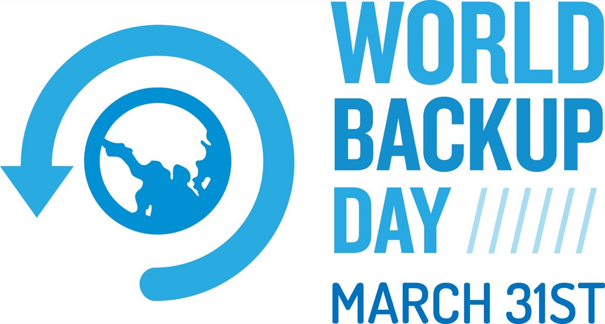

## Am heutigen 31. März ist [World Backup Day](https://www.worldbackupday.com/en). Wie es sich gehört und mittlerweile moderne Tradition ist, benötigen wir einen speziellen Tag, um auf ein wichtiges Thema nachhaltig aufmerksam zu machen. Der World Backup Day soll erneut an die Bedeutung von Datensicherungen- und Sicherheit erinnern.

In einem Zeitalter, wo das Sichern der eigenen Daten eine Selbstverständlichkeit darstellt und das Gefährdungspotential stetig ansteigt, muss das reine Backup nur ein Teil der gesamten Strategie sein. Doch was macht eine gute Backup-Strategie aus?

## Die Historie
Der frühere Idealweg wurde durch die „3-2-1“-Regel definiert: Drei Backups auf zwei verschiedenen Medientypen und einer Kopie außer Haus - doch selbst das war und (leider auch) ist bei weitem nicht die Regel. Die Realität sieht oft anders aus - ein Backup auf ein Network Attached Storage im selben Raum mag prinzipiell ein Backup sein, eine Strategie steht dahinter aber eher weniger. Diese Denkweise findet man teilweise noch in kleineren Unternehmen, wo ein Backup samt verläßlicher (und ergo oft kostenpflichtiger) Software eher ein „notwendiges Übel“ darstellt. Recovery Tests werden mäßig bis gar nicht durchgeführt, ein Monitoring des Backups geschieht per se sowieso nicht und nach einem dedizierten Sicherung-Konzept braucht man dann eher auch nicht fragen.

In dem Moment, wo ein zeitlicher Ausfall (aus welchen Gründen auch immer) geschieht, die Uhr klar gegen das Unternehmen tickt und die Faktoren RTO und RPO unbarmherzig in den Fokus rücken, wird schnell klar, dass auch beim Backup eine Strategie unerläßlich und - ja! - lebenswichtig ist.

## Der Zeit-Faktor

Zur Erklärung: Das Recovery Point Objective (RPO) bezieht sich im Allgemeinen auf die Berechnung der Menge an Datenverlusten, die ein Unternehmen innerhalb eines für sein Geschäft relevanten Zeitraums erleiden kann, bevor ein signifikanter Schaden entsteht - und zwar vom Zeitpunkt eines Störungsereignisses bis zur letzten Datensicherung. Redet man also über eine Strategie, so muss man auch zwangsläufig über diesen Faktor reden, der durchaus die erste Risikoklassifizierung darstellt. Die Wiederherstellungszeit (Recovery Time Objective, RTO) wiederum bezieht sich generell auf die Zeit, die eine Anwendung, ein System oder ein Prozess ausfallen kann, ohne dass ein erheblicher Schaden für das Unternehmen entsteht.

Ebenso steht sie in Verbindung mit der Zeit, die für die Wiederherstellung der Anwendung und ihrer Daten benötigt wird, um den normalen Geschäftsbetrieb nach einem schwerwiegenden Vorfall wieder aufzunehmen: Aus Erfahrung tickt im Worst Case die Uhr gnadenlos gegen die Betroffenen und das eine Backup mag die Daten enthalten, die Rücksicherung dauert aber quälend lange. Sofern also etwas passiert ist, sollte man sich nicht erst dann Gedanken über den Faktor „Zeit“ machen müssen.

## Die Strategie
Hat man bereits über RTO und RPO gesprochen, so spricht man unweigerlich auch über das Backup-Konzept, die Mittel (Hard- wie Software) und am Ende eben über die gesamte Strategie: Ein Backup-Server gehört nicht in eine Active Directory-Domäne und er sollte idealerweise auch keinen virtueller Server auf der eigentlich zu sichernden Umgebung darstellen. Idealerweise ist er auch physisch getrennt von den Produktivsystem - ebenso wie die weiteren Repositories, die die Backups enthalten, beispielsweise in einem anderen, unabdingbaren Brandabschnitt.

Auch die 3-2-1-Regel ist längst nicht mehr der Weisheit letzter Schluß, wie es bereits Veeam seit einiger Zeit beschreibt. Sie wird durch die 3-2-1-1-0-Regel abgelöst, die der Hersteller auch als „goldene Regel“ tituliert: Vorhalten dreier Kopien-/Backups der Daten, Sicherung dieser Backups auf zwei verschiedene Medientypen, Erstellung mindestens einer Offsite- sowie einer Offline-Kopie (Stichwort „Medientrennung“) und die finale „0“ in Form der Verifizierung der getätigten Backups ohne jeglichen Fehler: Das klingt komplex, ist es aber nicht, wenn man seinen Daten entsprechende Priorität einräumt, die Pflichten, Rechte wie auch Risiken in Bezug auf Backups klassifiziert und die richtigen Partner und Dienste an seiner Seite weiß.

## Ein (vorläufiges) Fazit
Ein Produkt macht noch keine Lösung. Ein Backup noch keine Strategie. Sicherungs-Software, die mit dem „Weiter-Weiter-Fertig“-Installationsweg deployed wird, ist trotz eines möglichen ersten vollständigen Backups weit entfernt von einem wasserdichten Konzept. Das Tape ist (gerade in großen Umgebungen) immer noch nicht tot: Fragen Sie einmal [IBM](https://www.ibm.com/tape-storage)! Ein Restore sollte nur erfolgen, wenn das Backup Ransomware-frei ist: [Veeam](https://community.veeam.com/blogs-and-podcasts-57/ransomware-proof-backups-configuring-and-integrating-object-first-with-veeam-vbr-6930) zeigt, wie das funktionieren kann! Ein (selbstverständlich selbst) verschlüsseltes Backup auszulagern, kann mit Bordmitteln auch zu einem vertrauenswürdigen Cloud Service Provider, beispielsweise in die [enthus Cloud](https://enthus.de/services-xaas/xaas/enthus-cloud), erfolgen - und wer am Ende auch noch ein Disaster Recovery-Ansatz erfolgt, wird hier ebenfalls fündig: Zusammen mit der [Zerto](https://www.hpe.com/de/de/storage/data-protection-solutions/disaster-recovery-zerto.html) von [HPE](https://www.hpe.com/de/de/storage/data-protection-solutions/disaster-recovery-zerto.html) lassen sich Backups und DRaaS wunderbar gemeinsam betreiben und die Ausfallsicherheit je nach Anforderungen nahezu gen Null fahren!

Das sind nur einige Möglichkeiten, derer man im Rahmen dieses jährlich wiederkehrenden World Backups Day „gedenkt“. Eine allgemeine, für jeden Anwendungsfall geltende, Backup-Strategie gibt es nicht. Primär muss verstanden werden, dass vieles, was wir heute als „Backup“ definieren, kein wirkliches ist respektive von einer Backup-Strategie weit entfernt ist. Am Ende kommt es auf das geschärfte Bewusstsein in einer voller Bedrohungslagen gespickten Zeit, die passenden Werkzeuge und Partner an - und auf ein Konzept, dass individuell für den eigenen Use Case zugeschnitten ist.

Dieses Konzept sollte nicht starr sein, sondern dynamisch an die Möglichkeiten des Marktes und vor allem den eigenen, wechselnden Anforderungen angepasst werden - denn so, wie sich Softwarekomponenten, Partnerlandschaften und Hardware ändern, ändern sich auch die eigenen Anforderungen häufiger, als man es glauben mag. All das zusammen zählt auf eine gute Backup-Strategie ein und hilft auch, künftigen Herausforderungen gelassener entgegenzutreten.

In diesem Sinne einen happy [World Backup Day 2024](https://www.worldbackupday.com/en) und frohe Ostern!
