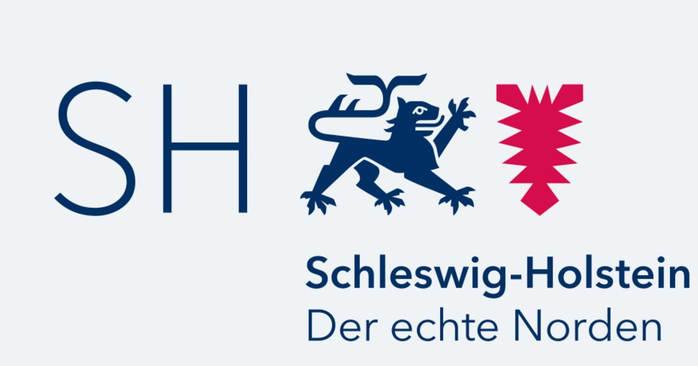
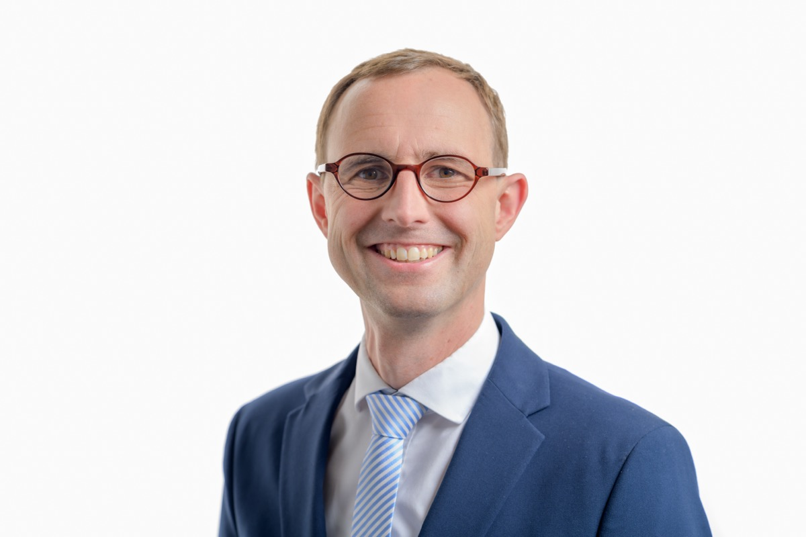

## An Open Source-strategy in German states and municipalities is not that common. While the idea of decoupling those scopes from Big Tech isn’t that new (just remind the city of Munich’s failed „Linux“-project back in 2017!), reality is telling yet another story. Now, the German state of Schleswig-Holstein has recently announced a new workplace strategy based on digital sovereignty.

It's not just "Schleswig-Holstein against the trend", it's a statement that contains a lot of potential, but also the well-known sceptical thoughts about whether Linux and Open Source in general are able to replace Microsoft & Co. in public and governmental institutions. Call it "pioneering work", but the realisation of this [roadmap](https://www.schleswig-holstein.de/DE/landesregierung/ministerien-behoerden/I/_startseite/Artikel2024/II/240403_digitalsouveraene_verwaltung.html) could indeed provide a real example that there can be a change in dependency if only every single sub-item on this long list of prerequisites can be marked as "checked".

## The announcement
"Einstieg in den Umstieg" is the slogan chosen by Schleswig-Holstein for the official announcement, meaning "entry into the change" - which says it all. While it's not unusual for someone to try to switch from proprietary software to FOSS-based software, the fact that a German state has officially expressed this yearning for change is quite a groundbreaking proclamation, turning away from Big Tech-backed software (here) in the form of Microsoft-solutions.

Under the banner of "independent, sustainable, secure", Schleswig-Holstein wants to lead the way while being the first German state to introduce the modern workplace based on digital sovereignty in local government. Following a decision by the cabinet, the widespread adoption of LibreOffice as the standard office suite is just the first step and the starting point for a broader strategy aimed at complete digital sovereignty in the state of Schleswig-Holstein.

> „The future of government is cloud-based, automated, algorithmic and data-driven. Therefore, all our future applications will be cloud-based. However, we don't have any control over how data is processed, nor do we have any control over any data leakage.“

(Dirk Schrödter, Minister of Digitalization)

> „Our responsibility to the citizens of our state is to ensure that every single piece of data is kept secure and that we are always in control of the IT solutions we implement. Securing digital sovereignty is at least as important as securing power and energy sovereignty.“

## Focusing on Europe

Dirk Schrödter also names the focus on Europe as one of the key factors for the [new and pioneering digital strategy of Schleswig-Holstein](https://www.schleswig-holstein.de/DE/landesregierung/ministerien-behoerden/I/Presse/PI/2024/CdS/240403_cds_it-arbeitsplatz.html?nn=549a8fa0-66c0-4da0-9f19-70e4be245eac):

> „The path to digital sovereignty follows a strict industrial policy compass: My vision of a strong digital garrison can only become a reality if we don't have to invest our public budgets in licensing costs.“

The Cabinet's decision marks the start of the transition from proprietary software to free, Open Source-based solutions for some 30,000 users in the administration. Proprietary software refers to digital applications that are strictly limited in terms of copyright, licensing and further processing.

> „Instead, we can invest it in local digital companies and create local value and jobs. Our goals in developing a common digital single market are interconnected digital government solutions and services. As a government, we use the potential of data to create and secure innovation, value chains and wealth at home.“

In addition, these offerings are usually tied to data centre- or managed services which ultimately allows the product owner to retain sovereignty over these products and services - so breaking these dependencies is ultimately key to Schleswig-Holstein's ongoing and future-based digital strategy.

## The factors
That's right, there are not seven pillars of wisdom, as T. E. Lawrence once wrote but only six, all of which are part of the digital sovereign workplace in the state of Schleswig-Holstein:

- Replacement of Microsoft Office with LibreOffice
- Changing the basic OS from Microsoft Windows to Linux
- Collaboration within the state administration and external parties: Using Open Source-solutions Nextcloud, Open Xchange/Thunderbird paired with Univention AD-Connector superseding Microsoft Sharepoint and Microsoft Exchange/Outlook
- A new approach with an Open Source-based directory service taking over from Microsoft Active Directory
- Inventory of the single specific procedures in terms of compatibility and interoperability with LibreOffice and Linux
- Development of an Open Source-related telephony solution replacing Telekom-Flexport

All six together are said to provide a solid foundation for the digital challenges ahead. By switching to open source, Schleswig-Holstein is laying the foundations for creating, maintaining and preserving digital sovereignty. Pros such as increased IT security, efficiency, data protection and seamless cooperation between different software systems are cited as well as the goal of making future development results in the Open Source-sector available to the "greater whole" under the rights of free software licensing.

Not to forget: Any change requires proper change management and with such a high turnover, user adoption is inevitable and a single beam carries the whole project: The use of LibreOffice for communication between departments and authorities is to be implemented in the short term, with exceptions in case the switch cannot be made for technical or professional reasons. According to Schleswig-Holstein there is already a wide range of training available for employees which will be expanded as needed. What's more, the state's central IT administration is making skilled staff available to ensure that user acceptance is not a showstopper.

## My two cents
This step is a big signal. Despite the amount of work that still lies ahead for the IT administration of Schleswig-Holstein, this announcement and all its consequences could be THE initiator for the decoupling of old status quos that have always relied on Microsoft solutions. There is a use case for everything but considering the current dependencies and even pure facts in terms of security (see [this](https://www.bleepingcomputer.com/news/security/microsoft-still-unsure-how-hackers-stole-msa-key-in-2023-exchange-attack/) or [this](https://www.cisa.gov/sites/default/files/2024-04/CSRB_Review_of_the_Summer_2023_MEO_Intrusion_Final_508c.pdf)), there should be an alternative to Big Tech - at least if the reappraisal of this whole bunch of unfortunate events within the attack chain is so sloppy.

Perhaps this transition will take time - it certainly will - and the path of good intentions will be paved with delays, frustrations and other obstacles. On the other hand, the ultimate goal of creating digital sovereignty for an entire German state will be within reach, setting a good example for others to follow. Turning away from Microsoft-based solutions may be a sacrilege from many points of view, but there are alternatives to proprietary software - so if this project turns out to be a success (with the planned FOSS-based solutions, as advised), Schleswig-Holstein may iron out the manifestly bad experiences of Munich's failed Linux migration which was ended back in 2017. Being independent of possible lobbying, turning to Open Source and contributing experience and code back to the community would be a shining example for other states (do you hear me, North Rhine-Westphalia?) to follow - or even whole governments?

The ball has been kicked into play and we may be eager to see the result - sometimes all it takes is an open mind, a courageous attitude and the ultimate will to keep going, even if the wind is blowing against you. The cold wind may turn into a vicious storm, but the visual signals are set to 'Go', so thumbs up and help from all quarters should be the least we can do to contribute to the cause!
