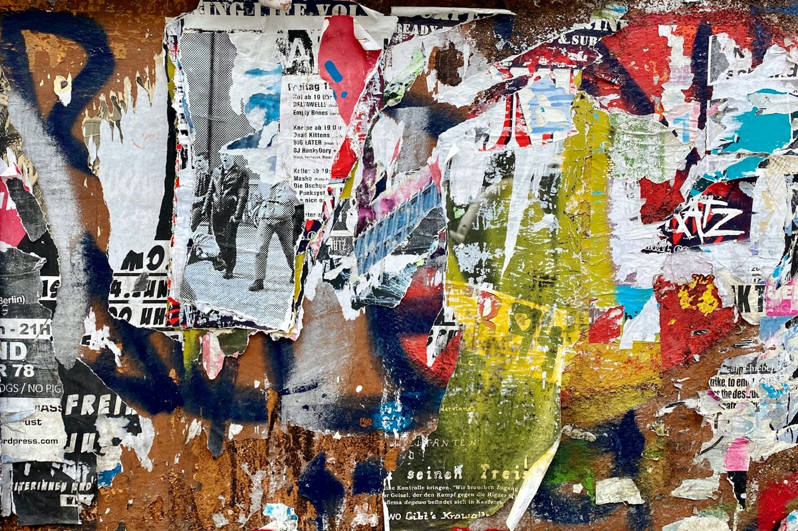
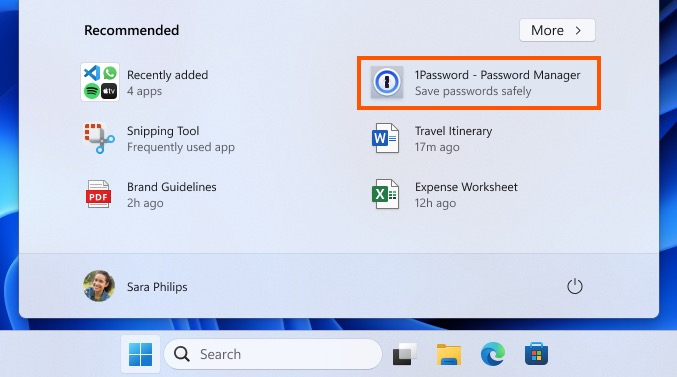
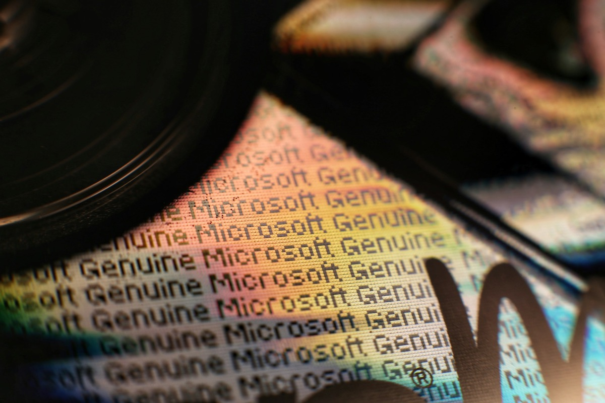

## Microsoft is currently battling a lot of bad press but as if that wasn't enough, there's still something else to add: According to a recent [blog post](https://blogs.windows.com/windows-insider/2024/04/12/announcing-windows-11-insider-preview-build-22635-3495-beta-channel/), the latest Windows 11 Insider Preview Build 22635.3495 will add recommended apps to the user's start menu - at least in the US and on unmanaged devices.

Although this is only a test in a preview version of Windows 11, it is yet another ticked box on the list of foreign intrusion into the user's operating system that is sadly part of Microsoft's recent history. The unwanted [progressive web apps (PWAs) in Windows 10](https://www.theverge.com/2020/10/19/21524006/microsoft-pause-unsolicited-pwa-office-app-windows-10), the [privacy issue with the 'new' Outlook sending credentials to Redmond servers](https://pifferi.info/new-outlook-seemingly-sends-sensitive-data-to-microsoft/) or this new issue raises the question of whether the installed operating system belongs to the user or is subject to Microsoft's arbitrariness.

Personally, and whenever I have to deal with a client's Windows system, I have never got used to the new "features" of grouping recently installed applications or showing frequently installed applications. This may have something to do with my own past when the classic Start menu had everything I needed. This was later superseded by these new features and in present days, whenever I have to deal with a Windows system, the combination of the Windows key and the 'S' is far quicker than any new idea from Redmond associated with the Start menu.

Anyway, as if that wasn’t enough already, the latest obvious idea is to recommend fancy and famous applications from the Microsoft Store in the Start menu even if you've never had a relationship with them. So, Redmond, what could possibly go wrong with this great new addition of useless bloatware to an operating system, cloaking this under the smoke screen of friendly recommendations to explore new, yet unknown apps?

Surely this could just be another test balloon, with Redmond experimenting with new features that may (and hopefully) never make it to the final build. It's also stated that only US-users enrolled in the Windows Insider program will be able to see this change and that it won't apply to commercial devices ("devices managed by organizations").

As we have become accustomed to, these friendly recommendations can also be turned off by going to „Settings > Personalization > Start“ and unchecking the „Show recommendations for tips, app promotions and more“-box. Unfortunately they seem to be standard in this build and users will have to turn this feature off in the same way they can prevent the Start menu from showing frequently installed or used apps - once they made their way throughout the dazzling and confusing new system settings. 

> As a reminder, we regularly try out new experiences and concepts that may never get released with Windows Insiders to get feedback. Should you see this experience on the Start menu, let us know what you think. We are beginning to roll this out to a small set of Insiders in the Beta Channel at first.

## Where do you want to go tomorrow, Microsoft?

Remember the phrase "it's not a bug, it's a feature"? It just popped into my head when I thought of those friendly additions to a simple operating system. Seemingly, Redmond lost its way on the desktop many years ago and while the focus is clearly on the cloud and the bundle of services that reside there, the desktop is somehow losing its historic role and adding pointless features to an end-user operating system may be one of the few facts that justify a new press release with leading the users to believe that there is an active development. There aren't many features that justified ditching Windows 7 for Windows 10, and - in my humble opinion - there were even fewer that justified ditching Windows 10 in favour of Windows 11 and whatever may come. The desktop got boring and there aren’t that much justifications to slip creepy features to working operating systems without the user’s permission.

Maybe the days of extraordinary changes on the desktop are over and operating systems are pretty mature - the same trend applies to my beloved macOS (at least for my use cases and personal needs). Instead of blowing these systems up, the focus should be on stripping them down to the bare essentials - with people being able to install the features they need, when they need them! The current trend coming out of Redmond is simply awful, and even if this is just a test in a preview version of Windows 11, the trend is clear - and the mistakes are being repeated over time. While the cloud is referred to as "just other people's computers", how do we ensure that using the latest iteration of Windows leaves us in control of our own PCs in the future?

Thinking of this, where do you want to go tomorrow, Microsoft?

