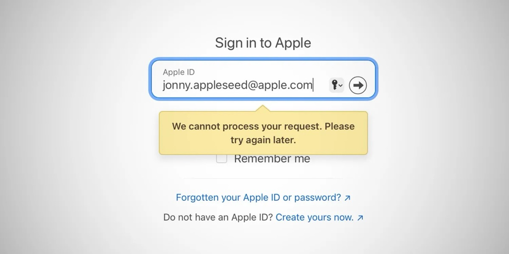
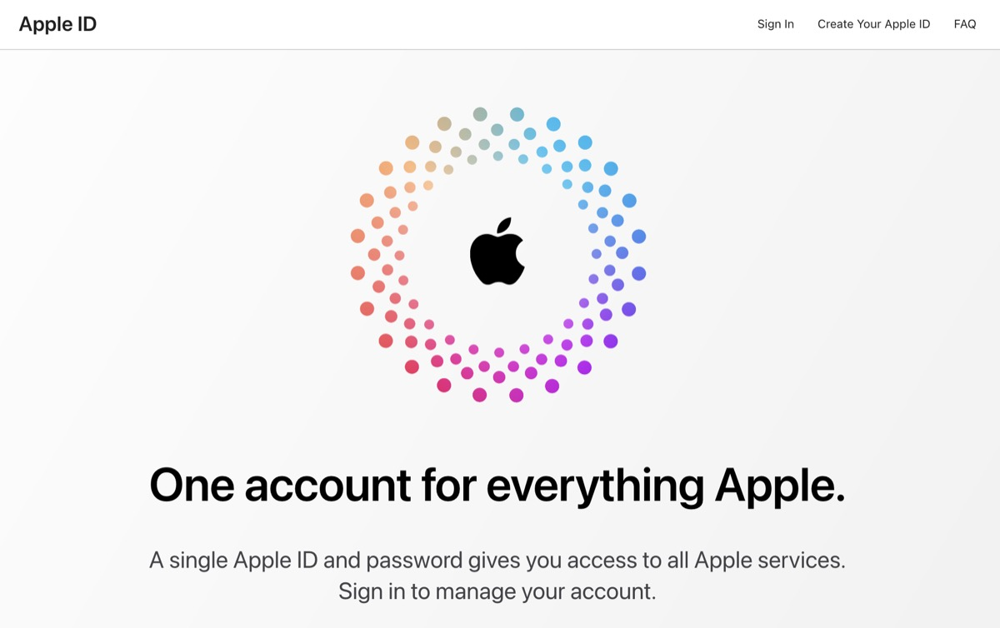
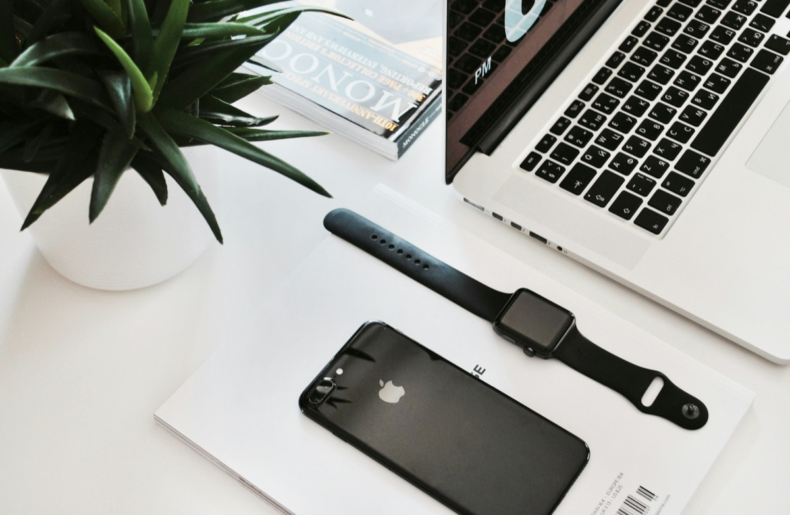

## "Security" and "big tech" are two terms that don't go well together at the moment. After ongoing security issues at Microsoft, Apple seems to have at least one minor problem that has left many users unexpectedly locked out of iCloud and devices belonging to it and forced to perform an unexpected password change. However, depending on Apple's forthcoming response to the case, this minor problem could turn into a serious one.

Imagine a simple day with your beloved Apple devices - to be honest, this is the status quo on pretty much every day. This Friday, I first noticed that my Apple Watch Ultra was unable to update the weather forecast and the current temperature. I had arrived at one of our offices early and was therefore not in a „trusted location“ - which are my home address and the nearest office, my main place of work. Suddenly I noticed that the Apple Watch was forcing me to verify the password of my Apple account (an old @mac.com one) out of nowhere. Then my iPhone came along with the same effect - feeling that something was very strange, I tried to access Apple's [account page] (https://appleid.apple.com/) and discovered that my account was indeed locked, forcing me to recover it with a subsequent password change.

Given that I am a bit of a "tinfoil-hat" guy, as friends and colleagues call me, when it comes to security, I tried to find out what could be wrong. I haven't added any new devices to my account, which is of course protected by 2FA, backed up by two YubiKey 5C NFC keys. iOS 17.3's "Stolen Device Protection" is also enabled, and at the time of writing I was not using any applications that require an application password. The password I used for my beloved old @mac.com address is generated and definitely not something that could be guessed or brute-forced - the tinfoil-hat guy, remember?

So I reset my password, knowing that I had some work to do at home later that evening. Two hours later, the same messages appeared again on my iPhone and Watch, so I went through the same process, feeling that something had to be wrong - and fearing that my account had some kind of security issue, especially since Apple's [official status page](https://www.apple.com/support/systemstatus/) didn't show anything unusual. Anyway, with all the security options Apple provides, the likelihood of a security flaw should be quite low - but the issue concerned me anyway (and should concern anyone with a similar experience). So, maybe it was a technical issue or something that forced Apple to lock my account?

Meanwhile, many people began reporting similar incidents around the world - many of them focusing on old @mac.com or @me.com addresses in the context of being the head of a family using the Family Sharing feature on iCloud.com. 9to5mac.com [reported the issue](https://9to5mac.com/2024/04/26/signed-out-of-apple-id-account-problem-password/) fairly early on and staff at [Forbes](https://www.forbes.com/sites/daveywinder/2024/04/27/apple-id-password-reset-issue-hitting-iphone-ipad-and-macbook-users/) had similar experiences. Also [The Verge got in line](https://www.theverge.com/2024/4/27/24142509/apple-id-logged-out-reset-stolen-device-protection) as well. The good news: I was not the only one. The bad: Nobody knew what was really going on because something was definitely wrong but Apple refused to comment on the issue, drawing the familiar veil of silence over the incident.

In the meantime, the Net has been flooded with news about the issue, so the whole thing seems to have a greater impact:

- [Thread #1 on Mastodon](https://theinternet.social/@tbridge/112340463598872085)
- [Thread #2 on Mastodon](https://eworld.social/@ismh/112340745553157794)
- [Thread #3 on Mastodon](https://mastodon.social/@ChrisLawley/112340853972099137)
- Michael Tsai’s [blog post](https://mjtsai.com/blog/2024/04/26/janky-apple-id-security/)
- [Threads #1](https://www.threads.net/@singletary/post/C6P9jfJt1VH)
- [Threads #2](https://www.threads.net/@andelirich/post/C6P88QiNY-J)
- [Threads #3](https://www.threads.net/@adhdjesse/post/C6P9hS_L9_7)
- [Threads #4](https://www.threads.net/@9six7/post/C6P-cP1sNu7)
- [Threads #5](https://www.threads.net/@jubnub/post/C6P_DNyMVaT)
- [Threads #6](https://www.threads.net/@timmeh71/post/C6P_b4prnWJ)
- [Threads #7](https://www.threads.net/@ngorby/post/C6PvqnArUpZ)
- [More complaints on Threads](https://www.threads.net/@nichagan/post/C6Pzb8jLrvx)

## What’s next, Apple?

Interestingly, among my friends and acquaintances, I was the only one affected - the only one with an "old" @mac.com-Apple ID. There was also no reaction in our family to similar effects (at least no one was texting or calling, so everything seems to be working). As The Net reports, Apple is downplaying the problem in terms of support calls and is not saying anything specific about "why" the whole thing happened in the first place. Personally, I could live with any explanation (precaution? attack? technical glitch?), as my security baseline is definitely more than just the simple standard, using all the options each vendor (in this case Apple) offers me but definitely there should be an official statement on this issue that has not just affected a few individual users. There is no need to diminish the relative importance of this case, and simply saying nothing is the wrong way to prove that "security" and "privacy" are still at the heart of Apple's agenda.

In the end, we see that security is not a status quo, but an ongoing process. Vendor agnostic. It's a process often paved with good intentions and a lot of backtracking, but it's never finished. For every measure there is a countermeasure, and yes, I love Apple, my fenced (and falling down) garden and the products that grow in it (and are paid for by the users) but specifically in this frustrating and annoying case I want an answer - and I am not alone!

So even as (or because being!) a loyal Apple fan and user for two decades, I have to ask the obvious question:

> **What do you have to say about that, Apple?**