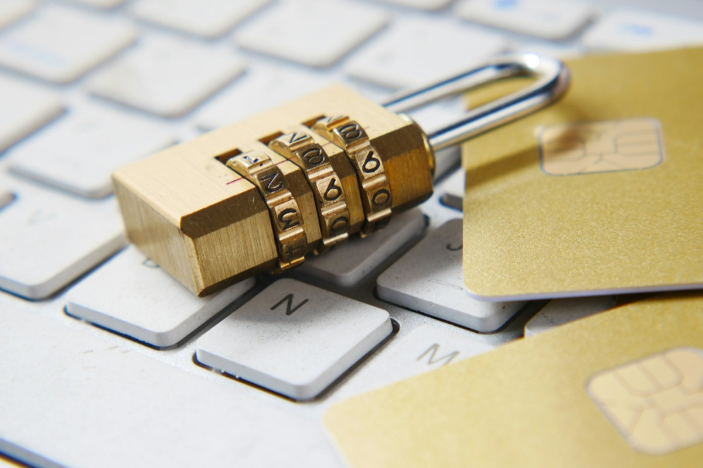
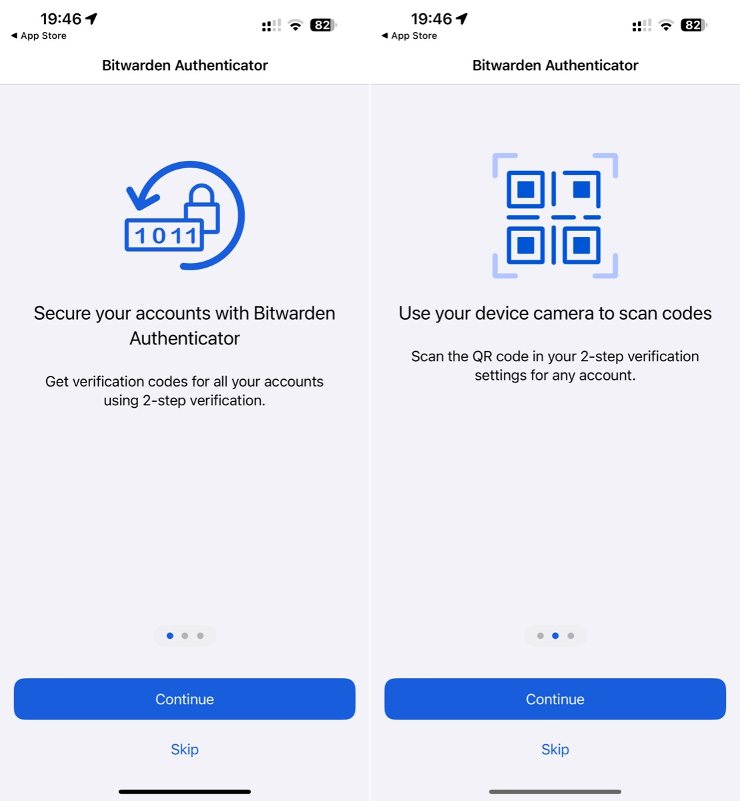
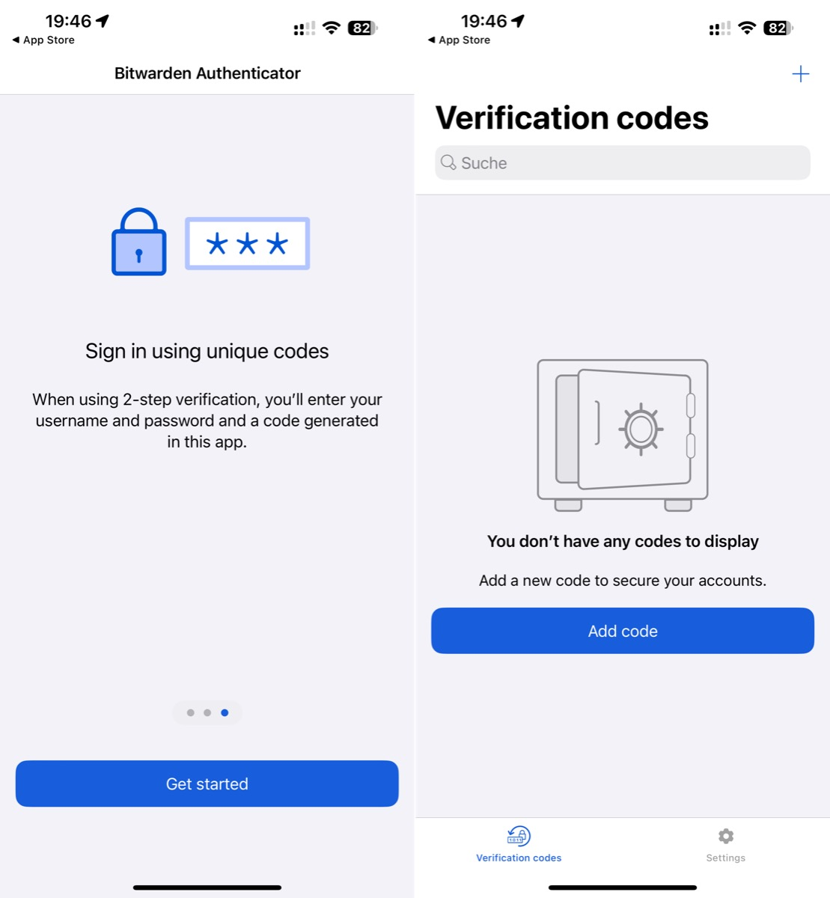
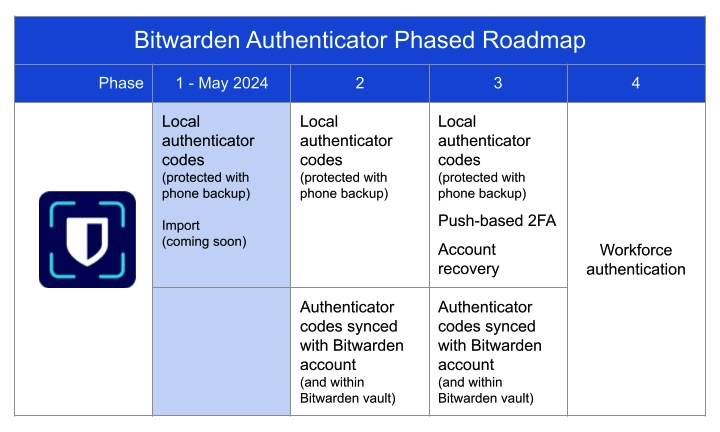

## The use of a second factor to secure online accounts has become a must over time, long before the triumph of passkeys. Although there are already plenty of mobile apps that generate the multi-factor, Bitwarden has decided to create its own - and it has a pretty interesting roadmap!

Looking back, the history of the (more or less) complex password has been a special one and after multi-factor authentication found its way to users, using an application to enter a generated number (the multi-factor) in addition to the password itself was the way to go. Over the years, security approaches have changed and hardware keys and passkeys have been added to the security layer but the first line of defense after a strong and complex password (and the least people can do to secure their accounts) are these randomly generated numbers from password managers or (even better) standalone apps.

The importance of having at least a second factor at hand was recently demonstrated [by the unexpected reset of my Apple ID-connected devices](https://pifferi.info/apple-locks-users-out-of-their-apple-ids-without-explanation/) which forced me to update my password - I was worried, but definitely less worried because 2FA was already enabled in its most extreme iteration.

Now Bitwarden has [officially released](https://bitwarden.com/blog/bitwarden-just-launched-a-new-authenticator-app-heres-what-it-means-to-users/) a new multi-factor authentication app available for [iOS](https://apps.apple.com/us/app/bitwarden-authenticator/id6497335175) and [Android](https://play.google.com/store/apps/details?id=com.bitwarden.authenticator). It features the familiar TOTP (time-based one-time passwords) and can be used for accounts by scanning a QR code or manually entering the initial setup key, providing the familiar extra layer of authentication. Bitwarden, being an Open Source project, also provides the code for both apps in public GitHub repositories, separated into Android ([here](https://github.com/bitwarden/authenticator-android)) and iOS ([here](https://github.com/bitwarden/authenticator-ios)).

> „Bitwarden Authenticator provides immediate value to the Bitwarden user base who has been asking for a standalone app for several years. Stay tuned for upcoming new features that will help enterprise organizations enforce security policies to protect and monitor authentication to business applications.“

(Kyle Spearrin, founder and CTO of Bitwarden)

Although the TOTP feature was already implemented in the [Bitwarden Password Manager](https://bitwarden.com), it was a premium add-on only available to paying customers or those using a self-hosted derivative called [Vaultwarden](https://github.com/dani-garcia/vaultwarden). So speaking (and assuming this feature is still of interest to users), people can now stay within the "Bitwarden" brand and use the official authenticator, whether they're paying customers or not. For example, if someone is new to Bitwarden, they can start with this standalone application without having to use Bitwarden's password vault features, as these applications are (still) separate. From a security perspective, the second factor should usually be separated from the password manager itself, so running both apps could also be an improvement for current users and their own security layer.

Adding new accounts is pretty straightforward, either by scanning the QR code or entering the token for the service you want to enable 2FA for. Bitwarden also revealed a guided roadmap with this first release in Phase 1 and not much else to do besides enabling 2FA or exporting the entries in it to a .json-backup file. There is no real backup yet, instead the phone backup will take care of backing up the data stored in the authenticator. An import option is said to be coming soon, and Authenticator codes synchronized with a Bitwarden account are features already announced for Phase 2. Phase 3 will bring push-based 2FA and account recovery as additional features while the final phase will target employee authentication and further [security polices](https://bitwarden.com/help/policies/).

Bitwarden Authenticator is a great and free addition to the existing TOTP-supporting applications and although it is still in its early stages, it already has the Bitwarden-flavour that I have loved since discovering it as my preferred password manager. For now, the codes it generates stand on their own without any connection to the password vault itself but with Phase 2 already coming with this feature, the physical separation of two important tools (password manager and 2FA app) based on one database could be yet another improvement for users' security structures.

There's still some work to be done, but even at this early stage, Bitwarden Authenticator is a great alternative to other apps and assuming you already trust Bitwarden with your password vault (or even host it yourself), why not use this app to refine your Bitwarden-powered security baseline?

