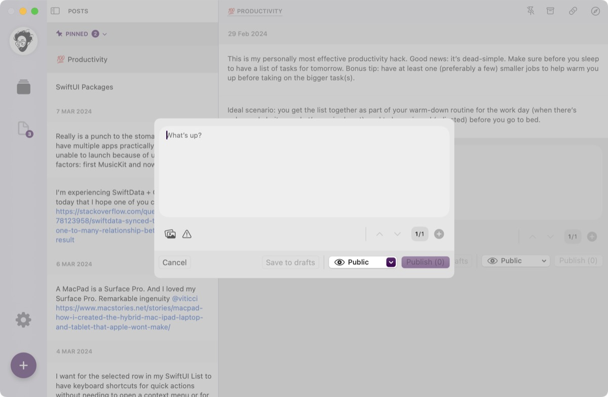
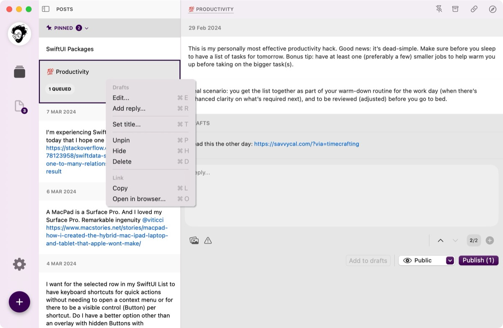
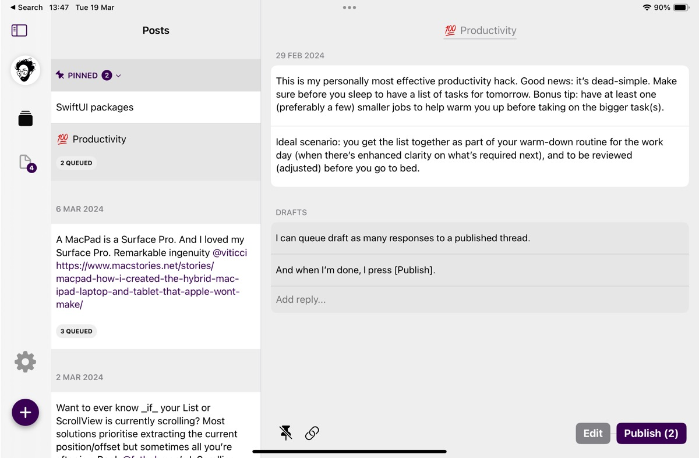

## Sometimes I come across apps that I would never have missed. Apps that come out of nowhere and still find their niche - Tusks by developer [Bardi Golriz](https://mas.to/@bardi) is one of them, aiming for a new focus when posting on Mastodon. 

Although there are many Mastodon clients out there including my beloved [Ivory](https://apps.apple.com/de/app/ivory-for-mastodon-by-tapbots/id6444602274), Tusks is not intended to replace them. Instead, this clean and slim app tries to complement existing clients by simply focusing on different tasks than the typical "post-a-picture-or-video-stuff-paired-with-some-text“-scenario we know from Social Media these days. [Tusks](https://thirdculture.app/tusks) gets rid of the timeline and just shows you your own posts, helping you to focus and build a thread-like experience while keeping everything in order.

## How Tusks works

Starting a new thread in Tusks is as easy as making a single post but that's not what makes it special. Tusks actively discourages posting into a vacuum and losing valuable context - this state is achieved by making it effortless to continue threading narratives. Each post becomes an update to a larger story that we can tell. Tusks is clearly aimed at pure writing but also supports the posting of images, including content warnings, and is aimed at people who blog, post or simply want to write more without distraction.

Tusks shows posts as well as any replies to the original post but users won't see replies or interactions with others. The app also comes with several features to help you organize and publish such as pinning threads for quick access, ignoring irrelevant posts when searching, or writing as much as possible on the go while Tusks breaks everything down into individual posts.

The app is currently free and can be downloaded from the [App Store](https://apps.apple.com/gb/app/tusks-make-mastodon-your-blog/id6473683937). This free version is read-only and requires an update to Tusks Pro for posting and publishing which currently costs $4.99 / €5.99 for the first thousand fans and early adopters. Indie developer [Bardi Golriz](mailto:bardi.golriz@gmail.com) also says that the app will have a more expensive LTD (at least $9.99) and possibly a subscription option after the first thousand slots are filled.

## New client, client replacement or... ?

In the end, Tusks is indeed no replacement for any of our standard Mastodon-apps but that’s not the intention here. Indeed  it puts even more value on Mastodon in case you meet the criteria the app was made for - focus, blogging, thread-based tooting. Although the current release is the initial one, the app’s quality is already very fine and stable on all platforms while the [official roadmap](https://midnight-beanie-ccb.notion.site/281be94b75504b60b600eb73ee1072f9?v=9479d0e4e1e8468187a7e2efbe3a53c7) already covers even more promising potential like editing posts, drag and drop, multi-account support or even scheduling posts.

If you are more of a blogger than a „tootist“ and have struggled with splitting posts into threads (a nightmare if you need to do it manually), you should definitely check out Tusks - you may not have missed it before, but it will certainly improve your tooting experience. It also helps to focus on the essential aspects of working with Mastodon and the topics people like to write about, and in my case, it definitely drives me to automatically work on longer articles that Tusks will publish in the future!